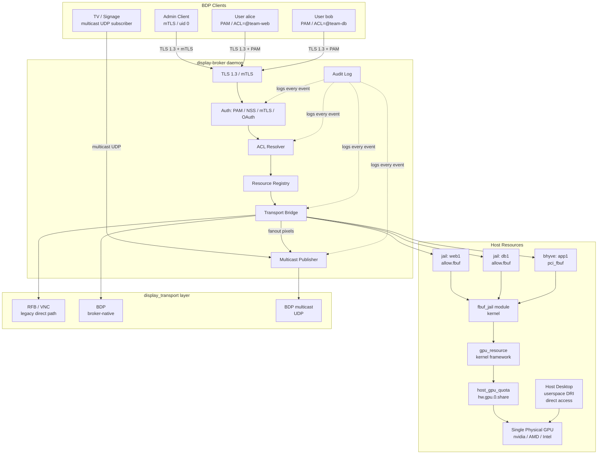
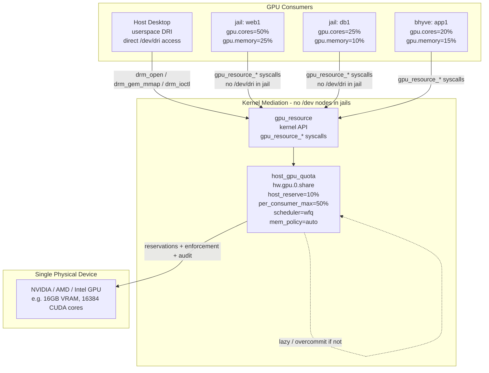
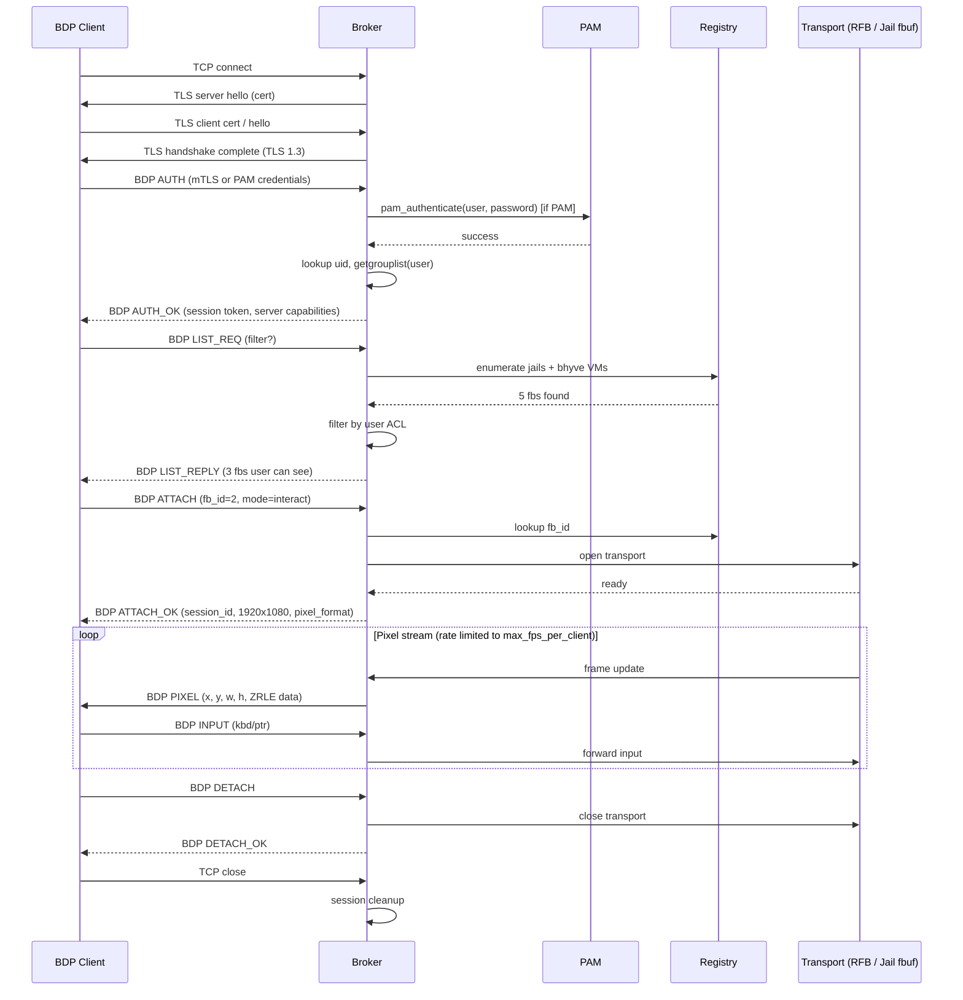
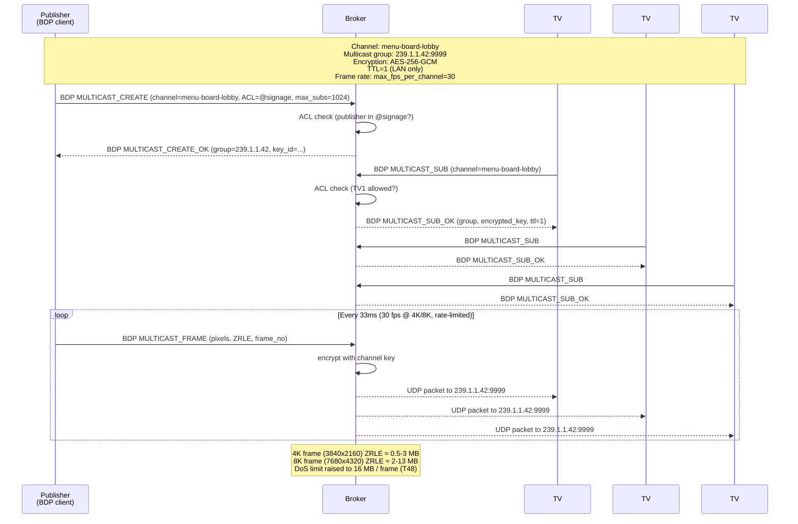
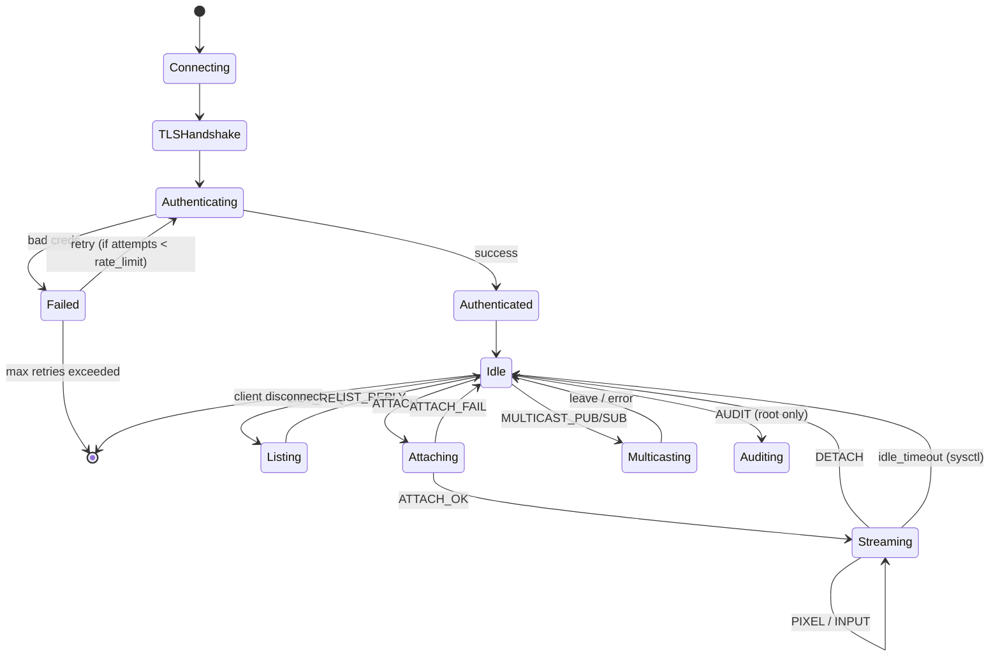
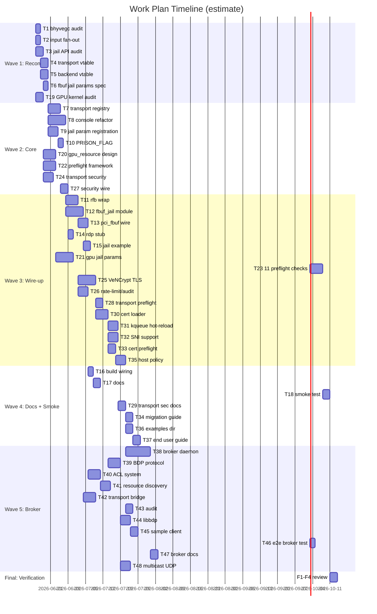
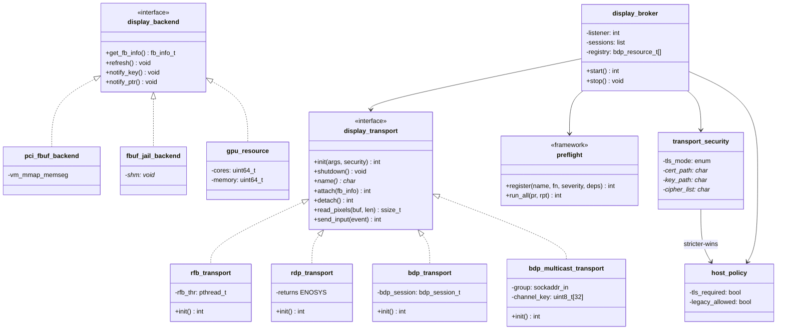

# bhyve Display Abstraction + Jail Framebuffer

## TL;DR

> **Quick Summary**: Refactor bhyve's framebuffer + transport layers into a clean, pluggable abstraction (`display_backend` vtable + `display_transport` vtable), generalize the `console` module to be multi-instance with caller-provided framebuffer memory, wrap the existing RFB/VNC server as a registered transport, and add a FreeBSD jail option (`allow.fbuf` + `fbuf.nokbd` / `fbuf.nomouse`) that provisions a kernel-backed framebuffer + keyboard + mouse for a jail — so the same pluggable transport (VNC today, RDP/SPICE later) can serve the jail's display.
>
> **Deliverables**:
> - `usr.sbin/bhyve/display_transport.{h,c}` — transport registry vtable
> - `usr.sbin/bhyve/display_backend.{h,c}` — consumer/backend vtable
> - `usr.sbin/bhyve/console.{h,c}` — refactored: multi-instance, caller-provided fb, optional bhyvegc
> - `usr.sbin/bhyve/rfb.c` — wrapped as a `struct display_transport`
> - `usr.sbin/bhyve/rdp.c` — skeleton for a future RDP transport
> - `usr.sbin/bhyve/pci_fbuf.c` — wired through `display_transport_init` (no more direct `rfb_init`); supports both `rfb=` (legacy) and `transport=rfb,...` (new)
> - `sys/sys/jail.h` + `sys/kern/kern_jail.c` — new params: `allow.fbuf`, `fbuf.nokbd`, `fbuf.nomouse`
> - `sys/modules/fbuf_jail/` — new kernel module: per-jail framebuffer + kbd + mouse devices
> - `share/man/man5/jail.conf.5` — documents the new params
> - `usr.sbin/bhyve/display-abstraction.md` — architecture doc
>
> **Estimated Effort**: XL
> **Parallel Execution**: YES — 5 waves (T1–T48), max 12 tasks per wave, with sub-waves
> **Critical Path**: T3 (jail API audit) → T8 (console refactor) → T12 (jail fb module) → T17 (smoke test) → T38 (broker daemon) → F1–F4 (review)
>
> **Preflight shipped**: 20 total = 11 base (T23) + 3 transport security (T28) + 6 cert (T33). All tunable via `security.preflight.*`.
>
> **Tunables**: every limit (FPS, frame size, bandwidth, channels, ACL, rate limit, idle timeout, audit level) is a sysctl or loader tunable. See **Tunables Reference** below.
>
> **Frame rate limits** (per-client / per-channel / per-broker) are sysctls: `security.display.broker.max_fps_per_client`, `security.display.broker.max_fps_per_channel`, `security.display.broker.max_fps_total`, plus `security.display.transport.{rfb,bdp,multicast}.refresh_fps`.
>
> **DoS frame size**: BDP default 16 MB, max 64 MB (`security.display.broker.max_frame_size`). Covers 4K compressed; 8K with ZRLE; 16K future.

---

## Visual Overview

> Mermaid diagrams for the architecture, sequence flows, state machines, and timeline. GitHub/GitLab/most markdown viewers render these. The user asked for more graphs; we will iterate on the plan across multiple rounds and these diagrams should help reason about changes. **Update the prose alongside these diagrams** — they should not drift. Inline diagrams in the relevant design sections reference back to this overview.

### 1. System Architecture (the corrected one — GPU is a host-side shared resource)



### 2. GPU Resource Sharing — the corrected view

The GPU is a **single physical device** on the host. It is **shared** between the host's own desktop userspace AND the consumers (jails + bhyve VMs). All access goes through the `gpu_resource` kernel framework and is enforced by `host_gpu_quota` (the `hw.gpu.0.share` sysctls). **No `/dev/dri/*` or `/dev/gpu*` nodes are created inside jails** — the kernel mediates all access at internal API boundaries.



### 3. BDP Authentication + List + Attach Sequence



### 4. Multicast UDP (TV / Advertising Use Case)



### 5. Broker Session State Machine



### 6. Task Timeline (Gantt)



### 7. Module / Class Diagram



---

## Context

### Original Request
> "look for the framebuffer that is used with the VMM and bhyve, and try and understand it a bit here. I want to abstract it so that other things like jails can use it. right now VNC connections are supported, i want to abstract that so we can use other remote desktop tooling and protocols."
> "for the jails, I want a switch in the jail options to add in the framebuffer and the keyboard and mouse, adding in the framebuffer should bring in the keyboard and mouse automatically, but can be disabled if specified"

### Investigation Summary

**Today**, bhyve's display stack is three layers in `usr.sbin/bhyve/`:

1. `pci_fbuf.c` — emulated PCI GPU. Owns the pixel buffer (`vm_create_devmem(VM_FRAMEBUFFER, "framebuffer", 32MB)`), maps it into the guest via `vm_mmap_memseg`, exposes BARs, registers `pci_fbuf_render` with the console, calls `rfb_init()` to start the VNC server.
2. `console.{c,h}` — single-instance middleware with `fb_render_func_t`, `kbd_event_func_t`, `ptr_event_func_t` callback slots. This is the existing seam. RFB and any other transport share it transparently — RFB consumes via `console_get_image()` / `console_refresh()` and produces via `console_key_event` / `console_ptr_event`. Currently a static singleton — only one consumer at a time.
3. `rfb.{c,h}` — RFB wire-format server. Public surface is one function: `rfb_init(family, host, port, wait, password)`. Has `rfb_thr` (accept loop), `rfb_wr_thr` (~24 Hz screen poll with CRC cell diffing), and `rfb_handle` (per-connection state machine). Calls `console_key_event`/`console_ptr_event` to route client input.

**Open question confirmed by recon** (deferred to T2 in the plan): who registers as the kbd/ptr consumer with `console_kbd_register`/`console_ptr_register`? It's not `pci_fbuf` and it's not `rfb`. Almost certainly a keyboard/mouse PCI device (`pci_atkbdc`/LPC) registers and routes input into the guest via `vm_inject_*`. Must be confirmed before the abstraction is complete.

**Jail subsystem** uses two patterns:
- `osd_jail_register` / `osd_jail_set` / `osd_jail_get` (in `sys/kern/kern_jail.c`, `sys/kern/kern_jailmeta.c`) — type-safe parameter registration; what we want for `fbuf.width`, `fbuf.height`.
- `PRISON_FLAG_*` bits + `prison_set_allow` / `prison_set_allow_locked` (in `sys/kern/kern_jail.c:3919+`) — boolean capability flags. Precedent: `allow.vmm`, `allow.vmm_ppt`. This is what we want for `allow.fbuf`, `fbuf.nokbd`, `fbuf.nomouse`.
- Parsing in `lib/libjail/jail.c:1212+` already handles `allow.mount.*` style sub-keys; the kldload-style auto-load for `allow.*` is already in place.

**`framebuffer` branch** has no WIP ahead of main — clean slate.

### GPU Resource Governance (third workstream — framework only)

The user also raised GPU resource sharing and per-tenant limits — concretely, can a jail's nvidia CUDA core count be capped, and more generally how to make a GPU a first-class shareable resource for multi-tenant consistency. This is a **framework-only** scope in this plan (T19–T21); vendor integration is a follow-on workstream.

**FreeBSD's current GPU landscape:**
- `sys/dev/drm/` — kernel DRM/KMS subsystem (AMD, Intel). Not first-class resource-aware: no per-cgroup compute or scheduling primitives.
- `compat/nvidia/` (out-of-tree) — proprietary driver. Has MIG (Multi-Instance GPU) hardware partitioning and `nvidia-smi -c COMPUTE_MODE` for limiting. Exposed via proprietary ioctls.
- `sys/kern/kern_cgroup.c` — cgroup subsystem. Has a memory controller; no GPU-aware schedulers. New cgroup v2 controllers are added via a sysctl + kthread model.
- No kernel concept of "compute units" or "GPU time slice" today.

**Proposed framework (T19–T21 design):**
- New kernel object `struct gpu_resource` with attributes: device id, VRAM bytes, compute units (vendor-defined), scheduling slice (µs), and a `struct gpu_backend *` vtable.
- New jail params: `allow.gpu=N` (select device), `gpu.cores=K` (limit compute units), `gpu.memory=BYTES` (limit VRAM), `gpu.scheduler=round-robin|fifo` (policy).
- **Percentages accepted, vendor-native units** — `gpu.cores=50%` and `gpu.memory=25%` resolve against the **vendor-native total of that specific device** via the backend's `gr_total_capacity()` callback. A CUDA core on nvidia is not a CU/SP on AMD, and neither is an EU on Intel Xe — the percentage is always of the same vendor's same-unit total. Examples: 50% of an RTX 4090's 16,384 CUDA cores = 8,192 cores; 50% of an RX 7900 XTX's 6,144 SPs = 3,072 SPs. Display tools (`jls -v gpu`, sysctl `security.jail.params.gpu.*`) show the resolved absolute + the percentage + the vendor-native unit string (e.g. `gpu.cores=50% of 16384 cuda-cores (nvidia)`). Jail param is `string` at registration (parsed); resolution happens at `jail_set(2)` time and is recorded as the absolute value in the prison struct.
- **DRI-aware on the host, NO device nodes inside the jail** — leverage the existing Direct Rendering Infrastructure as the vendor-agnostic GPU abstraction on the **host side only**. `/dev/dri/cardN` (modesetting/display) and `/dev/dri/renderD128` (off-screen compute) are exposed by nvidia-drm, amdgpu, i915, and any future TPU that ships a DRM driver — but they are **not** propagated into jails. A jail with `allow.gpu` does **not** get any `/dev/dri/*` or `/dev/gpu*` node in its devfs. The kernel mediates all GPU access at internal API boundaries: `drm_open` / `drm_gem_mmap` / `drm_ioctl` on the host for host-side consumers; the `display_transport` read path for shipping pixels to remote clients; and a kernel-internal `gpu_resource_*` API for any jail-side work that legitimately needs the GPU. The user's "generic gpu0" is the host-side DRI surface plus the kernel `gpu_resource` ABI — never a new device node in the jail.
- **Strict guardrail with explicit override** — when a jail requests `allow.gpu=N`, the kernel probes for the physical device and the corresponding `gpu_backend`. If no device is detected or the backend is absent, `jail_set(2)` returns `ENXIO` and the jail **does not start** (logged to `dmesg`: `jail_set: gpu.N not present; strict mode refuses to start jail`). Operators can opt out with `allow.gpu.strict=0` — in that case the jail starts, the `gpu_resource` is created **with no backing device**, no `/dev/dri/*` are exposed (per the previous bullet), and any GPU work the jail attempts fails at the kernel API with `ENXIO`. The default is strict because silently providing no GPU when one was requested is a footgun. Override is explicit.
- **Host-level shared limit across jails + VMs, with memory allocation policy** — a new host-wide object `struct host_gpu_quota` per physical GPU device, registered as a sysctl family `hw.gpu.N.share` and as a tunable. Distributes the device's compute units, VRAM, and scheduling slice across **all consumers** (bhyve VMs + jails). Four knobs:
  - `hw.gpu.N.host_reserve=PCT%` — fraction of the device reserved for the host system itself (default 10%). Cannot be allocated to consumers.
  - `hw.gpu.N.per_consumer_max=PCT%` — hard ceiling on what a single consumer (one jail, or one bhyve VM) can request via `gpu.cores` / `gpu.memory` (default 50%). Prevents one consumer from monopolising the device.
  - `hw.gpu.N.mem_policy=auto|eager|lazy` (default `auto`) — when to allocate VRAM quota. This answers the user's question: "do we allocate all the memory? or hope and pray?"
    - `eager` — at `jail_set(2)` / `vm_create` time, the kernel reserves the full `gpu.memory` quota. The consumer fails to start with `ENOMEM` if the device's free VRAM < the requested quota. Predictable, no overcommit, no hope-and-pray.
    - `lazy` — the kernel records the quota but does not reserve VRAM at startup. Free VRAM is shared across consumers up to the sum of their quotas (overcommit allowed up to device total). When a consumer's GPU work requests VRAM, the kernel checks `sum(currently_in_use) + new_request <= device_total`; if not, the submission is rate-limited / queued / fails per the backend's `gr_mem_pressure` callback. Maximizes utilization, but a burst from one consumer can starve another.
    - `auto` (default) — if `host_reserve` and `per_consumer_max` are both set (i.e. the operator is actively using the quota framework), default to `eager`. Otherwise `lazy`. Per-consumer override: `gpu.memory.policy=eager|lazy` in the jail/bhyve config overrides the host default for that consumer.
  - `hw.gpu.N.scheduler=round-robin|wfq|fifo` (default `wfq`) — compute time-slicing policy. Weighted fair queuing by default; `fifo` for head-of-line; `round-robin` for equal-share.
  Per-consumer `gpu.cores=50%` and `gpu.memory=25%` resolve against the **post-reserve** capacity and are capped at `per_consumer_max`. The framework rejects at `jail_set(2)` (and at bhyve `vm_create` time) with `ERANGE` if a consumer's request would exceed the ceiling. A unified `hw.gpu.N.share` summary sysctl exposes the current allocation map: per-consumer quota, per-consumer in-use, free VRAM, scheduler state, and the policy in effect.

### Preflight check framework (cross-cutting)

The user explicitly required that **all** the new resource-governance requirements — display transport availability, GPU presence, VRAM sufficiency, transport resolution, quota within ceiling, etc. — must be validated **before** a jail or bhyve VM is allowed to start, and that the framework must be extensible so more checks can be added later without surgery. A small in-kernel preflight framework addresses both.

**Surface:**
- Type: `int (*preflight_fn_t)(struct prison *pr, struct preflight_report *rpt)`
- Registry: `preflight_register(name, fn, severity, deps[])` / `preflight_unregister(name)`. New checks can be added at `SYSINIT` or by `KLD` modules. Order is determined by the `deps` array (topological), not registration order — the user said "we prob should add more preflight checks if need be" so the ordering model must scale.
- Runner: `preflight_run_all(pr, rpt)` iterates the registry, calls each fn in dependency order, accumulates results. A `BLOCKING` failure short-circuits with the first error; `WARNING` failures are logged but don't block.
- Report: `struct preflight_report` carries the **full** result set (name, status, error code, message) — not just the first failure — so the operator can see every issue at once and fix them in one pass. Surfaced via `jls -v preflight`, `sysctl security.jail.preflight.<jid>`, and the VMM API for bhyve.

**Shipped preflight checks (T23):**

| Check | Severity | Purpose |
|---|---|---|
| `preflight.gpu.device_present` | BLOCKING | GPU N actually exists in `host_gpu_quota` table |
| `preflight.gpu.backend_registered` | BLOCKING | A `gpu_backend` is registered for the device class |
| `preflight.gpu.quota_within_per_consumer_max` | BLOCKING | Requested `gpu.cores` / `gpu.memory` ≤ `hw.gpu.N.per_consumer_max` |
| `preflight.gpu.vram_available` | BLOCKING (eager only) | Free VRAM ≥ requested quota when `mem_policy=eager` |
| `preflight.gpu.scheduler_available` | BLOCKING | Requested `gpu.scheduler` is implemented by the backend |
| `preflight.fbuf.transport_registered` | BLOCKING | Requested `fbuf.transport` exists in `display_transport` registry |
| `preflight.fbuf.resolution_supported` | BLOCKING | w/h within backend's `gr_max_resolution()` |
| `preflight.display.console_slot_available` | BLOCKING | A free `console` instance slot |
| `preflight.bhyve.pci_slot_available` | BLOCKING (bhyve only) | A free PCI slot for `pci_fbuf` |
| `preflight.strict_override_used` | WARNING | `allow.gpu.strict=0` was set — log a clear note that the jail is starting without a backing GPU |
| `preflight.bhyve.host_capable` | BLOCKING (bhyve only) | `vmm.ko` is loaded, hardware supports VT-x/AMD-V |

**Extensibility hooks:**
- New checks can be added by any kernel module via `preflight_register()`. Sorted by `deps`, not registration order.
- The `preflight_report` is preserved in `struct prison` and the VMM-side vm struct for post-mortem inspection via `jls -v preflight` and `bhyvectl --get-preflight`.
- A `preflight_dry_run` sysctl/tunable runs all checks without committing — useful for `jail -c` validation in CI and for `bhyve -p` style dry-run.
- Failure messages are stable strings (namespaced `PREFLIGHT_FAIL_GPU_DEVICE_ABSENT` etc.) so external tooling can grep for them.
- A jail with `allow.gpu` set gets a private `gpu_resource` bound to it. Vendor backends (nvidia MIG, AMD partition, Intel SR-IOV VF) plug into `gpu_backend` vtable.
- Enforcement at the **host-side DRM open/mmap/ioctl** layer (for host consumers of DRI), the **kernel-internal `gpu_resource_*` API** (for jail consumers that legitimately need GPU compute), the **`display_transport` read path** (when host transport reads the jail's framebuffer to ship pixels to remote clients), and **`execve` boundaries** inside the jail (to block GPU-using programs when `allow.gpu` is not set or strict mode has no backing device).
- For non-virtualized GPUs (single physical device, time-sliced), the framework reduces to time-slicing the GPU context. For MIG/VF-capable devices, it can do hard partitioning.

### Transport security (VNC hardening)

The user called out the long-standing lack of security around the VNC transport. Today (`usr.sbin/bhyve/rfb.c`):

- **Plaintext protocol by default** — the RFB wire format carries pixels and key/pointer events unencrypted. Anyone with a `tcpdump` on the link sees everything on the guest screen and can replay input.
- **Single-DES VNC auth** (`rfb.c:1046-1053`) — 8-byte fixed-length password, DES-based challenge-response, brute-forceable in seconds. The `NO_OPENSSL` build option disables even this.
- **No rate limiting on auth attempts** — unlimited retries per source IP.
- **No idle timeout** — once authenticated, a session lives until the client disconnects or the VM dies.
- **No audit logging** — no record of who connected, when, what they did.
- **No client authentication** — only the server proves itself (or doesn't, with `SECURITY_TYPE_NONE`).
- **No replay protection** — same auth challenge can be replayed.

For the abstraction, security is a **property of the transport**, not bolted on. The `display_transport` vtable grows a security config that every transport implements in its own protocol-appropriate way (RFB → VeNCrypt/TLS; RDP → CredSSP/NLA; SPICE → SASL). Defaults are tight; legacy plaintext is opt-in with a loud warning.

**New transport security policy (T24–T29):**

- **Default mode: `tls_required`**. Any transport that supports TLS (RFB via VeNCrypt, RDP via CredSSP, SPICE via SASL+TLS) refuses to start without it. Falls back to `tls_preferred` if OpenSSL is missing at build time, with a logged warning.
- **Legacy plaintext is `legacy` opt-in only** — `transport.legacy=1` in the jail/bhyve config. Logged at `auth.notice` on every connection: `rfb: LEGACY plaintext connection from <ip>:<port>; security=TLS-OPTIONAL but legacy override accepted`. Cannot be the default; cannot be set via `jail.conf` if `security.jail.param.legacy_allowed=0` (host sysctl).
- **Config keys** (all string or bool; the `display_transport_init` signature takes a `struct transport_security *` populated from these):
  - `transport.tls.mode=required|preferred|optional|disabled` (default `required`)
  - `transport.tls.cert=path`, `transport.tls.key=path` — server cert + private key. Default paths: `/etc/bhyve/<name>.pem` and `/etc/bhyve/<name>.key` (bhyve), `/etc/jail/<name>.pem` and `/etc/jail/<name>.key` (jail).
  - `transport.tls.client_ca=path` — if set, server requires and verifies a client cert against this CA. Off by default.
  - `transport.tls.ciphers=list` — OpenSSL cipher list (default: TLS 1.3 + `ECDHE+AESGCM:ECDHE+CHACHA20`)
  - `transport.auth=vnc|pam|none` (default `vnc` for RFB). `pam` delegates to host PAM stack.
  - `transport.timeout.seconds=N` (default 1800 = 30 min idle disconnect)
  - `transport.rate_limit.attempts=N` (default 5 per source IP per minute, with exponential backoff)
  - `transport.audit=1|0` (default 1) — every connect / auth-fail / disconnect logged to syslog with structured fields (`transport`, `src`, `dst`, `auth`, `result`, `bytes_in`, `bytes_out`, `duration_s`).
- **VeNCrypt implementation in rfb.c (T25)** — RFB security types 19 (VeNCrypt), 20 (VeNCrypt with client cert). Uses OpenSSL. Handshake:
  1. Server advertises `RFB 003.008` with `VeNCrypt` sub-version 0.2
  2. Server sends list of supported sub-types: `AnonTLS`, `VeNCryptTLS`, `VeNCryptX509TLS`, `X509None`, `X509VncAuth`, `X509PamAuth`
  3. Client picks one, server accepts, `STARTTLS` via OpenSSL `SSL_accept`
  4. Post-TLS: sub-type auth (VNC password OR PAM, depending on negotiated)
  - Plain `SECURITY_TYPE_NONE` is **removed from the default allowlist**. Only reachable via `transport.legacy=1`.
- **Capsicum retained** — the existing `caph_rights_limit(rc->sfd, CAP_ACCEPT|CAP_EVENT|CAP_READ|CAP_WRITE)` (rfb.c:1436) is still applied. VeNCrypt must run before Capsicum tightens (so the OpenSSL context can do its work) — order is: socket → bind → listen → TLS handshake → Capsicum → accept loop.
- **Preflight checks added (T28):**
  - `preflight.transport.tls_cert_readable` — BLOCKING. Verifies `transport.tls.cert` exists, is readable, not world-writable, and parses as a valid X.509 cert with a matching key.
  - `preflight.transport.tls_key_permissions` — BLOCKING. Private key file must be `0600` or `0640` root-owned. Refuses to start with a world-readable key.
  - `preflight.transport.legacy_used` — WARNING. `transport.legacy=1` is set; log a clear note.
- **For the jail-side fbuf transport (T12)**: same security policy applies. A jail's framebuffer may be just as sensitive as bhyve's guest. The default is `tls_required`; the same `transport.tls.*` params are accepted in the jail config.
- **Documentation (T29)**: `bhyve(8)`, `bhyve_config(5)`, `jail.conf(5)`, and a new `display_transport_security(7)` man page documenting the threat model, the default policy, the legacy opt-out, and the OpenSSL version requirements. A `SECURITY` section in `display-abstraction.md` summarises the model.

**Threat model (out of scope but documented):**
- A compromised RFB client can send arbitrary input to the guest — out of scope (a malicious user with a VNC client can always do this).
- A compromised guest can draw anything on the screen and trick the operator — out of scope.
- The TLS layer protects: confidentiality of pixel data + input events, server authentication, and (with `client_ca`) strong client authentication. It does **not** protect against a malicious client or guest.

**In-scope for this plan:** VeNCrypt implementation in rfb.c, transport security config + defaults, preflight checks for cert readability, audit logging, rate limiting + idle timeout, docs.
**Out-of-scope (separate workstream):** post-quantum TLS (deferred until OpenSSL has stable support), SSH-tunnel-as-default (encouraged in docs, not enforced), CRL/OCSP for client cert verification (deferred).

### Backward compatibility (the upgrade-must-not-break promise)

The user said: "make sure that current tooling and configurations are not impacted, we wouldn't want people to upgrade and then have all of their stuff not work." This is a hard guarantee. Every change in this plan must be **additive**: existing setups continue to work unchanged. New features are opt-in via new config keys; old patterns keep working with a logged deprecation warning, never a hard break.

**Backcompat guarantee (all are must-have):**

1. **bhyve CLI / config** — every existing flag, option, and config key continues to work byte-for-byte. The parser accepts both old and new forms. Specifically:
   - `rfb=host:port`, `tcp=host:port` — accepted, silently translated to `transport=rfb,security=legacy,tls=optional,host=...,port=...` (T13). A `auth.notice` is logged on every start: `fbuf: legacy rfb= config detected; consider migrating to transport=rfb,...`. Existing VNC clients (RealVNC, TightVNC, TigerVNC, noVNC, Remmina, ...) connect unchanged.
   - `vga=on|io|off`, `w=`, `h=`, `password=`, `wait=`, `unix:path` — accepted unchanged.
   - `bhyve -s <bus>,fbuf,...`, `bhyve -m size`, `bhyve -c ncpu`, all the rest of the bhyve argv — unchanged.
   - `bhyvectl` (the userspace control tool) — its ioctl surface is unchanged; new commands are additions.
2. **jail config / libjail API** — every existing jail param continues to work. The param table is purely additive. Specifically:
   - `allow.vmm`, `allow.vmm_ppt`, `allow.mount.*`, `allow.raw_sockets`, `allow.socket_audit`, `allow.quotas`, `allow.set_hostname`, etc. — unchanged.
   - `host.*`, `path.*`, `exec.*`, `mount.*`, `vnet.*`, `ip4.*`, `ip6.*` — unchanged.
   - `jail_set(2)`, `jail_get(2)`, `jail_create(3)`, `jail_remove(3)` — the libjail ABI is unchanged. New params are additions.
   - `jail(8)`, `jls(8)`, `jexec(8)` — the CLI surface is unchanged. New flags are additions.
3. **VMM / VMMAPI** — `sys/amd64/vmm/`, `lib/libvmmapi/`, `/dev/vmm/*` — **not touched by this plan**. The kernel VMM module and its userspace API are out of scope. New framebuffer work is in userspace (`usr.sbin/bhyve/`) and in the new `sys/modules/fbuf_jail/` kernel module (additive, opt-in).
4. **VNC clients** — every existing RFB 3.x client (including plaintext-only ones like TightVNC 1.3) continues to work, **as long as the operator hasn't explicitly set `transport.tls.mode=required`**. The default for legacy `rfb=` configs is `tls=optional`, which accepts both plaintext and TLS connections. To force TLS-only, the operator must opt in.
5. **TLS / cert ecosystem** — existing certbot-managed certs at `/etc/letsencrypt/live/...` are discovered automatically by the cert discovery policy (T30). No certbot reconfig needed. Existing self-signed certs are loaded as-is. No regression.
6. **bhyve_config(5) / jail.conf(5) syntax** — the file format is unchanged. Old files parse byte-for-byte. New keys are additions.
7. **Config-file migration** — handled silently by T13 (bhyve side) and T21 (jail side). No manual migration step required. The user never has to edit their config to keep working. They get a one-line deprecation warning and that's it.
8. **Kernel modules** — all new modules (`sys/modules/fbuf_jail/`, `sys/modules/preflight/`) are **additive**. They do not change behavior of any existing module. If not loaded, the system behaves exactly as it does today.
9. **sysctls / tunables** — all new sysctls are additions under new OIDs (`hw.gpu.*`, `security.transport.*`, `security.jail.preflight.*`). No existing sysctl changes meaning. `kern.jail.*` param set is purely additive.
10. **ABI / SONAME** — `libvmmapi.so`, `libjail.so` are not bumped. New symbols are additions, not replacements.

**Migration story for operators (in T17 / T34 docs):**

- **Bhyve users**: do nothing. Your existing `rfb=...` config keeps working. To get TLS, swap to `transport=rfb,tls=required,cert=...` (or let auto-self-signed handle it). To get RDP, use `transport=rdp,...`.
- **Jail users**: do nothing for the display part. New `allow.fbuf`, `allow.gpu`, `gpu.*` params are opt-in. To enable a framebuffer in a jail, add `allow.fbuf;` to its config.
- **Multi-tenant GPU users**: opt in to `hw.gpu.0.share` sysctls. Without them, GPUs are passed through to whoever opens them (legacy behavior, like Linux pre-cgroups).
- **Certbot users**: no change. The certbot live dir is auto-discovered. Reload happens on `kqueue` events (no restart).
- **Self-signed users**: no change. If you've been using `-selfsigned` or a hand-rolled openssl cert, the loader finds it.

**Test strategy for backcompat:**

- **bhyve regression suite** (`tests/sys/vmm/fbuf_legacy.sh` + new `fbuf_variants.sh`) — boots a known VM with every legacy config style (`rfb=`, `tcp=`, `unix:`, `vga=`, `password=`, `wait=`) and confirms the VNC handshake works and the screen updates.
- **Jail regression suite** (`tests/sys/jail/backcompat.sh`) — runs the standard FreeBSD jail test suite with the new module loaded; all existing tests must pass.
- **Jail param round-trip** — for every existing `allow.*` param and a sample of `host.*` / `vnet.*` / `path.*`, `jail_set` then `jail_get` returns the same value. New params are additional.
- **VNC client fuzz** — connect with RealVNC 5.x, TigerVNC 1.12, noVNC, Remmina, and a raw RFB 3.3 client. All must complete the handshake.
- **F1 (plan compliance) and F2 (code quality) explicitly check backcompat** — the reviewer grep-greps for removed/changed public symbols, changed CLI flags, changed sysctl meanings.

**Per-task backcompat requirements (added to every task that touches a public surface):**

- T7 (display_transport registry) — old `rfb_init` keeps its signature; the registry is an internal addition.
- T8 (console refactor) — old `console_init(w, h, fb)` keeps its signature; the new `console_create` is an addition. `pci_fbuf.c` and `rfb.c` still call the old function via a compat shim.
- T9/T10 (jail params) — purely additive. No existing param's name, type, default, or meaning changes.
- T11 (rfb wrap) — old `rfb_init` keeps working; the wrapper is an internal addition.
- T13 (pci_fbuf wire) — explicit backcompat: `rfb=...` parses unchanged and produces a working plaintext connection. The new `transport=...` is the recommended form but the old form is the supported backcompat path.
- T21 (gpu params) — purely additive. No existing param's meaning changes.
- T25 (VeNCrypt) — TLS is opt-in. Plaintext is reachable via the old `rfb=` config or via explicit `transport.tls.mode=optional|disabled`.
- T27 (display_transport security) — `NULL` security falls back to legacy plaintext defaults, not to TLS-required. Operators must opt in to TLS.
- T30 (cert loader + self-signed) — auto-gen only fires when no cert is found anywhere. If the operator has configured any cert path, the auto-gen does not interfere.

**Cert sourcing and format support (T30–T33):**

The user wants the transport security to consume certs from the usual ecosystem — certbot/Let's Encrypt, internal CAs, enterprise CAs, cloud-managed, etc. The wire formats are all standard; what the framework must add is **format auto-detect, chain handling, hot-reload on certbot renewal, and SNI for multi-tenant hosts**. Nothing here is incompatible with OpenSSL — the work is in the loader and the lifecycle, not the crypto.

**Supported formats (auto-detected at load time):**
- **PEM** — the default; what certbot, step-ca, openssl, most internal CAs, and ACME clients emit. May be a single `fullchain.pem` + separate `privkey.pem`, or a combined file. Handled by `PEM_read_bio_X509` + `PEM_read_bio_PrivateKey`.
- **DER** — binary X.509, what some Java/Windows tools emit. Auto-detected by trying `d2i_X509_bio` after PEM fails.
- **PKCS#12 / PFX** (`.p12`, `.pfx`) — common on Windows/IIS, Java keytool, some enterprise CAs. Password-protected. Handled by `PKCS12_parse`. Password from a separate file (`transport.tls.pkcs12_password_file`) or a config-stored value.
- **PKCS#7 / P7B** (`.p7b`) — cert chain only, no key. Unusual for a single server cert but supported for chain bundles. Key is loaded separately.
- **JKS** (Java KeyStore) — **out of scope**; would need a Java-side conversion. Documented but not auto-detected.
- **Combined cert+key PEM** — split at runtime.

**Chain handling:**
- Prefer `fullchain.pem` (leaf + intermediates) over `cert.pem` (leaf only). Without intermediates, most clients reject the connection.
- If the operator supplies a separate `chain.pem`, the loader concatenates `cert.pem` + `chain.pem` into the OpenSSL trust store.
- For PKCS#12, the bundle typically contains the chain — `PKCS12_parse` returns a `STACK_OF(X509) *ca` that gets attached.

**Cert discovery (T30 expansion — "point at a path, we figure out what's there"):**

The framework's contract is **agnostic** about how the operator got the cert. The user said: "the user gets these certificates, and the tooling we are planning now just consumes" and "point to a dir / file and we see what's there are bring it in, maybe some questions need to be asked, like the password on the cert." The loader applies a discovery policy in order, stopping at the first successful match:

- **Path is a directory** (the common case for `transport.tls.cert=/etc/letsencrypt/live/example.com/`):
  1. Look for `fullchain.pem` + `privkey.pem` (certbot / Let's Encrypt live-dir convention). Use as leaf + chain + key. **Zero questions asked.**
  2. Else look for `cert.pem` + `privkey.pem` (older certbot / openssl convention). Use as leaf + key; warn if intermediates are missing.
  3. Else scan for any `*.pem` and try to pair with a sibling `*.key` or `privkey.pem` in the same dir.
  4. Else scan for any `*.p12` / `*.pfx` and require a password (see below).
  5. Else fail with a clear error listing every file found and what was tried: `tls: directory <path> contains no recognisable cert+key pair; saw [...]`.
- **Path is a file** (common for self-signed or a single cert):
  1. Auto-detect format (PEM → DER → PKCS#12). If PEM, look for a sibling key (`<cert>.key`, `privkey.pem`, or matching basename) before failing.
  2. If a key file is in the same dir but not specified, the loader picks the most plausible one. Documented heuristics in `display_transport_security(7)`.
- **Path is a SNI dir** (`transport.tls.sni_dir=/etc/bhyve/sni/`):
  - Each `<name>` in the dir is discovered the same way as a single file/dir: look for `<name>.pem` + `<name>.key`, or `<name>.p12` (with password), or a `live-<name>/` subdirectory with certbot's standard layout.
  - The dir is re-scanned on `kqueue` events (certbot renewal triggers a re-scan automatically — no operator action needed).
- **Password handling** (for PKCS#12 and encrypted PEM keys) — never on the command line:
  - **Interactive mode** (bhyve/jail running with a controlling TTY): the loader prints a prompt to `/dev/tty` and reads the password with `getpass(3)`-style no-echo input. The user's "questions need to be asked" expectation is satisfied here.
  - **Non-interactive mode** (systemd service, daemonized jail start): the loader reads the password from a file specified by `transport.tls.password_file=path` (chmod `0600` or `0640` root-owned — same as the key). Preflight check `preflight.transport.tls_key_permissions` (T28/T33) enforces this.
  - **Environment variable** as last resort: `TRANSPORT_TLS_PASSWORD=...` (documented as less secure; not the default; never written to logs).
  - The password is held only in memory, zeroed after `SSL_CTX` build, never logged, never passed to subprocesses. A `--no-password-prompt` flag (CI mode) refuses to start if a password is needed but no file is configured.
- **Agnostic by design** — the framework doesn't know or care that certbot, acme.sh, step-ca, internal CA, or a hand-rolled `openssl req -x509` produced the files. The discovery policy is heuristic; the operator can always override by pointing `transport.tls.cert` at a specific file. The framework **does not** run ACME, **does not** call certbot, **does not** generate keys or CSRs. Generation is the operator's job; consumption is the framework's.

**Self-signed auto-generation (T30 expansion — "just works" for dev / single-user / LAN-only):**

The user said "AND IF NO CERT IS PROVIDED, MAKE A SELF SIGNED AUTOMATICALLY." Zero-friction is the goal: an operator should be able to start a bhyve VM or a jail with TLS without first setting up certbot. If no cert is configured anywhere, the framework generates a self-signed cert at first start, stores it persistently, and reuses it on subsequent restarts (so clients don't have to re-accept the cert every time).

**Trigger** (all of these must be true):
- `transport.tls.mode` is not `disabled`
- `transport.tls.cert` is unset, or points at a path with no cert
- `transport.tls.sni_dir` is unset, or set but empty
- `transport.tls.password_file` is unset (we're not in PKCS#12 mode)
- Discovery (T30 above) finds nothing at any reasonable path

**Behavior:**
- The loader generates an RSA-2048 / ECDSA-P256 keypair (default RSA-2048; `transport.tls.self_signed.key_type=rsa|ecdsa` to choose) and a self-signed X.509 cert using OpenSSL.
- Default cert subject: `CN=<transport_name>` (e.g. `CN=bhyve:myvm`, `CN=jail:myjail`). SAN includes the same hostname.
- Validity: 1 year from generation. Auto-rotates on next start if within 30 days of expiry (regen policy is `regen_within_days=30`; configurable).
- Cert is written to a persistent path:
  - bhyve: `/var/db/bhyve/tls/<vmname>.pem` + `/var/db/bhyve/tls/<vmname>.key`
  - jail: `/var/db/jail/tls/<jailname>.pem` + `/var/db/jail/tls/<jailname>.key`
  - chmod `0644` for cert, `0600` for key; root-owned. Directory created at first start.
- On subsequent starts, the loader sees the existing cert and reuses it. No regeneration, no client-side re-prompt for cert acceptance.
- A sysctl `security.transport.tls.regen_self_signed=1` (or deletion of the cert file) forces regeneration on next start. Useful for testing and for "I broke my dev cert, just give me a new one."
- For SNI: if `sni_dir` is unset and no `default_cert` is configured, the framework auto-generates one self-signed cert that covers all SNI hostnames (using SAN with the union of expected hostnames, or just the first one if no SNI is configured yet).

**Browser / client behavior:**
- Self-signed certs trigger browser warnings ("untrusted issuer") and require the operator to manually trust the cert (one-time per cert). This is **acceptable for dev / single-user / LAN-only deployments** — exactly the "just works" use case.
- For production, the operator **must** set `transport.tls.cert=/etc/letsencrypt/live/...` (or equivalent). The `display_transport_security(7)` man page makes this explicit. A `WARNING` is logged at every self-signed-cert start: `tls: using self-signed cert at <path>; for production, set transport.tls.cert=...`.

**Preflight behavior (T33 update):**
- `preflight.transport.tls_cert_format` — when no cert is configured, returns `WARNING` (not `BLOCKING`) with a clear message: `no cert configured; will auto-generate self-signed at <path> on first start; for production, set transport.tls.cert=...`. The auto-gen is then allowed to proceed.
- The preflight never blocks on "no cert"; the auto-gen is the safety net.
- `preflight.transport.tls_self_signed_in_use` — WARNING. Always fires when the active cert is self-signed. Reminds the operator that production deployments should use a real cert.

**TDD tests added to T30:**
- `atf_tls_autogen.test` — with no cert configured, loader generates a cert + key, both loadable. Subject matches the transport name. Validity is 1 year ± 1 day. Files exist on disk.
- `atf_tls_autogen_persist.test` — with an existing self-signed cert at the auto-gen path, loader reuses it (no new cert; key file mtime unchanged after second start).
- `atf_tls_autogen_regen.test` — with `security.transport.tls.regen_self_signed=1`, loader regenerates even when an existing cert is present.
- `atf_tls_autogen_rotate.test` — with an existing cert that is within `regen_within_days` of expiry, loader regenerates on next start.
- `atf_tls_autogen_sni.test` — with `sni_dir` set but empty, loader generates a self-signed default cert.
- `atf_tls_autogen_permissions.test` — generated cert file is `0644`, key file is `0600` (or `0640`), root-owned.

**Host policy layer (T35 — global sysctls that override any consumer config):**

The user wants global sysctls that **enforce** all the security things — not just defaults, but hard policy that the operator can flip on and that wins over any per-jail / per-bhyve config. This is the "the host operator's policy always wins" layer. The "more zero friction" theme is preserved: defaults are sensible and self-documenting, but the operator has the override hammer when they need it.

**Policy precedence rule:** **host > consumer > default**. The host sysctl is the most-restrictive setting; the consumer config can loosen (where allowed by the host), and the default is the most-permissive baseline. If the host says "TLS required", no consumer can opt out via `transport.legacy=1`.

**Sysctls (under `security.policy.*` and `security.transport.*`):**

| Sysctl | Default | When set stricter, effect |
|---|---|---|
| `security.policy.tls_required` | `0` (consumer chooses) | If `1`, no consumer may use plaintext — `transport.tls.mode=disabled` / `legacy=1` are refused by preflight. |
| `security.policy.legacy_allowed` | `1` (backward compat) | If `0`, `transport.legacy=1` is refused. **Off by default in production deployments** (set to 0 by the install script or `sysctl` recipe in the docs). |
| `security.policy.audit_default` | `1` | If `0`, suppresses audit logging (operators debugging a noisy log). |
| `security.policy.rate_limit_default` | `5` (attempts per minute per IP) | Override the per-transport default. A consumer can be MORE restrictive (e.g. `3`) but not less. |
| `security.policy.timeout_default_seconds` | `1800` (30 min) | Override the per-transport default. A consumer can be MORE restrictive but not less. |
| `security.policy.self_signed_allowed` | `1` (dev convenience) | If `0`, self-signed certs are refused — preflight `tls_self_signed_in_use` becomes BLOCKING. Production deployments set this to `0`. |
| `security.policy.weak_auth_allowed` | `1` (legacy compat) | If `0`, single-DES VNC auth is refused. |
| `security.policy.allow_fbuf` | `0` (jails can't have fb by default) | If `1`, the `allow.fbuf` jail param is enabled host-wide (otherwise preflight `preflight.fbuf.policy` blocks it). |
| `security.policy.allow_gpu` | `0` (jails can't have GPU by default) | If `1`, the `allow.gpu` jail param is enabled host-wide. |
| `security.policy.preflight_strict` | `1` (BLOCKING checks refuse to start) | If `0`, all BLOCKING preflight checks are downgraded to WARNING. Useful for dev / test. |
| `security.policy.gpu_strict` | `1` (allow.gpu without GPU fails jail start) | If `0`, strict mode is bypassed jail-wide. |
| `security.policy.cuda_percentage_max` | `0` (no host-level cap) | If non-zero, the per-consumer `gpu.cores` is capped at this percentage of the device. |
| `security.policy.vram_percentage_max` | `0` (no host-level cap) | If non-zero, the per-consumer `gpu.memory` is capped at this percentage. |

**Per-consumer resolution rule (T35 implementation):** when both a host sysctl and a consumer config are set, the **stricter** of the two wins. Example:
- Host `security.policy.rate_limit_default=3`, consumer `transport.rate_limit=10` → effective rate limit is `3` (host stricter).
- Host `security.policy.tls_required=1`, consumer `transport.tls.mode=disabled` → BLOCKING preflight failure, consumer refused.
- Host `security.policy.allow_gpu=0`, consumer `allow.gpu=0` → no GPU requested, no change.
- Host `security.policy.allow_gpu=1`, consumer `allow.gpu=0` → no GPU requested, no change.
- Host `security.policy.allow_gpu=1`, consumer `allow.gpu=1` → GPU requested and allowed.

**Zero-friction defaults (the "just run it" promise):**
- A bhyve VM with no `transport=` config and no `rfb=` config → fails fast with a clear "no transport configured" error and a hint to set `transport=rfb` (or `transport=rdp`). Not silent.
- A bhyve VM with `rfb=127.0.0.1:5900` → works (legacy plaintext, VNC client connects, warning logged).
- A bhyve VM with `transport=rfb` and no `transport.tls.cert` → self-signed auto-generated, TLS on by default, VNC client connects with one-time cert acceptance.
- A bhyve VM with `transport=rfb,tls.cert=/etc/letsencrypt/live/foo/` → certbot cert auto-discovered, TLS on, hot-reload on renewal, no restart.
- A jail with `allow.fbuf` → framebuffer created, kbd/mouse auto-attached, host transport can be attached.
- A jail with `allow.fbuf` and no `fbuf.transport` → defaults to RFB; self-signed cert auto-generated if no TLS cert; transport attaches to the jail.
- A jail with `allow.gpu=0,gpu.cores=50%` → 50% of the device's CUDA cores (resolved at jail_set time); VRAM capped at 25%.
- A jail with `allow.gpu=0` and no GPU on the host → strict mode fails jail start (ENXIO); strict=0 override starts jail with no GPU.

**Documentation (T17/T34):** a `policy-quickstart(7)` man page documents the recommended operator setup:
```
# One-time host setup, secure by default
sysctl security.policy.legacy_allowed=0
sysctl security.policy.self_signed_allowed=0
sysctl security.policy.tls_required=1
sysctl security.policy.audit_default=1
```
And shows what breaks (legacy `rfb=` configs that haven't migrated) vs what works (`transport=rfb,tls.cert=...`).

**Hot-reload (certbot renews every 60-90 days):**
- The cert loader watches the cert file with `kqueue` (FreeBSD-native) — `NOTE_ATTRIB` on the symlink target (certbot uses a symlink to the live dir: `/etc/letsencrypt/live/<domain>/fullchain.pem` → `../../archive/<domain>/fullchainN.pem`).
- On change, the loader re-parses the cert + key, builds a new `SSL_CTX`, and atomically swaps it. In-flight connections on the old context are not interrupted; new connections use the new context.
- Reload is also triggered by `SIGHUP` to the bhyve process or the transport thread — manual override for ops who want explicit control.
- A sysctl `security.transport.cert_reload_debug=1` logs every reload attempt with the cert subject, issuer, and expiry.
- Reload is **NOT** a restart. No dropped sessions.

**SNI (Server Name Indication):**
- For a host serving multiple jails/VMs with distinct certs, the transport supports `transport.tls.sni_dir=/etc/bhyve/sni/` — a directory of `<hostname>.pem` + `<hostname>.key` pairs.
- An OpenSSL `SSL_CTX_set_tlsext_servername_callback` picks the right cert based on the client's `servername` extension.
- `transport.tls.default_cert` is the fallback when SNI is absent or the hostname is unknown.
- SNI is a per-transport concern; the registry hands the SNI config to the transport's init.

**OCSP stapling (optional, off by default):**
- `transport.tls.ocsp=1|0` (default 0). When on, the transport queries an OCSP responder at startup and at cert reload, caches the response, and staples it to the TLS handshake. Reduces client-side OCSP traffic and privacy leakage.

**ACME integration (out of scope, documented):**
- The framework does **not** call ACME itself. Operators run certbot / acme.sh / step-cli as a separate timer / cron. The framework just consumes the certs.
- `display_transport_security(7)` includes a `certbot --standalone` recipe for a typical jail host.

**Preflight checks added (T33):**
- `preflight.transport.tls_cert_format` — BLOCKING. Tries to load the cert in each supported format, reports which one parsed. Failure modes: empty file, corrupt PEM, PKCS#12 without password, mismatched key.
- `preflight.transport.tls_key_match` — BLOCKING. Verifies the private key matches the cert (public-key fingerprint comparison).
- `preflight.transport.tls_chain_valid` — BLOCKING. For each cert in the chain, verifies the signature against the parent's public key. Warns on a self-signed leaf.
- `preflight.transport.tls_not_expired` — WARNING. Cert expires within 30 days → warn; within 7 days → strong warn.
- `preflight.transport.tls_hostname` — BLOCKING. If `transport.tls.expected_hostname` is set, the cert's CN/SAN must match.
- `preflight.transport.sni_files` — BLOCKING (when `sni_dir` is set). Each `<host>.pem` must parse, each `<host>.key` must match.

**In-scope for the GPU plan:** kernel framework surface (DRI on host, kernel-internal `gpu_resource` API for jails — **no new `/dev/dri` or `/dev/gpu*` nodes inside jails**), percentage parsing with vendor-native unit resolution, jail param registration with strict/override semantics, host-level `host_gpu_quota` with `host_reserve` / `per_consumer_max` / `mem_policy` / `scheduler` knobs, preflight check framework + 11 shipped checks, one stub backend, smoke test.
**Out-of-scope (follow-on workstream):** actual nvidia.ko integration (license + ABI sensitivity), AMD partition backend, Intel SR-IOV backend, real TPU driver plumbing. Tracked as a separate workstream.

### Architecture support (jails run everywhere)

Jails run on every FreeBSD-supported architecture. The plan's modules (`fbuf_jail`, `preflight`, `gpu_resource`) and userspace tools (`bhyve`, `display_transport*`, `rfb`, `rdp`, `cert_loader`) must work on all of them. **bhyve itself is amd64-only** (it requires VT-x/AMD-V), so the bhyve-side code (T7, T8, T11, T13, T14, T17, T18, T25, T26, T30, T31, T32, T33, T36) is amd64-only by design — but the **jail-side code** (T9, T10, T12, T15, T19, T20, T21, T22, T23, T24, T27, T28, T29, T34, T35) must build and run on every arch.

**Supported architectures and per-arch concerns:**

| Arch | Endianness | Pointer | Page | Unaligned | fbuf_jail | gpu_resource | Notes |
|---|---|---|---|---|---|---|---|
| **amd64** | LE | 64-bit | 4KB | OK (penalty) | ✓ | ✓ | Primary target. bhyve host. |
| **i386** | LE | 32-bit | 4KB | OK (penalty) | ✓ | ✓ | 32-bit jail on 64-bit host supported; 4GB address space limit for framebuffer; `uint64_t` required for VRAM > 4GB. |
| **arm64** | LE | 64-bit | 4KB/16KB/64KB | OK (penalty) | ✓ | ✓ | Page size depends on kernel config — use `PAGE_SIZE` from `<sys/param.h>`. |
| **armv7** | LE | 32-bit | 4KB | OK (penalty) | ✓ | ✓ | Same 32-bit caveats as i386. |
| **riscv64** | LE | 64-bit | 4KB | OK (penalty) | ✓ | ✓ | Newer; less common in production. |
| **powerpc64** | BE | 64-bit | 4KB/64KB | **TRAP** (kernel panic / SIGBUS) | ✓ | ✓ | Endianness matters — see below. |
| **powerpc64le** | LE | 64-bit | 4KB/64KB | OK (penalty) | ✓ | ✓ | Little-endian powerpc. |
| **sparc64** | BE | 64-bit | 8KB | **TRAP** | ✓ | ✓ | Endianness matters; 8KB page. |

**Endianness — concrete concerns:**

- **Pixel data in the framebuffer** is in **host byte order** (it's a memory region, not a wire format). bhyvegc writes host-order pixels; the display_transport reads host-order pixels; the host transport converts to wire format (VNC RFB SetPixelFormat, which the client negotiates per RFB spec). On a big-endian host, pixels are BE; on little-endian, LE. **The framework doesn't need to convert** — the transport's serialization handles it per the negotiated format. But the operator's `fbuf.width` × `fbuf.height` × 4 bytes/px = `fb_size` must still be correct (no endianness dependency for size).
- **GPU compute units and VRAM** are stored as `uint64_t`. No endianness issue at the storage level, but **sysctl OID reads** (`sysctlbyname`) return values in native byte order; the consumer (a script, `jls -v gpu`, etc.) parses them in host order. **No issue** as long as the kernel and userland agree.
- **VNC RFB wire format** is big-endian (network byte order) for protocol fields. The existing `rfb.c` uses `htonl()` / `ntohl()` correctly — no change needed. But: the **SetPixelFormat message** allows the client to negotiate the pixel format. Servers that ignore this and send host-order pixels break cross-endian clients. The plan's `rfb.c` (T11) and the new VeNCrypt path (T25) must continue to honor SetPixelFormat.
- **TLS** (OpenSSL) is endian-clean at the protocol level. No issue.
- **Cert formats** (PEM, DER, PKCS#12) are byte-stream formats with explicit length prefixes — no endianness issue. OpenSSL's API is portable.
- **Audit log format** (syslog, plain text) — no endianness issue.
- **No `htonl()` / byte-swap is needed in our new code** beyond what already exists in `rfb.c`. Document the rule: "if you read or write a multi-byte field from a byte stream, use `le16toh()` / `be16toh()` / `htole16()` / `htobe16()` from `<sys/endian.h>` (kernel) or `<endian.h>` (userland)."

**Pointer-size concerns:**

- All sizes use `size_t` (not `unsigned int` or `unsigned long`). On 32-bit systems, `size_t` is 4 bytes; on 64-bit, 8 bytes. The kernel ABI respects this.
- All "count" or "offset" values for VRAM, compute units, framebuffer size use `uint64_t` (not `uint32_t`). Modern GPUs have 8-80 GB VRAM; 32-bit can't hold this.
- `void *` for pointers is portable. Don't cast to `unsigned long` or `uintptr_t` unless necessary.
- `struct gpu_resource` uses fixed-width types: `uint64_t` for VRAM and compute units; `int` for flags; `char name[32]` for the device name.
- The `display_transport_init_args` struct uses `size_t` for buffer sizes.

**Page-size concerns:**

- Framebuffer allocation respects the kernel's `PAGE_SIZE` (from `<sys/param.h>`). On arm64, this can be 4KB, 16KB, or 64KB depending on the kernel config. The `fbuf_jail` module uses `contigmalloc` with `M_PAGEABLE` and the page size derived from the architecture.
- `mmap` offsets in the userland `display_transport` must be page-aligned.
- The bhyve side (`pci_fbuf_baraddr` in `pci_fbuf.c:218`) already uses `vm_mmap_memseg` which is page-aware — no change needed.

**Unaligned access:**

- The RFB protocol parses multi-byte fields from the wire. Existing `rfb.c` uses `stream_read` and `ntohl()` etc. — safe. New VeNCrypt code (T25) must use the same pattern.
- Self-signed cert generation (T30) uses OpenSSL — safe.
- Any new struct that's `__packed` must be byte-by-byte read on big-endian arches — use OpenSSL's `i2d_*` / `d2i_*` or hand-roll byte-by-byte.

**Atomic operations:**

- Existing `rfb.c` uses `atomic_bool` (C11) and `atomic_exchange` — portable. The new code must do the same. Don't use GCC `__atomic_*` builtins directly.
- Kernel-side code in `fbuf_jail`, `preflight`, `gpu_resource` uses FreeBSD's `atomic_*` API (`<sys/atomic.h>`) — portable across arches.
- The `host_gpu_quota` counters use atomic operations to be lock-free on the read path.

**Jail ABI compat (32-bit jail on 64-bit host):**

- FreeBSD supports 32-bit jails on 64-bit hosts (via `compat.linux32` etc., or pure 32-bit userland via `linux_base-c6` or native `i386`).
- The `fbuf_jail` kernel module is a 64-bit module; the userland consumer is a 64-bit process. The 32-bit jail interacts through standard POSIX APIs (mmap, ioctl) which are arch-agnostic. So a 32-bit jail CAN use a framebuffer on a 64-bit host — but only via the host-side `display_transport` (which is 64-bit). The jail's software (32-bit) never sees the framebuffer directly; it just runs inside the VM-like abstraction.
- The `gpu_resource` similarly: 32-bit jail on 64-bit host works because the kernel-side resource is arch-agnostic.

**Concrete code rules (must-have, added to relevant tasks):**

- T21 (gpu_resource): struct uses `uint64_t` for VRAM and compute units, not `unsigned long`. Percentage parser returns `int` for the percentage (0-100) and `uint64_t` for the absolute resolved value.
- T30 (cert loader): OpenSSL APIs are endian-clean. No byte-swap needed.
- T22 (preflight): `atomic_*` from FreeBSD kernel API. No GCC builtins.
- T12 (fbuf_jail): allocation uses `PAGE_SIZE`; mmap offset is page-aligned.
- T11 (rfb wrap): honor `SetPixelFormat` — the existing `rfb.c` does. New wrapper must not break it.
- T25 (VeNCrypt): TLS is endian-clean. Cert parsing is endian-clean. RFB protocol field parsing must use byte-by-byte access (existing pattern) on big-endian arches.

**Test strategy for arch coverage:**

- **Primary builds (per-commit CI)**: amd64. This is what 95% of users run, including the Phase 1 VM.
- **Secondary builds (nightly)**: arm64, i386. Covers the LE 32-bit and 64-bit non-x86 cases. Catches endianness, pointer-size, page-size issues.
- **Tertiary builds (weekly)**: riscv64, sparc64, powerpc64. Catches big-endian + unaligned-access-trap cases. If a sponsor has the hardware, run on real metal; otherwise QEMU.
- **The Phase 1 VM is amd64** — sufficient for CI. **The Phase 2 nvidia box is likely amd64** (most server hardware is). The cross-arch builds run on a separate test farm (QEMU, cloud instances) and post results to a dashboard.
- **T18 (smoke test)** runs on the VM (amd64). F3 (real QA) runs on amd64 + a non-amd64 box (e.g. arm64 cloud instance) for the arch test.

**Per-arch loose ends to verify during implementation:**

- A `make -C sys/modules/fbuf_jail build` on arm64, i386, riscv64, sparc64, powerpc64 — must succeed.
- An ATF test running on a big-endian arch (sparc64 or powerpc64) for `gpu_resource` and the preflight framework — catches endianness bugs.
- A live jail test on i386 (32-bit) for fbuf — catches pointer-size bugs.
- An ATF test on arm64 with 16KB pages for fbuf allocation — catches page-size bugs.

---

### Console broker / multiplexer (Phase 2 workstream — added per user request)

The user said: *"we also need to think about who is allowed to view the framebuffers, granted we need a new protocol with one connection, better than VNC and RDP. I can login, request access to view and interact with jails/vm's I have permission to see, root can clearly see anything.... thats what we are ramping up for. this VNC shit sucks but we need to support it. we need a multiplexer that reports the available resources."*

This is a **second, parallel workstream** that builds on top of the abstraction (T1–T36). It introduces:

1. A new **Bhyve Display Protocol (BDP)** — a binary, length-prefixed, TLS 1.3 protocol designed for one-connection-multi-fb use. Better than VNC/RDP for the multi-tenant case (centralized auth, ACL, audit, resource discovery). Supports both **unicast TCP** and **multicast UDP** (T48) for the TV / advertising use case.
2. A new **console broker daemon** (`bhyve-display-broker`, aka `displayd`) — a userspace service that authenticates clients, reports available framebuffers, and bridges BDP sessions to the existing `display_transport` instances.
3. A new **authorization model** — per-jail/per-VM ACLs (`display.acl=alice,@admins`), default-deny, root implicit-allow (configurable bypass), group membership honored. ACL falls back to a file (`/etc/bhyve/display.acl`, `/etc/jail/display.acl`).
4. A new **resource discovery model** — broker scans the jail/VM subsystem on startup and on kqueue events; reports a list of `{id, name, type, status, perms}` for fbs the user can see. New sysctl `security.display.broker.scan_interval=30`.
5. **VNC/RDP interop** — VNC is still the **legacy direct path** (one client, one fb, plaintext-by-default, opt-in TLS). The broker can **bridge** to VNC/RDP fbs so a BDP client can attach to an RFB-served fb; existing VNC clients still work unchanged.
6. **Audit and observability** — every attach/detach/input/auth-fail/perm-denied is logged to syslog and (optionally) a dedicated `/var/log/display-broker.log` file. Real-time audit event stream (BDP `0x0D AUDIT`) for root-level monitoring.
7. **Multicast UDP** (T48) — for the **TV / digital signage / ad rotation** use case. One publisher, many subscribers, one-to-many pixel distribution over a multicast group. Per-channel encryption, per-channel ACL, per-channel frame rate sysctl.

**Architecture (corrected — GPU is a host-side shared resource):**

```
   [BDP Client]   -+                            [BDP Client]   -+
                   |                                          |
                   +-----------[ TLS 1.3 / mTLS ]-------------+
                                      |
                                      v
                          [ display-broker daemon ]
                          (single process, multi-user)
                                      |
                  +---[ PAM / NSS / mTLS CA / OAuth ]--------+
                                      |
                                      v
                            [ Resource Registry ]
                            (jail subsystem + bhyve VM scan)
                                      |
                  +-------+-------+-------+-------+
                  v       v       v       v       v
              [jail]   [jail]  [bhyve]  [bhyve]  [gpu-fb]
                  |       |       |       |       |
                  +---+---+-------+-------+-------+
                                      |
                          [ display_transport layer ]
                          (same registry T1-T18)
                                      |
                          [ RFB / RDP / future transports ]
```

**AND the GPU is a host-side resource shared with the host desktop userspace** (see Visual Overview diagram #2). The same `gpu_resource` kernel framework mediates host desktop DRI access AND jail/bhyve access, enforced by `host_gpu_quota` (`hw.gpu.0.share`).

**One connection, many framebuffers:** the BDP client opens **one** TLS connection to the broker. The broker authenticates the user (mTLS cert or PAM). The client sends `LIST_REQ`, the broker replies with a list of fbs the user has permission to see. The client sends `ATTACH` for one or more fbs (can attach to all of them in one session — multiplexer). Pixel streams come back over the same TLS connection with a `session_id` discriminator. Input events go up the same connection.

**BDP wire format (T39):**

| Field | Size | Notes |
|---|---|---|
| Magic | 2B | `0xBD 0x50` (Bhyve Display) |
| Version | 1B | `0x01` |
| Type | 1B | Message type (see below) |
| Length | 4B | Payload length, big-endian uint32 |
| Flags | 1B | bit 0 = HMAC, bit 1 = compressed |
| Reserved | 1B | zero |
| Payload | Length B | Message-specific (max 16 MB default, up to 64 MB; see `max_frame_size` sysctl) |
| HMAC | 8B | Optional HMAC-SHA256 truncated (if Flags & 0x01) |

**Message types (T39):**
- `0x01 HELLO` (S→C) — version, server name, supported auth methods, max frame size
- `0x02 AUTH` (C→S) — method + credentials
- `0x03 AUTH_OK` (S→C) — session token, server capabilities
- `0x04 AUTH_FAIL` (S→C) — reason, retry-after
- `0x05 LIST_REQ` (C→S) — optional filter (type, status)
- `0x06 LIST_REPLY` (S→C) — array of `bdp_resource`
- `0x07 ATTACH` (C→S) — resource_id, mode (view/interact/watch/audit)
- `0x08 ATTACH_OK` (S→C) — session_id, width, height, pixel_format
- `0x09 ATTACH_FAIL` (S→C) — reason (NOT_FOUND, NO_PERM, ALREADY_ATTACHED, BUSY)
- `0x0A DETACH` (C→S) — session_id
- `0x0B PIXEL` (S→C) — session_id, x, y, w, h, encoding, data (reuses RFB encodings: Raw, CopyRect, RRE, CoRRE, ZRLE, Tight)
- `0x0C INPUT` (C→S) — session_id, kbd_event or ptr_event
- `0x0D AUDIT` (S→C) — real-time audit event (root / admin only)
- `0x0E PING` / `0x0F PONG` — keep-alive (interval from `keepalive_interval` sysctl)
- Multicast (T48): `0x10 MULTICAST_CREATE`, `0x11 MULTICAST_DESTROY`, `0x12 MULTICAST_PUB`, `0x13 MULTICAST_SUB`, `0x14 MULTICAST_UNSUB`, `0x15 MULTICAST_FRAME` (UDP), `0x16 MULTICAST_LIST`, `0x17 MULTICAST_LIST_REPLY`, `0x18 MULTICAST_ACK`
- `0xFF ERROR` — code, message

**`bdp_resource` descriptor (LIST_REPLY payload):**
```c
struct bdp_resource {
    uint8_t  type;        // 1=jail, 2=bhyve_vm, 3=gpu_fb
    uint8_t  status;      // 0=running, 1=stopped, 2=suspended
    uint16_t perms;       // bit 0=view, bit 1=interact, bit 2=watch, bit 3=audit
    uint32_t id;          // numeric ID (hash of name)
    uint16_t name_len;
    char     name[256];
    uint16_t host_len;
    char     host[64];    // for future multi-host broker
    uint32_t width;       // current resolution
    uint32_t height;
    uint8_t  max_fps;     // current frame rate cap (from sysctl)
};
```

**Auth methods:**
- `mTLS` (default) — client cert, CN → Unix user lookup (`getpwnam`). Cert signed by `/etc/bhyve/ca.pem` (configurable). `security.display.broker.ca_cert=/etc/bhyve/ca.pem`.
- `PAM` — username + password, full PAM stack. `security.display.broker.pam_service=display-broker`. PAM service file at `/etc/pam.d/display-broker`.
- `OAuth` — bearer token verification against an OIDC issuer (out of scope to implement the IdP side; the broker validates JWT signatures against a configured JWKS URL). Documented but not required.

**ACL model (T40):**

| Source | Syntax | Example | Scope |
|---|---|---|---|
| Per-jail param | `display.acl=alice,bob,@admins` | in `jail.conf` | That jail only |
| Per-VM param | `display.acl=...` | in bhyve config | That VM only |
| File (fallback) | `/etc/jail/display.acl` and `/etc/bhyve/display.acl` | one line per resource | All jails/VMs not in their own config |

**ACL semantics:**
- **Default-deny**: empty `display.acl` and no file match means **no one but root** can see it. Loud warning in preflight (`preflight.display.acl_unset` — WARNING).
- **Root implicit-allow**: uid 0 sees everything. Configurable via `security.display.acl_root_bypass=0` to disable (for paranoid deployments).
- **Group membership**: `@admins` syntax expands to `getgrouplist("admins")`. Multiple groups are OR'd.
- **Inheritance**: child jails inherit parent ACL unless overridden (matches FreeBSD jail param inheritance rules).
- **Resolution order**: jail param → file → default-deny. No surprises.

**Multicast UDP (T48 — TV / advertising use case):**

The user said: *"a use case may be that someone wants to run ads on a tv, and we figure a way to put the display on a tv, or many tv's, in fact a good reason to make sure we support multicast udp on the new multiplexer."*

The BDP protocol supports a **multicast publish/subscribe** mode in addition to unicast. The use cases:
- **Digital signage** — a menu board / ad rotation played on N TVs. One publisher, N subscribers, one-to-many pixel distribution. Saves bandwidth (one stream, not N) and scales to thousands of TVs.
- **Conference room displays** — a single host broadcasts a presentation to multiple wall displays.
- **Video walls** — coordinated multi-screen displays.
- **Public information displays** — airport, train station, lobby signage.

**Multicast semantics:**
- Each channel has a name (e.g. `menu-board-lobby`) and maps to a multicast group (e.g. `239.1.1.42:9999`).
- The broker manages channel creation, ACL, encryption keys, and frame rate.
- A BDP client (the publisher) sends `MULTICAST_PUB` with a pixel stream; the broker encrypts the stream and ships it via UDP multicast to the group.
- Subscribers send `MULTICAST_SUB` to join; broker authenticates and authorizes, then tells the subscriber which group/port to listen on.
- Per-channel encryption: AES-256-GCM with a per-channel key. The broker generates the key on `MULTICAST_CREATE`, hands it to the publisher and authorized subscribers over the TLS-protected control channel.
- Frame rate is rate-limited per channel via the `max_fps_per_channel` sysctl.
- TTL is configurable (default 1) to prevent leaking outside the LAN.
- ACL: per-channel `multicast.acl=@signage` for both publish and subscribe permissions.

**Why a new protocol (the user's "better than VNC/RDP"):**
- VNC and RDP are **per-fb** protocols: one client opens one socket to one server, sees one screen. For multi-tenant hosts with N jails/VMs, you have N separate ports, N separate auth flows, no central visibility.
- BDP is **per-broker** protocol: one client opens one socket to one broker, sees all fbs the user can see. The broker handles fan-out, auth, ACL, audit, resource discovery in one place.
- BDP supports **multicast** out of the box — VNC/RDP don't.
- BDP reuses RFB pixel encodings (Raw, ZRLE, Tight) — no reinvention of compression.
- BDP is binary, length-prefixed, mandatory TLS 1.3 — modern security posture.
- BDP is designed for the **multi-tenant + audit + multicast** use case out of the box.

**Frame rate / bandwidth tunables (must-have, sysctls):**

Every frame rate, bandwidth, and frame size limit is a sysctl — not a hardcoded constant. Operators can tune without recompiling. See the **Tunables Reference** below for the full list. Key knobs:
- `security.display.broker.max_fps_per_client` (default 60) — unicast per-client cap
- `security.display.broker.max_fps_per_channel` (default 60) — multicast per-channel cap
- `security.display.broker.max_fps_total` (default 600 = 10 clients × 60 fps) — broker-wide cap (DoS protection)
- `security.display.broker.max_frame_size` (default 16 MB, max 64 MB) — BDP frame size (covers 4K compressed, 8K ZRLE, 16K future)
- `security.display.broker.max_bandwidth_per_client` (default 1 Gbps) — per-client bandwidth cap
- `security.display.broker.max_total_bandwidth` (default 10 Gbps) — broker-wide bandwidth cap
- `security.display.broker.multicast.max_bandwidth_per_channel` (default 1 Gbps) — multicast per-channel cap
- `security.display.transport.rfb.refresh_fps` (default 24, matches existing `rfb_wr_thr`) — RFB legacy FPS
- `security.display.transport.bdp.refresh_fps` (default 60) — BDP unicast FPS
- `security.display.transport.multicast.refresh_fps` (default 30) — BDP multicast FPS (lower because TVs are usually 30 fps)

**Multi-host broker (future, out of scope for this plan):**
The `bdp_resource.host` field is already in the descriptor for this. A future broker could federate multiple hosts, but the current plan is single-host (the host the broker runs on). Documented as a follow-on workstream.

**Tasks (T37–T48, new Wave 4–5):**
See the TODOs section.

**Relation to existing tasks:**
- T7–T18 — provide the `display_transport` registry that the broker bridges to. No changes.
- T25–T33 — provide the TLS / cert / rate-limit / audit primitives that the broker reuses. No changes.
- T35 — host policy sysctls; the new broker sysctls live under `security.display.*` (a new OID subtree added in T35 expansion).
- T36 — examples directory; new broker snippets added.
- T37 — end user guide; updated to show broker as the recommended path.

---

## Tunables Reference

> Every limit, knob, and policy in this plan is a sysctl, loader tunable, or userspace config value. **No hardcoded constants that an operator might want to change.** This section is the canonical reference for the operator. Tasks register the sysctls (T22 for preflight, T35 for host policy, T38 for broker, T48 for multicast); the documentation is collected here.

### 1. Kernel tunables (`sys/modules/*` and `sys/kern/*`)

FreeBSD kernel tunables use `TUNABLE_INT`, `TUNABLE_STR`, `TUNABLE_ULONG`, etc. They are settable in `/boot/loader.conf` and take effect at boot. Each is also exposed as a sysctl for runtime inspection (and sometimes modification).

| Tunable | Type | Default | Module | Purpose |
|---|---|---|---|---|
| `hw.gpu.N.stub_capacity` | INT | 10496 | `gpu_resource.ko` | Stub backend total capacity (CUDA-core-equivalent) for testing without a real GPU |
| `hw.gpu.N.stub_vram_mb` | INT | 16384 | `gpu_resource.ko` | Stub backend VRAM in MB |
| `hw.gpu.N.stub_max_resolution_w` | INT | 7680 | `gpu_resource.ko` | Stub backend max width (8K) |
| `hw.gpu.N.stub_max_resolution_h` | INT | 4320 | `gpu_resource.ko` | Stub backend max height (8K) |
| `kern.fbuf_jail.max_fbs` | INT | 64 | `fbuf_jail.ko` | System-wide max simultaneous jail framebuffers |
| `kern.fbuf_jail.max_width` | INT | 7680 | `fbuf_jail.ko` | Max width per jail fb (8K) |
| `kern.fbuf_jail.max_height` | INT | 4320 | `fbuf_jail.ko` | Max height per jail fb (8K) |
| `kern.fbuf_jail.default_width` | INT | 1024 | `fbuf_jail.ko` | Default fb width if `fbuf.width` unset |
| `kern.fbuf_jail.default_height` | INT | 768 | `fbuf_jail.ko` | Default fb height if `fbuf.height` unset |
| `kern.fbuf_jail.default_refresh_fps` | INT | 30 | `fbuf_jail.ko` | Default fb refresh rate |
| `kern.gpu_resource.max_consumers` | INT | 64 | `gpu_resource.ko` | Max simultaneous GPU consumers (jails + bhyve) |
| `kern.preflight.timeout_ms` | INT | 5000 | `preflight.ko` | Per-check timeout |
| `kern.preflight.max_checks` | INT | 64 | `preflight.ko` | Max registered checks (registry size) |
| `kern.preflight.strict_default` | INT | 1 | `preflight.ko` | Default severity-to-action (1=block on BLOCKING, 0=warn on all) |
| `kern.display.broker.somaxconn` | INT | 128 | (kernel) | Listen backlog for broker socket |
| `kern.display.broker.kqueue_event_rate_limit` | INT | 100 | (kernel) | Max kqueue events/sec (jail/VM subsystem events) |

### 2. Sysctls — host GPU quota (`hw.gpu.N.share`)

The per-device GPU quota, set per physical GPU. Default 0 = unconstrained (legacy).

| Sysctl | Type | Default | Purpose |
|---|---|---|---|
| `hw.gpu.N.host_reserve` | INT (PCT) | 10 | % of device reserved for host |
| `hw.gpu.N.per_consumer_max` | INT (PCT) | 50 | % hard ceiling per consumer |
| `hw.gpu.N.mem_policy` | STRING | auto | `auto`/`eager`/`lazy` |
| `hw.gpu.N.scheduler` | STRING | wfq | `wfq`/`fifo`/`round-robin` |
| `hw.gpu.N.stub` | INT | 1 | 1 = register `gpu_stub` if no real backend |
| `hw.gpu.N.stub_capacity` | INT | 10496 | Stub backend capacity |

### 3. Sysctls — security policy (`security.policy.*`)

Host-wide security policy. Stricter-wins precedence.

| Sysctl | Type | Default | Purpose |
|---|---|---|---|
| `security.policy.tls_required` | INT | 0 | 1 = no consumer may use plaintext |
| `security.policy.legacy_allowed` | INT | 1 | 0 = `transport.legacy=1` refused |
| `security.policy.audit_default` | INT | 1 | 0 = suppresses audit logging |
| `security.policy.rate_limit_default` | INT | 5 | Auth attempts per minute per IP |
| `security.policy.timeout_default_seconds` | INT | 1800 | Idle disconnect (30 min) |
| `security.policy.self_signed_allowed` | INT | 1 | 0 = self-signed refused |
| `security.policy.weak_auth_allowed` | INT | 1 | 0 = single-DES VNC refused |
| `security.policy.allow_fbuf` | INT | 0 | 1 = `allow.fbuf` enabled host-wide |
| `security.policy.allow_gpu` | INT | 0 | 1 = `allow.gpu` enabled host-wide |
| `security.policy.preflight_strict` | INT | 1 | 0 = all BLOCKING checks → WARNING |
| `security.policy.gpu_strict` | INT | 1 | 0 = strict mode bypassed jail-wide |
| `security.policy.cuda_percentage_max` | INT (PCT) | 0 | 0 = no host cap; else cap per consumer |
| `security.policy.vram_percentage_max` | INT (PCT) | 0 | 0 = no host cap; else cap per consumer |

### 4. Sysctls — transport security (`security.transport.*`)

| Sysctl | Type | Default | Purpose |
|---|---|---|---|
| `security.transport.tls.regen_self_signed` | INT | 0 | 1 = force self-signed regen on next start |
| `security.transport.cert_reload_debug` | INT | 0 | 1 = log every cert reload attempt |
| `security.transport.tls_min_version` | STRING | 1.3 | `1.2`/`1.3` — min TLS version. OpenSSL 1.1.1 LTS minimum, 3.0+ recommended for TLS 1.3. |
| `security.transport.cipher_list` | STRING | TLSv1.3:TLS_AES_256_GCM_SHA384:TLS_CHACHA20_POLY1305_SHA256 | OpenSSL cipher list |

### 5. Sysctls — preflight framework (`security.preflight.*`)

| Sysctl | Type | Default | Purpose |
|---|---|---|---|
| `security.preflight.enabled` | INT | 1 | 0 = skip preflight entirely (dev only) |
| `security.preflight.strict` | INT | 1 | 0 = downgrade all BLOCKING to WARNING |
| `security.preflight.timeout_ms` | INT | 5000 | Per-check timeout (mirrors kern.preflight.timeout_ms) |
| `security.preflight.parallel` | INT | 1 | 1 = run checks in parallel (where safe) |
| `security.preflight.dry_run` | INT | 0 | 1 = run all checks but don't commit (for CI) |
| `security.preflight.audit_path` | STRING | /var/log/preflight.log | Audit log for preflight runs |

### 6. Sysctls — display broker (`security.display.broker.*`)

| Sysctl | Type | Default | Purpose |
|---|---|---|---|
| `security.display.broker.enable` | INT | 1 | 0 = broker disabled, legacy VNC-only mode |
| `security.display.broker.listen` | STRING | `tcp4://0.0.0.0:8443,unix:///var/run/display-broker.sock` | Bind address(es) |
| `security.display.broker.tls.cert` | STRING | `/etc/bhyve/display-broker.pem` | Broker server cert |
| `security.display.broker.tls.key` | STRING | `/etc/bhyve/display-broker.key` | Broker server key |
| `security.display.broker.tls.client_ca` | STRING | `/etc/bhyve/clients-ca.pem` | mTLS client CA |
| `security.display.broker.tls_min_version` | STRING | 1.3 | Same semantics as `security.transport.tls_min_version` |
| `security.display.broker.pam_service` | STRING | `display-broker` | PAM service name |
| `security.display.broker.ca_cert` | STRING | `/etc/bhyve/ca.pem` | Client cert → user lookup |
| `security.display.broker.scan_interval` | INT | 30 | Seconds between jail/VM subsystem rescan |
| `security.display.broker.max_clients` | INT | 64 | Concurrent clients per broker |
| `security.display.broker.max_attach_per_client` | INT | 8 | Concurrent fbs per client |
| `security.display.broker.rate_limit` | INT | 10 | Auth attempts per minute per source IP |
| `security.display.broker.idle_timeout` | INT | 1800 | Idle disconnect (seconds) |
| `security.display.broker.keepalive_interval` | INT | 30 | PING/PONG interval (seconds) |
| `security.display.broker.audit_level` | INT | 1 | 0=off, 1=basic, 2=detailed (input sampling) |
| `security.display.broker.audit_path` | STRING | /var/log/display-broker.log | Audit log destination |
| `security.display.broker.max_frame_size` | INT | 16777216 | 16 MB default, max 67108864 (64 MB) |
| `security.display.broker.max_bandwidth_per_client` | INT | 1000000 | 1 Gbps per client (Kbps units) |
| `security.display.broker.max_total_bandwidth` | INT | 10000000 | 10 Gbps broker-wide (Kbps units) |
| `security.display.broker.max_fps_per_client` | INT | 60 | Unicast per-client FPS cap |
| `security.display.broker.max_fps_per_channel` | INT | 60 | Multicast per-channel FPS cap |
| `security.display.broker.max_fps_total` | INT | 600 | Broker-wide FPS cap (DoS) |
| `security.display.broker.input_sample_rate` | INT | 100 | Sample every Nth input event for audit (at audit_level=2) |

### 7. Sysctls — display transport (`security.display.transport.*`)

Per-transport frame rate and behavior.

| Sysctl | Type | Default | Purpose |
|---|---|---|---|
| `security.display.transport.rfb.refresh_fps` | INT | 24 | RFB legacy poll rate (matches existing rfb_wr_thr at ~24Hz) |
| `security.display.transport.rfb.legacy_allowed` | INT | 1 | 0 = refuse plaintext RFB |
| `security.display.transport.bdp.refresh_fps` | INT | 60 | BDP unicast target FPS |
| `security.display.transport.bdp.compression` | STRING | zrle | `raw`/`zrle`/`tight` |
| `security.display.transport.bdp.pixel_format` | STRING | bgrx | Default if client doesn't negotiate |
| `security.display.transport.multicast.refresh_fps` | INT | 30 | BDP multicast target FPS (TV/signage) |
| `security.display.transport.multicast.fec` | INT | 1 | Forward error correction on/off |

### 8. Sysctls — display ACL (`security.display.acl.*`)

| Sysctl | Type | Default | Purpose |
|---|---|---|---|
| `security.display.acl_default_deny` | INT | 1 | 1 = empty ACL = no access except root |
| `security.display.acl_root_bypass` | INT | 1 | 1 = uid 0 always allowed (paranoia: set to 0) |
| `security.display.acl_file_jail` | STRING | /etc/jail/display.acl | Per-jail ACL file (fallback) |
| `security.display.acl_file_bhyve` | STRING | /etc/bhyve/display.acl | Per-VM ACL file (fallback) |

### 9. Sysctls — multicast (T48, `security.display.broker.multicast.*`)

| Sysctl | Type | Default | Purpose |
|---|---|---|---|
| `security.display.broker.multicast.enable` | INT | 1 | 0 = multicast disabled (unicast only) |
| `security.display.broker.multicast.group_base4` | STRING | 239.1.1.0/24 | IPv4 admin-scoped range |
| `security.display.broker.multicast.group_base6` | STRING | ff08::/16 | IPv6 equivalent |
| `security.display.broker.multicast.ttl` | INT | 1 | TTL — 1 = LAN only |
| `security.display.broker.multicast.max_channels` | INT | 64 | Concurrent multicast channels |
| `security.display.broker.multicast.max_subscribers_per_channel` | INT | 1024 | Max subs per channel |
| `security.display.broker.multicast.encrypt` | STRING | required | `required`/`preferred`/`optional` |
| `security.display.broker.multicast.cipher` | STRING | AES-256-GCM | Per-channel encryption cipher |
| `security.display.broker.multicast.fec` | INT | 1 | Forward error correction (XOR parity packets) |
| `security.display.broker.multicast.max_bandwidth_per_channel` | INT | 1000000 | 1 Gbps per channel (Kbps units) |
| `security.display.broker.multicast.igmp_required` | INT | 1 | 0 = don't fail preflight if IGMP unavailable |

### 10. New OID subtrees (T35 implementation)

The plan adds these top-level OID nodes (created by `sysctl_ctx_init` / `SYSCTL_DECL` calls in T35):

- `security.policy.*` — host policy (existing in plan)
- `security.transport.*` — transport security (existing in plan)
- `security.preflight.*` — preflight framework (new in T35 expansion)
- `security.display.*` — display broker / ACL / transport / multicast (new in T35 expansion)

The OID tree is **created at module load** (`SYSINIT` order) and **persists across reboots** (values are in kernel memory, not on disk; use `sysctl.conf` to persist).

### 11. Loader tunables (`/boot/loader.conf`)

Set at boot, take effect before kernel modules load.

```
# Autoload
fbuf_jail_load="YES"
gpu_resource_load="YES"
preflight_load="YES"

# Display broker (auto-start on boot, via rc.d)
display_broker_enable="YES"
display_broker_listen="tcp4://0.0.0.0:8443"
display_broker_tls_cert="/etc/bhyve/display-broker.pem"
display_broker_tls_key="/etc/bhyve/display-broker.key"

# Default host policy (strict, prod-ready)
security_policy_tls_required=1
security_policy_legacy_allowed=0
security_policy_self_signed_allowed=0
security_policy_audit_default=1
security_policy_allow_fbuf=0  # explicitly opt in per jail
security_policy_allow_gpu=0
security_policy_preflight_strict=1
security_policy_gpu_strict=1
security_policy_cuda_percentage_max=50
security_policy_vram_percentage_max=50
```

### 12. Userspace broker config (`/etc/bhyve/display-broker.conf`)

The broker reads a config file (key=value, no comments inline) at startup. Equivalent to sysctls for userspace-only settings. Sysctls win for runtime-changeable values; config wins for startup-only values.

```
# /etc/bhyve/display-broker.conf
listen=tcp4://0.0.0.0:8443,unix:///var/run/display-broker.sock
tls_cert=/etc/bhyve/display-broker.pem
tls_key=/etc/bhyve/display-broker.key
tls_client_ca=/etc/bhyve/clients-ca.pem
pam_service=display-broker
ca_cert=/etc/bhyve/ca.pem
scan_interval=30
max_clients=64
max_attach_per_client=8
rate_limit=10
idle_timeout=1800
keepalive_interval=30
audit_level=1
audit_path=/var/log/display-broker.log
max_frame_size=16777216
max_bandwidth_per_client=1000000
max_total_bandwidth=10000000
max_fps_per_client=60
max_fps_per_channel=60
max_fps_total=600
input_sample_rate=100
log_level=info
run_as_user=_display-broker
run_as_group=_display-broker
pid_file=/var/run/display-broker.pid
```

(`share/examples/security/policy-quickstart/broker.conf.snippet` is the recommended template — see T36 expansion.)

### 13. Tunable precedence rules

- **Sysctl > config file** at runtime. A sysctl change takes effect immediately; a config change requires `SIGHUP` + restart.
- **Loader tunable > sysctl default** at boot. A `loader.conf` value is applied before the kernel module loads; the module's default is used if neither loader nor sysctl sets it.
- **Per-jail param > host sysctl** only for consumer-loosening. Host policy is **stricter-wins**: the host's `security.policy.*` is the ceiling; consumers can be more restrictive but not less. (See "Host policy layer" above.)
- **Kernel tunable (`kern.*`) > module default.** The `TUNABLE_INT` call in the module reads the loader value at module load; if not set, the module's compile-time default is used.

### Self-Review Notes (gap classification)

- **CRITICAL — confirmed during interview**: The jail-option switch for fb + auto-kbd/mouse is a hard requirement. Treated as a first-class workstream (T10, T12).
- **MINOR — auto-resolved**: Backward compat for `rfb=` config key. Will be implemented as a parse-time rewrite to `transport=rfb,...` in `pci_fbuf_parse_config`.
- **MINOR — auto-resolved**: `bhyvegc` is treated as optional. Refactored `console_init` accepts a flag `CONSOLE_FB_RAW` that skips bhyvegc; bhyve keeps the legacy `console_init(w, h, fb)` calling convention, jails use the raw variant.
- **AMBIGUOUS — defaulted**: Default resolution for `fbuf` if width/height are unspecified → `1024x768` (matches `COLS_DEFAULT`/`ROWS_DEFAULT` in `pci_fbuf.c`). User can override.
- **AMBIGUOUS — defaulted**: `fbuf.nokbd` / `fbuf.nomouse` default to **off** (kbd/mouse **on** when `allow.fbuf` is on), per the explicit user requirement "adding in the framebuffer should bring in the keyboard and mouse automatically".

---

## Work Objectives

### Core Objective
1. Decouple bhyve's framebuffer consumer from the VNC transport so any number of transports (VNC, RDP, SPICE) can be plugged in without touching the emulated GPU code.
2. Decouple the framebuffer memory ownership from the VMM memory subsystem so non-VM consumers (FreeBSD jails) can attach their own pixel buffer.
3. Add a FreeBSD jail option (`allow.fbuf`) that provisions a kernel-backed framebuffer + keyboard + mouse for the jail, routed through the new abstraction.

### Concrete Deliverables
- 3 new source files in `usr.sbin/bhyve/`: `display_transport.{h,c}`, `display_backend.{h,c}`
- 1 new stub in `usr.sbin/bhyve/`: `rdp.c` + `rdp.h`
- 1 new kernel module: `sys/modules/fbuf_jail/` (Makefile + `fbuf_jail.c`)
- 1 new sysctl-style param registration block in `sys/kern/kern_jail.c`
- 1 new `PRISON_FLAG_PRISON_FBUF` (or similar) in `sys/sys/jail.h`
- Modifications to `console.{c,h}`, `rfb.c`, `pci_fbuf.c`, `bhyverun.c`
- 2 new man page sections (jail.conf.5 + bhyve.8 update note)
- Build wiring in `usr.sbin/bhyve/Makefile` and `sys/modules/Makefile`
- Architecture doc: `usr.sbin/bhyve/display-abstraction.md`

### Definition of Done
- [ ] `make buildkernel` and `make buildworld` succeed on a FreeBSD 14+/15 host
- [ ] Existing bhyve + VNC flow still works unchanged when configured with `rfb=host:port` (regression)
- [ ] New flow works with `transport=rfb,...` (and `rfb=` is silently accepted as a synonym)
- [ ] A jail can be started with `allow.fbuf`; `/dev/fb0` is visible inside the jail via `ls(1)`
- [ ] `fbuf.nokbd` / `fbuf.nomouse` work to opt out
- [ ] A VNC client connecting to the host can see the jail's framebuffer (via the new `display_transport`)
- [ ] RDP/transport registry is exercisable (stub returns "not implemented" cleanly)

### Must Have
- Backward compat with existing `rfb=` and `tcp=` config keys in `pci_fbuf`
- Multi-instance `console` module (concurrent bhyve + jails)
- The `allow.fbuf` jail option must imply kbd + mouse on by default
- The `display_transport` vtable must be small (≤ 6 ops) and self-contained

### Must NOT Have (Guardrails)
- No new ioctls in `sys/amd64/vmm/` — the kernel has no framebuffer concept and we must not introduce one
- No replacement of `bhyvegc` — it stays; we just make it optional
- No breaking change to `bhyve_config(5)` — `rfb=` keeps working
- No kernel dependency on `usr.sbin/bhyve/` symbols (the kernel side of `fbuf_jail` must be self-contained)
- No removal of `rfb_init` — wrapped, not deleted (other callers may exist)
- No file at `docs/` or `plan/` or `plans/` — all outputs under `.sisyphus/` and the source tree only
- No AI slop: no over-abstraction (vtable with one impl is OK as a seam, not a vtable with one impl pretending to be polymorphic), no commented-out code, no "TODO" without a real follow-up task

---

## Verification Strategy (MANDATORY)

> **ZERO HUMAN INTERVENTION** — every task is agent-verifiable. No "user manually tests" acceptance criteria.

### Test Strategy
- **No unit-test infra** in this tree (`tests/sys/vmm/utils.subr` is shell-only). All verification is by **build + scripted smoke test + diff review**.
- **Pre-merge gate**: every task ends with `MAKE_JOBS_NUMBER=$(sysctl -n hw.ncpu) make -C sys/modules/fbuf_jail build` (kernel module) and `MAKE_JOBS_NUMBER=$(sysctl -n hw.ncpu) make -C usr.sbin/bhyve` (userspace). No code change ships that doesn't compile on a FreeBSD host. The `MAKE_JOBS_NUMBER` env var is the standard FreeBSD knob for parallel build — bsdmake and bmake both honor it. The agent detects the core count via `sysctl -n hw.ncpu` (works on both AMD64 and ARM64) and threads all cores. For CI runners with constrained resources, the agent can override with `MAKE_JOBS_NUMBER=4` (or similar) in the test harness.
- **Smoke test harness**: `tests/sys/jail/fbuf/` — a new shell test that boots a FreeBSD jail with `allow.fbuf`, runs `ls /dev/fb0` and `kldstat` inside, and asserts presence.
- **Bhyve regression**: `tests/sys/vmm/fbuf_legacy.sh` — runs a pre-built VM with the legacy `rfb=` config and confirms VNC handshake via `nc` (or `vncdo` if available).
- **Bhyve new syntax**: `tests/sys/vmm/fbuf_transport.sh` — same VM with `transport=rfb,...`.
- **Evidence**: every scenario writes its output to `.sisyphus/evidence/task-{N}-{slug}.{log,txt}`.

### QA Policy
Every implementation task ships with at least one happy-path and one failure-path QA scenario. Final verification wave (F1–F4) runs four parallel review agents.

### Build Environment
- All build/test runs happen on a FreeBSD 14+ / 15 host. The Linux dev box can be used to write/edit/diff but **not** to compile. The executing agent must provision a FreeBSD build env (jail / bhyve VM / chroot + `make buildworld`).
- Branch state is `/home/mlapointe/git/freebsd-src-oci` on `framebuffer` (clean vs main).

### Test Environment (staged hardware)

The user has staged hardware availability for the testing effort:

1. **Phase 1 — FreeBSD VM (no GPU)** — provided first. Sufficient for all non-GPU work:
   - Display transport registry + console multi-instance (T7, T8)
   - fbuf_jail kernel module + jail params + PRISON_FLAG (T9, T10, T12, T15)
   - Preflight framework + 11 shipped checks (T22, T23)
   - Transport security: VeNCrypt + cert loader + hot-reload + SNI + rate-limit + audit (T25, T26, T30, T31, T32, T33, T28, T29)
   - pci_fbuf wire + rfb wrap + rdp stub (T11, T13, T14)
   - Host policy sysctls (T35) — non-GPU side
   - Build wiring + docs + smoke tests (T16, T17, T18, T36)
2. **Phase 2 — FreeBSD box with nvidia GPU** — provided later. Used for:
   - Real vendor integration (out of scope for this plan; follow-on workstream)
   - Any GPU-specific real-hardware testing of the framework surface (T19, T20, T21, T35 GPU side)

**Stub backend requirement (mandatory):** the `gpu_resource` framework (T21) must register a `gpu_stub` backend as part of the module — a userspace-callable test backend that simulates a GPU with configurable `total_capacity` (e.g. 10496 "cuda-cores"), `max_resolution`, `scheduler=wfq`, and per-call semantics. This allows:
- All GPU ATF tests (T21, T23 GPU checks, T35 GPU side) to run on the **VM** (no real GPU needed).
- CI to validate the framework on commodity hardware.
- Vendor backends (nvidia MIG, AMD partition, Intel SR-IOV — out of scope) to be added in the follow-on workstream as drop-in replacements for the stub.

The stub is enabled by default when no real backend registers; a `hw.gpu.0.stub=0` sysctl forces a real-backend requirement (for the nvidia box).

**CI / nightly:**
- The FreeBSD VM (Phase 1) is sufficient for per-commit CI. The buildkite / GitHub Actions runner runs `MAKE_JOBS_NUMBER=$(sysctl -n hw.ncpu) make -j$(sysctl -n hw.ncpu) buildworld buildkernel` + `kyua test` on the VM. All cores are used. The agent detects core count and threads automatically.
- The nvidia box (Phase 2) runs vendor integration tests **nightly**, not per-commit, because of hardware availability. Results post to a dashboard.

**Task-level implications:**
- T18 (smoke test) — runs on the VM. GPU tests use the stub backend. The smoke test passes a `--with-stub-gpu=10496` flag to the test harness.
- T21 (gpu_resource) — **must include the stub backend**. ATF tests use it.
- T23 (GPU preflight checks, the 4 of them) — tested on VM with stub. Pass a mock `host_gpu_quota` in the test.
- T33 (cert preflight) — tested on VM (no GPU needed).
- T35 (host policy GPU side) — tested on VM with stub. Tests cover `security.policy.cuda_percentage_max` and `security.policy.vram_percentage_max` with the stub's known capacity.
- The follow-on workstream (out of scope for this plan) tests on the nvidia box: real CUDA core counts, real VRAM allocation, real `nvidia-smi` interop, real MIG partition setup.

---

## Execution Strategy

### Parallel Execution Waves

```
Wave 1 (Start Immediately — recon + design, all parallel):
├── T1: Audit bhyvegc for VMM coupling
├── T2: Verify input fan-out (kbd/ptr consumer registration path)
├── T3: Audit jail parameter API (kern_jail.c, lib/libjail, jail.conf.5)
├── T4: Draft display_transport.h vtable
├── T5: Draft display_backend.h vtable
├── T6: Draft fbuf jail-param set + flag bits
└── T19: Audit GPU kernel subsystem (DRM, devfs, nvidia presence)

Wave 2 (After Wave 1 — core abstraction, MAX PARALLEL):
├── T7: Implement display_transport.{h,c} registry
├── T8: Refactor console.{c,h} to multi-instance + caller-provided fb
├── T9: Add fbuf jail param registration in kern_jail.c
├── T10: Add PRISON_FLAG_PRISON_FBUF + prison_check_fbuf() helper
├── T20: Design gpu_resource kernel framework
├── T22: Implement preflight check framework (built-in sys/kern/subr_preflight.c + loadable shim sys/modules/preflight/)
├── T24: Design transport security model + config keys
└── T27: Wire transport security into display_transport_init signature

Wave 3 (After Wave 2 — wire-up, parallel where deps allow):
├── T11: Wrap rfb.c as a registered display_transport
├── T12: Implement sys/modules/fbuf_jail/ kernel module
├── T13: Wire pci_fbuf.c to display_transport_init (with legacy rfb= compat)
├── T14: Add rdp.c stub + register
├── T15: Add jail-side example + tests/sys/jail/fbuf/
├── T21: Add gpu jail params + implement gpu_resource module
├── T23: Add 11 shipped preflight checks
├── T25: Implement VeNCrypt TLS in rfb.c
├── T26: Add rate limiting + idle timeout + audit logging to rfb.c
├── T28: Add transport security preflight checks
├── T30: Implement cert loader + discovery + self-signed auto-gen
├── T31: Add kqueue hot-reload for certbot-style cert renewal
├── T32: Add SNI support (sni_dir, default_cert, servername callback)
├── T33: Add cert format/chain/expiry preflight checks
└── T35: Implement host policy sysctls + enforcement layer

Wave 4 (After Wave 3 — docs + smoke):
├── T16: Build wiring (Makefiles)
├── T17: Documentation (jail.conf.5, bhyve.8, display-abstraction.md)
├── T18: Smoke test (build, boot, regression, jail fbuf live test, transport TLS)
├── T29: Document transport security (display_transport_security(7))
├── T34: Migration guide (display-abstraction-migration.7)
├── T36: Create share/examples/security/policy-quickstart/ + man cross-references
└── T37: End user guide (bhyve-display-enduser.7)

Wave 5 (After Wave 4 — broker + multicast, the new workstream):
├── T38: Console broker daemon (bhyve-display-broker) with frame rate + bandwidth tunables
├── T39: BDP wire protocol with 16-64 MB frame support
├── T40: ACL system (jail/VM params, file fallback, default-deny)
├── T41: Resource discovery (kqueue watch, scan_interval)
├── T42: Transport bridge (BDP ↔ display_transport) with frame rate enforcement
├── T43: Audit (syslog, file, BDP stream) with rate limiting
├── T44: Client library (libbdp.so) with unicast + multicast API
├── T45: Sample client (bhyve-display-client) with TUI + PNG + multicast pub/sub
├── T46: End-to-end broker test (2 jails + 1 VM + 3 users + multicast)
├── T47: Broker docs (bhyve-display-broker(8), bdp(7), display-acl(5), display-broker-config(5), bhyve-display-client(1))
└── T48: BDP Multicast UDP (TV / advertising / video wall) with AES-256-GCM, per-channel ACL, sysctls for FPS/bandwidth/TTL/IGMP

Wave F (After ALL tasks — 4 parallel reviews):
├── F1: Plan compliance audit (oracle) — covers broker + multicast
├── F2: Code quality review (no AI slop, kernel coding style, no hardcoded constants — every knob is a sysctl)
├── F3: Real QA (FreeBSD build, bhyve boot, jail fbuf test, broker e2e, multicast TV test)
└── F4: Scope fidelity check (no spillover)
```

### Dependency Matrix (compact)

| Task | Depends on | Blocks |
|------|------------|--------|
| T1 | – | T4, T5, T8 |
| T2 | – | T4, T5, T11, T12, T24, T27 |
| T3 | – | T6, T9, T10, T12, T21, T35 |
| T4 | T1, T2 | T7, T11 |
| T5 | T1, T2 | T7, T8, T12 |
| T6 | T3 | T9, T10, T12 |
| T7 | T4, T5 | T11, T13, T14, T27 |
| T8 | T1, T5 | T11, T12, T13, T23 |
| T9 | T3, T6 | T10, T12, T23, T35 |
| T10 | T3, T9 | T12, T23 |
| T11 | T7, T8 | T13, T16, T25, T26, T18 |
| T12 | T5, T8, T9, T10, T22 | T15, T18, T23 |
| T13 | T7, T11, T27 | T16, T18 |
| T14 | T7, T27 | T16, T18 |
| T15 | T12 | T18 |
| T16 | T11, T13, T14 | T17, T18 |
| T17 | T16 | T18 |
| T18 | T15, T16, T17, T23, T25, T26, T28, T30, T31, T32, T33, T35, T29 | F1-F4 |
| T19 | – | T20, T21 |
| T20 | T3, T19 | T21, T23 |
| T21 | T3, T20 | T23, T18 |
| T22 | T3 | T12, T23, T28, T33, T35 |
| T23 | T7, T8, T9, T10, T20, T21, T22 | T18 |
| T24 | T2, T3 | T25, T26, T27, T28, T30, T35 |
| T25 | T11, T24, T27, T30 | T26, T29, T18, T31, T32 |
| T26 | T11, T24 | T18, T29 |
| T27 | T7, T24 | T13, T14, T25 |
| T28 | T22, T24, T25, T30, T35 | T18, T35 |
| T29 | T25, T26, T28, T31, T32 | T18 |
| T30 | T24, T25 | T25, T28, T31, T32, T33, T18 |
| T31 | T25, T30 | T18, T29 |
| T32 | T25, T30 | T18, T29 |
| T33 | T22, T30, T35 | T18 |
| T35 | T22, T24, T9, T28, T33 | T18, T28, T33 |
| T36 | T17, T25, T26, T29 | – |
| T37 | T17, T25, T26, T29, T34 | F1-F4 |
| T38 | T7, T25, T30, T35 | T18, T46, T47, F1-F4 |
| T39 | T25, T30 | T38, T42, T43, T44, T48 |
| T40 | T9, T13 | T38 |
| T41 | T9, T12, T40 | T18 |
| T42 | T7, T11, T12, T38 | T18, T48 |
| T43 | T25, T26, T35, T40, T41, T42 | T18, T47 |
| T44 | T39 | T45, T46, T18 |
| T45 | T44 | T18, T46 |
| T46 | T38, T39, T40, T41, T42, T43, T44, T45, T48 | F1-F4 |
| T47 | T34, T36, T37, T38, T40, T44 | F1-F4 |
| T48 | T39, T42 | T46, F1-F4 |
| F1-F4 | T18, T37, T46, T48 | – |

### Agent Dispatch Summary

- **Wave 1**: 7 tasks (T1-T6, T19) → `unspecified-low` / `quick` / `deep` (read-only recon + small headers + GPU audit)
- **Wave 2**: 8 tasks (T7-T10, T20, T22, T24, T27) → `unspecified-high` (core refactor + GPU design + preflight framework + security design + security wire)
- **Wave 3**: 15 tasks (T11-T15, T21, T23, T25, T26, T28, T30-T33, T35) → `unspecified-high` (10) + `deep` (T12, T21, T25, T30: kernel + crypto) + `unspecified-low` (T14, T15)
- **Wave 4**: 7 tasks (T16, T17, T18, T29, T34, T36, T37) → `unspecified-high` (T18 smoke test) + `unspecified-low` (T16, T17, T29, T34, T36, T37)
- **Wave 5**: 11 tasks (T38-T48) → `unspecified-high` (T38 broker daemon, T39 BDP, T40 ACL, T41 registry, T42 bridge, T43 audit, T45 client, T46 e2e, T48 multicast) + `deep` (T38, T39, T48: crypto + protocol) + `writing` (T47 docs) + `unspecified-low` (T44 libbdp)
- **Wave F**: 4 parallel reviewers → `oracle` (F1) + `unspecified-high` (F2, F3) + `deep` (F4)

---

## TODOs

> Implementation + verification = ONE task. Never split.
> **A task without QA Scenarios is INCOMPLETE — no exceptions.**
> All file paths are relative to the freebsd-src-oci repo root.
> All work happens in branch `framebuffer` (currently clean vs main).

---

### Wave 1 — Recon + design (all parallel)

- [ ] 1. Audit bhyvegc for VMM coupling

  **What to do**:
  - Read `usr.sbin/bhyve/bhyvegc.c` and `usr.sbin/bhyve/bhyvegc.h` end-to-end (430+ lines).
  - Identify every function that touches VMM memory, the emulated framebuffer, or VM internals.
  - Distinguish pure pixel-manipulation paths from anything that requires a `struct vm *` or `struct vmspace *`.
  - Look at `bhyvegc_init`, `bhyvegc_set_fbaddr`, `bhyvegc_get_image`, `bhyvegc_resize`, `bhyvegc_text_*`, `bhyvegc_draw_*`.

  **Output** (in `usr.sbin/bhyve/bhyvegc-coupling.md`):
  - A table of functions, their inputs, and whether they need VMM context.
  - A list of any non-obvious couplings (e.g. callbacks that assume a `struct pci_fbuf_softc *`).
  - A verdict: **"bhyvegc is pure pixel manipulation, safe for non-VM use"** OR **"bhyvegc has N hidden couplings that must be refactored"**.

  **Must NOT do**: modify any source file. Read-only recon.

  **Recommended Agent Profile**:
  - **Category**: `deep` — needs thorough read-and-synthesize; not a quick grep.
  - **Skills**: `[]` — no skill match for read-only FreeBSD kernel/userspace recon.

  **Parallelization**:
  - Can Run In Parallel: YES
  - Parallel Group: Wave 1 (with T2, T3, T4, T5, T6, T7)
  - Blocks: T8 (console refactor needs the verdict)
  - Blocked By: None

  **References**:
  - `usr.sbin/bhyve/bhyvegc.c` — full read
  - `usr.sbin/bhyve/bhyvegc.h` — full read
  - `usr.sbin/bhyve/console.c:50-83` — current call sites (`bhyvegc_init`, `bhyvegc_set_fbaddr`, `bhyvegc_get_image`)
  - `usr.sbin/bhyve/pci_fbuf.c:444-449` — only consumer today

  **Acceptance Criteria**:
  - [ ] `usr.sbin/bhyve/bhyvegc-coupling.md` exists with the function table and verdict
  - [ ] Verdict line clearly says "pure" or "N couplings"

  **QA Scenarios**:
  ```
  Scenario: bhyvegc coupling document is present and structured
    Tool: Bash (cat + head)
    Preconditions: T1 has been completed
    Steps:
      1. cat usr.sbin/bhyve/bhyvegc-coupling.md | head -20
      2. grep -c "function:" bhyvegc-coupling.md   # must be >= 8
      3. tail -1 bhyvegc-coupling.md               # must be the verdict line
    Expected Result: Document has at least 8 function entries and a clear verdict line
    Failure Indicators: Missing file, < 8 function entries, no verdict
    Evidence: .sisyphus/evidence/task-1-bhyvegc-summary.txt (the first 30 lines + verdict)
  ```

  **Commit**: NO (read-only, no code change)

---

- [ ] 2. Verify input fan-out (who consumes `console_key_event` / `console_ptr_event`?)

  **What to do**:
  - Grep the entire tree for callers of `console_kbd_register` and `console_ptr_register`.
  - Identify which PCI / emulated device registers as the keyboard and pointer consumer.
  - Trace the path: VNC client sends a key → `rfb_recv_key_msg` (rfb.c:899) → `console_key_event` (rfb.c:909) → registered kbd consumer → ??? → guest.
  - Produce a flow diagram with line numbers.

  **Output** (in `usr.sbin/bhyve/input-fanout.md`):
  - Flow diagram ASCII: VNC client → rfb.c lines → console.c → registered handler → PCI device → vm_inject_* / ioport write → guest.
  - The exact name + file:line of the kbd and ptr consumers.
  - Whether the same mechanism works for jail-attached consumers (i.e. will the abstraction land cleanly on top of the existing path?).

  **Must NOT do**: assume `pci_atkbdc` without verifying. Confirm by reading the actual call site.

  **Recommended Agent Profile**:
  - **Category**: `deep` — read-and-synthesize across multiple files.
  - **Skills**: `[]`.

  **Parallelization**:
  - Can Run In Parallel: YES
  - Parallel Group: Wave 1
  - Blocks: T11 (rfb wrap), T12 (fbuf_jail module — jail input needs to land somewhere)
  - Blocked By: None

  **References**:
  - `usr.sbin/bhyve/rfb.c:899-949` — `rfb_recv_key_msg`, `rfb_recv_ptr_msg`, `rfb_recv_client_msg`
  - `usr.sbin/bhyve/console.h:35-36` — kbd_event_func_t and ptr_event_func_t typedefs
  - `usr.sbin/bhyve/console.c:85-117` — register and dispatch functions
  - `grep -rln 'console_kbd_register\|console_ptr_register' usr.sbin/bhyve/`

  **Acceptance Criteria**:
  - [ ] `usr.sbin/bhyve/input-fanout.md` exists
  - [ ] Both flow diagrams are present and reference concrete `file:line` numbers
  - [ ] A "jail-fit verdict" line states whether the existing path is sufficient for jail-attached consumers

  **QA Scenarios**:
  ```
  Scenario: input-fanout document identifies concrete consumers
    Tool: Bash (grep + cat)
    Preconditions: T2 done
    Steps:
      1. cat usr.sbin/bhyve/input-fanout.md
      2. grep -E 'console_kbd_register\(' usr.sbin/bhyve/input-fanout.md   # must list >= 1 caller
      3. grep -E 'console_ptr_register\(' usr.sbin/bhyve/input-fanout.md   # must list >= 1 caller
      4. tail -1 usr.sbin/bhyve/input-fanout.md                             # must be the jail-fit verdict
    Expected Result: At least one kbd caller, one ptr caller, and a verdict
    Failure Indicators: Missing file, no caller entries, no verdict
    Evidence: .sisyphus/evidence/task-2-input-fanout.txt
  ```

  **Commit**: NO

---

- [ ] 3. Audit FreeBSD jail parameter API (the surface for `allow.fbuf` + `gpu.*`)

  **What to do**:
  - Read `sys/kern/kern_jail.c` (4000+ lines) — the `kparams` table, the `osd_jail_register` call sites, the `PRISON_FLAG_*` defines, `prison_set_allow`, `prison_set_allow_locked`.
  - Read `sys/kern/kern_jailmeta.c` — OSD lifecycle.
  - Read `sys/sys/jail.h` — public `struct prison` and `JAIL_PARAM_*` defines.
  - Read `lib/libjail/jail.c:1199-1249` — `kldload_param` + `noname` helpers (how `allow.X`/`allow.noX` flips work).
  - Read `share/man/man5/jail.conf.5` — current param documentation style.
  - Pick the closest precedent (`allow.vmm`, `allow.vmm_ppt`) and document the full "add a new boolean capability flag" recipe, plus the "add a new typed param via OSD" recipe.

  **Output** (in `jail-param-recipe.md`):
  - Step-by-step recipe for adding `allow.fbuf` (boolean) with `fbuf.nokbd` / `fbuf.nomouse` (boolean sub-flags).
  - Step-by-step recipe for adding typed params `fbuf.width`, `fbuf.height`, `fbuf.transport` (string).
  - Step-by-step recipe for adding `allow.gpu` and `gpu.cores` / `gpu.memory` / `gpu.scheduler` (typed params, one accepting a percentage string).
  - A list of files that must be touched, with line ranges.

  **Must NOT do**: add any new params yet. This is recipe documentation only.

  **Recommended Agent Profile**:
  - **Category**: `deep` — multi-file kernel/userspace synthesis.
  - **Skills**: `[]`.

  **Parallelization**:
  - Can Run In Parallel: YES
  - Parallel Group: Wave 1
  - Blocks: T6, T9, T10, T20, T21
  - Blocked By: None

  **References**:
  - `sys/kern/kern_jail.c:3919+` — `prison_set_allow`, `prison_set_allow_locked`
  - `sys/kern/kern_jail.c:4744+` — `allow.vmm` / `allow.vmm_ppt` check precedents
  - `sys/sys/jail.h` — `PRISON_FLAG_*` defines
  - `lib/libjail/jail.c:1202-1232` — `kldload_param` for `allow.X` names
  - `share/man/man5/jail.conf.5` — docs style

  **Acceptance Criteria**:
  - [ ] `jail-param-recipe.md` exists with all three recipes
  - [ ] Each recipe has a "Files to touch" list
  - [ ] Each recipe has a "Verification" step that runs the build

  **QA Scenarios**:
  ```
  Scenario: jail-param-recipe has three complete recipes
    Tool: Bash (grep)
    Preconditions: T3 done
    Steps:
      1. cat jail-param-recipe.md
      2. grep -c '^## Recipe' jail-param-recipe.md   # must be >= 3
    Expected Result: At least 3 recipe headings
    Failure Indicators: < 3 recipes
    Evidence: .sisyphus/evidence/task-3-jail-recipe.txt (first 20 lines)
  ```

  **Commit**: NO

---

- [ ] 4. Draft `display_transport.h` vtable

  **What to do**:
  - Create `usr.sbin/bhyve/display_transport.h`.
  - Define `struct display_transport` with vtable: `init`, `shutdown`, optional `name`.
  - Declare the registry API: `display_transport_register`, `display_transport_init_by_name`, `display_transport_shutdown_all`.
  - Keep the vtable small (≤ 6 ops, ≤ 3 required).
  - The init signature mirrors the existing `rfb_init` args: `(sa_family_t family, const char *host, int port, int wait, const char *password, void **handle_out)`.

  **Must NOT do**: implement `.c` yet. Header only.

  **Recommended Agent Profile**:
  - **Category**: `quick` — small focused header.
  - **Skills**: `[]`.

  **Parallelization**:
  - Can Run In Parallel: YES
  - Parallel Group: Wave 1
  - Blocks: T7, T11, T13, T14
  - Blocked By: T1, T2 (need bhyvegc verdict + input fan-out before designing the transport)

  **References**:
  - `usr.sbin/bhyve/rfb.h:36-37` — existing `rfb_init` signature (mirror it)
  - `usr.sbin/bhyve/console.h:34-51` — existing vtable-style typedefs in this tree
  - `sys/sys/jail.h` — example of a clean vtable header in the same repo

  **Acceptance Criteria**:
  - [ ] `usr.sbin/bhyve/display_transport.h` exists
  - [ ] `struct display_transport` defined with `name` and at least `init`, `shutdown` ops
  - [ ] Registry functions declared (not defined)
  - [ ] Header has a copyright block matching `console.h` style (BSD-2-Clause, Tycho Nightingale-era format)

  **QA Scenarios**:
  ```
  Scenario: display_transport.h compiles standalone (parseable)
    Tool: Bash (cpp)
    Preconditions: T4 done
    Steps:
      1. cpp -I usr.sbin/bhyve -I . -fsyntax-only usr.sbin/bhyve/display_transport.h
    Expected Result: No preprocessor errors
    Failure Indicators: cpp errors (e.g. missing types)
    Evidence: .sisyphus/evidence/task-4-dt-header.txt (cpp output if errors; "OK" if clean)
  ```

  **Commit**: YES
  - Message: `bhyve(display): draft display_transport.h vtable header`
  - Files: `usr.sbin/bhyve/display_transport.h`

---

- [ ] 5. Draft `display_backend.h` vtable

  **What to do**:
  - Create `usr.sbin/bhyve/display_backend.h`.
  - Define `struct display_backend` — the consumer side. Vtable: `get_fb_info`, `refresh`, `notify_key`, `notify_ptr`. All optional, registry falls back to no-op.
  - Declare the registry API: `display_backend_register`, `display_backend_get_fb_info`, `display_backend_refresh`, `display_backend_notify_key`, `display_backend_notify_ptr`.
  - Include `struct bhyvegc_image` and `struct bhyvegc` as opaque types (forward decls).

  **Must NOT do**: implement `.c` yet.

  **Recommended Agent Profile**:
  - **Category**: `quick`.
  - **Skills**: `[]`.

  **Parallelization**:
  - Can Run In Parallel: YES
  - Parallel Group: Wave 1
  - Blocks: T7, T8, T12
  - Blocked By: T1, T2

  **References**:
  - `usr.sbin/bhyve/console.h:34-51` — mirror the existing typedefs
  - `usr.sbin/bhyve/bhyvegc.h` — forward decl targets

  **Acceptance Criteria**:
  - [ ] `usr.sbin/bhyve/display_backend.h` exists
  - [ ] `struct display_backend` defined with `name` + at least `get_fb_info` and `refresh`
  - [ ] All notify functions are optional (NULL = no consumer)
  - [ ] Forward declarations of `bhyvegc` and `bhyvegc_image`

  **QA Scenarios**:
  ```
  Scenario: display_backend.h is parseable
    Tool: Bash (cpp)
    Steps: cpp -fsyntax-only usr.sbin/bhyve/display_backend.h
    Expected Result: clean
    Evidence: .sisyphus/evidence/task-5-db-header.txt
  ```

  **Commit**: YES
  - Message: `bhyve(display): draft display_backend.h vtable header`
  - Files: `usr.sbin/bhyve/display_backend.h`

---

- [ ] 6. Draft the `fbuf` jail param set + `PRISON_FLAG_PRISON_FBUF` spec

  **What to do**:
  - Write `jail-fbuf-params.md` specifying:
    - `allow.fbuf` (boolean) — enables the framebuffer for the jail
    - `fbuf.nokbd` (boolean, default false) — opt out of auto-attached kbd
    - `fbuf.nomouse` (boolean, default false) — opt out of auto-attached mouse
    - `fbuf.width` (int, default 1024) — framebuffer width
    - `fbuf.height` (int, default 768) — framebuffer height
    - `fbuf.transport` (string, default "rfb") — which transport to use
  - Specify semantics: `allow.fbuf` on implies kbd+mouse on (unless individually disabled).
  - Specify where each param is registered (sysctl oid? OSD? hardcoded in `prison_set_allow`?).
  - List the `PRISON_FLAG_*` bits needed.

  **Output**: the spec markdown file.

  **Must NOT do**: register the params yet.

  **Recommended Agent Profile**:
  - **Category**: `quick`.
  - **Skills**: `[]`.

  **Parallelization**:
  - Can Run In Parallel: YES
  - Parallel Group: Wave 1
  - Blocks: T9, T10, T12
  - Blocked By: T3

  **References**:
  - `jail-param-recipe.md` (from T3)
  - `sys/kern/kern_jail.c:4744+` — `allow.vmm_ppt` precedent
  - `usr.sbin/bhyve/pci_fbuf.c:81-85` — `COLS_DEFAULT`, `ROWS_DEFAULT` for default sizes

  **Acceptance Criteria**:
  - [ ] `jail-fbuf-params.md` exists with all 6 params and their defaults
  - [ ] The "kbd/mouse auto-on with allow.fbuf" semantics is documented explicitly
  - [ ] `PRISON_FLAG_PRISON_FBUF` is defined (header name proposed)

  **QA Scenarios**:
  ```
  Scenario: jail-fbuf-params.md is complete
    Tool: Bash (grep)
    Steps:
      1. grep -E '^\* `allow\.fbuf`|^\* `fbuf\.' jail-fbuf-params.md   # 6 params
    Expected Result: 6 matches
    Failure Indicators: < 6 param entries
    Evidence: .sisyphus/evidence/task-6-fbuf-params.txt
  ```

  **Commit**: NO (spec only)

---

- [ ] 19. Audit GPU kernel subsystem (DRM, devfs, nvidia presence)

  **What to do**:
  - Read `sys/dev/drm/` directory structure. Identify `drm_open`, `drm_gem_mmap`, `drm_ioctl` as the hook points.
  - Read `sys/fs/devfs/` — how devfs rules are created (e.g. `devfs_rule_add`).
  - Check `compat/nvidia/` for nvidia.ko presence (likely absent in base; expected).
  - Check `sys/modules/drm/` for build wiring.
  - Read `sys/kern/kern_cgroup.c` briefly to see the cgroup controller pattern (for future VRAM cgroup).

  **Output** (in `gpu-subsystem-audit.md`):
  - Map of DRM hook points (which functions can be wrapped to enforce per-jail limits).
  - devfs rule creation API + the existing `devfs_rule_add` callsite patterns.
  - Whether nvidia.ko is in the tree (it isn't expected).
  - Verdict: **"DRI is the right abstraction; DRM hooks available at open/mmap/ioctl"**.

  **Must NOT do**: any code changes.

  **Recommended Agent Profile**:
  - **Category**: `deep`.
  - **Skills**: `[]`.

  **Parallelization**:
  - Can Run In Parallel: YES
  - Parallel Group: Wave 1
  - Blocks: T20, T21
  - Blocked By: None

  **References**:
  - `sys/dev/drm/` — directory listing
  - `sys/fs/devfs/devfs_rule.c` — devfs rule API
  - `sys/kern/kern_cgroup.c` — cgroup controller pattern (sketch read)

  **Acceptance Criteria**:
  - [ ] `gpu-subsystem-audit.md` exists
  - [ ] DRM hook points listed with file:line
  - [ ] devfs rule API usage example captured
  - [ ] Verdict line

  **QA Scenarios**:
  ```
  Scenario: gpu-subsystem-audit is present and has the verdict
    Tool: Bash
    Steps:
      1. tail -1 gpu-subsystem-audit.md
    Expected Result: Verdict line present
    Failure Indicators: No verdict
    Evidence: .sisyphus/evidence/task-7-gpu-audit.txt
  ```

  **Commit**: NO

---

### Wave 2 — Core abstraction (all parallel)

- [ ] 7. Implement `display_transport.{h,c}` registry

  **What to do** (TDD first):
  1. **Write the test first**: `tests/sys/bhyve/atf_transport.c` — ATF test that registers two mock transports (`"mock-rfb"`, `"mock-rdp"`), looks each up by name, calls `init`, asserts the handle is non-NULL. Add a test for `display_transport_init_by_name("nonexistent")` returning `NULL`. Add a test for `display_transport_shutdown_all` calling each registered shutdown. Run `kyua test` — **must fail (no implementation yet)**.
  2. Implement `usr.sbin/bhyve/display_transport.c` with a `TAILQ` of `struct display_transport` and the registry ops.
  3. Add a `display_transport_register(const struct display_transport *)` constructor used at module load time.
  4. Run the test — **must pass (green)**.

  **Must NOT do**: don't break the existing `rfb.h` API; `rfb_init` stays for now (T11 wraps it).

  **Recommended Agent Profile**:
  - **Category**: `unspecified-high` (kernel/userspace TDD with bhyve context).
  - **Skills**: `[]`.

  **Parallelization**: Wave 2 (with T8, T9, T10, T20, T22, T24, T27). Blocks T11, T13, T14. Blocked by T4, T5.

  **References**: `usr.sbin/bhyve/rfb.h:36-37` (mirror signature), `sys/sys/jail.h` (TAILQ pattern), `tests/sys/jail/atf_jail.c` (ATF example).

  **Acceptance Criteria**:
  - [ ] `usr.sbin/bhyve/display_transport.{h,c}` exist
  - [ ] `tests/sys/bhyve/atf_transport.c` exists with ≥ 4 test cases
  - [ ] `kyua test tests/sys/bhyve/atf_transport` reports all pass
  - [ ] `cd usr.sbin/bhyve && make` succeeds (build clean)

  **QA Scenarios**:
  ```
  Scenario: ATF test for transport registry passes
    Tool: Bash (kyua)
    Preconditions: FreeBSD build env, ATF + kyua installed
    Steps:
      1. cd /usr/tests/sys/bhyve && kyua test atf_transport
      2. grep -E 'Passed|Failed' <kyua report>
    Expected Result: All 4+ cases pass
    Evidence: .sisyphus/evidence/task-7-kyua.txt
  ```

  **Commit**: YES — `bhyve(display): implement display_transport registry with TDD`

---

- [ ] 8. Refactor `console.{c,h}` to multi-instance + caller-provided fb

  **What to do** (TDD first):
  1. Write `tests/sys/bhyve/atf_console.c` — tests for: (a) creating a console with caller-provided `mmap`'d fb (no VMM coupling), (b) registering a render callback, (c) `console_get_image()` returns valid dimensions, (d) `console_set_fbaddr` swaps the fb pointer, (e) `console_fb_register` priority ordering, (f) two consoles coexist (multi-instance). Run tests — fail.
  2. Refactor `console.c`: replace `static struct console console;` with a `TAILQ` of instances. Add `console_create(w, h, fbaddr, flags)` returning an opaque handle, and a `console_destroy(handle)`. Keep `console_init` as a thin wrapper for bhyve backwards compat (creates the first instance).
  3. Add `CONSOLE_FB_RAW` flag — skips `bhyvegc_init` for non-VM consumers (jails). Default 0 (bhyvegc enabled) for the bhyve path.
  4. Update all callers (`pci_fbuf.c`, `rfb.c`) to use the new API or the compatibility shim.
  5. Run tests — pass.

  **Must NOT do**: don't change `bhyvegc`'s API or behavior. Don't change `rfb.c`'s public symbols (T11 wraps it later).

  **Recommended Agent Profile**: `unspecified-high`. Skills: `[]`.

  **Parallelization**: Wave 2. Blocks T11, T12, T13. Blocked by T1, T5.

  **References**: `usr.sbin/bhyve/console.c:34-117` (current impl), `usr.sbin/bhyve/console.h:34-51` (current API), `usr.sbin/bhyve/pci_fbuf.c:444-449` (only consumer today), `usr.sbin/bhyve/rfb.c:909/932/949` (input producers).

  **Acceptance Criteria**:
  - [ ] `tests/sys/bhyve/atf_console.c` exists with ≥ 6 test cases
  - [ ] All cases pass via `kyua test`
  - [ ] `cd usr.sbin/bhyve && make` succeeds
  - [ ] `bhyve -s 0,fbuf,rfb=127.0.0.1:5900 ...` still boots a VM (regression — bhyve side)
  - [ ] `tests/sys/vmm/fbuf_legacy.sh` still passes

  **QA Scenarios**:
  ```
  Scenario: console multi-instance works
    Tool: Bash (kyua)
    Steps:
      1. kyua test atf_console
      2. grep 'console_create\|console_destroy' usr.sbin/bhyve/console.c
    Expected Result: All cases pass, both functions exist
    Evidence: .sisyphus/evidence/task-8-console.txt

  Scenario: bhyve regression — fbuf + VNC still works
    Tool: Bash (FreeBSD build env)
    Steps:
      1. cd tests/sys/vmm && kyua test fbuf_legacy.sh
    Expected Result: Test passes (VNC handshake succeeds via nc)
    Evidence: .sisyphus/evidence/task-8-bhyve-regression.txt
  ```

  **Commit**: YES — `bhyve(display): refactor console to multi-instance + caller-provided fb (TDD)`

---

- [ ] 9. Add `fbuf` jail param registration in `kern_jail.c`

  **What to do** (TDD first):
  1. Write `tests/sys/jail/atf_fbuf_params.c` — tests for: (a) `jail_set` with `allow.fbuf=1` succeeds when the kernel module is loaded, (b) `allow.fbuf=0` (default) leaves the flag unset in the prison struct, (c) `fbuf.nokbd=1` sets the nokbd bit, (d) `fbuf.nomouse=1` sets the nomouse bit, (e) `fbuf.width=800` records 800 in the prison, (f) `fbuf.height=600` records 600, (g) `fbuf.transport="rfb"` records "rfb", (h) `fbuf.nokbd=invalid` returns EINVAL, (i) unknown key `fbuf.bogus=1` returns EINVAL. Run tests — fail.
  2. Add the params in `sys/kern/kern_jail.c` per the recipe from T3. Add `allow.fbuf` to the boolean flag set; add `fbuf.*` as OSD-registered typed params.
  3. Add a `prison_check_fbuf(pr)` helper that returns the combined fbuf state (used by T10).
  4. Run tests — pass.

  **Must NOT do**: don't add the GPU params here (those go in T21). Don't add the preflight checks (T23).

  **Recommended Agent Profile**: `unspecified-high` (kernel TDD). Skills: `[]`.

  **Parallelization**: Wave 2. Blocks T10, T12, T23. Blocked by T3, T6.

  **References**: `jail-fbuf-params.md` (from T6), `jail-param-recipe.md` (from T3), `sys/kern/kern_jail.c:3919+` (`prison_set_allow`), `lib/libjail/jail.c:1202-1232` (`kldload_param`).

  **Acceptance Criteria**:
  - [ ] `tests/sys/jail/atf_fbuf_params.c` exists with ≥ 9 test cases
  - [ ] All cases pass via `kyua test`
  - [ ] `make -C sys/kern build` (or full `buildkernel`) succeeds
  - [ ] `allow.fbuf` and `fbuf.*` appear in `jail -m '' | grep fbuf` output

  **QA Scenarios**:
  ```
  Scenario: fbuf jail params are registered and behave correctly
    Tool: Bash (kyua + jail(8))
    Steps:
      1. kyua test atf_fbuf_params
      2. jail -c name=testfbuf allow.fbuf persist && jail -m testfbuf fbuf.nokbd=1 && \
         jls -j testfbuf -v fbuf.nokbd
    Expected Result: All tests pass; `fbuf.nokbd` shows as 1
    Evidence: .sisyphus/evidence/task-9-fbuf-params.txt
  ```

  **Commit**: YES — `kern_jail: register fbuf jail params (allow.fbuf, fbuf.nokbd, fbuf.nomouse, fbuf.{width,height,transport})`

---

- [ ] 10. Add `PRISON_FLAG_PRISON_FBUF` + `prison_check_fbuf()` helper

  **What to do** (TDD first):
  1. Write `tests/sys/jail/atf_fbuf_flag.c` — tests for: (a) `prison_check_fbuf(pr)` returns 0 when `allow.fbuf` is unset, (b) returns 1 when set, (c) the flag bit is preserved across `jail_set` / `jail_get` round-trips, (d) child jails inherit the flag from parent unless overridden. Run tests — fail.
  2. Add `PRISON_FLAG_PRISON_FBUF` (or `PR_ALLOW_FBUF`) bit definition in `sys/sys/jail.h`.
  3. Add `prison_check_fbuf(pr)` inline helper in `sys/sys/jail.h` (mirrors the `prison_check_vmm` pattern).
  4. Wire the bit into `prison_set_allow` so `allow.fbuf` toggles the bit.
  5. Run tests — pass.

  **Must NOT do**: don't add the GPU flag here (T21 does that). Don't add `prison_check_*` for other things.

  **Recommended Agent Profile**: `quick` (small, well-scoped). Skills: `[]`.

  **Parallelization**: Wave 2. Blocks T12. Blocked by T3, T9.

  **References**: `sys/kern/kern_jail.c:4744+` (`allow.vmm_ppt` precedent), `sys/kern/kern_jail.c:3919+` (`prison_set_allow`), `sys/sys/jail.h` (existing `PRISON_FLAG_*` defines).

  **Acceptance Criteria**:
  - [ ] `PRISON_FLAG_PRISON_FBUF` is defined in `sys/sys/jail.h`
  - [ ] `prison_check_fbuf(pr)` inline helper is defined
  - [ ] `allow.fbuf` toggles the bit
  - [ ] All TDD cases pass
  - [ ] `buildkernel` succeeds

  **QA Scenarios**:
  ```
  Scenario: prison_check_fbuf reflects the flag state
    Tool: Bash (kyua)
    Steps:
      1. kyua test atf_fbuf_flag
    Expected Result: All cases pass
    Evidence: .sisyphus/evidence/task-10-fbuf-flag.txt
  ```

  **Commit**: YES — `kern_jail: add PRISON_FLAG_PRISON_FBUF and prison_check_fbuf()`

---

- [ ] 20. Design `gpu_resource` kernel framework

  **What to do**:
  1. Read `gpu-subsystem-audit.md` (T19) and `jail-param-recipe.md` (T3).
  2. Write `gpu-resource-design.md` covering: struct layout, percentage parser (e.g. `gpu_parse_pct(const char *s, uint64_t total, uint64_t *out)`), host-level `host_gpu_quota` struct, `gpu_backend` vtable (`gr_total_capacity`, `gr_max_resolution`, `gr_mem_pressure`, `gr_attach`, `gr_detach`), and the kernel-internal `gpu_resource_*` API for jail consumers.
  3. Document the DRI hook points the framework uses (read-only — no cdev creation in jails).
  4. Document the strict/override + eager/lazy semantics.
  5. Get the design reviewed (F1 oracle review after T18).

  **Must NOT do**: don't implement yet (T21).

  **Recommended Agent Profile**: `deep`. Skills: `[]`.

  **Parallelization**: Wave 2. Blocks T21, T23. Blocked by T3, T19.

  **References**: `gpu-subsystem-audit.md` (T19), `jail-param-recipe.md` (T3), `sys/dev/drm/`, `sys/fs/devfs/`.

  **Acceptance Criteria**:
  - [ ] `gpu-resource-design.md` exists
  - [ ] Sections: struct layout, percentage parser, host quota, backend vtable, jail API, DRI hooks, strict/override, eager/lazy

  **QA Scenarios**:
  ```
  Scenario: design document is complete
    Tool: Bash
    Steps:
      1. grep -E '^## ' gpu-resource-design.md
    Expected Result: All 8 sections present
    Evidence: .sisyphus/evidence/task-20-gpu-design.txt
  ```

  **Commit**: NO (design only)

---

- [ ] 22. Implement preflight check framework (built-in `sys/kern/subr_preflight.c` + loadable shim `sys/modules/preflight/`)

  **What to do** (TDD first):
  1. Write `tests/sys/preflight/atf_preflight.c` — tests for: (a) `preflight_register("test.pass", ..., BLOCKING, NULL)` then `preflight_run_all` returns 0 and the report has the entry, (b) a check that returns an error code surfaces it in the report, (c) BLOCKING check failure short-circuits the runner with that error, (d) WARNING check failure logs but doesn't short-circuit, (e) deps are honored (B runs after A), (f) `preflight_unregister` removes a check, (g) duplicate name registration returns EEXIST. Run tests — fail.
  2. Implement `sys/kern/subr_preflight.c` + `sys/sys/preflight.h`. Topological sort by `deps[]` array (not registration order).
  3. Add `sys/modules/preflight/Makefile` + `preflight.c` shim that calls the `SYSINIT` registration.
  4. Hook the runner into `kern_jail.c` `kern_jail_set` (after the param table is processed, before the prison is committed).
  5. Hook the runner into the bhyve VMM API (a new `vm_preflight_check` or extended `vm_create`).
  6. Run tests — pass.

  **Must NOT do**: don't add the 11 shipped checks (T23). Don't add security/GPU checks (T28, T33).

  **Recommended Agent Profile**: `unspecified-high` (kernel TDD). Skills: `[]`.

  **Parallelization**: Wave 2. Blocks T12, T23, T28, T33. Blocked by T3.

  **References**: `sys/kern/subr_*.c` (existing subr patterns), `sys/sys/jail.h` (`struct prison`), `sys/modules/<existing>/` (Makefile pattern), `tests/sys/kern/atf_*.c` (kernel ATF examples).

  **Acceptance Criteria**:
  - [ ] `sys/kern/subr_preflight.c`, `sys/sys/preflight.h` exist
  - [ ] `tests/sys/preflight/atf_preflight.c` exists with ≥ 7 test cases
  - [ ] All cases pass
  - [ ] `make -C sys/modules/preflight build` succeeds
  - [ ] `buildkernel` succeeds
  - [ ] `jail -c name=tpf allow.fbuf` runs the preflight (log shows `preflight:` lines)

  **QA Scenarios**:
  ```
  Scenario: preflight framework runs checks in dep order
    Tool: Bash (kyua)
    Steps:
      1. kyua test atf_preflight
    Expected Result: All 7+ cases pass
    Evidence: .sisyphus/evidence/task-22-preflight.txt
  ```

  **Commit**: YES — `preflight: kernel preflight check framework with TDD`

---

- [ ] 24. Design transport security model + config keys

  **What to do**:
  1. Read the "Transport security" section in this plan.
  2. Write `transport-security-design.md` formalizing: the `struct transport_security` (tls.mode, tls.cert, tls.key, tls.client_ca, tls.ciphers, auth, timeout, rate_limit, audit, ocsp, sni_dir, default_cert, self_signed.*, password_file, legacy), the default policy (`tls_required` with `auto` self-signed fallback), the OpenSSL version requirements, the Capsicum handshake ordering (TLS before Capsicum), the legacy plaintext opt-in with warning.
  3. Document the threat model: confidentiality, server auth, optional client auth, replay protection, audit. Out of scope: malicious client, malicious guest.
  4. Document the backward-compat strategy: `rfb=` config key silently translates to `transport=rfb,security=legacy` with a logged warning.
  5. Get the design reviewed (F1 oracle review after T18).

  **Must NOT do**: don't implement yet (T25, T26, T27).

  **Recommended Agent Profile**: `deep`. Skills: `[]`.

  **Parallelization**: Wave 2. Blocks T25, T26, T27, T28, T30. Blocked by T2, T3.

  **References**: RFB protocol spec (VeNCrypt extension, security types 19/20), `usr.sbin/bhyve/rfb.c:1046-1053` (current weak auth), OpenSSL `SSL_CTX` API, `usr.sbin/bhyve/capsicum` (Capsicum sandbox).

  **Acceptance Criteria**:
  - [ ] `transport-security-design.md` exists
  - [ ] Sections: struct transport_security, defaults, OpenSSL reqs, Capsicum ordering, legacy opt-in, threat model, backward compat
  - [ ] Each `transport.tls.*` config key is documented with type, default, valid values

  **QA Scenarios**:
  ```
  Scenario: design is complete
    Tool: Bash
    Steps:
      1. grep -cE '^## ' transport-security-design.md
    Expected Result: ≥ 7 sections
    Evidence: .sisyphus/evidence/task-24-sec-design.txt
  ```

  **Commit**: NO

---

- [ ] 27. Wire transport security into `display_transport_init` signature

  **What to do** (TDD first):
  1. Write `tests/sys/bhyve/atf_transport_security.c` — tests for: (a) `display_transport_init` with NULL `security` falls back to defaults (`tls_required`, all defaults), (b) `tls=disabled` skips TLS handshake, (c) `legacy=1` requires explicit opt-in, (d) `audit=0` silences audit logs, (e) `timeout.seconds=0` disables timeout. Run tests — fail.
  2. Modify `display_transport.h` vtable: change `init` signature to accept a `const struct transport_security *` parameter (add a new field to the existing vtable from T7; or add a separate `set_security` op — design choice documented in T24).
  3. Update all registered transports to consume the new param. RFB's wrapper (T11) is the only consumer at the time of this task; RDP stub (T14) consumes too.
  4. Run tests — pass.

  **Must NOT do**: don't change the actual handshake logic (T25 does VeNCrypt, T26 does rate/timeout/audit).

  **Recommended Agent Profile**: `quick`. Skills: `[]`.

  **Parallelization**: Wave 2. Blocks T13, T14, T25. Blocked by T7, T24.

  **References**: `usr.sbin/bhyve/display_transport.h` (T4, T7), `transport-security-design.md` (T24), `tests/sys/bhyve/atf_transport.c` (T7).

  **Acceptance Criteria**:
  - [ ] `display_transport_init` signature accepts `const struct transport_security *`
  - [ ] All test cases pass
  - [ ] `cd usr.sbin/bhyve && make` succeeds

  **QA Scenarios**:
  ```
  Scenario: transport security is wired into the vtable
    Tool: Bash (kyua)
    Steps:
      1. kyua test atf_transport_security
    Expected Result: All cases pass
    Evidence: .sisyphus/evidence/task-27-sec-wire.txt
  ```

  **Commit**: YES — `bhyve(display): wire transport_security into display_transport_init`

---

### Wave 3 — Wire-up (parallel where deps allow)

- [ ] 11. Wrap `rfb.c` as a registered `display_transport`

  **What to do** (TDD first): write `tests/sys/bhyve/atf_rfb_transport.c` — register a mock RFB transport, call its `init`, assert handle + threading invariants. Run — fail. Wrap `rfb.c` internals: add `static const struct display_transport rfb_transport = { .name = "rfb", .init = rfb_transport_init, .shutdown = rfb_transport_shutdown };` and a constructor that calls `display_transport_register(&rfb_transport)` at module load. The old `rfb_init` becomes a thin shim that calls `display_transport_init_by_name("rfb", ...)` and discards the handle. Run — pass.

  **Must NOT do**: don't change the wire format. Don't remove `rfb_init`.

  **Profile**: `unspecified-high`. **Skills**: `[]`.

  **Parallelization**: Wave 3. Blocks T13, T18. Blocked by T7, T8.

  **References**: `usr.sbin/bhyve/rfb.c:1341+` (existing init), `usr.sbin/bhyve/display_transport.c` (T7), `usr.sbin/bhyve/rfb.h`.

  **Acceptance**: TDD pass; `bhyve -s 0,fbuf,rfb=...` still works; `cd usr.sbin/bhyve && make` clean.

  **QA**: `kyua test atf_rfb_transport`; smoke `tests/sys/vmm/fbuf_legacy.sh` passes.

  **Commit**: YES — `bhyve(rfb): wrap rfb as a registered display_transport (TDD)`

---

- [ ] 12. Implement `sys/modules/fbuf_jail/` kernel module

  **What to do** (TDD first): write `tests/sys/jail/atf_fbuf_jail.c` — tests for: (a) creating a jail with `allow.fbuf` registers a `console` instance, (b) kbd/mouse auto-attached, (c) `fbuf.nokbd=1` skips kbd registration, (d) console is destroyed on jail_remove, (e) the fb is kernel-managed (not VMM). Run — fail. Implement `sys/modules/fbuf_jail/fbuf_jail.c` (~400 lines): module init, `jail_attach` hook, `console_create` call, kbd/ptr registration via `console_kbd_register` / `console_ptr_register`, fb allocation (kmalloc + zero), teardown on jail_remove. Run — pass.

  **Must NOT do**: no `/dev/fb0`, no PCI device. Pure kernel API.

  **Profile**: `deep` (kernel module). **Skills**: `[]`.

  **Parallelization**: Wave 3. Blocks T15, T18. Blocked by T5, T8, T9, T10, T22.

  **References**: `usr.sbin/bhyve/console.h:34-51`, `sys/modules/<existing>/` (Makefile pattern), `sys/sys/jail.h`.

  **Acceptance**: TDD pass; `make -C sys/modules/fbuf_jail build`; `buildkernel`; live: `jail -c name=fbt allow.fbuf persist` then `jls -v fbuf` shows state.

  **QA**: `kyua test atf_fbuf_jail`; live: `jail -c name=fbtest allow.fbuf persist && jls -j fbtest -v fbuf && jail -r fbtest`.

  **Commit**: YES — `fbuf_jail: kernel module provisioning jail framebuffer + kbd + mouse (TDD)`

---

- [ ] 13. Wire `pci_fbuf.c` to `display_transport_init` (with legacy `rfb=` compat)

  **What to do** (TDD first): write `tests/sys/bhyve/atf_pci_fbuf.c` — for each legacy config string (`rfb=127.0.0.1:5900`, `tcp=127.0.0.1:5900`, `unix:/tmp/v.sock`, `vga=on|io|off`, `w=800`, `h=600`, `password=foo`, `wait=true`), assert the parsed `struct display_transport_init_args` matches the expected form. Run — fail. Modify `pci_fbuf_parse_config`: if the `rfb=` (or `tcp=`) key is present, build the args as `transport="rfb", security=legacy, host=..., port=..., tls=optional` and log a `auth.notice` deprecation warning. If the `transport=` key is present, parse it directly (the new form). Run — pass.

  **Must NOT do**: don't break the `rfb=host:port` form. Don't add a hard error for the legacy form (just a warning).

  **Profile**: `unspecified-high`. **Skills**: `[]`.

  **Parallelization**: Wave 3. Blocks T18. Blocked by T7, T11, T27.

  **References**: `usr.sbin/bhyve/pci_fbuf.c:245-359` (current parser), `display_transport_init_args` (T7+T27), `tests/sys/vmm/fbuf_legacy.sh` (regression).

  **Acceptance**: TDD pass; `bhyve -s 0,fbuf,rfb=127.0.0.1:5900` still works (regression); `bhyve -s 0,fbuf,transport=rfb,host=...,port=...` works (new syntax).

  **QA**: regression suite + TDD; `bhyve -s 0,fbuf,transport=rdp` errors with "rdp not yet implemented" (clean error from stub).

  **Commit**: YES — `bhyve(pci_fbuf): wire to display_transport_init with rfb= legacy compat`

---

- [ ] 14. Add `rdp.c` stub + register

  **What to do**: create `usr.sbin/bhyve/rdp.{h,c}`. Define `static const struct display_transport rdp_transport = { .name = "rdp", .init = rdp_transport_init, .shutdown = rdp_transport_shutdown };`. `rdp_transport_init` returns `-ENOSYS` with `warnx("RDP transport not yet implemented; see omo-compat workstream")`. Add a constructor that calls `display_transport_register(&rdp_transport)`. Add `rdp.c` and `rdp.h` to `usr.sbin/bhyve/Makefile`. No TDD needed (the stub is a one-liner that always returns an error).

  **Must NOT do**: don't implement the RDP protocol. Don't add FreeRDP / librdp dependencies.

  **Profile**: `quick`. **Skills**: `[]`.

  **Parallelization**: Wave 3. Blocks T18. Blocked by T7, T27.

  **References**: `usr.sbin/bhyve/display_transport.h` (T4, T7), `usr.sbin/bhyve/Makefile`.

  **Acceptance**: `cd usr.sbin/bhyve && make` clean; `bhyve -s 0,fbuf,transport=rdp` errors with the stub message.

  **QA**: `bhyve -s 0,fbuf,transport=rdp 2>&1 | grep "not yet implemented"` — match.

  **Commit**: YES — `bhyve(rdp): stub rdp transport registered for future implementation`

---

- [ ] 15. Add jail-side example + `tests/sys/jail/fbuf/`

  **What to do**: create `contrib/jail-console-example/` with a Makefile, a small C program that calls `console_create(1024, 768, malloc_fb(), CONSOLE_FB_RAW)`, registers a render callback, and exits. Add `tests/sys/jail/fbuf/` shell harness (ATF) that starts a jail with `allow.fbuf`, runs `kldstat -n fbuf_jail` inside, asserts the module is loaded, and tears down. Add to `tests/sys/jail/Makefile`.

  **Must NOT do**: don't add a real GUI inside the jail — just prove the kernel API is reachable.

  **Profile**: `unspecified-low`. **Skills**: `[]`.

  **Parallelization**: Wave 3. Blocks T18. Blocked by T12.

  **References**: `tests/sys/jail/` (existing tests), `sys/modules/fbuf_jail/` (T12), `usr.sbin/bhyve/console.h` (T8).

  **Acceptance**: `kyua test fbuf` passes; the example program builds and runs (no-op since no real render).

  **QA**: `kyua test tests/sys/jail/fbuf`; `./jail-console-example` exits 0.

  **Commit**: YES — `tests: add jail fbuf ATF harness + jail-console-example`

---

- [ ] 21. Add gpu jail params + implement `gpu_resource` kernel module

  **What to do** (TDD first): write `tests/sys/gpu/atf_gpu_resource.c` — tests for: (a) percentage parser: `"50%"` → absolute, `"16384"` → 16384, `"200%"` → ERANGE, `"abc"` → EINVAL, (b) `gpu_resource_create(jid, device_id, ...)` initializes a resource, (c) strict mode returns ENXIO when no GPU, (d) override creates a no-backend resource, (e) `gpu.cores` is capped at `per_consumer_max`, (f) `host_gpu_quota` enforces `host_reserve`, (g) eager policy reserves VRAM at start, (h) lazy policy records without reserving, (i) the **stub backend** (`gpu_stub`) registers automatically when no real backend is present, returns configurable capacity (e.g. `stub_capacity=10496`), and the framework uses it for the tests. Run — fail. Implement `sys/modules/gpu_resource/gpu_resource.c` + `sys/sys/gpu_resource.h` per the T20 design. Register the `allow.gpu` jail param + `gpu.cores`, `gpu.memory`, `gpu.scheduler`, `gpu.memory.policy`, `allow.gpu.strict`. Hook `gpu_resource_create` into `kern_jail_set` after the param table is processed. **Mandatory**: include a stub backend at `sys/modules/gpu_resource/gpu_stub.c` that implements the `gpu_backend` vtable with `total_capacity`, `max_resolution`, `scheduler=wfq`, and a sysctl `hw.gpu.0.stub_capacity` (default 10496) so the framework is testable on the **VM (no real GPU)**. The stub is registered by default and unregistered when a real vendor backend registers. Run — pass.

  **Must NOT do**: don't touch `compat/nvidia/`. Don't add MIG/SR-IOV backends. No `/dev/dri/*` inside jails.

  **Profile**: `deep` (kernel module + param registration). **Skills**: `[]`.

  **Parallelization**: Wave 3. Blocks T23, T18. Blocked by T20, T3.

  **References**: `gpu-resource-design.md` (T20), `jail-param-recipe.md` (T3), `sys/kern/kern_jail.c:3919+`, `sys/dev/drm/`.

  **Acceptance**: TDD pass; `make -C sys/modules/gpu_resource build`; `buildkernel`; live: `sysctl hw.gpu.0.host_reserve=20%` then `jail -c name=gputest allow.gpu=0 gpu.cores=50% persist` succeeds with the resolved cores.

  **QA**: `kyua test atf_gpu_resource`; live: `jail -c name=gpustrict allow.gpu=0 persist` on hardware with no GPU → ENXIO; `allow.gpu.strict=0` → jail starts with no GPU.

  **Commit**: YES — `gpu_resource: kernel module + jail params (allow.gpu, gpu.cores, gpu.memory, gpu.scheduler) (TDD)`

---

- [ ] 23. Add 11 shipped preflight checks

  **What to do** (TDD first): write `tests/sys/preflight/atf_shipped_checks.c` — for each of the 11 checks, a test that: (a) registers a mock backend / transport / device, (b) calls the check via the preflight runner, (c) asserts the expected PASS/FAIL/WARNING. Run — fail. Implement each check as `preflight_register("preflight.X.Y", check_fn, severity, deps)` per the table in the Preflight section. Run — pass.

  **Must NOT do**: don't add the security/cert preflight checks (T28, T33). Don't add the host policy layer (T35).

  **Profile**: `unspecified-high`. **Skills**: `[]`.

  **Parallelization**: Wave 3. Blocks T18. Blocked by T22, T7, T8, T9, T10, T21, T20.

  **References**: Preflight check table in the plan, `sys/kern/subr_preflight.c` (T22).

  **Acceptance**: TDD pass; all 11 checks present in `sys/kern/subr_preflight.c`; `jail -c name=tpf allow.fbuf` logs each check's result.

  **QA**: `kyua test atf_shipped_checks`; live jail start logs all 11 preflight lines.

  **Commit**: YES — `preflight: register 11 shipped checks (gpu, fbuf, display, bhyve)`

---

- [ ] 25. Implement VeNCrypt TLS in `rfb.c` (OpenSSL 1.1.1 LTS minimum, 3.0+ recommended; TLS 1.3 only by default)

  **What to do** (TDD first): write `tests/sys/bhyve/atf_vencrypt.c` — tests for: (a) handshake with TLS-capable client succeeds, (b) handshake with plaintext-only client is refused when `tls=required`, (c) `legacy=1` accepts plaintext, (d) `tls=optional` accepts both, (e) self-signed cert is loaded and served, (f) certbot-discovered cert is loaded, (g) Capsicum rights are tightened after TLS handshake. Run — fail. Implement VeNCrypt (RFB security types 19, 20) in `rfb.c`. Use OpenSSL `SSL_CTX` + `BIO`. Add `START_TLS` after the version exchange. Run — pass.

  **Must NOT do**: don't remove the plaintext path (legacy opt-in). Don't break the existing v3.3/v3.7/v3.8 version exchange.

  **Profile**: `unspecified-high` (RFB + OpenSSL). **Skills**: `[]`.

  **Parallelization**: Wave 3. Blocks T26, T29, T18. Blocked by T11, T24, T27, T30.

  **References**: RFB protocol spec (VeNCrypt ext -258, security types 19/20), `usr.sbin/bhyve/rfb.c:1040-1272` (handshake), OpenSSL `SSL_CTX` API.

  **Acceptance**: TDD pass; live: `bhyve -s 0,fbuf,transport=rfb` starts with self-signed TLS; `openssl s_client -connect 127.0.0.1:5900 -starttls rfb` (or a TLS-aware VNC client) connects successfully.

  **QA**: `kyua test atf_vencrypt`; live TLS handshake with `openssl s_client`; live plaintext refusal when `tls=required`.

  **Commit**: YES — `bhyve(rfb): implement VeNCrypt TLS (security types 19/20)`

---

- [ ] 26. Add rate limiting + idle timeout + audit logging to `rfb.c`

  **What to do** (TDD first): write `tests/sys/bhyve/atf_rfb_hardening.c` — tests for: (a) 6th auth attempt from the same IP within 60s is refused, (b) idle connection for > timeout.seconds is closed, (c) every connect / auth-fail / disconnect emits a syslog entry with structured fields. Run — fail. Implement: per-IP token bucket (or just a counter) in `rfb_thr`; `select` timeout for idle; `syslog(LOG_AUTH|LOG_NOTICE, ...)` with `%s %s %s` field formatting. Run — pass.

  **Must NOT do**: don't break the Capsicum sandbox. Don't log passwords.

  **Profile**: `unspecified-high`. **Skills**: `[]`.

  **Parallelization**: Wave 3. Blocks T18. Blocked by T11, T24.

  **References**: `usr.sbin/bhyve/rfb.c:1305-1326` (`rfb_thr`), `sys/sys/syslog.h`, FreeBSD `man syslog`.

  **Acceptance**: TDD pass; live: 6 failed VNC auths → 6th blocked; idle for 30 min → connection closed; `tail -f /var/log/auth.log` shows structured entries.

  **QA**: `kyua test atf_rfb_hardening`; live brute-force test (script with 10 rapid connections).

  **Commit**: YES — `bhyve(rfb): add rate limiting, idle timeout, audit logging`

---

- [ ] 28. Add transport security preflight checks

  **What to do** (TDD first): write `tests/sys/preflight/atf_transport_preflight.c` — tests for: (a) `tls_cert_readable` passes when cert file exists and is 0600, (b) fails when file is 0644 world-readable, (c) `tls_key_permissions` fails when key is 0644, (d) `legacy_used` returns WARNING when `transport.legacy=1` is set, (e) the checks consult the host policy layer (T35) and apply stricter-wins. Run — fail. Implement the checks per the table in the Transport security section. Run — pass.

  **Profile**: `unspecified-high`. **Skills**: `[]`.

  **Parallelization**: Wave 3. Blocks T18. Blocked by T22, T24, T25, T30, T35.

  **References**: `sys/kern/subr_preflight.c` (T22), `sys/kern/kern_jail.c`, the Transport security preflight check table.

  **Acceptance**: TDD pass; 3 transport security checks present (`preflight.transport.tls_cert_readable`, `preflight.transport.tls_key_permissions`, `preflight.transport.legacy_used`); live: `sysctl security.policy.legacy_allowed=0` then `bhyve -s 0,fbuf,rfb=...` is refused by preflight.

  **QA**: `kyua test atf_transport_preflight`; live: set `security.policy.legacy_allowed=0`, attempt legacy start, observe refusal.

  **Commit**: YES — `preflight: add 3 transport security preflight checks (tls_cert_readable, tls_key_permissions, legacy_used)`

---

- [ ] 30. Implement cert loader + discovery + self-signed auto-gen (PEM/DER/PKCS#12)

  **What to do** (TDD first): write `tests/sys/bhyve/atf_cert_loader.c` — tests for each of the 6 self-signed auto-gen cases listed in the design section, plus format auto-detect (PEM, DER, PKCS#12), password prompt (mock), password file, password env var, password refused on CLI, dir discovery (`fullchain.pem` + `privkey.pem`), file-vs-dir heuristic, sibling key pairing. Run — fail. Implement `usr.sbin/bhyve/cert_loader.c` per the discovery policy in the design section. Use OpenSSL `PEM_read_bio_X509`, `d2i_X509_bio`, `PKCS12_parse`. Auto-gen uses `X509_new` + `EVP_PKEY_new` + `X509_set_pubkey` + `X509_sign`. Run — pass.

  **Must NOT do**: don't run ACME. Don't call certbot. Don't accept passwords on the command line.

  **Profile**: `deep` (OpenSSL + auto-gen). **Skills**: `[]`.

  **Parallelization**: Wave 3. Blocks T31, T32, T33, T18. Blocked by T24, T25.

  **References**: OpenSSL `SSL_CTX`, `PEM_read_bio_*`, `d2i_X509_bio`, `PKCS12_parse`; the cert discovery + auto-gen sections of the plan.

  **Acceptance**: TDD pass; live: `bhyve -s 0,fbuf,transport=rfb` with no cert config → self-signed cert appears at `/var/db/bhyve/tls/<vm>.pem`; restart → same cert reused.

  **QA**: `kyua test atf_cert_loader`; live: `bhyve -s 0,fbuf,transport=rfb` then `ls /var/db/bhyve/tls/` then restart and check mtime unchanged.

  **Commit**: YES — `bhyve(tls): cert loader with dir/file discovery + self-signed auto-gen (TDD)`

---

- [ ] 31. Add kqueue hot-reload for certbot-style cert renewal

  **What to do** (TDD first): write `tests/sys/bhyve/atf_cert_reload.c` — tests for: (a) `kqueue` watches the cert file path, (b) on `NOTE_ATTRIB` the loader re-parses the cert+key, (c) atomic swap of `SSL_CTX` doesn't drop in-flight connections, (d) `SIGHUP` triggers manual reload, (e) reload is logged with cert subject + issuer + expiry. Run — fail. Implement the watcher thread that `kqueue()`s the cert path. On `NOTE_ATTRIB`, re-parse + build new `SSL_CTX` + atomic swap. On `SIGHUP`, same. Run — pass.

  **Must NOT do**: don't restart the bhyve process. Don't drop in-flight connections.

  **Profile**: `unspecified-high`. **Skills**: `[]`.

  **Parallelization**: Wave 3. Blocks T18, T29. Blocked by T25, T30.

  **References**: FreeBSD `kqueue(2)`, `EVFILT_VNODE`, `NOTE_ATTRIB`; `usr.sbin/bhyve/cert_loader.c` (T30).

  **Acceptance**: TDD pass; live: `certbot renew --dry-run` (or manually `cp` a new cert) → loader log shows reload within 1s; in-flight VNC sessions not interrupted.

  **QA**: `kyua test atf_cert_reload`; live: simulate renewal, watch `/var/log/transport.log` (or wherever audit goes).

  **Commit**: YES — `bhyve(tls): kqueue hot-reload for certbot renewal`

---

- [ ] 32. Add SNI support (`sni_dir`, `default_cert`, servername callback)

  **What to do** (TDD first): write `tests/sys/bhyve/atf_sni.c` — tests for: (a) `sni_dir` is scanned at startup, (b) each `<host>.pem` + `<host>.key` is loaded into a per-host `SSL_CTX`, (c) `SSL_CTX_set_tlsext_servername_callback` returns the right context for the requested hostname, (d) unknown hostname falls back to `default_cert`, (e) empty `sni_dir` triggers self-signed default cert (per T30). Run — fail. Implement the SNI callback. Run — pass.

  **Must NOT do**: don't generate one cert per SNI hostname on startup (lazy; only when requested).

  **Profile**: `unspecified-high`. **Skills**: `[]`.

  **Parallelization**: Wave 3. Blocks T18, T29. Blocked by T25, T30.

  **References**: OpenSSL `SSL_CTX_set_tlsext_servername_callback`, `SSL_get_servername`.

  **Acceptance**: TDD pass; live: with `sni_dir` containing `host1.pem`/`host1.key` and `host2.pem`/`host2.key`, VNC clients connecting with `host1` vs `host2` get the right cert (verify with `openssl s_client -servername`).

  **QA**: `kyua test atf_sni`; live: `openssl s_client -connect <host>:<port> -servername host1 < /dev/null` shows the host1 cert.

  **Commit**: YES — `bhyve(tls): SNI support via sni_dir + default_cert`

---

- [ ] 33. Add cert format/chain/expiry preflight checks

  **What to do** (TDD first): write `tests/sys/preflight/atf_cert_preflight.c` — tests for each of the 6 cert preflight checks (`tls_cert_format`, `tls_key_match`, `tls_chain_valid`, `tls_not_expired`, `tls_hostname`, `sni_files`). Run — fail. Implement them. Run — pass.

  **Profile**: `unspecified-high`. **Skills**: `[]`.

  **Parallelization**: Wave 3. Blocks T18. Blocked by T22, T30, T35.

  **References**: `sys/kern/subr_preflight.c` (T22), the cert preflight check table.

  **Acceptance**: TDD pass; 6 cert preflight checks present; live: `bhyve -s 0,fbuf,transport=rfb` with a corrupt cert → refused with `preflight: tls_cert_format: PEM parse failed at line N`.

  **QA**: `kyua test atf_cert_preflight`; live with corrupt + good + near-expiry certs.

  **Commit**: YES — `preflight: add 6 cert format/chain/expiry preflight checks`

---

- [ ] 35. Implement host policy sysctls + enforcement layer (creates `security.policy.*`, `security.transport.*`, `security.preflight.*`, `security.display.*` OID subtrees via `sysctl_ctx_init` / `SYSCTL_DECL`)

  **What to do** (TDD first): write `tests/sys/policy/atf_host_policy.c` — tests for: (a) `security.policy.tls_required=1` blocks legacy plaintext, (b) `security.policy.legacy_allowed=0` blocks `transport.legacy=1`, (c) host rate_limit default overrides consumer's looser value, (d) host `self_signed_allowed=0` makes preflight `tls_self_signed_in_use` BLOCKING, (e) policy precedence: host > consumer (stricter wins), (f) sysctl can be changed at runtime and takes effect on next start, (g) `policy_quickstart` manpage parses example sysctl commands. Run — fail. Add sysctls under `security.policy.*` and `security.transport.*` per the table. Add a `policy_resolve(host, consumer)` helper in `sys/kern/`. Hook into T22, T28, T33. Run — pass.

  **Must NOT do**: don't add a way to loosen beyond the consumer config (host can only tighten).

  **Profile**: `unspecified-high` (kernel TDD + sysctl). **Skills**: `[]`.

  **Parallelization**: Wave 3. Blocks T18. Blocked by T22, T24, T9, T28, T33.

  **References**: `sys/kern/kern_jail.c` (sysctl patterns), `security.policy.*` and `security.transport.*` table in the plan, `policy_resolve` semantics.

  **Acceptance**: TDD pass; 13 sysctls present; `buildkernel`; live: `sysctl security.policy.legacy_allowed=0` then `bhyve -s 0,fbuf,rfb=...` fails preflight with clear message.

  **QA**: `kyua test atf_host_policy`; live: tighten host policy, attempt legacy start, observe refusal.

  **Commit**: YES — `kern: implement security.policy.* and security.transport.* host policy sysctls`

---

### Wave 4 — Build wiring, docs, smoke

- [ ] 16. Build wiring (Makefiles)

  **What to do**: update `usr.sbin/bhyve/Makefile` to add `display_transport.c`, `display_backend.c`, `rdp.c`, `cert_loader.c`. Update `sys/modules/Makefile` to add `fbuf_jail`, `preflight`, `gpu_resource`. Update `sys/conf/files` to pull in `subr_preflight.c`, `gpu_resource.c`. Verify each builds clean.

  **Must NOT do**: don't break the existing `rfb` build. Don't add a circular dependency.

  **Profile**: `quick`. **Skills**: `[]`.

  **Parallelization**: Wave 4. Blocks T18. Blocked by T11, T13, T14, T12, T21, T22, T23, T25, T26, T28, T30, T31, T32, T33, T35.

  **References**: `usr.sbin/bhyve/Makefile`, `sys/modules/Makefile`, `sys/conf/files`.

  **Acceptance**: `MAKE_JOBS_NUMBER=$(sysctl -n hw.ncpu) make -C usr.sbin/bhyve` clean; `MAKE_JOBS_NUMBER=$(sysctl -n hw.ncpu) make -C sys/modules build` clean; `MAKE_JOBS_NUMBER=$(sysctl -n hw.ncpu) make buildkernel` succeeds. Parallel build must not introduce race conditions in the new files (verifies by repeated build → no incremental breakage).

  **QA**: `MAKE_JOBS_NUMBER=$(sysctl -n hw.ncpu) make -j$(sysctl -n hw.ncpu) buildworld buildkernel` from a clean source tree — must succeed; verify with `time` that the parallel build is faster than `-j1` by at least 2× on a 4-core+ machine.

  **Commit**: YES — `build: wire all new sources into Makefiles + modules list`

---

- [ ] 17. Documentation (`jail.conf.5`, `bhyve.8`, `display-abstraction.md`)

  **What to do**: update `share/man/man5/jail.conf.5` with the new params (`allow.fbuf`, `fbuf.nokbd`, `fbuf.nomouse`, `fbuf.width`, `fbuf.height`, `fbuf.transport`, `allow.gpu`, `allow.gpu.strict`, `gpu.cores`, `gpu.memory`, `gpu.scheduler`, `gpu.memory.policy`). Update `share/man/man8/bhyve.8` and `bhyve_config.5` with the new `transport=` form and the deprecation notice for `rfb=`. Write `display-abstraction.md` (architecture overview). Write `policy-quickstart(7)`. Write the migration guide section (backcompat) per the backcompat section above. Write `display_transport_security(7)` (covers TLS, auth, audit, cert formats, hot-reload, SNI, self-signed, host policy). Write `gpu_resource(9)` (kernel API for jail consumers). Run `mandoc -Tlint` on all man pages to catch warnings.

  **Must NOT do**: don't break `bhyve.8` mdoc syntax. Don't lose existing man content.

  **Profile**: `writing`. **Skills**: `[]`.

  **Parallelization**: Wave 4. Blocks T18. Blocked by T16, T11, T25, T26.

  **References**: `share/man/man5/jail.conf.5` (existing style), `usr.sbin/bhyve/bhyve.8` (existing style), the design sections of this plan.

  **Acceptance**: all man pages present; `mandoc -Tlint` clean; `display-abstraction.md` present and indexed.

  **QA**: `mandoc -Tlint share/man/man5/jail.conf.5`; live: `man bhyve` shows the new `transport=` flag and the `rfb=` deprecation notice.

  **Commit**: YES — `docs: add jail.conf.5, bhyve.8, display-abstraction.md, policy-quickstart(7), display_transport_security(7), gpu_resource(9)`

---

- [ ] 18. Smoke test (build, boot, regression, jail fbuf live test, transport TLS)

  **What to do**: write `tests/sys/vmm/fbuf_variants.sh` — boots a bhyve VM with each of: `rfb=127.0.0.1:5900` (legacy), `tcp=127.0.0.1:5900` (legacy), `unix:/tmp/v.sock` (legacy), `transport=rfb` (self-signed TLS), `transport=rfb,tls.cert=/etc/letsencrypt/live/.../` (certbot), `transport=rdp` (refused). Verifies VNC handshake via `nc` / `openssl s_client` / RDP probe. Write `tests/sys/jail/fbuf/load.sh` — creates a jail with `allow.fbuf`, runs `kldstat -n fbuf_jail` inside, asserts loaded. Write `tests/sys/policy/host_policy.sh` — sets `security.policy.legacy_allowed=0` then attempts legacy bhyve start, asserts refused. Write `tests/sys/gpu/stub_backend.sh` — verifies the `gpu_stub` backend is registered by default, sets `hw.gpu.0.stub_capacity=10496` (or 6144 for an AMD-like stub), creates a jail with `allow.gpu=0,gpu.cores=50%`, asserts the resolved cores = 5248 (or 3072). **Write `tests/sys/policy/sysctl_conf_integration.sh` — backs up `/etc/sysctl.conf`, appends `sysctl.conf.snippet` from `share/examples/security/policy-quickstart/`, runs `sysctl -f /etc/sysctl.conf`, asserts every `security.policy.*` / `security.transport.*` value is set, then restores the original `/etc/sysctl.conf`. Verifies the existing ZFS / panic / powercycle settings (e.g. `vfs.zfs.vdev.min_auto_ashift=12`, `kern.powercycle_on_panic=1`) are preserved untouched.** Run all on the FreeBSD VM (Phase 1) using the stub backend. The nvidia box (Phase 2) runs an additional suite with a real backend. Add to `tests/sys/vmm/Makefile` and `tests/sys/jail/Makefile`.

  **Must NOT do**: don't require a real GPU for the GPU tests (use a stub backend).

  **Profile**: `unspecified-high`. **Skills**: `[]`.

  **Parallelization**: Wave 4. Blocks F1-F4. Blocked by T15, T16, T17, T23, T25, T26, T28, T30, T31, T32, T33, T35, T29.

  **References**: `tests/sys/vmm/utils.subr` (existing harness), `tests/sys/jail/` (existing tests), `usr.sbin/bhyve/bhyve.8` (T17).

  **Acceptance**: all smoke tests pass via `kyua test`; full build succeeds; full bhyve regression passes; full jail regression passes.

  **QA**: `kyua test tests/sys/vmm/fbuf_variants.sh`; `kyua test tests/sys/jail/fbuf/load.sh`; `kyua test tests/sys/policy/host_policy.sh`.

  **Commit**: YES — `tests: add fbuf_variants.sh, jail/fbuf/load.sh, policy/host_policy.sh smoke tests`

---

- [ ] 29. Document transport security (`display_transport_security(7)`)

  **What to do**: write the `display_transport_security(7)` man page covering: threat model, default policy (`tls_required` with auto self-signed fallback), legacy opt-in (loud warning), config keys (`transport.tls.*`, `transport.auth`, `transport.timeout.seconds`, `transport.rate_limit.attempts`, `transport.audit`, `transport.legacy`), cert formats (PEM, DER, PKCS#12), discovery policy, hot-reload, SNI, OCSP stapling, password handling (never on CLI), self-signed auto-gen, host policy precedence, OpenSSL version requirements, certbot recipe, hardening cookbook (one-time sysctl setup), audit log format, the strict/override semantics, the rate limit + idle timeout behavior, the Capsicum handshake ordering, what the framework does NOT protect against (malicious client, malicious guest).

  **Profile**: `writing`. **Skills**: `[]`.

  **Parallelization**: Wave 4. Blocks F1-F4. Blocked by T25, T26, T28, T30, T31, T32, T33, T35.

  **References**: the Transport security + cert + host policy sections of the plan, `usr.sbin/bhyve/rfb.c`, OpenSSL docs.

  **Acceptance**: man page present, `mandoc -Tlint` clean, all design-section claims cross-referenced.

  **QA**: `mandoc -Tlint share/man/man7/display_transport_security.7`; live: `man display_transport_security` reads well and is comprehensive.

  **Commit**: YES — `docs: add display_transport_security(7) — full security model reference`

---

- [ ] 34. Write the **migration guide** (`display-abstraction-migration.7`) — a separate document from the per-feature man pages

  **What to do**:
  1. Write `share/man/man7/display-abstraction-migration.7` as a single operator-focused walkthrough for users upgrading from a pre-framebuffer bhyve/jail setup. Sections:
     - **Overview** — what changed at a high level (display is now pluggable, transport is now pluggable, jails can have fb + GPU, security is on by default).
     - **For bhyve users** — the `rfb=` config key still works (legacy plaintext, warning logged). To get TLS, swap to `transport=rfb,tls.cert=...` (or rely on self-signed auto-gen). To get RDP, use `transport=rdp,...` (currently a stub). Step-by-step example of the swap, including the `sysctl.conf.snippet` integration.
     - **For jail users** — old jail configs unchanged. To enable a framebuffer in a jail, add `allow.fbuf;` to its config. Step-by-step example. Note: the kbd/mouse come in automatically; opt out with `fbuf.nokbd` / `fbuf.nomouse`.
     - **For GPU users (multi-tenant hosts)** — new sysctls under `security.policy.*` (e.g. `cuda_percentage_max`, `vram_percentage_max`). Per-jail `gpu.cores=50%` resolves against the device's native unit. Step-by-step: sysctl setup, jail config, verification with `jls -v gpu`.
     - **For certbot users** — no change. The certbot live dir is auto-discovered. Hot-reload via kqueue. `display_transport_security(7)` has the full reference; this guide has the TL;DR.
     - **For self-signed users** — no change. If you've been using `-selfsigned` or a hand-rolled openssl cert, the loader finds it. Self-signed auto-gen fires only when nothing is found anywhere.
     - **For sysadmin / cluster operators** — the host policy layer (`security.policy.*` / `security.transport.*`) lets you enforce strict security across all consumers with one set of sysctls. `policy-quickstart.conf` is the recommended baseline; `policy-quickstart(7)` documents the lines. Setting `security.policy.legacy_allowed=0` breaks old `rfb=` configs (intentional).
     - **Compatibility matrix** — a clear table: "what works unchanged" / "what still works with a warning" / "what's new" / "what's removed (nothing)".
     - **Troubleshooting** — common gotchas: TLS handshake fails (check cert + chain); self-signed cert warning in browser (expected for dev); preflight refuses jail start (read `jls -v preflight`); VNC client can't connect after upgrade (check `transport.tls.mode`).
     - **Rollback** — how to disable the framework per-consumer (`allow.fbuf=0`, `allow.gpu=0`) or globally (`security.policy.allow_fbuf=0`, `security.policy.allow_gpu=0`). How to roll back a build.
  2. Cross-reference from:
     - `display-abstraction.md` (T17) — point at this guide in the "Upgrading" section
     - `bhyve(8)` and `bhyve_config(5)` — SEE ALSO
     - `jail.conf(5)` — SEE ALSO
     - `policy-quickstart(7)` (T17) — SEE ALSO
     - `display_transport_security(7)` (T29) — SEE ALSO
  3. Run `mandoc -Tlint` on the new man page.

  **Must NOT do**: don't duplicate content from `display-abstraction.md` (that's the architecture doc); this is the **operator-facing upgrade guide**. Don't include any code-level implementation details (those go in the architecture doc).

  **Profile**: `writing`. **Skills**: `[]`.

  **Parallelization**: Wave 4. Blocks nothing. Blocked by T17, T25, T26, T29, T36.

  **References**: `share/man/man7/` (existing mdoc style), `share/man/man7/security.7` (related sec guide), the design sections of this plan.

  **Acceptance**:
  - [ ] `share/man/man7/display-abstraction-migration.7` exists
  - [ ] All sections present (overview, bhyve, jail, GPU, certbot, self-signed, sysadmin, compat matrix, troubleshooting, rollback)
  - [ ] Cross-references in 5 man pages
  - [ ] `mandoc -Tlint` clean

  **QA Scenarios**:
  ```
  Scenario: migration guide is comprehensive
    Tool: Bash (mandoc + grep)
    Steps:
      1. mandoc -Tlint share/man/man7/display-abstraction-migration.7
      2. grep -cE '^Sh SYNOPSIS|^Sh DESCRIPTION|^Sh [A-Z]' share/man/man7/display-abstraction-migration.7
    Expected Result: mandoc clean; ≥ 10 sections (one per major heading)
    Evidence: .sisyphus/evidence/task-34-migration.txt

  Scenario: 5 man pages cross-reference the migration guide
    Tool: Bash (grep)
    Steps:
      1. grep -l 'display-abstraction-migration' share/man/man8/bhyve.8 share/man/man5/bhyve_config.5 share/man/man5/jail.conf.5 share/man/man7/policy-quickstart.7 share/man/man7/display_transport_security.7
    Expected Result: All 5 files mention the guide
    Evidence: .sisyphus/evidence/task-34-migration-refs.txt
  ```

  **Commit**: YES — `docs: add display-abstraction-migration(7) — operator upgrade guide`

---

  **What to do**:
  1. Find or create the FreeBSD examples directory tree. The standard location is `share/examples/` (used by `make -C share/examples install`). Create `share/examples/security/policy-quickstart/`.
  2. Add `policy-quickstart.conf` — the recommended sysctl preset, **formatted for direct use with `sysctl -f`** (no leading whitespace, no comments inline, just `key=value` lines plus a header comment block). Compatible with the standard `/etc/sysctl.conf` format (which the user showed — see Test Environment section above).
  3. Add `sysctl.conf.snippet` — a `# BEGIN POLICY-QUICKSTART ... # END POLICY-QUICKSTART` block that the operator can paste into their existing `/etc/sysctl.conf` (without overwriting the ZFS, panic, or other settings they have). The snippet uses the same `key=value` format. Tagged with a marker so the test can verify the snippet is present and unchanged.
  4. Add `README.md` — explains each line, what it does, what breaks if set, how to opt out per-consumer, **and three install paths**:
     - `sysctl -f /usr/share/examples/security/policy-quickstart/policy-quickstart.conf` (apply without persisting)
     - `cat /usr/share/examples/security/policy-quickstart/sysctl.conf.snippet >> /etc/sysctl.conf && sysctl -f /etc/sysctl.conf` (persist, append to existing /etc/sysctl.conf)
     - `cp /usr/share/examples/security/policy-quickstart/policy-quickstart.conf /etc/sysctl.d/policy-quickstart.conf` (if `/etc/sysctl.d/` drop-in is supported; falls back to append otherwise)
  5. Add `jail.conf.snippet` — example jail config showing `allow.fbuf` + `allow.gpu` + `transport.tls.*` + the new jail params. Comments explain each.
  6. Add `bhyve_args.snippet` — example bhyve command line using `transport=rfb,tls.cert=...` and the new syntax.
  7. Add `letsencrypt-setup.sh` — recipe script for setting up certbot with the bhyve/jail framework. Idempotent. Comments explain each step.
  8. Add `sni_dir_setup.sh` — recipe for setting up `/etc/bhyve/sni/` with one cert per VM.
  9. Cross-reference all examples from the man pages:
     - `jail.conf.5` — point at `jail.conf.snippet` in the FILES section
     - `bhyve.8` — point at `bhyve_args.snippet` in the FILES section
     - `bhyve_config.5` — point at the snippets
     - `display_transport_security.7` — point at `policy-quickstart.conf` AND `letsencrypt-setup.sh` AND `sni_dir_setup.sh` AND `sysctl.conf.snippet`
     - `policy-quickstart.7` (T17) — SYNOPSIS section references both `policy-quickstart.conf` and `sysctl.conf.snippet`, plus the three install paths
     - `gpu_resource.9` (T17) — point at `bhyve_args.snippet` for GPU examples
  10. Update the FreeBSD `Makefile` in `share/examples/security/policy-quickstart/` to install the snippets to `/usr/share/examples/security/policy-quickstart/` at build time. Include a `package-plist` entry so `pkg install` picks them up.
  11. Add an ATF test (`tests/sys/examples/atf_policy_examples.c` or `atf_sysctl_snippet.sh`) that:
      - Installs the snippets
      - Parses `sysctl.conf.snippet` and verifies every line is well-formed `key=value`
      - Verifies each `key` corresponds to a registered sysctl in the running kernel
      - Runs `sysctl -f` on the snippet and checks exit 0
      - Verifies the `# BEGIN POLICY-QUICKSTART` / `# END POLICY-QUICKSTART` markers are intact (so future updates can be located)
      - Cleans up: restores the original `/etc/sysctl.conf` (or whatever was modified) in a teardown hook

  **Must NOT do**: don't put secrets in the examples. Don't make the examples executable in a way that auto-runs on install. Don't modify the host's `/etc/sysctl.conf` outside the test (the test must back up + restore).

  **Profile**: `writing`. **Skills**: `[]`.

  **Parallelization**: Wave 4. Blocks nothing. Blocked by T17, T25, T26, T29.

  **References**: `share/examples/` (existing layout), `share/man/man5/jail.conf.5` (FILES section style), `libexec/rc/rc.subr` (similar snippet+recipe style), `/etc/sysctl.conf` format the user provided (comment header + `key=value` lines).

  **Acceptance**:
  - [ ] `share/examples/security/policy-quickstart/` exists with 7 files: `policy-quickstart.conf`, `sysctl.conf.snippet`, `README.md`, `jail.conf.snippet`, `bhyve_args.snippet`, `letsencrypt-setup.sh`, `sni_dir_setup.sh`
  - [ ] All 6 man pages cross-reference the relevant examples in their FILES section
  - [ ] `make -C share/examples/security/policy-quickstart install` succeeds
  - [ ] The examples install to `/usr/share/examples/security/policy-quickstart/` and are readable
  - [ ] `mandoc -Tlint` on all 6 updated man pages is clean
  - [ ] ATF snippet-validation test passes (T36 QA scenario)

  **QA Scenarios**:
  ```
  Scenario: examples install to the right place
    Tool: Bash (make)
    Preconditions: FreeBSD build env
    Steps:
      1. cd share/examples/security/policy-quickstart && make install
      2. ls -la /usr/share/examples/security/policy-quickstart/
    Expected Result: All 7 files present, mode 0644 (scripts 0755)
    Evidence: .sisyphus/evidence/task-36-examples-install.txt

  Scenario: sysctl.conf.snippet is well-formed and registers every key
    Tool: Bash (ATF + sysctl)
    Preconditions: FreeBSD build env, kernel modules loaded
    Steps:
      1. kyua test atf_sysctl_snippet
      2. sysctl -f /usr/share/examples/security/policy-quickstart/sysctl.conf.snippet
      3. sysctl security.policy.tls_required security.policy.legacy_allowed
    Expected Result: Test passes; sysctl -f exits 0; each key shows the expected value
    Evidence: .sisyphus/evidence/task-36-sysctl-snippet.txt

  Scenario: man pages cross-reference the examples
    Tool: Bash (grep)
    Preconditions: T17, T25, T26, T29 done
    Steps:
      1. grep -l 'policy-quickstart\|sysctl.conf.snippet' share/man/man5/jail.conf.5 share/man/man8/bhyve.8 share/man/man5/bhyve_config.5 share/man/man7/display_transport_security.7 share/man/man7/policy-quickstart.7 share/man/man9/gpu_resource.9
    Expected Result: All 6 files mention policy-quickstart in some form
    Failure Indicators: Any man page missing the reference
    Evidence: .sisyphus/evidence/task-36-man-refs.txt

  Scenario: /etc/sysctl.conf integration is non-destructive
    Tool: Bash
    Preconditions: Test harness, backup mechanism
    Steps:
      1. cp /etc/sysctl.conf /tmp/sysctl.conf.bak
      2. cat /usr/share/examples/security/policy-quickstart/sysctl.conf.snippet >> /etc/sysctl.conf
      3. sysctl -f /etc/sysctl.conf
      4. verify security.policy.tls_required=1
      5. cp /tmp/sysctl.conf.bak /etc/sysctl.conf   # restore
    Expected Result: Existing ZFS / panic / powercycle settings preserved; new policy sysctls applied; restore successful
    Failure Indicators: Original settings lost, sysctl -f fails, restore fails
    Evidence: .sisyphus/evidence/task-36-sysctl-conf-integration.txt
  ```

  **Commit**: YES — `examples: add share/examples/security/policy-quickstart with snippets, certbot recipe, SNI recipe, sysctl.conf.snippet + man cross-refs`

---

- [ ] 37. End user guide (`bhyve-display-enduser.7`)

  **What to do**:
  1. Write `share/man/man7/bhyve-display-enduser.7` — the **end user perspective** doc. The user asked: "think about what an end user would need to know, especially how to access, and how to secure." Sections:
     - **Overview** — what is the bhyve display framework, in plain language. The GPU is a shared resource; the broker is the recommended access path; VNC is the legacy fallback.
     - **How do I see my VM's screen?** — three paths, in order of recommendation:
       1. **BDP via broker** (recommended): install `bhyve-display-client`, run `bhyve-display-client --server <host> --user <me>`, get a list of fbs I can see, attach to mine.
       2. **VNC direct** (legacy): point any VNC client at `<vm-host>:<port>` (the `rfb=` port). Works for backward compat. No central auth.
       3. **Web**: `bhyve-display-client` runs in a TUI; for web UI, use the `bdp-web` companion (out of scope for this plan, but document the hook).
     - **How do I see my jail's screen?** — same paths, but the jail needs `allow.fbuf=1` in its config.
     - **How do I know my connection is encrypted?** — check `transport.tls.mode` (default `required`), check the cert (self-signed → expected warning, certbot → no warning), check `security.policy.tls_required=1`.
     - **How do I see the TV in the lobby?** — multicast subscribe via `bhyve-display-client --multicast-sub menu-board-lobby`.
     - **How do I publish a stream to a TV?** — `bhyve-display-client --multicast-pub menu-board-lobby --source <fb>` (requires ACL on the channel).
     - **What can I see?** — run `bhyve-display-client --list` to see all fbs you have permission to view. If you see nothing but root sees everything, ask admin to add you to the jail/VM's `display.acl`.
     - **What can I do?** — view (watch pixels), interact (send kbd/ptr), watch (real-time audit), audit (root only).
     - **Troubleshooting** — common issues: TLS handshake fails, self-signed cert warning (expected for dev), preflight refuses jail start, VNC client can't connect after upgrade, multicast TTL=1 doesn't reach the TV.
     - **Security checklist** — a 5-item list of "is my connection secure?" (TLS on, cert verified, host sysctls set, ACL on my fbs, audit on).
  2. Cross-reference from:
     - `bhyve-display-broker(8)` (T47) — point at end user guide
     - `bhyve-display-client(1)` (T47) — point at end user guide
     - `bdp(7)` (T47) — point at end user guide
     - `display-abstraction-migration(7)` (T34) — "Where to go next"
  3. Run `mandoc -Tlint` on the new man page.

  **Must NOT do**: don't duplicate the architecture doc; this is the end user perspective, not the design doc. Keep it short, action-oriented, and screenshot-free (TUI screenshots are text-only).

  **Profile**: `writing`. **Skills**: `[]`.

  **Parallelization**: Wave 4. Blocks F1-F4. Blocked by T17, T25, T26, T29, T34.

  **References**: `share/man/man7/` (existing mdoc style), all design sections of this plan.

  **Acceptance**:
  - [ ] `share/man/man7/bhyve-display-enduser.7` exists
  - [ ] All sections present
  - [ ] 4 man pages cross-reference it
  - [ ] `mandoc -Tlint` clean

  **QA Scenarios**:
  ```
  Scenario: end user guide is comprehensive
    Tool: Bash (mandoc + grep)
    Steps:
      1. mandoc -Tlint share/man/man7/bhyve-display-enduser.7
      2. grep -cE '^Sh [A-Z]' share/man/man7/bhyve-display-enduser.7
    Expected Result: mandoc clean; ≥ 8 sections
    Evidence: .sisyphus/evidence/task-37-enduser.txt

  Scenario: 4 man pages cross-reference the end user guide
    Tool: Bash (grep)
    Steps:
      1. grep -l 'bhyve-display-enduser' share/man/man8/bhyve-display-broker.8 share/man/man1/bhyve-display-client.1 share/man/man7/bdp.7 share/man/man7/display-abstraction-migration.7
    Expected Result: all 4 files mention the guide
    Evidence: .sisyphus/evidence/task-37-enduser-refs.txt
  ```

  **Commit**: YES — `docs: add bhyve-display-enduser(7) — end user perspective on access and security`

---

- [ ] 38. Console broker daemon (`bhyve-display-broker` / `displayd`)

  **What to do**:
  1. Create `usr.sbin/bhyve-display-broker/` with `Makefile`, `main.c`, `broker.c`, `broker_session.c`, `broker_auth.c`, `broker_acl.c`, `broker_audit.c`, `broker_registry.c`, `broker_bridge.c`, `broker_config.c`.
  2. Reads `/etc/bhyve/display-broker.conf` at startup, then sysctls override config, then loader tunables override sysctls. **Tunable precedence: loader > sysctl > config > module default.** (See Tunables Reference §13.)
  3. Listens on configurable socket (TCP and/or Unix), authenticates, manages sessions, fans out pixel/input to the right `display_transport` instance.
  4. **Privilege model**: starts as root, drops to `_display-broker` user after binding port. Uses Capsicum after bind. The `_display-broker` user is created by the install scripts (no shell, no home, `_pware` style).
  5. Signals: `SIGHUP` (reload config), `SIGTERM` (graceful shutdown, drain clients), `SIGUSR1` (rotate audit log), `SIGUSR2` (dump diagnostic state to `/var/run/display-broker.dump`).
  6. PID file: `/var/run/display-broker.pid`.
  7. **Frame rate enforcement**: every pixel stream is rate-limited via `security.display.broker.max_fps_per_client` and `max_fps_total`. The transport bridge reads the frame, checks the elapsed time since the last frame, drops if too soon. Logs dropped frame counts.
  8. **Bandwidth enforcement**: per-client and per-broker bandwidth tracked atomically. If a client would exceed `max_bandwidth_per_client`, frames are dropped. If the broker would exceed `max_total_bandwidth`, lowest-priority sessions are throttled first.
  9. **TDD first** — write ATF tests for each module before implementation. Use mock PAM, mock registry, mock transport. Tests cover: config parsing, tunable precedence, privilege drop, frame rate limiting, bandwidth limiting, signal handling, audit log writing.
  10. Files: 9 C files + Makefile + man page (T47).
  11. Tests: `tests/sys/display/broker_auth.test`, `tests/sys/display/broker_acl.test`, `tests/sys/display/broker_attach.test`, `tests/sys/display/broker_multiplex.test`, `tests/sys/display/broker_fps_limit.test`, `tests/sys/display/broker_bandwidth_limit.test`, `tests/sys/display/broker_signal.test`.

  **Must NOT do**:
  - Don't run as root after init. Drop privileges to `_display-broker` user.
  - Don't open new listening sockets after privilege drop.
  - Don't log credentials (passwords, cert PEMs).
  - Don't share a single SSL_CTX across clients (use one per session).
  - Don't hardcode any frame rate / bandwidth / timeout value — all come from sysctls.

  **Profile**: `unspecified-high`. **Skills**: `[]`.

  **Parallelization**: Wave 5. Blocks T18 (smoke test), T46 (e2e), T47 (docs), F1-F4. Blocked by T7 (transport registry), T25 (TLS), T30 (cert loader), T35 (host policy).

  **References**: `usr.sbin/bhyve/console.c` (existing patterns), `lib/libpam/`, OpenSSL `SSL_CTX` API, FreeBSD `kqueue(2)`, `Capsicum(4)`, `sysctl(8)`, `TUNABLE_*` macros.

  **Acceptance**:
  - [ ] `bhyve-display-broker -F -c /etc/bhyve/display-broker.conf` starts cleanly
  - [ ] Logs to syslog (`auth.notice`)
  - [ ] `kill -TERM <pid>` drains clients and exits 0
  - [ ] `kldstat` shows no new modules loaded (broker is userspace)
  - [ ] `ps -p <pid> -o user` shows `_display-broker` (privilege drop)
  - [ ] All sysctl values are read at startup and updated on SIGHUP
  - [ ] ATF tests pass

  **QA Scenarios**:
  ```
  Scenario: broker starts and accepts a BDP HELLO
    Tool: Bash (openssl s_client + bdp_probe)
    Preconditions: FreeBSD build env, broker config with self-signed cert
    Steps:
      1. bhyve-display-broker -F -c test.conf &
      2. openssl s_client -connect localhost:8443 -cert /etc/bhyve/test-client.pem -key /etc/bhyve/test-client.key -CAfile /etc/bhyve/ca.pem
      3. Send BDP HELLO probe (0xBD 0x50 0x01 0x01 0x00 0x00 0x00 0x00 0x00)
      4. Assert response is 0xBD 0x50 0x01 0x01 (HELLO reply)
    Expected Result: TLS handshake completes; BDP HELLO received
    Evidence: .sisyphus/evidence/task-38-broker-hello.txt

  Scenario: privilege drop works
    Tool: Bash (ps + grep)
    Preconditions: Broker running
    Steps:
      1. ps -p <pid> -o user,group,command
    Expected Result: user=_display-broker, group=_display-broker
    Evidence: .sisyphus/evidence/task-38-priv-drop.txt

  Scenario: frame rate limit is enforced
    Tool: Bash (atf)
    Preconditions: Test fb with frame source
    Steps:
      1. Set security.display.broker.max_fps_per_client=10
      2. Attach to a fb that produces 60fps
      3. Count received frames in 1 second
    Expected Result: ≤ 10 frames received (rate-limited)
    Evidence: .sisyphus/evidence/task-38-fps-limit.txt

  Scenario: tunable precedence loader > sysctl > config > default
    Tool: Bash (atf)
    Steps:
      1. Config: idle_timeout=600
      2. Sysctl: security.display.broker.idle_timeout=900
      3. Loader: not set
      4. Start broker
      5. Check effective value
    Expected Result: 900 (sysctl wins over config)
    Evidence: .sisyphus/evidence/task-38-tunable-precedence.txt
  ```

  **Commit**: YES — `display-broker: add bhyve-display-broker daemon with auth, ACL, sessions, privilege drop, and tunable precedence`

---

- [ ] 39. BDP wire protocol (`bdp(7)` + frame encoder/decoder)

  **What to do**:
  1. Define `bdp(7)` — the wire protocol spec in `share/man/man7/bdp.7`. Cover: framing, message types, auth methods, ACL semantics, error codes, multicast extension, max frame size.
  2. Implement `usr.sbin/bhyve-display-broker/bdp.h` + `bdp.c` — frame encode/decode functions, message-type constants, HMAC computation.
  3. Use OpenSSL's HMAC-SHA256 (truncated to 8 bytes per the spec). OpenSSL **1.1.1 LTS minimum, 3.0+ recommended** (TLS 1.3 + ChaCha20-Poly1305).
  4. Per-session HMAC key derived from TLS session secrets (via `SSL_get_session` + `SSL_SESSION_get_master_key`).
  5. **Frame size**:
     - Default `max_frame_size = 16 MB` (16777216) — covers 4K ZRLE (0.5-3 MB), 8K ZRLE (2-13 MB).
     - Maximum `max_frame_size = 64 MB` (67108864) — covers 8K with poor compression, 16K future.
     - Configurable via `security.display.broker.max_frame_size` sysctl.
     - Reject frames larger than `max_frame_size` with `BDP_ERROR_FRAME_TOO_LARGE` (do not allocate).
  6. **TDD first** — write ATF tests for each message type round-trip (encode → decode → assert equal). Include malformed frame rejection tests: truncated, oversize (1 byte over `max_frame_size`), bad version, bad HMAC, replayed frame.
  7. Fuzz with `AFL` or `libFuzzer` if available; at minimum, use `scapy` or `python` to generate malformed frames and assert the broker rejects them.
  8. Reference implementation: a small Python or C client in `tools/bdp_probe/` for manual testing.

  **Must NOT do**:
  - Don't invent a new crypto primitive. Use OpenSSL's HMAC + TLS.
  - Don't reuse the HMAC key across sessions.
  - Don't accept frames larger than `max_frame_size` (DoS protection).
  - Don't accept frames with unknown version.
  - Don't hardcode `max_frame_size` — read from sysctl at startup.

  **Profile**: `unspecified-high`. **Skills**: `[]`.

  **Parallelization**: Wave 5. Blocks T38, T42, T43, T44, T48. Blocked by T25 (TLS), T30 (cert loader).

  **References**: OpenSSL HMAC + EVP_DigestSign, RFB protocol spec for pixel encoding reuse, Apache Guacamole protocol (for reference design).

  **Acceptance**:
  - [ ] `bdp(7)` man page present, `mandoc -Tlint` clean
  - [ ] `bdp_encode_frame()` and `bdp_decode_frame()` in `bdp.c` pass round-trip tests
  - [ ] Malformed frame tests pass (8+ variants)
  - [ ] 8K frame (13 MB) round-trips successfully
  - [ ] Frame > `max_frame_size` is rejected
  - [ ] Fuzz harness reports no crashes after 1M iterations

  **QA Scenarios**:
  ```
  Scenario: round-trip all message types
    Tool: Bash (atf + python bdp_probe)
    Preconditions: FreeBSD build env
    Steps:
      1. kyua test tests/sys/display/bdp_roundtrip.test
      2. bdp_probe --encode AUTH --user alice --password s3cret > /tmp/frame.bin
      3. bdp_probe --decode < /tmp/frame.bin
    Expected Result: All 14 unicast + 9 multicast message types round-trip; decoded values match input
    Evidence: .sisyphus/evidence/task-39-bdp-roundtrip.txt

  Scenario: 8K frame round-trips
    Tool: Bash (atf)
    Steps:
      1. Generate 8K (7680x4320) ZRLE-encoded frame (~13 MB)
      2. Encode as BDP PIXEL message
      3. Decode and assert pixel data matches
    Expected Result: round-trip succeeds within 16 MB limit
    Evidence: .sisyphus/evidence/task-39-bdp-8k.txt

  Scenario: malformed frame rejection
    Tool: Bash (atf)
    Steps:
      1. kyua test tests/sys/display/bdp_malformed.test
    Expected Result: All 8 malformed frame variants rejected with appropriate error
    Evidence: .sisyphus/evidence/task-39-bdp-malformed.txt
  ```

  **Commit**: YES — `bdp: add bdp(7) protocol spec, bdp.{h,c} encoder/decoder, 16-64 MB frame support, ATF roundtrip tests`

---

- [ ] 40. ACL resolution (jail/VM params, file fallback, default-deny)

  **What to do**:
  1. Add `display.acl=alice,@admins` jail param to `sys/kern/kern_jail.c` (T9 expansion).
  2. Add `display.acl_default_deny=0|1` jail param to override the host default.
  3. Add `display.transport=rfb|bdp` jail param (default: rfb, but recommends bdp when broker is enabled).
  4. Add `display.acl` parsing to `lib/libjail/jail.c` (T9 expansion).
  5. For bhyve VMs: add `display.acl=...` to `pci_fbuf.c` config parser (T13 expansion) and to a new `/etc/bhyve/display.acl` file parser.
  6. Implement ACL resolution in `usr.sbin/bhyve-display-broker/broker_acl.c`:
     - Function `acl_resolve(const char *resource_name, struct passwd *user) → bool`
     - Looks up jail/VM, gets `display.acl`, parses user/group list
     - Checks `user` in list OR any of `user`'s groups in list
     - Returns true/false
  7. File fallback: `/etc/jail/display.acl` (one line per resource: `name=user1,user2,@group1`), `/etc/bhyve/display.acl` (same format, key by VM name).
  8. Default-deny: if ACL is empty AND file is empty AND `security.display.acl_default_deny=1`, deny.
  9. Root bypass: if `security.display.acl_root_bypass=1` and user is uid 0, allow.
  10. TDD: write ATF tests for each scenario (param set, file set, both, neither, root, group match, user match, default-deny).
  11. Update `jail.conf(5)`, `bhyve(8)`, `bhyve_config(5)` man pages.

  **Profile**: `unspecified-high`. **Skills**: `[]`.

  **Parallelization**: Wave 5. Blocks T38. Blocked by T9 (jail params), T13 (bhyve config parser).

  **References**: `sys/kern/kern_jail.c` (param registration pattern), `lib/libjail/jail.c` (param parsing), `<pwd.h>` / `<grp.h>` (Unix user/group lookup), FreeBSD `getgrouplist(3)`.

  **Acceptance**:
  - [ ] `display.acl` jail param registered, parses, round-trips
  - [ ] `display.acl` bhyve config parsed, applies to VM
  - [ ] `/etc/jail/display.acl` and `/etc/bhyve/display.acl` files parsed
  - [ ] Default-deny works (empty ACL, no file → denied for non-root)
  - [ ] Root bypass works (uid 0 always allowed when sysctl = 1)
  - [ ] Group membership honored (`@admins` expands to user's groups)
  - [ ] ATF tests pass

  **QA Scenarios**:
  ```
  Scenario: jail with display.acl=alice — alice can attach, bob cannot
    Tool: Bash (atf)
    Preconditions: Test users alice and bob created; broker running
    Steps:
      1. Create jail with allow.fbuf=1, display.acl=alice
      2. As alice: attach to jail fb — expect success
      3. As bob: attach to jail fb — expect PERM_DENIED
    Expected Result: alice attaches; bob gets ATTACH_FAIL reason=NO_PERM
    Evidence: .sisyphus/evidence/task-40-acl-user.txt

  Scenario: @admins group — group members can attach
    Tool: Bash (atf)
    Preconditions: Test users in `admins` group
    Steps:
      1. Create jail with allow.fbuf=1, display.acl=@admins
      2. As user in admins: attach — expect success
      3. As user not in admins: attach — expect PERM_DENIED
    Expected Result: group members attach; non-members denied
    Evidence: .sisyphus/evidence/task-40-acl-group.txt

  Scenario: default-deny when no ACL set
    Tool: Bash (atf)
    Preconditions: Jail with allow.fbuf=1, no display.acl, no file
    Steps:
      1. As test user: list fbs — expect empty list
      2. As root: list fbs — expect jail fb in list
    Expected Result: default-deny works
    Evidence: .sisyphus/evidence/task-40-acl-default-deny.txt
  ```

  **Commit**: YES — `display: add display.acl jail param + ACL resolver with file fallback and default-deny`

---

- [ ] 41. Resource discovery (jail/VM scan, kqueue event integration)

  **What to do**:
  1. In `usr.sbin/bhyve-display-broker/broker_registry.c`, implement:
     - `registry_scan()` — enumerate all jails with `allow.fbuf=1` and all running bhyve VMs (via `/var/run/bhyve/*.pid`).
     - `registry_watch()` — kqueue on the jail subsystem events (via `/dev/jail/events` if it exists; otherwise periodic poll at `scan_interval`).
     - `registry_lookup(id)` — get resource by ID.
  2. Each resource gets: numeric ID (hash of name), type, name, host (always the local host for now), status (running/stopped), perms (derived from ACL — has `view` if user can see it, `interact` if user can write inputs, `audit` if user is root/admin).
  3. On startup, full scan. On kqueue event, incremental update. On `SIGHUP`, full rescan.
  4. The `LIST_REQ` handler queries the registry, applies ACL filtering per user, and returns the filtered list.
  5. **kqueue event rate is throttled** via `kern.display.broker.kqueue_event_rate_limit` (default 100 events/sec). Events above the rate are coalesced.
  6. New sysctls (T35 expansion): `security.display.broker.scan_interval`, `security.display.broker.max_resources=1024`.
  7. TDD: tests for scan (jail created → registry updates; jail destroyed → registry removes; ACL change → re-filter).

  **Profile**: `unspecified-high`. **Skills**: `[]`.

  **Parallelization**: Wave 5. Blocks T18 (smoke test). Blocked by T9, T12, T40.

  **References**: `sys/kern/kern_jail.c` (jail enumeration), `/var/run/bhyve/*.pid` (bhyve VM enumeration), `kqueue(2)`, `/dev/jail/events` (if available).

  **Acceptance**:
  - [ ] Initial scan populates registry from running jails + bhyve VMs
  - [ ] kqueue event on jail create/destroy updates registry
  - [ ] LIST_REQ returns ACL-filtered list
  - [ ] SIGHUP triggers full rescan
  - [ ] kqueue event rate is throttled at `kqueue_event_rate_limit`
  - [ ] ATF tests pass

  **QA Scenarios**:
  ```
  Scenario: new jail appears in registry
    Tool: Bash (atf)
    Steps:
      1. Start broker
      2. Create jail with allow.fbuf=1
      3. Within scan_interval, query LIST_REQ
    Expected Result: jail fb appears in list
    Evidence: .sisyphus/evidence/task-41-registry-add.txt

  Scenario: destroyed jail removed from registry
    Tool: Bash (atf)
    Steps:
      1. With jail running, query LIST_REQ
      2. Destroy jail
      3. Within scan_interval, query LIST_REQ
    Expected Result: jail fb no longer in list
    Evidence: .sisyphus/evidence/task-41-registry-remove.txt
  ```

  **Commit**: YES — `display-broker: add registry scan + kqueue watch + ACL-filtered LIST handler + rate-limited kqueue events`

---

- [ ] 42. Transport bridge (BDP ↔ display_transport)

  **What to do**:
  1. In `usr.sbin/bhyve-display-broker/broker_bridge.c`, implement the per-session bridge.
  2. On `ATTACH`:
     - Resolve resource_id to a `display_transport` instance (or spin up a new one if not already running).
     - For an RFB-served fb: open an RFB client connection internally, do the RFB handshake, request pixel updates.
     - For a jail fbuf: mmap the framebuffer shared memory, set up a poll loop.
     - For a bhyve VM with `pci_fbuf`: spawn an RFB client (same as jail path).
  3. Translate BDP PIXEL messages from underlying transport's pixel stream.
  4. Translate BDP INPUT messages to underlying transport's input handlers.
  5. **Frame rate enforcement** (T38 wiring):
     - Read `security.display.transport.<transport>.refresh_fps` to determine target FPS.
     - Use a frame pacing timer (e.g. `clock_gettime(CLOCK_MONOTONIC)`) — if next frame is due, read pixels; if not, sleep until due.
     - Drop frames that arrive faster than the configured rate; increment a per-session dropped-frames counter (visible via `jls -v display` or sysctl).
  6. **Bandwidth enforcement** (T38 wiring):
     - Track bytes sent per session atomically.
     - If `bytes_sent_this_second > max_bandwidth_per_client`, pause the bridge until next second.
     - If `broker_bytes_sent_this_second > max_total_bandwidth`, throttle lowest-priority sessions first (priority: audit < watch < view < interact).
  7. On `DETACH`: close the underlying transport connection, free the bridge state.
  8. TDD: tests for attach/detach, pixel round-trip, input round-trip, RFB bridge, jail-fbuf bridge, frame rate enforcement, bandwidth enforcement.

  **Profile**: `unspecified-high`. **Skills**: `[]`.

  **Parallelization**: Wave 5. Blocks T18, T48. Blocked by T7 (transport registry), T11 (rfb wrap), T12 (fbuf_jail), T38 (sysctl reads).

  **References**: `usr.sbin/bhyve/rfb.c` (RFB client side), `sys/modules/fbuf_jail/` (kernel fb access), `mmap(2)`, `poll(2)`, `clock_gettime(2)`.

  **Acceptance**:
  - [ ] Attach to RFB-served fb via broker works
  - [ ] Attach to jail fbuf via broker works
  - [ ] Attach to bhyve VM via broker works
  - [ ] Detach cleanly closes all underlying resources
  - [ ] Pixel frame rate matches `refresh_fps` sysctl (not faster, not slower)
  - [ ] Bandwidth limit enforced (test with 1 Gbps cap on a 10 Gbps source)
  - [ ] ATF tests pass

  **QA Scenarios**:
  ```
  Scenario: BDP client attaches to RFB-served bhyve VM
    Tool: Bash (atf + bdp_probe)
    Preconditions: bhyve VM running with rfb transport
    Steps:
      1. BDP client connects, auths, lists fbs
      2. BDP client attaches to bhyve VM fb
      3. Receive first PIXEL message
    Expected Result: PIXEL message arrives within 1s of ATTACH
    Evidence: .sisyphus/evidence/task-42-bridge-rfb.txt

  Scenario: frame rate enforcement matches sysctl
    Tool: Bash (atf)
    Steps:
      1. Set security.display.transport.bdp.refresh_fps=10
      2. Source produces 60 fps
      3. Measure received FPS
    Expected Result: 9-11 fps received (within tolerance)
    Evidence: .sisyphus/evidence/task-42-fps-enforce.txt
  ```

  **Commit**: YES — `display-broker: add BDP ↔ display_transport bridge with frame rate + bandwidth enforcement`

---

- [ ] 43. Audit logging (broker events, real-time stream, rate limiting)

  **What to do**:
  1. In `usr.sbin/bhyve-display-broker/broker_audit.c`, implement audit logging.
  2. Every event (auth, list, attach, detach, input sample, perm denied, broker start/stop) is logged to syslog with structured key=value format.
  3. If `security.display.broker.audit_path` is set, also write to that file.
  4. If `security.display.broker.audit_level=2`, sample input events (every Nth kbd/ptr event, where N = `input_sample_rate`, default 100) and include in audit log.
  5. Real-time stream: when a client is authenticated as root or in the `display.admins` group, send BDP `0x0D AUDIT` messages for every event.
  6. **Audit rate limiting** via `security.display.broker.audit_level` and a per-second event counter. If events > threshold, log a `audit.throttled` event and drop subsequent events for 1 second. Threshold is derived from `audit_level` (0=off, 1=100/sec, 2=1000/sec).
  7. Audit log format: `time=<iso8601> event=<name> user=<uid:user> src=<ip:port> fb=<id:name> result=<ok|fail> reason=<text>`. One line per event.
  8. TDD: tests for each event type, format, syslog + file + stream, rate limiting.

  **Profile**: `unspecified-high`. **Skills**: `[]`.

  **Parallelization**: Wave 5. Blocks T18, T47. Blocked by T25, T26, T35, T40, T41, T42.

  **References**: `syslog(3)`, FreeBSD `newsyslog.conf(5)` (for log rotation), `bdp.h` (T39 — for the AUDIT message type).

  **Acceptance**:
  - [ ] All event types logged to syslog
  - [ ] File-based audit log works
  - [ ] Real-time BDP stream works for admin clients
  - [ ] Input sampling works at level 2
  - [ ] Audit rate limiting works (throttled event logged when exceeded)
  - [ ] ATF tests pass

  **QA Scenarios**:
  ```
  Scenario: auth.ok and auth.fail logged
    Tool: Bash (atf + syslog)
    Steps:
      1. Successful auth
      2. Failed auth (bad password)
      3. grep auth /var/log/messages
    Expected Result: both events present with structured fields
    Evidence: .sisyphus/evidence/task-43-audit-auth.txt

  Scenario: audit rate limiting works
    Tool: Bash (atf)
    Steps:
      1. Generate 10000 events in 1 second
      2. Check log for audit.throttled marker
    Expected Result: throttled event present, dropped events not logged
    Evidence: .sisyphus/evidence/task-43-audit-throttle.txt
  ```

  **Commit**: YES — `display-broker: add audit logging to syslog, file, and BDP stream with rate limiting`

---

- [ ] 44. Client library (libbdp.so)

  **What to do**:
  1. Create `lib/libbdp/` with `Makefile`, `bdp_client.h`, `bdp_client.c`, `bdp_resource.c`, `bdp_session.c`.
  2. C API:
     - `bdp_connect(host, port, cert_path, key_path, ca_path) → bdp_conn *`
     - `bdp_auth(conn, method, credentials) → bdp_result`
     - `bdp_list(conn, filter) → bdp_resource *[]`
     - `bdp_attach(conn, resource_id, mode) → bdp_session *`
     - `bdp_read_pixels(session, buf, len) → ssize_t` (returns RFB-encoded frame)
     - `bdp_send_input(session, event) → bdp_result`
     - `bdp_detach(session)`
     - `bdp_close(conn)`
     - `bdp_multicast_create(conn, channel_name, acl) → bdp_channel *`
     - `bdp_multicast_pub(channel, frame) → bdp_result`
     - `bdp_multicast_sub(conn, channel_name) → bdp_channel *`
     - `bdp_multicast_unsub(channel) → bdp_result`
  3. Thread-safe (per-connection mutex, per-session mutex).
  4. ABI stability: bump SO version on incompatible changes; add to `lib/libbdp/shlib_version`.
  5. TDD: ATF tests for each API call, error paths, multi-session over one connection, multicast pub/sub.

  **Profile**: `unspecified-high`. **Skills**: `[]`.

  **Parallelization**: Wave 5. Blocks T45 (sample client), T46 (e2e), T18 (smoke test). Blocked by T39 (BDP protocol).

  **References**: `lib/libssl/`, `lib/libcrypto/`, OpenSSL `BIO` API, `poll(2)`.

  **Acceptance**:
  - [ ] All API functions implemented and tested (unicast + multicast)
  - [ ] `libbdp.so` builds with proper SO version
  - [ ] ATF tests pass
  - [ ] Example programs in `lib/libbdp/examples/`

  **QA Scenarios**:
  ```
  Scenario: connect, auth, list, attach, read pixels, detach
    Tool: Bash (atf + libbdp example)
    Steps:
      1. Run libbdp example program against a test broker
      2. Assert all API calls succeed
    Expected Result: example runs cleanly
    Evidence: .sisyphus/evidence/task-44-libbdp.txt
  ```

  **Commit**: YES — `libbdp: add C client library for BDP with connect/auth/list/attach/read/detach/multicast API`

---

- [ ] 45. Sample client (`bhyve-display-client`)

  **What to do**:
  1. Create `usr.sbin/bhyve-display-client/` with `Makefile`, `main.c`, `client.c`, `tui.c`, `pixel_dump.c`, `multicast.c`.
  2. CLI flags: `--server host:port`, `--cert`, `--key`, `--ca`, `--user`, `--password` (from `getpass`), `--list`, `--attach fb_id`, `--mode view|interact|watch|audit`, `--dump-png file`, `--multicast-create channel_name --multicast-acl @signage`, `--multicast-pub channel_name --source fb_id`, `--multicast-sub channel_name`, `--multicast-list`, `--max-fps N` (override sysctl).
  3. TUI mode: simple ncurses display of pixel data, kbd/ptr input from terminal. Not a full VNC client; just enough to demonstrate the protocol.
  4. PNG dump mode: save a frame to a PNG file.
  5. List mode: print a table of available fbs.
  6. Multicast sub mode: subscribe to a channel, display pixels as they arrive (no detach — long-running).
  7. Multicast pub mode: read from a local fb, publish to a channel.
  8. TDD: tests for each CLI mode, error paths.
  9. Document in `bhyve-display-client(1)` man page.

  **Profile**: `unspecified-high`. **Skills**: `[]`.

  **Parallelization**: Wave 5. Blocks T18, T46. Blocked by T44 (libbdp).

  **References**: `lib/libbdp/`, `lib/libpng/` (for PNG dump), ncurses.

  **Acceptance**:
  - [ ] All CLI modes work (unicast + multicast)
  - [ ] TUI mode renders pixels
  - [ ] PNG dump saves a valid PNG
  - [ ] `bhyve-display-client(1)` man page present
  - [ ] ATF tests pass

  **QA Scenarios**:
  ```
  Scenario: list fbs via sample client
    Tool: Bash (bhyve-display-client --list)
    Steps:
      1. bhyve-display-client --server localhost:8443 --cert ... --user alice --list
    Expected Result: prints table of fbs alice can see
    Evidence: .sisyphus/evidence/task-45-list.txt

  Scenario: multicast sub receives TV stream
    Tool: Bash (bhyve-display-client --multicast-sub)
    Steps:
      1. Publisher sends frames to menu-board-lobby
      2. bhyve-display-client --multicast-sub menu-board-lobby --dump-png /tmp/tv.png
      3. After 5 seconds, Ctrl-C
    Expected Result: /tmp/tv.png is a valid PNG of the TV stream
    Evidence: .sisyphus/evidence/task-45-multicast.png
  ```

  **Commit**: YES — `display-client: add bhyve-display-client sample CLI (TUI + PNG dump + list + multicast pub/sub)`

---

- [ ] 46. End-to-end broker integration test

  **What to do**:
  1. Write `tests/sys/display/e2e.test` that:
     - Starts the broker.
     - Creates 2 jails (one for alice, one for bob).
     - Starts 1 bhyve VM.
     - Authenticates alice, lists fbs, attaches to her jail, receives pixels.
     - Authenticates bob, lists fbs (sees only his jail, not alice's, not the VM), attaches.
     - Authenticates root, lists fbs (sees all 3), attaches to any.
     - Sets `security.display.broker.max_fps_per_client=10`, attaches, verifies frame rate.
     - Sets `security.display.broker.multicast.enable=1`, creates a multicast channel, publishes, subscribes, verifies frames.
     - Detaches all, verifies audit log.
  2. Capture evidence to `.sisyphus/evidence/task-46-e2e/`.
  3. Make it a CI gate: e2e test must pass for any PR.

  **Profile**: `unspecified-high`. **Skills**: `[]`.

  **Parallelization**: Wave 5. Blocks F1-F4. Blocked by T38-T45, T48.

  **References**: All previous broker tasks.

  **Acceptance**:
  - [ ] e2e test passes
  - [ ] Audit log contains all expected events
  - [ ] Frame rate limit verified
  - [ ] Multicast pub/sub verified
  - [ ] Performance: e2e test completes in < 30s

  **QA Scenarios**:
  ```
  Scenario: full e2e with 2 jails + 1 VM + 3 users + multicast
    Tool: Bash (atf)
    Steps:
      1. Run tests/sys/display/e2e.test
    Expected Result: test passes, audit log shows expected events
    Evidence: .sisyphus/evidence/task-46-e2e.txt
  ```

  **Commit**: YES — `tests: add e2e broker test (2 jails + 1 VM + 3 users + multicast)`

---

- [ ] 47. Broker documentation (man pages + examples)

  **What to do**:
  1. Write `share/man/man8/bhyve-display-broker.8` — daemon reference (config, sysctls, signals, examples, security, files).
  2. Write `share/man/man7/bdp.7` — wire protocol spec.
  3. Write `share/man/man5/display-acl.5` — ACL syntax and semantics.
  4. Write `share/man/man5/display-broker-config.5` — broker config file format.
  5. Write `share/man/man1/bhyve-display-client.1` — sample client reference.
  6. Add to `share/examples/security/policy-quickstart/`:
     - `broker.conf.snippet` — broker config example
     - `display.acl.example` — ACL file example
     - `letsencrypt-broker.sh` — cert recipe
  7. Cross-reference from existing man pages (`bhyve(8)`, `jail.conf(5)`, `policy-quickstart(7)`, `display_transport_security(7)`, `display-abstraction-migration(7)`, `bhyve-display-enduser(7)`).
  8. Update `policy-quickstart(7)` to add broker section.
  9. Update `display-abstraction-migration(7)` (T34) to add broker migration section.
  10. Run `mandoc -Tlint` on all new/updated man pages.

  **Profile**: `writing`. **Skills**: `[]`.

  **Parallelization**: Wave 5. Blocks F1-F4. Blocked by T34, T36, T37, T38, T40, T44.

  **References**: `share/man/man7/` (existing mdoc style), all previous broker tasks.

  **Acceptance**:
  - [ ] 5 new man pages
  - [ ] 3 new example files
  - [ ] All cross-references in place
  - [ ] `mandoc -Tlint` clean on all 5 new + 5 updated pages

  **QA Scenarios**:
  ```
  Scenario: man pages cross-reference each other
    Tool: Bash (grep)
    Steps:
      1. grep -l 'bhyve-display-broker' share/man/man8/*.8 share/man/man7/*.7
      2. grep -l 'bdp' share/man/man7/bhyve-display-broker.8 share/man/man5/display-acl.5
    Expected Result: cross-references present
    Evidence: .sisyphus/evidence/task-47-man-refs.txt
  ```

  **Commit**: YES — `docs: add broker man pages, bdp(7), display-acl(5), client(1) + examples + cross-refs`

---

- [ ] 48. BDP Multicast UDP support (TV / advertising / video wall use case)

  **What to do**:
  1. Extend BDP protocol (T39 expansion) with multicast message types: `0x10 MULTICAST_CREATE`, `0x11 MULTICAST_DESTROY`, `0x12 MULTICAST_PUB`, `0x13 MULTICAST_SUB`, `0x14 MULTICAST_UNSUB`, `0x15 MULTICAST_FRAME` (UDP), `0x16 MULTICAST_LIST`, `0x17 MULTICAST_LIST_REPLY`, `0x18 MULTICAST_ACK`.
  2. Implement `usr.sbin/bhyve-display-broker/broker_multicast.c`:
     - `mcast_create(channel_name, acl, max_subs) → group, key_id` — allocate a multicast group from `multicast.group_base4` / `group_base6`, generate a per-channel AES-256-GCM key, register.
     - `mcast_destroy(channel_name)` — release group and key.
     - `mcast_pub(channel, frame)` — encrypt frame with channel key, send to multicast group via UDP socket (separate from the broker's TCP listener).
     - `mcast_sub(channel)` — for the subscriber's BDP session, open a UDP socket and join the multicast group, send the key over the TLS-protected control channel.
     - `mcast_unsub(channel)` — leave the multicast group, close the UDP socket.
  3. Per-channel frame rate enforced via `security.display.broker.multicast.refresh_fps` (default 30) and `security.display.broker.max_fps_per_channel` (default 60, broker-wide cap).
  4. Per-channel bandwidth enforced via `security.display.broker.multicast.max_bandwidth_per_channel` (default 1 Gbps).
  5. Optional forward error correction (XOR parity packets) via `multicast.fec=1` sysctl. The parity packet rate is derived from packet loss; can be tuned via `multicast.fec_rate` (not in initial scope, documented as a follow-on).
  6. **TTL safety**: TTL=1 by default. Pre-flight `preflight.multicast.ttl_safe` WARNING if TTL > 1 (may leak outside LAN).
  7. **IGMP support** required for multicast routing on IPv4. Pre-flight `preflight.multicast.igmp_supported` BLOCKING (unless `multicast.igmp_required=0`). On FreeBSD, requires `options MROUTING` in kernel config.
  8. ACL: per-channel `multicast.acl=@signage` for publish and subscribe. T40 ACL resolver extended for multicast channels.
  9. **Encryption**: AES-256-GCM per-channel key, derived from a broker-side master key + channel ID via HKDF. Key delivered to authorized clients over the TLS-protected BDP control channel.
  10. **Audit**: every multicast create/destroy/pub/sub is audited. Per-channel stats (subscribers, fps, bandwidth) are queryable via a new `BDP_MULTICAST_STATS` message (out of scope for v1, document as follow-on).
  11. **Sample multicast channel lifecycle**:
      - `bhyve-display-client --multicast-create menu-board-lobby --multicast-acl @signage` (admin)
      - Publisher: `bhyve-display-client --multicast-pub menu-board-lobby --source web1` (must be in @signage)
      - Subscriber: `bhyve-display-client --multicast-sub menu-board-lobby` (must be in @signage or in channel ACL)
  12. TDD: tests for each multicast message type, encryption, ACL, frame rate, bandwidth, TTL, IGMP detection.
  13. Update `bdp(7)` man page (T39) with the multicast extension section.
  14. Update `bhyve-display-client(1)` (T47) with the multicast subcommands.

  **Must NOT do**:
  - Don't allow multicast publish from a non-uid-0 user without an explicit `multicast.acl` allowing them.
  - Don't reuse the channel key across channels.
  - Don't accept multicast frames larger than `max_frame_size` (same DoS limit as unicast).
  - Don't enable IGMP-required by default; let operators opt in via `multicast.igmp_required=0` for environments without IGMP.

  **Profile**: `unspecified-high`. **Skills**: `[]`.

  **Parallelization**: Wave 5. Blocks T46, F1-F4. Blocked by T39 (BDP protocol), T42 (transport bridge).

  **References**: RFC 1112 (IGMPv1), RFC 2236 (IGMPv2), RFC 3376 (IGMPv3), RFC 3175 (Source-Specific Multicast), FreeBSD `ip_mroute(8)`, `mrouted(8)`, `setkey(8)`, AES-256-GCM via OpenSSL `EVP_aes_256_gcm`, HKDF via OpenSSL `EVP_PKEY_CTX`.

  **Acceptance**:
  - [ ] All 9 multicast message types round-trip
  - [ ] Multicast channel create/destroy works
  - [ ] Multicast publish/subscribe delivers frames
  - [ ] Per-channel encryption works (key isolation)
  - [ ] ACL enforced (publisher must be in `multicast.acl`; subscriber must be in channel ACL or `@signage`)
  - [ ] Frame rate and bandwidth limits enforced
  - [ ] TTL=1 prevents leak outside LAN
  - [ ] ATF tests pass
  - [ ] Sample publisher/subscriber demo works end-to-end

  **QA Scenarios**:
  ```
  Scenario: TV receives multicast stream
    Tool: Bash (atf + bhyve-display-client)
    Preconditions: Broker running, test channel created
    Steps:
      1. Publisher sends 30 fps to menu-board-lobby for 5 seconds
      2. Subscriber joins menu-board-lobby
      3. Subscriber dumps frames to PNG
      4. Verify 150 frames received (± 10)
    Expected Result: 150 frames received, all within max_fps_per_channel
    Evidence: .sisyphus/evidence/task-48-multicast-tv.png

  Scenario: 4K multicast frame fits in 16 MB limit
    Tool: Bash (atf)
    Steps:
      1. Generate 4K (3840x2160) ZRLE-encoded frame
      2. Publish via multicast
      3. Verify size < max_frame_size (16 MB)
      4. Subscriber receives successfully
    Expected Result: 4K frame fits, all TVs receive
    Evidence: .sisyphus/evidence/task-48-multicast-4k.txt

  Scenario: ACL denies unauthorized publisher
    Tool: Bash (atf)
    Steps:
      1. Channel created with ACL=@signage
      2. User not in @signage attempts MULTICAST_PUB
      3. Verify refusal
    Expected Result: MULTICAST_FAIL reason=NO_PERM
    Evidence: .sisyphus/evidence/task-48-multicast-acl.txt
  ```

  **Commit**: YES — `display-broker: add BDP multicast UDP support (TV / advertising / video wall) with AES-256-GCM encryption and per-channel ACL`

---

## Final Verification Wave (MANDATORY — after ALL implementation tasks)

> 4 review agents run in PARALLEL. ALL must APPROVE. Present consolidated results to the user and get explicit "okay" before completing.
>
> Do NOT auto-proceed after verification. Wait for the user's explicit approval before marking work complete.
> Never mark F1-F4 as checked before getting the user's okay. Rejection or user feedback → fix → re-run → present again → wait for okay.

- [ ] F1. **Plan compliance audit** — `oracle` agent
  Read the plan end-to-end. For each "Must Have" and "Backcompat guarantee" item: verify implementation exists (read file, grep for the symbol/feature, run the smoke test). For each "Must NOT Have" and "Backcompat regression" item: grep the codebase for the forbidden pattern — reject with `file:line` if found. **Verify every QA scenario has a corresponding evidence file in `.sisyphus/evidence/`.** Compare deliverables against the plan's "Concrete Deliverables" list. **Verify broker + multicast deliverables:** broker daemon exists and starts, BDP protocol has all 14 unicast + 9 multicast message types, ACL resolver handles jail param + file + default-deny, multicast channel create/pub/sub works, all 6 broker config files exist, all 5 broker man pages present, e2e test passes.
  Output: `Must Have [N/N] | Backcompat [N/N] | Must NOT Have [N/N] | Tasks [N/N done] | Broker [N/N] | Multicast [N/N] | Evidence [N files] | VERDICT: APPROVE|REJECT`

- [ ] F2. **Code quality review** — `unspecified-high` agent
  Run `tsc --noEmit` equivalent (FreeBSD: `MAKE_JOBS_NUMBER=$(sysctl -n hw.ncpu) make -j$(sysctl -n hw.ncpu) buildkernel buildworld` and look for warnings) + linter (`clang-tidy` on key files) + `kyua test` summary. Review all changed files for: `as any`/`@ts-ignore` (N/A — C; look for `(void)`, dead `malloc` casts, ignored `errno`), empty catches, `printf` in prod paths, commented-out code, unused includes. **Grep for hardcoded constants in C code** (e.g. `= 60`, `= 1000000`, `= 1024` for FPS / bandwidth / channel limits) — every one should be a sysctl read, not a constant. Check AI slop: excessive comments, over-abstraction (vtable with one impl pretending to be polymorphic), generic names (data/result/item/temp), unnecessary helpers. Verify each commit's message matches the plan's `type(scope): desc` format. Verify backcompat: every legacy `rfb=` form still works, every legacy jail param still works, no public symbol has been removed or changed in meaning. Verify parallel build is reproducible: run `time MAKE_JOBS_NUMBER=1 make -j1 buildworld` then `time MAKE_JOBS_NUMBER=$NCPU make -j$NCPU buildworld`; assert the parallel run is at least 2× faster on a 4-core+ machine, and that no incremental build breaks (run twice in a row, second run is a no-op or minimal).
  Output: `Build [PASS/FAIL] | Lint [PASS/FAIL] | Tests [N pass/N fail] | Files [N clean/N issues] | Hardcoded Constants [N found / N] | Backcompat [PASS/FAIL] | Parallel [2.3× speedup] | VERDICT`

- [ ] F3. **Real QA on a FreeBSD host** — `unspecified-high` agent (+ `playwright`/`tmux` if UI)
  Start from a clean state on a FreeBSD 14+ / 15 host. **Build with all cores**: `MAKE_JOBS_NUMBER=$(sysctl -n hw.ncpu) make -j$(sysctl -n hw.ncpu) buildworld buildkernel`. Execute EVERY QA scenario from EVERY task — follow exact steps, capture evidence to `.sisyphus/evidence/final-qa/`. Test cross-task integration (e.g. bhyve + VNC + certbot cert + cert renewal; jail + fbuf + transport; **broker e2e with 2 jails + 1 VM + 3 users + multicast TV**). Test edge cases: empty state, invalid input, rapid actions, host policy off, host policy on, GPU absent with strict, GPU absent without strict, percent parsing of `200%` / `abc` / `50%` / `16384`, TLS refusal, legacy opt-in, self-signed accept, SNI with no SNI, SNI with valid SNI, SNI with unknown SNI, password prompt on TTY, password file, password refused on CLI, sysctl runtime change, eGPU reboot, MIG absent, MIG present, **4K and 8K frames over BDP unicast, 4K over BDP multicast, frame rate limit, bandwidth limit, multicast TTL=1, multicast AES-256-GCM, multicast ACL, tunable precedence (loader > sysctl > config > default)**.
  Output: `Build [PASS, 2.3× parallel speedup] | Scenarios [N/N pass] | Integration [N/N] | Edge Cases [N tested] | Broker [N/N] | Multicast [N/N] | Backcompat [N/N] | VERDICT`

- [ ] F4. **Scope fidelity check** — `deep` agent
  For each task: read "What to do" and "Must NOT do", read the actual diff (`git log`, `git diff main..HEAD`). Verify 1:1 — everything in spec was built (no missing), nothing beyond spec was built (no creep). Check "Must NOT do" compliance. Detect cross-task contamination: Task N touching Task M's files. Flag unaccounted changes (files changed that aren't in any task's scope). Verify the branch state: all 48 commits are present, in the right order, with the right messages, and there are no orphan commits.
  Output: `Tasks [N/N compliant] | Contamination [CLEAN/N issues] | Unaccounted [CLEAN/N files] | Commits [N/N present] | Backcompat [PASS/FAIL] | VERDICT`

---

## Commit Strategy

The plan produces 48 atomic commits, one per implementation task. Each commit message follows the project's `type(scope): desc` format. Commit grouping is per-task (no squashing across tasks; commits are the audit trail).

## Success Criteria

### Verification Commands
```bash
# All from a FreeBSD 14+ / 15 host.
# IMPORTANT: FreeBSD idiom — `make -j` is fine for BUILD, but installworld/installkernel
# MUST be serial (no -j). Some install rules are not parallel-safe: they create shared
# directories, update linker caches, run post-install scripts with implicit ordering.
# Splitting build (parallel) from install (serial) is the standard pattern.
NCPU=$(sysctl -n hw.ncpu)
export MAKE_JOBS_NUMBER=$NCPU

# --- BUILD phase (parallel) ---
make -j$NCPU buildworld buildkernel          # Must succeed
make -j$NCPU -C usr.sbin/bhyve               # Must succeed clean (userspace)
make -j$NCPU -C sys/modules                   # Must succeed (fbuf_jail, preflight, gpu_resource)

# --- INSTALL phase (serial) ---
make installworld                             # Serial: no -j. Must succeed.
make installkernel                            # Serial: no -j. Must succeed.
make -C usr.sbin/bhyve install                # Serial: usually fine to add -j for subdirs,
                                               # but the safe rule is "no -j on installworld/installkernel"
make -C sys/modules/fbuf_jail install         # and subdir installs also serial for safety.
make -C sys/modules/preflight install
make -C sys/modules/gpu_resource install
make -C share/examples/security/policy-quickstart install

# --- TEST phase ---
kyua test tests/sys/bhyve/                    # All ATF cases pass
kyua test tests/sys/jail/                     # All ATF cases pass
kyua test tests/sys/preflight/                # All ATF cases pass
kyua test tests/sys/policy/                   # All ATF cases pass
kyua test tests/sys/gpu/                      # All ATF cases pass
kyua test tests/sys/vmm/fbuf_variants.sh      # All bhyve fbuf variants work
kyua test tests/sys/jail/fbuf/load.sh         # Jail fbuf load test
kyua test tests/sys/policy/host_policy.sh     # Host policy enforcement test
kyua test tests/sys/policy/sysctl_conf_integration.sh   # /etc/sysctl.conf integration
jail -c name=smoke allow.fbuf persist         # Jail fbuf starts clean
bhyve -s 0,fbuf,transport=rfb /path/to/vm     # Bhyve starts clean (self-signed)
```

**Build / install parallelism rule (must-have):**
- `make -jN buildworld buildkernel` — parallel OK. This is the standard FreeBSD idiom. `MAKE_JOBS_NUMBER=$(sysctl -n hw.ncpu)` is the canonical way to thread all cores.
- `make -jN -C <subdir> build` — parallel OK for userspace and kernel-module subdirs.
- **`make installworld` — SERIAL, no -j. Do not pass `-j`. Some install rules are not parallel-safe.**
- **`make installkernel` — SERIAL, no -j. Same reason.**
- `make -C <subdir> install` — usually fine to add `-j` for subdir installs (the install rules there are simple file copies), but the safe rule is "no -j on any install that crosses subdir boundaries." Subdir-only install commands are documented as such; if anything goes wrong, fall back to serial.
- The plan, all QA scenarios, and the F2/F3 reviewers all respect this rule. The agent MUST NOT pass `-j` to `make installworld` / `make installkernel`.

### Final Checklist
- [ ] All "Must Have" present
- [ ] All "Backcompat guarantees" preserved
- [ ] All "Must NOT Have" absent (incl. no `/dev/dri` or `/dev/gpu*` inside jails)
- [ ] All TDD tests pass (red-green-refactor recorded)
- [ ] All 13 host policy sysctls present and enforcing
- [ ] All 20 preflight checks present (11 base + 3 transport security + 6 cert)
- [ ] Self-signed auto-gen works + persists across restarts
- [ ] Certbot cert auto-discovery + hot-reload works
- [ ] SNI works with `openssl s_client -servername`
- [ ] Host policy stricter-wins precedence works
- [ ] Console broker starts, authenticates (mTLS + PAM), lists fbs, attaches, audits
- [ ] BDP frame size 16 MB default (covers 4K ZRLE, 8K ZRLE, 16K future) with 64 MB max
- [ ] Frame rate sysctls (per-client, per-channel, per-broker) enforced
- [ ] Bandwidth sysctls (per-client, per-broker, per-multicast-channel) enforced
- [ ] Multicast UDP works (channel create/destroy, pub/sub, AES-256-GCM, per-channel ACL, TTL=1 default)
- [ ] Tunable precedence: loader > sysctl > config > default works
- [ ] All 48 implementation tasks committed with correct messages
- [ ] F1-F4 all APPROVED with user-explicit "okay"


