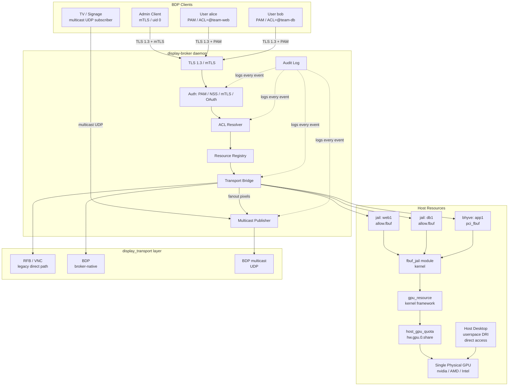
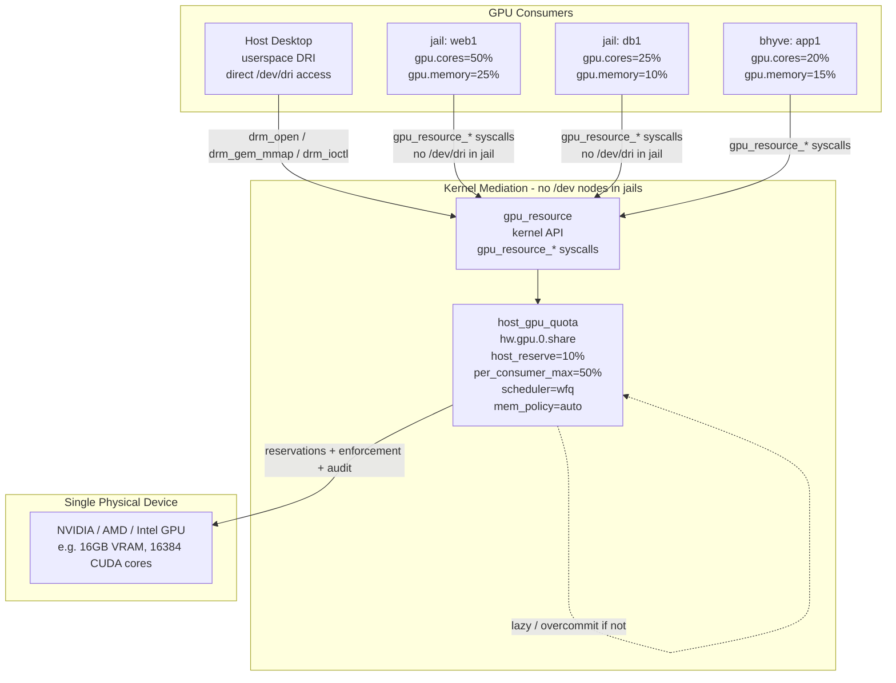
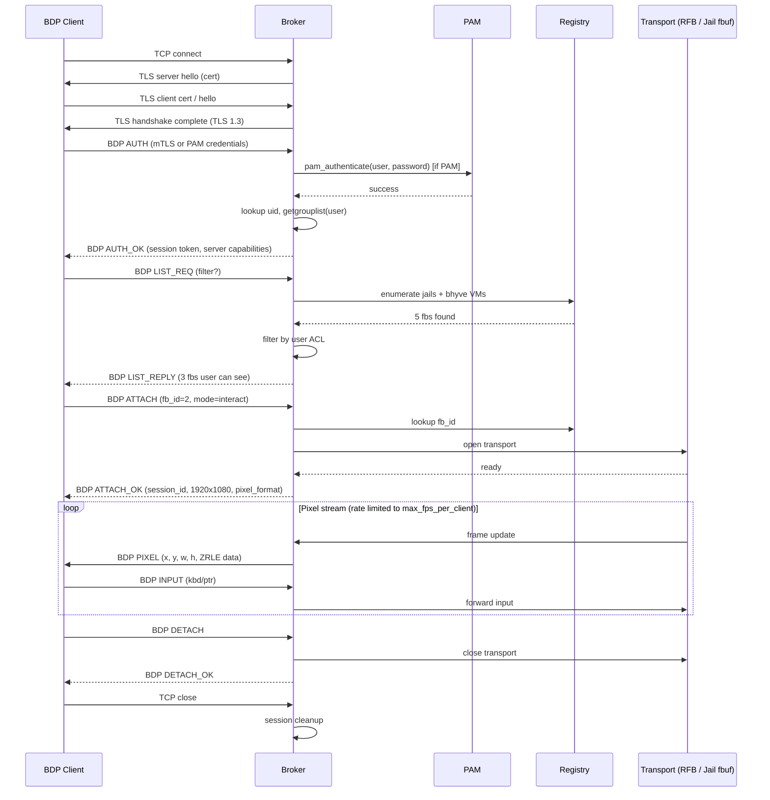
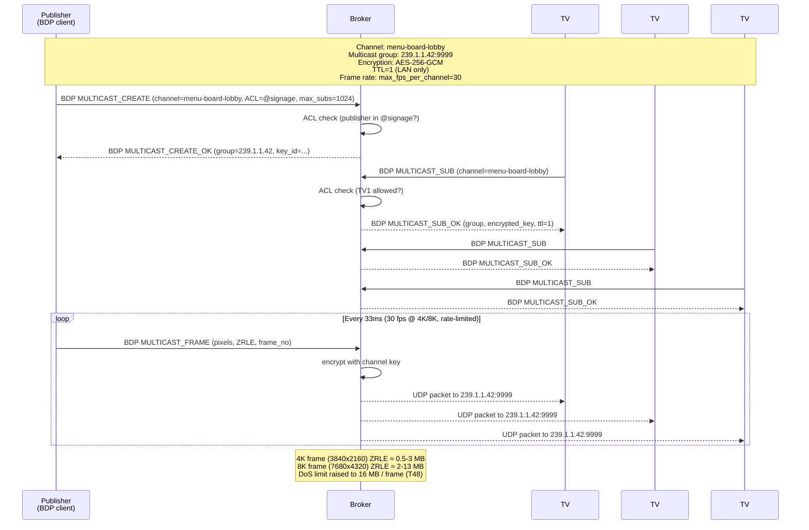
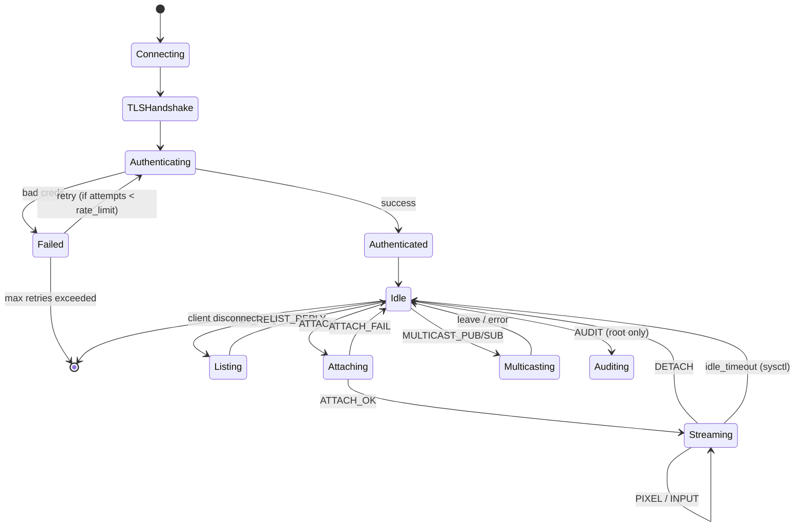
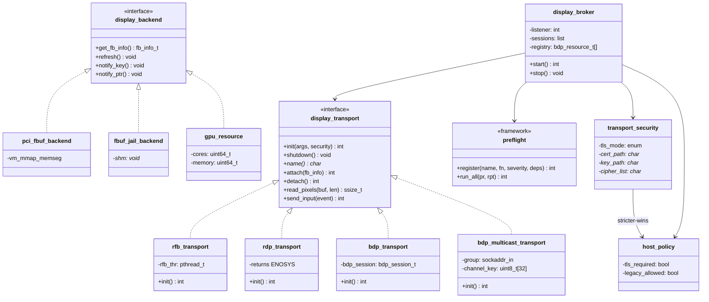
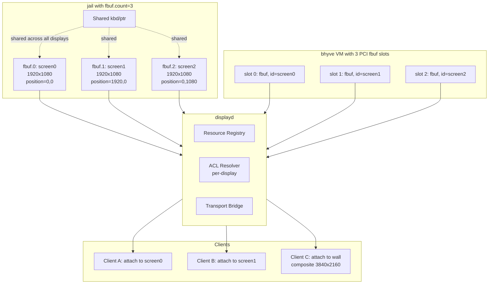
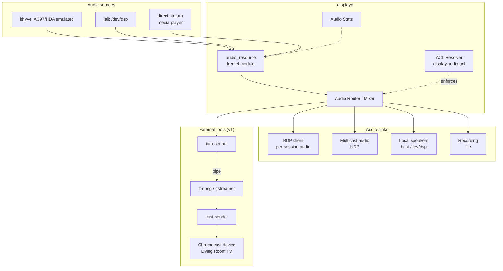

# bhyve Display Abstraction + Jail Framebuffer

## TL;DR

> **Quick Summary**: Refactor bhyve's framebuffer + transport layers into a clean, pluggable abstraction (`display_backend` vtable + `display_transport` vtable), generalize the `console` module to be multi-instance with caller-provided framebuffer memory, wrap the existing RFB/VNC server as a registered transport, and add a FreeBSD jail option (`allow.fbuf` + `fbuf.nokbd` / `fbuf.nomouse`) that provisions a kernel-backed framebuffer + keyboard + mouse for a jail — so the same pluggable transport (VNC today, RDP/SPICE later) can serve the jail's display.
>
> **Deliverables**:
> - `usr.sbin/bhyve/display_transport.{h,c}` — transport registry vtable
> - `usr.sbin/bhyve/display_backend.{h,c}` — consumer/backend vtable
> - `usr.sbin/bhyve/console.{h,c}` — refactored: multi-instance, caller-provided fb, optional bhyvegc
> - `usr.sbin/bhyve/rfb.c` — wrapped as a `struct display_transport`
> - `usr.sbin/bhyve/rdp.c` — skeleton for a future RDP transport
> - `usr.sbin/bhyve/pci_fbuf.c` — wired through `display_transport_init` (no more direct `rfb_init`); supports both `rfb=` (legacy) and `transport=rfb,...` (new)
> - `sys/sys/jail.h` + `sys/kern/kern_jail.c` — new params: `allow.fbuf`, `fbuf.nokbd`, `fbuf.nomouse`
> - `sys/modules/fbuf_jail/` — new kernel module: per-jail framebuffer + kbd + mouse devices
> - `share/man/man5/jail.conf.5` — documents the new params
> - `usr.sbin/bhyve/display-abstraction.md` — architecture doc
>
> **Estimated Effort**: XL
> **Parallel Execution**: YES — 5 waves (T1–T48), max 12 tasks per wave, with sub-waves
> **Critical Path**: T3 (jail API audit) → T8 (console refactor) → T12 (jail fb module) → T17 (smoke test) → T38 (broker daemon) → F1–F4 (review)
>
> **Preflight shipped**: 20 total = 11 base (T23) + 3 transport security (T28) + 6 cert (T33). All tunable via `security.preflight.*`.
>
> **Tunables**: every limit (FPS, frame size, bandwidth, channels, ACL, rate limit, idle timeout, audit level) is a sysctl or loader tunable. See **Tunables Reference** below.
>
> **Frame rate limits** (per-client / per-channel / per-broker) are sysctls: `security.display.broker.max_fps_per_client`, `security.display.broker.max_fps_per_channel`, `security.display.broker.max_fps_total`, plus `security.display.transport.{rfb,bdp,multicast}.refresh_fps`.
>
> **DoS frame size**: BDP default 16 MB, max 64 MB (`security.display.broker.max_frame_size`). Covers 4K compressed; 8K with ZRLE; 16K future.

---

## Visual Overview

> Mermaid diagrams for the architecture, sequence flows, state machines, and timeline. GitHub/GitLab/most markdown viewers render these. The user asked for more graphs; we will iterate on the plan across multiple rounds and these diagrams should help reason about changes. **Update the prose alongside these diagrams** — they should not drift. Inline diagrams in the relevant design sections reference back to this overview.

### 1. System Architecture (the corrected one — GPU is a host-side shared resource)



### 2. GPU Resource Sharing — the corrected view

The GPU is a **single physical device** on the host. It is **shared** between the host's own desktop userspace AND the consumers (jails + bhyve VMs). All access goes through the `gpu_resource` kernel framework and is enforced by `host_gpu_quota` (the `hw.gpu.0.share` sysctls). **No `/dev/dri/*` or `/dev/gpu*` nodes are created inside jails** — the kernel mediates all access at internal API boundaries.



### 3. BDP Authentication + List + Attach Sequence



### 4. Multicast UDP (TV / Advertising Use Case)



### 5. Broker Session State Machine



### 6. Task Timeline (Gantt)


### 7. Module / Class Diagram



---

## Context

### Original Request
> "look for the framebuffer that is used with the VMM and bhyve, and try and understand it a bit here. I want to abstract it so that other things like jails can use it. right now VNC connections are supported, i want to abstract that so we can use other remote desktop tooling and protocols."
> "for the jails, I want a switch in the jail options to add in the framebuffer and the keyboard and mouse, adding in the framebuffer should bring in the keyboard and mouse automatically, but can be disabled if specified"

### Investigation Summary

**Today**, bhyve's display stack is three layers in `usr.sbin/bhyve/`:

1. `pci_fbuf.c` — emulated PCI GPU. Owns the pixel buffer (`vm_create_devmem(VM_FRAMEBUFFER, "framebuffer", 32MB)`), maps it into the guest via `vm_mmap_memseg`, exposes BARs, registers `pci_fbuf_render` with the console, calls `rfb_init()` to start the VNC server.
2. `console.{c,h}` — single-instance middleware with `fb_render_func_t`, `kbd_event_func_t`, `ptr_event_func_t` callback slots. This is the existing seam. RFB and any other transport share it transparently — RFB consumes via `console_get_image()` / `console_refresh()` and produces via `console_key_event` / `console_ptr_event`. Currently a static singleton — only one consumer at a time.
3. `rfb.{c,h}` — RFB wire-format server. Public surface is one function: `rfb_init(family, host, port, wait, password)`. Has `rfb_thr` (accept loop), `rfb_wr_thr` (~24 Hz screen poll with CRC cell diffing), and `rfb_handle` (per-connection state machine). Calls `console_key_event`/`console_ptr_event` to route client input.

**Open question confirmed by recon** (deferred to T2 in the plan): who registers as the kbd/ptr consumer with `console_kbd_register`/`console_ptr_register`? It's not `pci_fbuf` and it's not `rfb`. Almost certainly a keyboard/mouse PCI device (`pci_atkbdc`/LPC) registers and routes input into the guest via `vm_inject_*`. Must be confirmed before the abstraction is complete.

**Jail subsystem** uses two patterns:
- `osd_jail_register` / `osd_jail_set` / `osd_jail_get` (in `sys/kern/kern_jail.c`, `sys/kern/kern_jailmeta.c`) — type-safe parameter registration; what we want for `fbuf.width`, `fbuf.height`.
- `PRISON_FLAG_*` bits + `prison_set_allow` / `prison_set_allow_locked` (in `sys/kern/kern_jail.c:3919+`) — boolean capability flags. Precedent: `allow.vmm`, `allow.vmm_ppt`. This is what we want for `allow.fbuf`, `fbuf.nokbd`, `fbuf.nomouse`.
- Parsing in `lib/libjail/jail.c:1212+` already handles `allow.mount.*` style sub-keys; the kldload-style auto-load for `allow.*` is already in place.

**`framebuffer` branch** has no WIP ahead of main — clean slate.

### GPU Resource Governance (third workstream — framework only)

The user also raised GPU resource sharing and per-tenant limits — concretely, can a jail's nvidia CUDA core count be capped, and more generally how to make a GPU a first-class shareable resource for multi-tenant consistency. This is a **framework-only** scope in this plan (T19–T21); vendor integration is a follow-on workstream.

**FreeBSD's current GPU landscape:**
- `sys/dev/drm/` — kernel DRM/KMS subsystem (AMD, Intel). Not first-class resource-aware: no per-cgroup compute or scheduling primitives.
- `compat/nvidia/` (out-of-tree) — proprietary driver. Has MIG (Multi-Instance GPU) hardware partitioning and `nvidia-smi -c COMPUTE_MODE` for limiting. Exposed via proprietary ioctls.
- `sys/kern/kern_cgroup.c` — cgroup subsystem. Has a memory controller; no GPU-aware schedulers. New cgroup v2 controllers are added via a sysctl + kthread model.
- No kernel concept of "compute units" or "GPU time slice" today.

**Proposed framework (T19–T21 design):**
- New kernel object `struct gpu_resource` with attributes: device id, VRAM bytes, compute units (vendor-defined), scheduling slice (µs), and a `struct gpu_backend *` vtable.
- New jail params: `allow.gpu=N` (select device), `gpu.cores=K` (limit compute units), `gpu.memory=BYTES` (limit VRAM), `gpu.scheduler=round-robin|fifo` (policy).
- **Percentages accepted, vendor-native units** — `gpu.cores=50%` and `gpu.memory=25%` resolve against the **vendor-native total of that specific device** via the backend's `gr_total_capacity()` callback. A CUDA core on nvidia is not a CU/SP on AMD, and neither is an EU on Intel Xe — the percentage is always of the same vendor's same-unit total. Examples: 50% of an RTX 4090's 16,384 CUDA cores = 8,192 cores; 50% of an RX 7900 XTX's 6,144 SPs = 3,072 SPs. Display tools (`jls -v gpu`, sysctl `security.jail.params.gpu.*`) show the resolved absolute + the percentage + the vendor-native unit string (e.g. `gpu.cores=50% of 16384 cuda-cores (nvidia)`). Jail param is `string` at registration (parsed); resolution happens at `jail_set(2)` time and is recorded as the absolute value in the prison struct.
- **DRI-aware on the host, NO device nodes inside the jail** — leverage the existing Direct Rendering Infrastructure as the vendor-agnostic GPU abstraction on the **host side only**. `/dev/dri/cardN` (modesetting/display) and `/dev/dri/renderD128` (off-screen compute) are exposed by nvidia-drm, amdgpu, i915, and any future TPU that ships a DRM driver — but they are **not** propagated into jails. A jail with `allow.gpu` does **not** get any `/dev/dri/*` or `/dev/gpu*` node in its devfs. The kernel mediates all GPU access at internal API boundaries: `drm_open` / `drm_gem_mmap` / `drm_ioctl` on the host for host-side consumers; the `display_transport` read path for shipping pixels to remote clients; and a kernel-internal `gpu_resource_*` API for any jail-side work that legitimately needs the GPU. The user's "generic gpu0" is the host-side DRI surface plus the kernel `gpu_resource` ABI — never a new device node in the jail.
- **Strict guardrail with explicit override** — when a jail requests `allow.gpu=N`, the kernel probes for the physical device and the corresponding `gpu_backend`. If no device is detected or the backend is absent, `jail_set(2)` returns `ENXIO` and the jail **does not start** (logged to `dmesg`: `jail_set: gpu.N not present; strict mode refuses to start jail`). Operators can opt out with `allow.gpu.strict=0` — in that case the jail starts, the `gpu_resource` is created **with no backing device**, no `/dev/dri/*` are exposed (per the previous bullet), and any GPU work the jail attempts fails at the kernel API with `ENXIO`. The default is strict because silently providing no GPU when one was requested is a footgun. Override is explicit.
- **Host-level shared limit across jails + VMs, with memory allocation policy** — a new host-wide object `struct host_gpu_quota` per physical GPU device, registered as a sysctl family `hw.gpu.N.share` and as a tunable. Distributes the device's compute units, VRAM, and scheduling slice across **all consumers** (bhyve VMs + jails). Four knobs:
  - `hw.gpu.N.host_reserve=PCT%` — fraction of the device reserved for the host system itself (default 10%). Cannot be allocated to consumers.
  - `hw.gpu.N.per_consumer_max=PCT%` — hard ceiling on what a single consumer (one jail, or one bhyve VM) can request via `gpu.cores` / `gpu.memory` (default 50%). Prevents one consumer from monopolising the device.
  - `hw.gpu.N.mem_policy=auto|eager|lazy` (default `auto`) — when to allocate VRAM quota. This answers the user's question: "do we allocate all the memory? or hope and pray?"
    - `eager` — at `jail_set(2)` / `vm_create` time, the kernel reserves the full `gpu.memory` quota. The consumer fails to start with `ENOMEM` if the device's free VRAM < the requested quota. Predictable, no overcommit, no hope-and-pray.
    - `lazy` — the kernel records the quota but does not reserve VRAM at startup. Free VRAM is shared across consumers up to the sum of their quotas (overcommit allowed up to device total). When a consumer's GPU work requests VRAM, the kernel checks `sum(currently_in_use) + new_request <= device_total`; if not, the submission is rate-limited / queued / fails per the backend's `gr_mem_pressure` callback. Maximizes utilization, but a burst from one consumer can starve another.
    - `auto` (default) — if `host_reserve` and `per_consumer_max` are both set (i.e. the operator is actively using the quota framework), default to `eager`. Otherwise `lazy`. Per-consumer override: `gpu.memory.policy=eager|lazy` in the jail/bhyve config overrides the host default for that consumer.
  - `hw.gpu.N.scheduler=round-robin|wfq|fifo` (default `wfq`) — compute time-slicing policy. Weighted fair queuing by default; `fifo` for head-of-line; `round-robin` for equal-share.
  Per-consumer `gpu.cores=50%` and `gpu.memory=25%` resolve against the **post-reserve** capacity and are capped at `per_consumer_max`. The framework rejects at `jail_set(2)` (and at bhyve `vm_create` time) with `ERANGE` if a consumer's request would exceed the ceiling. A unified `hw.gpu.N.share` summary sysctl exposes the current allocation map: per-consumer quota, per-consumer in-use, free VRAM, scheduler state, and the policy in effect.

### Preflight check framework (cross-cutting)

The user explicitly required that **all** the new resource-governance requirements — display transport availability, GPU presence, VRAM sufficiency, transport resolution, quota within ceiling, etc. — must be validated **before** a jail or bhyve VM is allowed to start, and that the framework must be extensible so more checks can be added later without surgery. A small in-kernel preflight framework addresses both.

**Surface:**
- Type: `int (*preflight_fn_t)(struct prison *pr, struct preflight_report *rpt)`
- Registry: `preflight_register(name, fn, severity, deps[])` / `preflight_unregister(name)`. New checks can be added at `SYSINIT` or by `KLD` modules. Order is determined by the `deps` array (topological), not registration order — the user said "we prob should add more preflight checks if need be" so the ordering model must scale.
- Runner: `preflight_run_all(pr, rpt)` iterates the registry, calls each fn in dependency order, accumulates results. A `BLOCKING` failure short-circuits with the first error; `WARNING` failures are logged but don't block.
- Report: `struct preflight_report` carries the **full** result set (name, status, error code, message) — not just the first failure — so the operator can see every issue at once and fix them in one pass. Surfaced via `jls -v preflight`, `sysctl security.jail.preflight.<jid>`, and the VMM API for bhyve.

**Shipped preflight checks (T23):**

| Check | Severity | Purpose |
|---|---|---|
| `preflight.gpu.device_present` | BLOCKING | GPU N actually exists in `host_gpu_quota` table |
| `preflight.gpu.backend_registered` | BLOCKING | A `gpu_backend` is registered for the device class |
| `preflight.gpu.quota_within_per_consumer_max` | BLOCKING | Requested `gpu.cores` / `gpu.memory` ≤ `hw.gpu.N.per_consumer_max` |
| `preflight.gpu.vram_available` | BLOCKING (eager only) | Free VRAM ≥ requested quota when `mem_policy=eager` |
| `preflight.gpu.scheduler_available` | BLOCKING | Requested `gpu.scheduler` is implemented by the backend |
| `preflight.fbuf.transport_registered` | BLOCKING | Requested `fbuf.transport` exists in `display_transport` registry |
| `preflight.fbuf.resolution_supported` | BLOCKING | w/h within backend's `gr_max_resolution()` |
| `preflight.display.console_slot_available` | BLOCKING | A free `console` instance slot |
| `preflight.bhyve.pci_slot_available` | BLOCKING (bhyve only) | A free PCI slot for `pci_fbuf` |
| `preflight.strict_override_used` | WARNING | `allow.gpu.strict=0` was set — log a clear note that the jail is starting without a backing GPU |
| `preflight.bhyve.host_capable` | BLOCKING (bhyve only) | `vmm.ko` is loaded, hardware supports VT-x/AMD-V |

**Extensibility hooks:**
- New checks can be added by any kernel module via `preflight_register()`. Sorted by `deps`, not registration order.
- The `preflight_report` is preserved in `struct prison` and the VMM-side vm struct for post-mortem inspection via `jls -v preflight` and `bhyvectl --get-preflight`.
- A `preflight_dry_run` sysctl/tunable runs all checks without committing — useful for `jail -c` validation in CI and for `bhyve -p` style dry-run.
- Failure messages are stable strings (namespaced `PREFLIGHT_FAIL_GPU_DEVICE_ABSENT` etc.) so external tooling can grep for them.
- A jail with `allow.gpu` set gets a private `gpu_resource` bound to it. Vendor backends (nvidia MIG, AMD partition, Intel SR-IOV VF) plug into `gpu_backend` vtable.
- Enforcement at the **host-side DRM open/mmap/ioctl** layer (for host consumers of DRI), the **kernel-internal `gpu_resource_*` API** (for jail consumers that legitimately need GPU compute), the **`display_transport` read path** (when host transport reads the jail's framebuffer to ship pixels to remote clients), and **`execve` boundaries** inside the jail (to block GPU-using programs when `allow.gpu` is not set or strict mode has no backing device).
- For non-virtualized GPUs (single physical device, time-sliced), the framework reduces to time-slicing the GPU context. For MIG/VF-capable devices, it can do hard partitioning.

### Transport security (VNC hardening)

The user called out the long-standing lack of security around the VNC transport. Today (`usr.sbin/bhyve/rfb.c`):

- **Plaintext protocol by default** — the RFB wire format carries pixels and key/pointer events unencrypted. Anyone with a `tcpdump` on the link sees everything on the guest screen and can replay input.
- **Single-DES VNC auth** (`rfb.c:1046-1053`) — 8-byte fixed-length password, DES-based challenge-response, brute-forceable in seconds. The `NO_OPENSSL` build option disables even this.
- **No rate limiting on auth attempts** — unlimited retries per source IP.
- **No idle timeout** — once authenticated, a session lives until the client disconnects or the VM dies.
- **No audit logging** — no record of who connected, when, what they did.
- **No client authentication** — only the server proves itself (or doesn't, with `SECURITY_TYPE_NONE`).
- **No replay protection** — same auth challenge can be replayed.

For the abstraction, security is a **property of the transport**, not bolted on. The `display_transport` vtable grows a security config that every transport implements in its own protocol-appropriate way (RFB → VeNCrypt/TLS; RDP → CredSSP/NLA; SPICE → SASL). Defaults are tight; legacy plaintext is opt-in with a loud warning.

**New transport security policy (T24–T29):**

- **Default mode: `tls_required`**. Any transport that supports TLS (RFB via VeNCrypt, RDP via CredSSP, SPICE via SASL+TLS) refuses to start without it. Falls back to `tls_preferred` if OpenSSL is missing at build time, with a logged warning.
- **Legacy plaintext is `legacy` opt-in only** — `transport.legacy=1` in the jail/bhyve config. Logged at `auth.notice` on every connection: `rfb: LEGACY plaintext connection from <ip>:<port>; security=TLS-OPTIONAL but legacy override accepted`. Cannot be the default; cannot be set via `jail.conf` if `security.jail.param.legacy_allowed=0` (host sysctl).
- **Config keys** (all string or bool; the `display_transport_init` signature takes a `struct transport_security *` populated from these):
  - `transport.tls.mode=required|preferred|optional|disabled` (default `required`)
  - `transport.tls.cert=path`, `transport.tls.key=path` — server cert + private key. Default paths: `/etc/bhyve/<name>.pem` and `/etc/bhyve/<name>.key` (bhyve), `/etc/jail/<name>.pem` and `/etc/jail/<name>.key` (jail).
  - `transport.tls.client_ca=path` — if set, server requires and verifies a client cert against this CA. Off by default.
  - `transport.tls.ciphers=list` — OpenSSL cipher list (default: TLS 1.3 + `ECDHE+AESGCM:ECDHE+CHACHA20`)
  - `transport.auth=vnc|pam|none` (default `vnc` for RFB). `pam` delegates to host PAM stack.
  - `transport.timeout.seconds=N` (default 1800 = 30 min idle disconnect)
  - `transport.rate_limit.attempts=N` (default 5 per source IP per minute, with exponential backoff)
  - `transport.audit=1|0` (default 1) — every connect / auth-fail / disconnect logged to syslog with structured fields (`transport`, `src`, `dst`, `auth`, `result`, `bytes_in`, `bytes_out`, `duration_s`).
- **VeNCrypt implementation in rfb.c (T25)** — RFB security types 19 (VeNCrypt), 20 (VeNCrypt with client cert). Uses OpenSSL. Handshake:
  1. Server advertises `RFB 003.008` with `VeNCrypt` sub-version 0.2
  2. Server sends list of supported sub-types: `AnonTLS`, `VeNCryptTLS`, `VeNCryptX509TLS`, `X509None`, `X509VncAuth`, `X509PamAuth`
  3. Client picks one, server accepts, `STARTTLS` via OpenSSL `SSL_accept`
  4. Post-TLS: sub-type auth (VNC password OR PAM, depending on negotiated)
  - Plain `SECURITY_TYPE_NONE` is **removed from the default allowlist**. Only reachable via `transport.legacy=1`.
- **Capsicum retained** — the existing `caph_rights_limit(rc->sfd, CAP_ACCEPT|CAP_EVENT|CAP_READ|CAP_WRITE)` (rfb.c:1436) is still applied. VeNCrypt must run before Capsicum tightens (so the OpenSSL context can do its work) — order is: socket → bind → listen → TLS handshake → Capsicum → accept loop.
- **Preflight checks added (T28):**
  - `preflight.transport.tls_cert_readable` — BLOCKING. Verifies `transport.tls.cert` exists, is readable, not world-writable, and parses as a valid X.509 cert with a matching key.
  - `preflight.transport.tls_key_permissions` — BLOCKING. Private key file must be `0600` or `0640` root-owned. Refuses to start with a world-readable key.
  - `preflight.transport.legacy_used` — WARNING. `transport.legacy=1` is set; log a clear note.
- **For the jail-side fbuf transport (T12)**: same security policy applies. A jail's framebuffer may be just as sensitive as bhyve's guest. The default is `tls_required`; the same `transport.tls.*` params are accepted in the jail config.
- **Documentation (T29)**: `bhyve(8)`, `bhyve_config(5)`, `jail.conf(5)`, and a new `display_transport_security(7)` man page documenting the threat model, the default policy, the legacy opt-out, and the OpenSSL version requirements. A `SECURITY` section in `display-abstraction.md` summarises the model.

**Threat model (out of scope but documented):**
- A compromised RFB client can send arbitrary input to the guest — out of scope (a malicious user with a VNC client can always do this).
- A compromised guest can draw anything on the screen and trick the operator — out of scope.
- The TLS layer protects: confidentiality of pixel data + input events, server authentication, and (with `client_ca`) strong client authentication. It does **not** protect against a malicious client or guest.

**In-scope for this plan:** VeNCrypt implementation in rfb.c, transport security config + defaults, preflight checks for cert readability, audit logging, rate limiting + idle timeout, docs.
**Out-of-scope (separate workstream):** post-quantum TLS (deferred until OpenSSL has stable support), SSH-tunnel-as-default (encouraged in docs, not enforced), CRL/OCSP for client cert verification (deferred).

### Backward compatibility (the upgrade-must-not-break promise)

The user said: "make sure that current tooling and configurations are not impacted, we wouldn't want people to upgrade and then have all of their stuff not work." This is a hard guarantee. Every change in this plan must be **additive**: existing setups continue to work unchanged. New features are opt-in via new config keys; old patterns keep working with a logged deprecation warning, never a hard break.

**Backcompat guarantee (all are must-have):**

1. **bhyve CLI / config** — every existing flag, option, and config key continues to work byte-for-byte. The parser accepts both old and new forms. Specifically:
   - `rfb=host:port`, `tcp=host:port` — accepted, silently translated to `transport=rfb,security=legacy,tls=optional,host=...,port=...` (T13). A `auth.notice` is logged on every start: `fbuf: legacy rfb= config detected; consider migrating to transport=rfb,...`. Existing VNC clients (RealVNC, TightVNC, TigerVNC, noVNC, Remmina, ...) connect unchanged.
   - `vga=on|io|off`, `w=`, `h=`, `password=`, `wait=`, `unix:path` — accepted unchanged.
   - `bhyve -s <bus>,fbuf,...`, `bhyve -m size`, `bhyve -c ncpu`, all the rest of the bhyve argv — unchanged.
   - `bhyvectl` (the userspace control tool) — its ioctl surface is unchanged; new commands are additions.
2. **jail config / libjail API** — every existing jail param continues to work. The param table is purely additive. Specifically:
   - `allow.vmm`, `allow.vmm_ppt`, `allow.mount.*`, `allow.raw_sockets`, `allow.socket_audit`, `allow.quotas`, `allow.set_hostname`, etc. — unchanged.
   - `host.*`, `path.*`, `exec.*`, `mount.*`, `vnet.*`, `ip4.*`, `ip6.*` — unchanged.
   - `jail_set(2)`, `jail_get(2)`, `jail_create(3)`, `jail_remove(3)` — the libjail ABI is unchanged. New params are additions.
   - `jail(8)`, `jls(8)`, `jexec(8)` — the CLI surface is unchanged. New flags are additions.
3. **VMM / VMMAPI** — `sys/amd64/vmm/`, `lib/libvmmapi/`, `/dev/vmm/*` — **not touched by this plan**. The kernel VMM module and its userspace API are out of scope. New framebuffer work is in userspace (`usr.sbin/bhyve/`) and in the new `sys/modules/fbuf_jail/` kernel module (additive, opt-in).
4. **VNC clients** — every existing RFB 3.x client (including plaintext-only ones like TightVNC 1.3) continues to work, **as long as the operator hasn't explicitly set `transport.tls.mode=required`**. The default for legacy `rfb=` configs is `tls=optional`, which accepts both plaintext and TLS connections. To force TLS-only, the operator must opt in.
5. **TLS / cert ecosystem** — existing certbot-managed certs at `/etc/letsencrypt/live/...` are discovered automatically by the cert discovery policy (T30). No certbot reconfig needed. Existing self-signed certs are loaded as-is. No regression.
6. **bhyve_config(5) / jail.conf(5) syntax** — the file format is unchanged. Old files parse byte-for-byte. New keys are additions.
7. **Config-file migration** — handled silently by T13 (bhyve side) and T21 (jail side). No manual migration step required. The user never has to edit their config to keep working. They get a one-line deprecation warning and that's it.
8. **Kernel modules** — all new modules (`sys/modules/fbuf_jail/`, `sys/modules/preflight/`) are **additive**. They do not change behavior of any existing module. If not loaded, the system behaves exactly as it does today.
9. **sysctls / tunables** — all new sysctls are additions under new OIDs (`hw.gpu.*`, `security.transport.*`, `security.jail.preflight.*`). No existing sysctl changes meaning. `kern.jail.*` param set is purely additive.
10. **ABI / SONAME** — `libvmmapi.so`, `libjail.so` are not bumped. New symbols are additions, not replacements.

**Migration story for operators (in T17 / T34 docs):**

- **Bhyve users**: do nothing. Your existing `rfb=...` config keeps working. To get TLS, swap to `transport=rfb,tls=required,cert=...` (or let auto-self-signed handle it). To get RDP, use `transport=rdp,...`.
- **Jail users**: do nothing for the display part. New `allow.fbuf`, `allow.gpu`, `gpu.*` params are opt-in. To enable a framebuffer in a jail, add `allow.fbuf;` to its config.
- **Multi-tenant GPU users**: opt in to `hw.gpu.0.share` sysctls. Without them, GPUs are passed through to whoever opens them (legacy behavior, like Linux pre-cgroups).
- **Certbot users**: no change. The certbot live dir is auto-discovered. Reload happens on `kqueue` events (no restart).
- **Self-signed users**: no change. If you've been using `-selfsigned` or a hand-rolled openssl cert, the loader finds it.

**Test strategy for backcompat:**

- **bhyve regression suite** (`tests/sys/vmm/fbuf_legacy.sh` + new `fbuf_variants.sh`) — boots a known VM with every legacy config style (`rfb=`, `tcp=`, `unix:`, `vga=`, `password=`, `wait=`) and confirms the VNC handshake works and the screen updates.
- **Jail regression suite** (`tests/sys/jail/backcompat.sh`) — runs the standard FreeBSD jail test suite with the new module loaded; all existing tests must pass.
- **Jail param round-trip** — for every existing `allow.*` param and a sample of `host.*` / `vnet.*` / `path.*`, `jail_set` then `jail_get` returns the same value. New params are additional.
- **VNC client fuzz** — connect with RealVNC 5.x, TigerVNC 1.12, noVNC, Remmina, and a raw RFB 3.3 client. All must complete the handshake.
- **F1 (plan compliance) and F2 (code quality) explicitly check backcompat** — the reviewer grep-greps for removed/changed public symbols, changed CLI flags, changed sysctl meanings.

**Per-task backcompat requirements (added to every task that touches a public surface):**

- T7 (display_transport registry) — old `rfb_init` keeps its signature; the registry is an internal addition.
- T8 (console refactor) — old `console_init(w, h, fb)` keeps its signature; the new `console_create` is an addition. `pci_fbuf.c` and `rfb.c` still call the old function via a compat shim.
- T9/T10 (jail params) — purely additive. No existing param's name, type, default, or meaning changes.
- T11 (rfb wrap) — old `rfb_init` keeps working; the wrapper is an internal addition.
- T13 (pci_fbuf wire) — explicit backcompat: `rfb=...` parses unchanged and produces a working plaintext connection. The new `transport=...` is the recommended form but the old form is the supported backcompat path.
- T21 (gpu params) — purely additive. No existing param's meaning changes.
- T25 (VeNCrypt) — TLS is opt-in. Plaintext is reachable via the old `rfb=` config or via explicit `transport.tls.mode=optional|disabled`.
- T27 (display_transport security) — `NULL` security falls back to legacy plaintext defaults, not to TLS-required. Operators must opt in to TLS.
- T30 (cert loader + self-signed) — auto-gen only fires when no cert is found anywhere. If the operator has configured any cert path, the auto-gen does not interfere.

**Cert sourcing and format support (T30–T33):**

The user wants the transport security to consume certs from the usual ecosystem — certbot/Let's Encrypt, internal CAs, enterprise CAs, cloud-managed, etc. The wire formats are all standard; what the framework must add is **format auto-detect, chain handling, hot-reload on certbot renewal, and SNI for multi-tenant hosts**. Nothing here is incompatible with OpenSSL — the work is in the loader and the lifecycle, not the crypto.

**Supported formats (auto-detected at load time):**
- **PEM** — the default; what certbot, step-ca, openssl, most internal CAs, and ACME clients emit. May be a single `fullchain.pem` + separate `privkey.pem`, or a combined file. Handled by `PEM_read_bio_X509` + `PEM_read_bio_PrivateKey`.
- **DER** — binary X.509, what some Java/Windows tools emit. Auto-detected by trying `d2i_X509_bio` after PEM fails.
- **PKCS#12 / PFX** (`.p12`, `.pfx`) — common on Windows/IIS, Java keytool, some enterprise CAs. Password-protected. Handled by `PKCS12_parse`. Password from a separate file (`transport.tls.pkcs12_password_file`) or a config-stored value.
- **PKCS#7 / P7B** (`.p7b`) — cert chain only, no key. Unusual for a single server cert but supported for chain bundles. Key is loaded separately.
- **JKS** (Java KeyStore) — **out of scope**; would need a Java-side conversion. Documented but not auto-detected.
- **Combined cert+key PEM** — split at runtime.

**Chain handling:**
- Prefer `fullchain.pem` (leaf + intermediates) over `cert.pem` (leaf only). Without intermediates, most clients reject the connection.
- If the operator supplies a separate `chain.pem`, the loader concatenates `cert.pem` + `chain.pem` into the OpenSSL trust store.
- For PKCS#12, the bundle typically contains the chain — `PKCS12_parse` returns a `STACK_OF(X509) *ca` that gets attached.

**Cert discovery (T30 expansion — "point at a path, we figure out what's there"):**

The framework's contract is **agnostic** about how the operator got the cert. The user said: "the user gets these certificates, and the tooling we are planning now just consumes" and "point to a dir / file and we see what's there are bring it in, maybe some questions need to be asked, like the password on the cert." The loader applies a discovery policy in order, stopping at the first successful match:

- **Path is a directory** (the common case for `transport.tls.cert=/etc/letsencrypt/live/example.com/`):
  1. Look for `fullchain.pem` + `privkey.pem` (certbot / Let's Encrypt live-dir convention). Use as leaf + chain + key. **Zero questions asked.**
  2. Else look for `cert.pem` + `privkey.pem` (older certbot / openssl convention). Use as leaf + key; warn if intermediates are missing.
  3. Else scan for any `*.pem` and try to pair with a sibling `*.key` or `privkey.pem` in the same dir.
  4. Else scan for any `*.p12` / `*.pfx` and require a password (see below).
  5. Else fail with a clear error listing every file found and what was tried: `tls: directory <path> contains no recognisable cert+key pair; saw [...]`.
- **Path is a file** (common for self-signed or a single cert):
  1. Auto-detect format (PEM → DER → PKCS#12). If PEM, look for a sibling key (`<cert>.key`, `privkey.pem`, or matching basename) before failing.
  2. If a key file is in the same dir but not specified, the loader picks the most plausible one. Documented heuristics in `display_transport_security(7)`.
- **Path is a SNI dir** (`transport.tls.sni_dir=/etc/bhyve/sni/`):
  - Each `<name>` in the dir is discovered the same way as a single file/dir: look for `<name>.pem` + `<name>.key`, or `<name>.p12` (with password), or a `live-<name>/` subdirectory with certbot's standard layout.
  - The dir is re-scanned on `kqueue` events (certbot renewal triggers a re-scan automatically — no operator action needed).
- **Password handling** (for PKCS#12 and encrypted PEM keys) — never on the command line:
  - **Interactive mode** (bhyve/jail running with a controlling TTY): the loader prints a prompt to `/dev/tty` and reads the password with `getpass(3)`-style no-echo input. The user's "questions need to be asked" expectation is satisfied here.
  - **Non-interactive mode** (systemd service, daemonized jail start): the loader reads the password from a file specified by `transport.tls.password_file=path` (chmod `0600` or `0640` root-owned — same as the key). Preflight check `preflight.transport.tls_key_permissions` (T28/T33) enforces this.
  - **Environment variable** as last resort: `TRANSPORT_TLS_PASSWORD=...` (documented as less secure; not the default; never written to logs).
  - The password is held only in memory, zeroed after `SSL_CTX` build, never logged, never passed to subprocesses. A `--no-password-prompt` flag (CI mode) refuses to start if a password is needed but no file is configured.
- **Agnostic by design** — the framework doesn't know or care that certbot, acme.sh, step-ca, internal CA, or a hand-rolled `openssl req -x509` produced the files. The discovery policy is heuristic; the operator can always override by pointing `transport.tls.cert` at a specific file. The framework **does not** run ACME, **does not** call certbot, **does not** generate keys or CSRs. Generation is the operator's job; consumption is the framework's.

**Self-signed auto-generation (T30 expansion — "just works" for dev / single-user / LAN-only):**

The user said "AND IF NO CERT IS PROVIDED, MAKE A SELF SIGNED AUTOMATICALLY." Zero-friction is the goal: an operator should be able to start a bhyve VM or a jail with TLS without first setting up certbot. If no cert is configured anywhere, the framework generates a self-signed cert at first start, stores it persistently, and reuses it on subsequent restarts (so clients don't have to re-accept the cert every time).

**Trigger** (all of these must be true):
- `transport.tls.mode` is not `disabled`
- `transport.tls.cert` is unset, or points at a path with no cert
- `transport.tls.sni_dir` is unset, or set but empty
- `transport.tls.password_file` is unset (we're not in PKCS#12 mode)
- Discovery (T30 above) finds nothing at any reasonable path

**Behavior:**
- The loader generates an RSA-2048 / ECDSA-P256 keypair (default RSA-2048; `transport.tls.self_signed.key_type=rsa|ecdsa` to choose) and a self-signed X.509 cert using OpenSSL.
- Default cert subject: `CN=<transport_name>` (e.g. `CN=bhyve:myvm`, `CN=jail:myjail`). SAN includes the same hostname.
- Validity: 1 year from generation. Auto-rotates on next start if within 30 days of expiry (regen policy is `regen_within_days=30`; configurable).
- Cert is written to a persistent path:
  - bhyve: `/var/db/bhyve/tls/<vmname>.pem` + `/var/db/bhyve/tls/<vmname>.key`
  - jail: `/var/db/jail/tls/<jailname>.pem` + `/var/db/jail/tls/<jailname>.key`
  - chmod `0644` for cert, `0600` for key; root-owned. Directory created at first start.
- On subsequent starts, the loader sees the existing cert and reuses it. No regeneration, no client-side re-prompt for cert acceptance.
- A sysctl `security.transport.tls.regen_self_signed=1` (or deletion of the cert file) forces regeneration on next start. Useful for testing and for "I broke my dev cert, just give me a new one."
- For SNI: if `sni_dir` is unset and no `default_cert` is configured, the framework auto-generates one self-signed cert that covers all SNI hostnames (using SAN with the union of expected hostnames, or just the first one if no SNI is configured yet).

**Browser / client behavior:**
- Self-signed certs trigger browser warnings ("untrusted issuer") and require the operator to manually trust the cert (one-time per cert). This is **acceptable for dev / single-user / LAN-only deployments** — exactly the "just works" use case.
- For production, the operator **must** set `transport.tls.cert=/etc/letsencrypt/live/...` (or equivalent). The `display_transport_security(7)` man page makes this explicit. A `WARNING` is logged at every self-signed-cert start: `tls: using self-signed cert at <path>; for production, set transport.tls.cert=...`.

**Preflight behavior (T33 update):**
- `preflight.transport.tls_cert_format` — when no cert is configured, returns `WARNING` (not `BLOCKING`) with a clear message: `no cert configured; will auto-generate self-signed at <path> on first start; for production, set transport.tls.cert=...`. The auto-gen is then allowed to proceed.
- The preflight never blocks on "no cert"; the auto-gen is the safety net.
- `preflight.transport.tls_self_signed_in_use` — WARNING. Always fires when the active cert is self-signed. Reminds the operator that production deployments should use a real cert.

**TDD tests added to T30:**
- `atf_tls_autogen.test` — with no cert configured, loader generates a cert + key, both loadable. Subject matches the transport name. Validity is 1 year ± 1 day. Files exist on disk.
- `atf_tls_autogen_persist.test` — with an existing self-signed cert at the auto-gen path, loader reuses it (no new cert; key file mtime unchanged after second start).
- `atf_tls_autogen_regen.test` — with `security.transport.tls.regen_self_signed=1`, loader regenerates even when an existing cert is present.
- `atf_tls_autogen_rotate.test` — with an existing cert that is within `regen_within_days` of expiry, loader regenerates on next start.
- `atf_tls_autogen_sni.test` — with `sni_dir` set but empty, loader generates a self-signed default cert.
- `atf_tls_autogen_permissions.test` — generated cert file is `0644`, key file is `0600` (or `0640`), root-owned.

**Host policy layer (T35 — global sysctls that override any consumer config):**

The user wants global sysctls that **enforce** all the security things — not just defaults, but hard policy that the operator can flip on and that wins over any per-jail / per-bhyve config. This is the "the host operator's policy always wins" layer. The "more zero friction" theme is preserved: defaults are sensible and self-documenting, but the operator has the override hammer when they need it.

**Policy precedence rule:** **host > consumer > default**. The host sysctl is the most-restrictive setting; the consumer config can loosen (where allowed by the host), and the default is the most-permissive baseline. If the host says "TLS required", no consumer can opt out via `transport.legacy=1`.

**Sysctls (under `security.policy.*` and `security.transport.*`):**

| Sysctl | Default | When set stricter, effect |
|---|---|---|
| `security.policy.tls_required` | `0` (consumer chooses) | If `1`, no consumer may use plaintext — `transport.tls.mode=disabled` / `legacy=1` are refused by preflight. |
| `security.policy.legacy_allowed` | `1` (backward compat) | If `0`, `transport.legacy=1` is refused. **Off by default in production deployments** (set to 0 by the install script or `sysctl` recipe in the docs). |
| `security.policy.audit_default` | `1` | If `0`, suppresses audit logging (operators debugging a noisy log). |
| `security.policy.rate_limit_default` | `5` (attempts per minute per IP) | Override the per-transport default. A consumer can be MORE restrictive (e.g. `3`) but not less. |
| `security.policy.timeout_default_seconds` | `1800` (30 min) | Override the per-transport default. A consumer can be MORE restrictive but not less. |
| `security.policy.self_signed_allowed` | `1` (dev convenience) | If `0`, self-signed certs are refused — preflight `tls_self_signed_in_use` becomes BLOCKING. Production deployments set this to `0`. |
| `security.policy.weak_auth_allowed` | `1` (legacy compat) | If `0`, single-DES VNC auth is refused. |
| `security.policy.allow_fbuf` | `0` (jails can't have fb by default) | If `1`, the `allow.fbuf` jail param is enabled host-wide (otherwise preflight `preflight.fbuf.policy` blocks it). |
| `security.policy.allow_gpu` | `0` (jails can't have GPU by default) | If `1`, the `allow.gpu` jail param is enabled host-wide. |
| `security.policy.preflight_strict` | `1` (BLOCKING checks refuse to start) | If `0`, all BLOCKING preflight checks are downgraded to WARNING. Useful for dev / test. |
| `security.policy.gpu_strict` | `1` (allow.gpu without GPU fails jail start) | If `0`, strict mode is bypassed jail-wide. |
| `security.policy.cuda_percentage_max` | `0` (no host-level cap) | If non-zero, the per-consumer `gpu.cores` is capped at this percentage of the device. |
| `security.policy.vram_percentage_max` | `0` (no host-level cap) | If non-zero, the per-consumer `gpu.memory` is capped at this percentage. |

**Per-consumer resolution rule (T35 implementation):** when both a host sysctl and a consumer config are set, the **stricter** of the two wins. Example:
- Host `security.policy.rate_limit_default=3`, consumer `transport.rate_limit=10` → effective rate limit is `3` (host stricter).
- Host `security.policy.tls_required=1`, consumer `transport.tls.mode=disabled` → BLOCKING preflight failure, consumer refused.
- Host `security.policy.allow_gpu=0`, consumer `allow.gpu=0` → no GPU requested, no change.
- Host `security.policy.allow_gpu=1`, consumer `allow.gpu=0` → no GPU requested, no change.
- Host `security.policy.allow_gpu=1`, consumer `allow.gpu=1` → GPU requested and allowed.

**Zero-friction defaults (the "just run it" promise):**
- A bhyve VM with no `transport=` config and no `rfb=` config → fails fast with a clear "no transport configured" error and a hint to set `transport=rfb` (or `transport=rdp`). Not silent.
- A bhyve VM with `rfb=127.0.0.1:5900` → works (legacy plaintext, VNC client connects, warning logged).
- A bhyve VM with `transport=rfb` and no `transport.tls.cert` → self-signed auto-generated, TLS on by default, VNC client connects with one-time cert acceptance.
- A bhyve VM with `transport=rfb,tls.cert=/etc/letsencrypt/live/foo/` → certbot cert auto-discovered, TLS on, hot-reload on renewal, no restart.
- A jail with `allow.fbuf` → framebuffer created, kbd/mouse auto-attached, host transport can be attached.
- A jail with `allow.fbuf` and no `fbuf.transport` → defaults to RFB; self-signed cert auto-generated if no TLS cert; transport attaches to the jail.
- A jail with `allow.gpu=0,gpu.cores=50%` → 50% of the device's CUDA cores (resolved at jail_set time); VRAM capped at 25%.
- A jail with `allow.gpu=0` and no GPU on the host → strict mode fails jail start (ENXIO); strict=0 override starts jail with no GPU.

**Documentation (T17/T34):** a `policy-quickstart(7)` man page documents the recommended operator setup:
```
# One-time host setup, secure by default
sysctl security.policy.legacy_allowed=0
sysctl security.policy.self_signed_allowed=0
sysctl security.policy.tls_required=1
sysctl security.policy.audit_default=1
```
And shows what breaks (legacy `rfb=` configs that haven't migrated) vs what works (`transport=rfb,tls.cert=...`).

**Hot-reload (certbot renews every 60-90 days):**
- The cert loader watches the cert file with `kqueue` (FreeBSD-native) — `NOTE_ATTRIB` on the symlink target (certbot uses a symlink to the live dir: `/etc/letsencrypt/live/<domain>/fullchain.pem` → `../../archive/<domain>/fullchainN.pem`).
- On change, the loader re-parses the cert + key, builds a new `SSL_CTX`, and atomically swaps it. In-flight connections on the old context are not interrupted; new connections use the new context.
- Reload is also triggered by `SIGHUP` to the bhyve process or the transport thread — manual override for ops who want explicit control.
- A sysctl `security.transport.cert_reload_debug=1` logs every reload attempt with the cert subject, issuer, and expiry.
- Reload is **NOT** a restart. No dropped sessions.

**SNI (Server Name Indication):**
- For a host serving multiple jails/VMs with distinct certs, the transport supports `transport.tls.sni_dir=/etc/bhyve/sni/` — a directory of `<hostname>.pem` + `<hostname>.key` pairs.
- An OpenSSL `SSL_CTX_set_tlsext_servername_callback` picks the right cert based on the client's `servername` extension.
- `transport.tls.default_cert` is the fallback when SNI is absent or the hostname is unknown.
- SNI is a per-transport concern; the registry hands the SNI config to the transport's init.

**OCSP stapling (optional, off by default):**
- `transport.tls.ocsp=1|0` (default 0). When on, the transport queries an OCSP responder at startup and at cert reload, caches the response, and staples it to the TLS handshake. Reduces client-side OCSP traffic and privacy leakage.

**ACME integration (out of scope, documented):**
- The framework does **not** call ACME itself. Operators run certbot / acme.sh / step-cli as a separate timer / cron. The framework just consumes the certs.
- `display_transport_security(7)` includes a `certbot --standalone` recipe for a typical jail host.

**Preflight checks added (T33):**
- `preflight.transport.tls_cert_format` — BLOCKING. Tries to load the cert in each supported format, reports which one parsed. Failure modes: empty file, corrupt PEM, PKCS#12 without password, mismatched key.
- `preflight.transport.tls_key_match` — BLOCKING. Verifies the private key matches the cert (public-key fingerprint comparison).
- `preflight.transport.tls_chain_valid` — BLOCKING. For each cert in the chain, verifies the signature against the parent's public key. Warns on a self-signed leaf.
- `preflight.transport.tls_not_expired` — WARNING. Cert expires within 30 days → warn; within 7 days → strong warn.
- `preflight.transport.tls_hostname` — BLOCKING. If `transport.tls.expected_hostname` is set, the cert's CN/SAN must match.
- `preflight.transport.sni_files` — BLOCKING (when `sni_dir` is set). Each `<host>.pem` must parse, each `<host>.key` must match.

**In-scope for the GPU plan:** kernel framework surface (DRI on host, kernel-internal `gpu_resource` API for jails — **no new `/dev/dri` or `/dev/gpu*` nodes inside jails**), percentage parsing with vendor-native unit resolution, jail param registration with strict/override semantics, host-level `host_gpu_quota` with `host_reserve` / `per_consumer_max` / `mem_policy` / `scheduler` knobs, preflight check framework + 11 shipped checks, one stub backend, smoke test.
**Out-of-scope (follow-on workstream):** actual nvidia.ko integration (license + ABI sensitivity), AMD partition backend, Intel SR-IOV backend, real TPU driver plumbing. Tracked as a separate workstream.

### Architecture support (jails run everywhere)

Jails run on every FreeBSD-supported architecture. The plan's modules (`fbuf_jail`, `preflight`, `gpu_resource`) and userspace tools (`bhyve`, `display_transport*`, `rfb`, `rdp`, `cert_loader`) must work on all of them. **bhyve itself is amd64-only** (it requires VT-x/AMD-V), so the bhyve-side code (T7, T8, T11, T13, T14, T17, T18, T25, T26, T30, T31, T32, T33, T36) is amd64-only by design — but the **jail-side code** (T9, T10, T12, T15, T19, T20, T21, T22, T23, T24, T27, T28, T29, T34, T35) must build and run on every arch.

**Supported architectures and per-arch concerns:**

| Arch | Endianness | Pointer | Page | Unaligned | fbuf_jail | gpu_resource | Notes |
|---|---|---|---|---|---|---|---|
| **amd64** | LE | 64-bit | 4KB | OK (penalty) | ✓ | ✓ | Primary target. bhyve host. |
| **i386** | LE | 32-bit | 4KB | OK (penalty) | ✓ | ✓ | 32-bit jail on 64-bit host supported; 4GB address space limit for framebuffer; `uint64_t` required for VRAM > 4GB. |
| **arm64** | LE | 64-bit | 4KB/16KB/64KB | OK (penalty) | ✓ | ✓ | Page size depends on kernel config — use `PAGE_SIZE` from `<sys/param.h>`. |
| **armv7** | LE | 32-bit | 4KB | OK (penalty) | ✓ | ✓ | Same 32-bit caveats as i386. |
| **riscv64** | LE | 64-bit | 4KB | OK (penalty) | ✓ | ✓ | Newer; less common in production. |
| **powerpc64** | BE | 64-bit | 4KB/64KB | **TRAP** (kernel panic / SIGBUS) | ✓ | ✓ | Endianness matters — see below. |
| **powerpc64le** | LE | 64-bit | 4KB/64KB | OK (penalty) | ✓ | ✓ | Little-endian powerpc. |
| **sparc64** | BE | 64-bit | 8KB | **TRAP** | ✓ | ✓ | Endianness matters; 8KB page. |

**Endianness — concrete concerns:**

- **Pixel data in the framebuffer** is in **host byte order** (it's a memory region, not a wire format). bhyvegc writes host-order pixels; the display_transport reads host-order pixels; the host transport converts to wire format (VNC RFB SetPixelFormat, which the client negotiates per RFB spec). On a big-endian host, pixels are BE; on little-endian, LE. **The framework doesn't need to convert** — the transport's serialization handles it per the negotiated format. But the operator's `fbuf.width` × `fbuf.height` × 4 bytes/px = `fb_size` must still be correct (no endianness dependency for size).
- **GPU compute units and VRAM** are stored as `uint64_t`. No endianness issue at the storage level, but **sysctl OID reads** (`sysctlbyname`) return values in native byte order; the consumer (a script, `jls -v gpu`, etc.) parses them in host order. **No issue** as long as the kernel and userland agree.
- **VNC RFB wire format** is big-endian (network byte order) for protocol fields. The existing `rfb.c` uses `htonl()` / `ntohl()` correctly — no change needed. But: the **SetPixelFormat message** allows the client to negotiate the pixel format. Servers that ignore this and send host-order pixels break cross-endian clients. The plan's `rfb.c` (T11) and the new VeNCrypt path (T25) must continue to honor SetPixelFormat.
- **TLS** (OpenSSL) is endian-clean at the protocol level. No issue.
- **Cert formats** (PEM, DER, PKCS#12) are byte-stream formats with explicit length prefixes — no endianness issue. OpenSSL's API is portable.
- **Audit log format** (syslog, plain text) — no endianness issue.
- **No `htonl()` / byte-swap is needed in our new code** beyond what already exists in `rfb.c`. Document the rule: "if you read or write a multi-byte field from a byte stream, use `le16toh()` / `be16toh()` / `htole16()` / `htobe16()` from `<sys/endian.h>` (kernel) or `<endian.h>` (userland)."

**Pointer-size concerns:**

- All sizes use `size_t` (not `unsigned int` or `unsigned long`). On 32-bit systems, `size_t` is 4 bytes; on 64-bit, 8 bytes. The kernel ABI respects this.
- All "count" or "offset" values for VRAM, compute units, framebuffer size use `uint64_t` (not `uint32_t`). Modern GPUs have 8-80 GB VRAM; 32-bit can't hold this.
- `void *` for pointers is portable. Don't cast to `unsigned long` or `uintptr_t` unless necessary.
- `struct gpu_resource` uses fixed-width types: `uint64_t` for VRAM and compute units; `int` for flags; `char name[32]` for the device name.
- The `display_transport_init_args` struct uses `size_t` for buffer sizes.

**Page-size concerns:**

- Framebuffer allocation respects the kernel's `PAGE_SIZE` (from `<sys/param.h>`). On arm64, this can be 4KB, 16KB, or 64KB depending on the kernel config. The `fbuf_jail` module uses `contigmalloc` with `M_PAGEABLE` and the page size derived from the architecture.
- `mmap` offsets in the userland `display_transport` must be page-aligned.
- The bhyve side (`pci_fbuf_baraddr` in `pci_fbuf.c:218`) already uses `vm_mmap_memseg` which is page-aware — no change needed.

**Unaligned access:**

- The RFB protocol parses multi-byte fields from the wire. Existing `rfb.c` uses `stream_read` and `ntohl()` etc. — safe. New VeNCrypt code (T25) must use the same pattern.
- Self-signed cert generation (T30) uses OpenSSL — safe.
- Any new struct that's `__packed` must be byte-by-byte read on big-endian arches — use OpenSSL's `i2d_*` / `d2i_*` or hand-roll byte-by-byte.

**Atomic operations:**

- Existing `rfb.c` uses `atomic_bool` (C11) and `atomic_exchange` — portable. The new code must do the same. Don't use GCC `__atomic_*` builtins directly.
- Kernel-side code in `fbuf_jail`, `preflight`, `gpu_resource` uses FreeBSD's `atomic_*` API (`<sys/atomic.h>`) — portable across arches.
- The `host_gpu_quota` counters use atomic operations to be lock-free on the read path.

**Jail ABI compat (32-bit jail on 64-bit host):**

- FreeBSD supports 32-bit jails on 64-bit hosts (via `compat.linux32` etc., or pure 32-bit userland via `linux_base-c6` or native `i386`).
- The `fbuf_jail` kernel module is a 64-bit module; the userland consumer is a 64-bit process. The 32-bit jail interacts through standard POSIX APIs (mmap, ioctl) which are arch-agnostic. So a 32-bit jail CAN use a framebuffer on a 64-bit host — but only via the host-side `display_transport` (which is 64-bit). The jail's software (32-bit) never sees the framebuffer directly; it just runs inside the VM-like abstraction.
- The `gpu_resource` similarly: 32-bit jail on 64-bit host works because the kernel-side resource is arch-agnostic.

**Concrete code rules (must-have, added to relevant tasks):**

- T21 (gpu_resource): struct uses `uint64_t` for VRAM and compute units, not `unsigned long`. Percentage parser returns `int` for the percentage (0-100) and `uint64_t` for the absolute resolved value.
- T30 (cert loader): OpenSSL APIs are endian-clean. No byte-swap needed.
- T22 (preflight): `atomic_*` from FreeBSD kernel API. No GCC builtins.
- T12 (fbuf_jail): allocation uses `PAGE_SIZE`; mmap offset is page-aligned.
- T11 (rfb wrap): honor `SetPixelFormat` — the existing `rfb.c` does. New wrapper must not break it.
- T25 (VeNCrypt): TLS is endian-clean. Cert parsing is endian-clean. RFB protocol field parsing must use byte-by-byte access (existing pattern) on big-endian arches.

**Test strategy for arch coverage:**

- **Primary builds (per-commit CI)**: amd64. This is what 95% of users run, including the Phase 1 VM.
- **Secondary builds (nightly)**: arm64, i386. Covers the LE 32-bit and 64-bit non-x86 cases. Catches endianness, pointer-size, page-size issues.
- **Tertiary builds (weekly)**: riscv64, sparc64, powerpc64. Catches big-endian + unaligned-access-trap cases. If a sponsor has the hardware, run on real metal; otherwise QEMU.
- **The Phase 1 VM is amd64** — sufficient for CI. **The Phase 2 nvidia box is likely amd64** (most server hardware is). The cross-arch builds run on a separate test farm (QEMU, cloud instances) and post results to a dashboard.
- **T18 (smoke test)** runs on the VM (amd64). F3 (real QA) runs on amd64 + a non-amd64 box (e.g. arm64 cloud instance) for the arch test.

**Per-arch loose ends to verify during implementation:**

- A `make -C sys/modules/fbuf_jail build` on arm64, i386, riscv64, sparc64, powerpc64 — must succeed.
- An ATF test running on a big-endian arch (sparc64 or powerpc64) for `gpu_resource` and the preflight framework — catches endianness bugs.
- A live jail test on i386 (32-bit) for fbuf — catches pointer-size bugs.
- An ATF test on arm64 with 16KB pages for fbuf allocation — catches page-size bugs.

---

### Console broker / multiplexer (Phase 2 workstream — added per user request)

The user said: *"we also need to think about who is allowed to view the framebuffers, granted we need a new protocol with one connection, better than VNC and RDP. I can login, request access to view and interact with jails/vm's I have permission to see, root can clearly see anything.... thats what we are ramping up for. this VNC shit sucks but we need to support it. we need a multiplexer that reports the available resources."*

This is a **second, parallel workstream** that builds on top of the abstraction (T1–T36). It introduces:

1. A new **Bhyve Display Protocol (BDP)** — a binary, length-prefixed, TLS 1.3 protocol designed for one-connection-multi-fb use. Better than VNC/RDP for the multi-tenant case (centralized auth, ACL, audit, resource discovery). Supports both **unicast TCP** and **multicast UDP** (T48) for the TV / advertising use case.
2. A new **console broker daemon** (`bhyve-display-broker`, aka `displayd`) — a userspace service that authenticates clients, reports available framebuffers, and bridges BDP sessions to the existing `display_transport` instances.
3. A new **authorization model** — per-jail/per-VM ACLs (`display.acl=alice,@admins`), default-deny, root implicit-allow (configurable bypass), group membership honored. ACL falls back to a file (`/etc/bhyve/display.acl`, `/etc/jail/display.acl`).
4. A new **resource discovery model** — broker scans the jail/VM subsystem on startup and on kqueue events; reports a list of `{id, name, type, status, perms}` for fbs the user can see. New sysctl `security.display.broker.scan_interval=30`.
5. **VNC/RDP interop** — VNC is still the **legacy direct path** (one client, one fb, plaintext-by-default, opt-in TLS). The broker can **bridge** to VNC/RDP fbs so a BDP client can attach to an RFB-served fb; existing VNC clients still work unchanged.
6. **Audit and observability** — every attach/detach/input/auth-fail/perm-denied is logged to syslog and (optionally) a dedicated `/var/log/display-broker.log` file. Real-time audit event stream (BDP `0x0D AUDIT`) for root-level monitoring.
7. **Multicast UDP** (T48) — for the **TV / digital signage / ad rotation** use case. One publisher, many subscribers, one-to-many pixel distribution over a multicast group. Per-channel encryption, per-channel ACL, per-channel frame rate sysctl.

**Architecture (corrected — GPU is a host-side shared resource):**

```
   [BDP Client]   -+                            [BDP Client]   -+
                   |                                          |
                   +-----------[ TLS 1.3 / mTLS ]-------------+
                                      |
                                      v
                          [ display-broker daemon ]
                          (single process, multi-user)
                                      |
                  +---[ PAM / NSS / mTLS CA / OAuth ]--------+
                                      |
                                      v
                            [ Resource Registry ]
                            (jail subsystem + bhyve VM scan)
                                      |
                  +-------+-------+-------+-------+
                  v       v       v       v       v
              [jail]   [jail]  [bhyve]  [bhyve]  [gpu-fb]
                  |       |       |       |       |
                  +---+---+-------+-------+-------+
                                      |
                          [ display_transport layer ]
                          (same registry T1-T18)
                                      |
                          [ RFB / RDP / future transports ]
```

**AND the GPU is a host-side resource shared with the host desktop userspace** (see Visual Overview diagram #2). The same `gpu_resource` kernel framework mediates host desktop DRI access AND jail/bhyve access, enforced by `host_gpu_quota` (`hw.gpu.0.share`).

**One connection, many framebuffers:** the BDP client opens **one** TLS connection to the broker. The broker authenticates the user (mTLS cert or PAM). The client sends `LIST_REQ`, the broker replies with a list of fbs the user has permission to see. The client sends `ATTACH` for one or more fbs (can attach to all of them in one session — multiplexer). Pixel streams come back over the same TLS connection with a `session_id` discriminator. Input events go up the same connection.

**BDP wire format (T39):**

| Field | Size | Notes |
|---|---|---|
| Magic | 2B | `0xBD 0x50` (Bhyve Display) |
| Version | 1B | `0x01` |
| Type | 1B | Message type (see below) |
| Length | 4B | Payload length, big-endian uint32 |
| Flags | 1B | bit 0 = HMAC, bit 1 = compressed |
| Reserved | 1B | zero |
| Payload | Length B | Message-specific (max 16 MB default, up to 64 MB; see `max_frame_size` sysctl) |
| HMAC | 8B | Optional HMAC-SHA256 truncated (if Flags & 0x01) |

**Message types (T39):**
- `0x01 HELLO` (S→C) — version, server name, supported auth methods, max frame size
- `0x02 AUTH` (C→S) — method + credentials
- `0x03 AUTH_OK` (S→C) — session token, server capabilities
- `0x04 AUTH_FAIL` (S→C) — reason, retry-after
- `0x05 LIST_REQ` (C→S) — optional filter (type, status)
- `0x06 LIST_REPLY` (S→C) — array of `bdp_resource`
- `0x07 ATTACH` (C→S) — resource_id, mode (view/interact/watch/audit)
- `0x08 ATTACH_OK` (S→C) — session_id, width, height, pixel_format
- `0x09 ATTACH_FAIL` (S→C) — reason (NOT_FOUND, NO_PERM, ALREADY_ATTACHED, BUSY)
- `0x0A DETACH` (C→S) — session_id
- `0x0B PIXEL` (S→C) — session_id, x, y, w, h, encoding, data (reuses RFB encodings: Raw, CopyRect, RRE, CoRRE, ZRLE, Tight)
- `0x0C INPUT` (C→S) — session_id, kbd_event or ptr_event
- `0x0D AUDIT` (S→C) — real-time audit event (root / admin only)
- `0x0E PING` / `0x0F PONG` — keep-alive (interval from `keepalive_interval` sysctl)
- Multicast (T48): `0x10 MULTICAST_CREATE`, `0x11 MULTICAST_DESTROY`, `0x12 MULTICAST_PUB`, `0x13 MULTICAST_SUB`, `0x14 MULTICAST_UNSUB`, `0x15 MULTICAST_FRAME` (UDP), `0x16 MULTICAST_LIST`, `0x17 MULTICAST_LIST_REPLY`, `0x18 MULTICAST_ACK`
- `0xFF ERROR` — code, message

**`bdp_resource` descriptor (LIST_REPLY payload):**
```c
struct bdp_resource {
    uint8_t  type;        // 1=jail, 2=bhyve_vm, 3=gpu_fb
    uint8_t  status;      // 0=running, 1=stopped, 2=suspended
    uint16_t perms;       // bit 0=view, bit 1=interact, bit 2=watch, bit 3=audit
    uint32_t id;          // numeric ID (hash of name)
    uint16_t name_len;
    char     name[256];
    uint16_t host_len;
    char     host[64];    // for future multi-host broker
    uint32_t width;       // current resolution
    uint32_t height;
    uint8_t  max_fps;     // current frame rate cap (from sysctl)
};
```

**Auth methods:**
- `mTLS` (default) — client cert, CN → Unix user lookup (`getpwnam`). Cert signed by `/etc/bhyve/ca.pem` (configurable). `security.display.broker.ca_cert=/etc/bhyve/ca.pem`.
- `PAM` — username + password, full PAM stack. `security.display.broker.pam_service=display-broker`. PAM service file at `/etc/pam.d/display-broker`.
- `OAuth` — bearer token verification against an OIDC issuer (out of scope to implement the IdP side; the broker validates JWT signatures against a configured JWKS URL). Documented but not required.

**ACL model (T40):**

| Source | Syntax | Example | Scope |
|---|---|---|---|
| Per-jail param | `display.acl=alice,bob,@admins` | in `jail.conf` | That jail only |
| Per-VM param | `display.acl=...` | in bhyve config | That VM only |
| File (fallback) | `/etc/jail/display.acl` and `/etc/bhyve/display.acl` | one line per resource | All jails/VMs not in their own config |

**ACL semantics:**
- **Default-deny**: empty `display.acl` and no file match means **no one but root** can see it. Loud warning in preflight (`preflight.display.acl_unset` — WARNING).
- **Root implicit-allow**: uid 0 sees everything. Configurable via `security.display.acl_root_bypass=0` to disable (for paranoid deployments).
- **Group membership**: `@admins` syntax expands to `getgrouplist("admins")`. Multiple groups are OR'd.
- **Inheritance**: child jails inherit parent ACL unless overridden (matches FreeBSD jail param inheritance rules).
- **Resolution order**: jail param → file → default-deny. No surprises.

**Multicast UDP (T48 — TV / advertising use case):**

The user said: *"a use case may be that someone wants to run ads on a tv, and we figure a way to put the display on a tv, or many tv's, in fact a good reason to make sure we support multicast udp on the new multiplexer."*

The BDP protocol supports a **multicast publish/subscribe** mode in addition to unicast. The use cases:
- **Digital signage** — a menu board / ad rotation played on N TVs. One publisher, N subscribers, one-to-many pixel distribution. Saves bandwidth (one stream, not N) and scales to thousands of TVs.
- **Conference room displays** — a single host broadcasts a presentation to multiple wall displays.
- **Video walls** — coordinated multi-screen displays.
- **Public information displays** — airport, train station, lobby signage.

**Multicast semantics:**
- Each channel has a name (e.g. `menu-board-lobby`) and maps to a multicast group (e.g. `239.1.1.42:9999`).
- The broker manages channel creation, ACL, encryption keys, and frame rate.
- A BDP client (the publisher) sends `MULTICAST_PUB` with a pixel stream; the broker encrypts the stream and ships it via UDP multicast to the group.
- Subscribers send `MULTICAST_SUB` to join; broker authenticates and authorizes, then tells the subscriber which group/port to listen on.
- Per-channel encryption: AES-256-GCM with a per-channel key. The broker generates the key on `MULTICAST_CREATE`, hands it to the publisher and authorized subscribers over the TLS-protected control channel.
- Frame rate is rate-limited per channel via the `max_fps_per_channel` sysctl.
- TTL is configurable (default 1) to prevent leaking outside the LAN.
- ACL: per-channel `multicast.acl=@signage` for both publish and subscribe permissions.

**Why a new protocol (the user's "better than VNC/RDP"):**
- VNC and RDP are **per-fb** protocols: one client opens one socket to one server, sees one screen. For multi-tenant hosts with N jails/VMs, you have N separate ports, N separate auth flows, no central visibility.
- BDP is **per-broker** protocol: one client opens one socket to one broker, sees all fbs the user can see. The broker handles fan-out, auth, ACL, audit, resource discovery in one place.
- BDP supports **multicast** out of the box — VNC/RDP don't.
- BDP reuses RFB pixel encodings (Raw, ZRLE, Tight) — no reinvention of compression.
- BDP is binary, length-prefixed, mandatory TLS 1.3 — modern security posture.
- BDP is designed for the **multi-tenant + audit + multicast** use case out of the box.

**Frame rate / bandwidth tunables (must-have, sysctls):**

Every frame rate, bandwidth, and frame size limit is a sysctl — not a hardcoded constant. Operators can tune without recompiling. See the **Tunables Reference** below for the full list. Key knobs:
- `security.display.broker.max_fps_per_client` (default 60) — unicast per-client cap
- `security.display.broker.max_fps_per_channel` (default 60) — multicast per-channel cap
- `security.display.broker.max_fps_total` (default 600 = 10 clients × 60 fps) — broker-wide cap (DoS protection)
- `security.display.broker.max_frame_size` (default 16 MB, max 64 MB) — BDP frame size (covers 4K compressed, 8K ZRLE, 16K future)
- `security.display.broker.max_bandwidth_per_client` (default 1 Gbps) — per-client bandwidth cap
- `security.display.broker.max_total_bandwidth` (default 10 Gbps) — broker-wide bandwidth cap
- `security.display.broker.multicast.max_bandwidth_per_channel` (default 1 Gbps) — multicast per-channel cap
- `security.display.transport.rfb.refresh_fps` (default 24, matches existing `rfb_wr_thr`) — RFB legacy FPS
- `security.display.transport.bdp.refresh_fps` (default 60) — BDP unicast FPS
- `security.display.transport.multicast.refresh_fps` (default 30) — BDP multicast FPS (lower because TVs are usually 30 fps)

**Multi-host broker (future, out of scope for this plan):**
The `bdp_resource.host` field is already in the descriptor for this. A future broker could federate multiple hosts, but the current plan is single-host (the host the broker runs on). Documented as a follow-on workstream.

**Tasks (T37–T48, new Wave 4–5):**
See the TODOs section.

**Relation to existing tasks:**
- T7–T18 — provide the `display_transport` registry that the broker bridges to. No changes.
- T25–T33 — provide the TLS / cert / rate-limit / audit primitives that the broker reuses. No changes.
- T35 — host policy sysctls; the new broker sysctls live under `security.display.*` (a new OID subtree added in T35 expansion).
- T36 — examples directory; new broker snippets added.
- T37 — end user guide; updated to show broker as the recommended path.

---

## Tunables Reference

> Every limit, knob, and policy in this plan is a sysctl, loader tunable, or userspace config value. **No hardcoded constants that an operator might want to change.** This section is the canonical reference for the operator. Tasks register the sysctls (T22 for preflight, T35 for host policy, T38 for broker, T48 for multicast); the documentation is collected here.

### 1. Kernel tunables (`sys/modules/*` and `sys/kern/*`)

FreeBSD kernel tunables use `TUNABLE_INT`, `TUNABLE_STR`, `TUNABLE_ULONG`, etc. They are settable in `/boot/loader.conf` and take effect at boot. Each is also exposed as a sysctl for runtime inspection (and sometimes modification).

| Tunable | Type | Default | Module | Purpose |
|---|---|---|---|---|
| `hw.gpu.N.stub_capacity` | INT | 10496 | `gpu_resource.ko` | Stub backend total capacity (CUDA-core-equivalent) for testing without a real GPU |
| `hw.gpu.N.stub_vram_mb` | INT | 16384 | `gpu_resource.ko` | Stub backend VRAM in MB |
| `hw.gpu.N.stub_max_resolution_w` | INT | 7680 | `gpu_resource.ko` | Stub backend max width (8K) |
| `hw.gpu.N.stub_max_resolution_h` | INT | 4320 | `gpu_resource.ko` | Stub backend max height (8K) |
| `kern.fbuf_jail.max_fbs` | INT | 64 | `fbuf_jail.ko` | System-wide max simultaneous jail framebuffers |
| `kern.fbuf_jail.max_width` | INT | 7680 | `fbuf_jail.ko` | Max width per jail fb (8K) |
| `kern.fbuf_jail.max_height` | INT | 4320 | `fbuf_jail.ko` | Max height per jail fb (8K) |
| `kern.fbuf_jail.default_width` | INT | 1024 | `fbuf_jail.ko` | Default fb width if `fbuf.width` unset |
| `kern.fbuf_jail.default_height` | INT | 768 | `fbuf_jail.ko` | Default fb height if `fbuf.height` unset |
| `kern.fbuf_jail.default_refresh_fps` | INT | 30 | `fbuf_jail.ko` | Default fb refresh rate |
| `kern.gpu_resource.max_consumers` | INT | 64 | `gpu_resource.ko` | Max simultaneous GPU consumers (jails + bhyve) |
| `kern.preflight.timeout_ms` | INT | 5000 | `preflight.ko` | Per-check timeout |
| `kern.preflight.max_checks` | INT | 64 | `preflight.ko` | Max registered checks (registry size) |
| `kern.preflight.strict_default` | INT | 1 | `preflight.ko` | Default severity-to-action (1=block on BLOCKING, 0=warn on all) |
| `kern.display.broker.somaxconn` | INT | 128 | (kernel) | Listen backlog for broker socket |
| `kern.display.broker.kqueue_event_rate_limit` | INT | 100 | (kernel) | Max kqueue events/sec (jail/VM subsystem events) |

### 2. Sysctls — host GPU quota (`hw.gpu.N.share`)

The per-device GPU quota, set per physical GPU. Default 0 = unconstrained (legacy).

| Sysctl | Type | Default | Purpose |
|---|---|---|---|
| `hw.gpu.N.host_reserve` | INT (PCT) | 10 | % of device reserved for host |
| `hw.gpu.N.per_consumer_max` | INT (PCT) | 50 | % hard ceiling per consumer |
| `hw.gpu.N.mem_policy` | STRING | auto | `auto`/`eager`/`lazy` |
| `hw.gpu.N.scheduler` | STRING | wfq | `wfq`/`fifo`/`round-robin` |
| `hw.gpu.N.stub` | INT | 1 | 1 = register `gpu_stub` if no real backend |
| `hw.gpu.N.stub_capacity` | INT | 10496 | Stub backend capacity |

### 3. Sysctls — security policy (`security.policy.*`)

Host-wide security policy. Stricter-wins precedence.

| Sysctl | Type | Default | Purpose |
|---|---|---|---|
| `security.policy.tls_required` | INT | 0 | 1 = no consumer may use plaintext |
| `security.policy.legacy_allowed` | INT | 1 | 0 = `transport.legacy=1` refused |
| `security.policy.audit_default` | INT | 1 | 0 = suppresses audit logging |
| `security.policy.rate_limit_default` | INT | 5 | Auth attempts per minute per IP |
| `security.policy.timeout_default_seconds` | INT | 1800 | Idle disconnect (30 min) |
| `security.policy.self_signed_allowed` | INT | 1 | 0 = self-signed refused |
| `security.policy.weak_auth_allowed` | INT | 1 | 0 = single-DES VNC refused |
| `security.policy.allow_fbuf` | INT | 0 | 1 = `allow.fbuf` enabled host-wide |
| `security.policy.allow_gpu` | INT | 0 | 1 = `allow.gpu` enabled host-wide |
| `security.policy.preflight_strict` | INT | 1 | 0 = all BLOCKING checks → WARNING |
| `security.policy.gpu_strict` | INT | 1 | 0 = strict mode bypassed jail-wide |
| `security.policy.cuda_percentage_max` | INT (PCT) | 0 | 0 = no host cap; else cap per consumer |
| `security.policy.vram_percentage_max` | INT (PCT) | 0 | 0 = no host cap; else cap per consumer |

### 4. Sysctls — transport security (`security.transport.*`)

| Sysctl | Type | Default | Purpose |
|---|---|---|---|
| `security.transport.tls.regen_self_signed` | INT | 0 | 1 = force self-signed regen on next start |
| `security.transport.cert_reload_debug` | INT | 0 | 1 = log every cert reload attempt |
| `security.transport.tls_min_version` | STRING | 1.3 | `1.2`/`1.3` — min TLS version. OpenSSL 1.1.1 LTS minimum, 3.0+ recommended for TLS 1.3. |
| `security.transport.cipher_list` | STRING | TLSv1.3:TLS_AES_256_GCM_SHA384:TLS_CHACHA20_POLY1305_SHA256 | OpenSSL cipher list |

### 5. Sysctls — preflight framework (`security.preflight.*`)

| Sysctl | Type | Default | Purpose |
|---|---|---|---|
| `security.preflight.enabled` | INT | 1 | 0 = skip preflight entirely (dev only) |
| `security.preflight.strict` | INT | 1 | 0 = downgrade all BLOCKING to WARNING |
| `security.preflight.timeout_ms` | INT | 5000 | Per-check timeout (mirrors kern.preflight.timeout_ms) |
| `security.preflight.parallel` | INT | 1 | 1 = run checks in parallel (where safe) |
| `security.preflight.dry_run` | INT | 0 | 1 = run all checks but don't commit (for CI) |
| `security.preflight.audit_path` | STRING | /var/log/preflight.log | Audit log for preflight runs |

### 6. Sysctls — display broker (`security.display.broker.*`)

| Sysctl | Type | Default | Purpose |
|---|---|---|---|
| `security.display.broker.enable` | INT | 1 | 0 = broker disabled, legacy VNC-only mode |
| `security.display.broker.listen` | STRING | `tcp4://0.0.0.0:8443,unix:///var/run/display-broker.sock` | Bind address(es) |
| `security.display.broker.tls.cert` | STRING | `/etc/bhyve/display-broker.pem` | Broker server cert |
| `security.display.broker.tls.key` | STRING | `/etc/bhyve/display-broker.key` | Broker server key |
| `security.display.broker.tls.client_ca` | STRING | `/etc/bhyve/clients-ca.pem` | mTLS client CA |
| `security.display.broker.tls_min_version` | STRING | 1.3 | Same semantics as `security.transport.tls_min_version` |
| `security.display.broker.pam_service` | STRING | `display-broker` | PAM service name |
| `security.display.broker.ca_cert` | STRING | `/etc/bhyve/ca.pem` | Client cert → user lookup |
| `security.display.broker.scan_interval` | INT | 30 | Seconds between jail/VM subsystem rescan |
| `security.display.broker.max_clients` | INT | 64 | Concurrent clients per broker |
| `security.display.broker.max_attach_per_client` | INT | 8 | Concurrent fbs per client |
| `security.display.broker.rate_limit` | INT | 10 | Auth attempts per minute per source IP |
| `security.display.broker.idle_timeout` | INT | 1800 | Idle disconnect (seconds) |
| `security.display.broker.keepalive_interval` | INT | 30 | PING/PONG interval (seconds) |
| `security.display.broker.audit_level` | INT | 1 | 0=off, 1=basic, 2=detailed (input sampling) |
| `security.display.broker.audit_path` | STRING | /var/log/display-broker.log | Audit log destination |
| `security.display.broker.max_frame_size` | INT | 16777216 | 16 MB default, max 67108864 (64 MB) |
| `security.display.broker.max_bandwidth_per_client` | INT | 1000000 | 1 Gbps per client (Kbps units) |
| `security.display.broker.max_total_bandwidth` | INT | 10000000 | 10 Gbps broker-wide (Kbps units) |
| `security.display.broker.max_fps_per_client` | INT | 60 | Unicast per-client FPS cap |
| `security.display.broker.max_fps_per_channel` | INT | 60 | Multicast per-channel FPS cap |
| `security.display.broker.max_fps_total` | INT | 600 | Broker-wide FPS cap (DoS) |
| `security.display.broker.input_sample_rate` | INT | 100 | Sample every Nth input event for audit (at audit_level=2) |

### 7. Sysctls — display transport (`security.display.transport.*`)

Per-transport frame rate and behavior.

| Sysctl | Type | Default | Purpose |
|---|---|---|---|
| `security.display.transport.rfb.refresh_fps` | INT | 24 | RFB legacy poll rate (matches existing rfb_wr_thr at ~24Hz) |
| `security.display.transport.rfb.legacy_allowed` | INT | 1 | 0 = refuse plaintext RFB |
| `security.display.transport.bdp.refresh_fps` | INT | 60 | BDP unicast target FPS |
| `security.display.transport.bdp.compression` | STRING | zrle | `raw`/`zrle`/`tight` |
| `security.display.transport.bdp.pixel_format` | STRING | bgrx | Default if client doesn't negotiate |
| `security.display.transport.multicast.refresh_fps` | INT | 30 | BDP multicast target FPS (TV/signage) |
| `security.display.transport.multicast.fec` | INT | 1 | Forward error correction on/off |

### 8. Sysctls — display ACL (`security.display.acl.*`)

| Sysctl | Type | Default | Purpose |
|---|---|---|---|
| `security.display.acl_default_deny` | INT | 1 | 1 = empty ACL = no access except root |
| `security.display.acl_root_bypass` | INT | 1 | 1 = uid 0 always allowed (paranoia: set to 0) |
| `security.display.acl_file_jail` | STRING | /etc/jail/display.acl | Per-jail ACL file (fallback) |
| `security.display.acl_file_bhyve` | STRING | /etc/bhyve/display.acl | Per-VM ACL file (fallback) |

### 9. Sysctls — multicast (T48, `security.display.broker.multicast.*`)

| Sysctl | Type | Default | Purpose |
|---|---|---|---|
| `security.display.broker.multicast.enable` | INT | 1 | 0 = multicast disabled (unicast only) |
| `security.display.broker.multicast.group_base4` | STRING | 239.1.1.0/24 | IPv4 admin-scoped range |
| `security.display.broker.multicast.group_base6` | STRING | ff08::/16 | IPv6 equivalent |
| `security.display.broker.multicast.ttl` | INT | 1 | TTL — 1 = LAN only |
| `security.display.broker.multicast.max_channels` | INT | 64 | Concurrent multicast channels |
| `security.display.broker.multicast.max_subscribers_per_channel` | INT | 1024 | Max subs per channel |
| `security.display.broker.multicast.encrypt` | STRING | required | `required`/`preferred`/`optional` |
| `security.display.broker.multicast.cipher` | STRING | AES-256-GCM | Per-channel encryption cipher |
| `security.display.broker.multicast.fec` | INT | 1 | Forward error correction (XOR parity packets) |
| `security.display.broker.multicast.max_bandwidth_per_channel` | INT | 1000000 | 1 Gbps per channel (Kbps units) |
| `security.display.broker.multicast.igmp_required` | INT | 1 | 0 = don't fail preflight if IGMP unavailable |

### 10. New OID subtrees (T35 implementation)

The plan adds these top-level OID nodes (created by `sysctl_ctx_init` / `SYSCTL_DECL` calls in T35):

- `security.policy.*` — host policy (existing in plan)
- `security.transport.*` — transport security (existing in plan)
- `security.preflight.*` — preflight framework (new in T35 expansion)
- `security.display.*` — display broker / ACL / transport / multicast (new in T35 expansion)

The OID tree is **created at module load** (`SYSINIT` order) and **persists across reboots** (values are in kernel memory, not on disk; use `sysctl.conf` to persist).

### 11. Loader tunables (`/boot/loader.conf`)

Set at boot, take effect before kernel modules load.

```
# Autoload
fbuf_jail_load="YES"
gpu_resource_load="YES"
preflight_load="YES"

# Display broker (auto-start on boot, via rc.d)
display_broker_enable="YES"
display_broker_listen="tcp4://0.0.0.0:8443"
display_broker_tls_cert="/etc/bhyve/display-broker.pem"
display_broker_tls_key="/etc/bhyve/display-broker.key"

# Default host policy (strict, prod-ready)
security_policy_tls_required=1
security_policy_legacy_allowed=0
security_policy_self_signed_allowed=0
security_policy_audit_default=1
security_policy_allow_fbuf=0  # explicitly opt in per jail
security_policy_allow_gpu=0
security_policy_preflight_strict=1
security_policy_gpu_strict=1
security_policy_cuda_percentage_max=50
security_policy_vram_percentage_max=50
```

### 12. Userspace broker config (`/etc/bhyve/display-broker.conf`)

The broker reads a config file (key=value, no comments inline) at startup. Equivalent to sysctls for userspace-only settings. Sysctls win for runtime-changeable values; config wins for startup-only values.

```
# /etc/bhyve/display-broker.conf
listen=tcp4://0.0.0.0:8443,unix:///var/run/display-broker.sock
tls_cert=/etc/bhyve/display-broker.pem
tls_key=/etc/bhyve/display-broker.key
tls_client_ca=/etc/bhyve/clients-ca.pem
pam_service=display-broker
ca_cert=/etc/bhyve/ca.pem
scan_interval=30
max_clients=64
max_attach_per_client=8
rate_limit=10
idle_timeout=1800
keepalive_interval=30
audit_level=1
audit_path=/var/log/display-broker.log
max_frame_size=16777216
max_bandwidth_per_client=1000000
max_total_bandwidth=10000000
max_fps_per_client=60
max_fps_per_channel=60
max_fps_total=600
input_sample_rate=100
log_level=info
run_as_user=_display-broker
run_as_group=_display-broker
pid_file=/var/run/display-broker.pid
```

(`share/examples/security/policy-quickstart/broker.conf.snippet` is the recommended template — see T36 expansion.)

### 13. Tunable precedence rules

- **Sysctl > config file** at runtime. A sysctl change takes effect immediately; a config change requires `SIGHUP` + restart.
- **Loader tunable > sysctl default** at boot. A `loader.conf` value is applied before the kernel module loads; the module's default is used if neither loader nor sysctl sets it.
- **Per-jail param > host sysctl** only for consumer-loosening. Host policy is **stricter-wins**: the host's `security.policy.*` is the ceiling; consumers can be more restrictive but not less. (See "Host policy layer" above.)
- **Kernel tunable (`kern.*`) > module default.** The `TUNABLE_INT` call in the module reads the loader value at module load; if not set, the module's compile-time default is used.

### Self-Review Notes (gap classification)

- **CRITICAL — confirmed during interview**: The jail-option switch for fb + auto-kbd/mouse is a hard requirement. Treated as a first-class workstream (T10, T12).
- **MINOR — auto-resolved**: Backward compat for `rfb=` config key. Will be implemented as a parse-time rewrite to `transport=rfb,...` in `pci_fbuf_parse_config`.
- **MINOR — auto-resolved**: `bhyvegc` is treated as optional. Refactored `console_init` accepts a flag `CONSOLE_FB_RAW` that skips bhyvegc; bhyve keeps the legacy `console_init(w, h, fb)` calling convention, jails use the raw variant.
- **AMBIGUOUS — defaulted**: Default resolution for `fbuf` if width/height are unspecified → `1024x768` (matches `COLS_DEFAULT`/`ROWS_DEFAULT` in `pci_fbuf.c`). User can override.
- **AMBIGUOUS — defaulted**: `fbuf.nokbd` / `fbuf.nomouse` default to **off** (kbd/mouse **on** when `allow.fbuf` is on), per the explicit user requirement "adding in the framebuffer should bring in the keyboard and mouse automatically".

---

### Localhost by default (security principle — added per user request)

The user said: *"No public facing http endpoints, if its not a legacy item, right now all connections are to be to localhost till configured elsewhere. so for everything new, unless there is a directive or configuration item, everything is exposed by default to localhost, but we will have a configuration file/sysctl/something appropriate that is secured."*

This is a **cross-cutting security principle** for all new code in this plan (T38 broker, T48 multicast, T52 HTTP admin, plus any follow-on work). It is **stricter than the existing host policy layer** because it's the *default*, not an opt-in.

**The rule (verbatim from the user):**
- For all new connections / listeners / endpoints: default bind to **localhost** (`127.0.0.1` / `::1` / Unix socket).
- For public exposure: requires an **explicit configuration item or sysctl** (e.g., `listen_public=1`).
- That config item is **secured** — meaning the operator must also configure TLS, ACL, and audit before public exposure is allowed.

**Affected components:**

| Component | Default | Public exposure requires |
|---|---|---|
| T38 broker `listen` | `tcp://[::1]:8443,unix:///var/run/display-broker.sock` | sysctl `security.display.broker.listen_public=1` + `tls.client_ca` configured + ACL default-deny |
| T48 multicast publisher | binds to `[::1]` for default | sysctl `multicast.publish_public=1` for cross-host |
| T48 multicast subscriber | receives from `[::1]` if `listen_localhost_only=1` (default) | sysctl `multicast.listen_localhost_only=0` |
| T52 HTTP admin | Unix socket only (`/var/run/display-broker.admin`) | sysctl `admin.http_listen_public=1` + mTLS required + localhost-only by default |
| Future work | always localhost-first | always sysctl-controlled public exposure |

**New sysctls:**

| Sysctl | Default | Purpose |
|---|---|---|
| `security.display.broker.listen_public` | 0 | Must be 1 to bind broker to non-localhost interface |
| `security.display.broker.listen_public_require_tls` | 1 | If 1, refuse `listen_public=1` unless TLS cert configured (not self-signed) |
| `security.display.broker.listen_public_require_acl` | 1 | If 1, refuse `listen_public=1` unless ACL configured |
| `security.display.broker.listen_public_audit` | 1 | Audit every listen_public change |
| `security.display.broker.admin.http_listen_public` | 0 | Must be 1 to bind HTTP admin to non-localhost |
| `security.display.broker.admin.http_listen` | (empty) | Empty = no TCP. Set to `[::1]:9090` for localhost, or `[::]:9090` only if `http_listen_public=1` |
| `security.display.broker.multicast.listen_localhost_only` | 1 | Restrict multicast to loopback interface |
| `security.display.broker.multicast.publish_public` | 0 | Must be 1 to publish multicast on non-loopback interface |

**New preflight checks:**

| Check | Severity | Purpose |
|---|---|---|
| `preflight.broker.listen_public_no_tls` | BLOCKING | `listen_public=1` but TLS cert is self-signed or missing |
| `preflight.broker.listen_public_no_acl` | BLOCKING | `listen_public=1` but no client_ca configured |
| `preflight.broker.listen_public_no_audit` | BLOCKING | `listen_public=1` but `audit_listen_changes=0` |
| `preflight.admin.http_listen_public_no_acl` | BLOCKING | `admin.http_listen_public=1` but no client_ca |
| `preflight.multicast.listen_localhost_only_off` | WARNING | `multicast.listen_localhost_only=0`, may leak outside loopback |

**Audit on every listen change (T43 expansion):**

Every change to `security.display.broker.listen*` or `security.display.broker.admin.http_listen*` is logged:
```
time=2026-06-05T10:23:45Z event=listen.change user=root via=sysctl
before=tcp://[::1]:8443 after=tcp://[::]:8443
family=inet6 listen_public=1 tls.client_ca=/etc/bhyve/clients-ca.pem
```

The audit record includes: who made the change, before/after values, all related security sysctls at the time of the change.

**Documentation (T17, T29, T34, T47):**

Every relevant man page adds a "Security defaults" section:
- `bhyve(8)`: "By default, the broker binds to localhost (`[::1]`, IPv6 dual-stack). To expose publicly, see `security.display.broker.listen_public`."
- `bhyve-display-broker(8)`: "Default listen is `[::1]:8443` (IPv6). Public exposure requires `listen_public=1` + TLS + ACL."
- `bhyve-display-client(1)`: "Connects to whatever the operator configured."
- `policy-quickstart(7)`: "Do NOT enable public exposure without first configuring TLS and ACL."

**Relation to host policy (T35):**
- Host policy sysctls (`security.policy.*`) are the **opt-in security** layer.
- Localhost by default is the **opt-in exposure** layer.
- Both work together: the operator opts in to public exposure (sysctl) AND opts in to security (TLS, ACL, audit). Both must be set for public exposure to be allowed by preflight.

**TDD additions:**
- T38: tests for default bind (no sysctl, expect `[::1]`), opt-in bind (`listen_public=1` + TLS, expect non-localhost), refusal (`listen_public=1` without TLS, expect preflight block).
- T48: tests for multicast listen_localhost_only=1 (binds to `[::1]`), =0 (binds to all interfaces).
- T52: tests for admin.http_listen_public=0 (refuses non-localhost), =1 (allows with mTLS).

---

### IPv6 / dual-stack support (security + portability principle)

The user said: *"be mindful of ipv6, and ipv6 only environments, don't assume there will always be ipv4."*

This is a **cross-cutting principle** for all new code in this plan. The plan does **not assume IPv4 is available** — it defaults to **IPv6 dual-stack** (which on FreeBSD with default `IPV6_V6ONLY=0` accepts both IPv4-mapped IPv6 and native IPv6 connections). IPv4 is **always** supported (we don't break IPv4 setups) — it's just not the default.

**The rule:**
- For all new bind addresses: default to **IPv6** (`[::1]` for localhost, `[::]` for public).
- For all new multicast groups: default to **IPv6** (`ff08::/16` admin-scoped equivalent of IPv4 `239.0.0.0/8`).
- For all new ACLs, audit logs, and config: store addresses in **canonical form** (DNS-resolved, normalized, no IPv4-mapped IPv6 if not enabled).
- For all new tests: cover **IPv4-only**, **IPv6-only**, and **dual-stack** scenarios.

**Affected components:**

| Component | Default (before) | Default (after) | Notes |
|---|---|---|---|
| T38 broker `listen` | `tcp4://127.0.0.1:8443,unix:///var/run/display-broker.sock` | `tcp://[::1]:8443,unix:///var/run/display-broker.sock` | `tcp://` prefix = dual-stack |
| T38 broker `listen_public` (when set) | `tcp4://0.0.0.0:8443` | `tcp://[::]:8443` | Both IPv4 and IPv6 on same socket |
| T48 multicast `group_base` | `239.1.1.0/24` (IPv4) | `ff08::/16` (IPv6 admin-scoped) | Both still available via `group_base4` / `group_base6` |
| T48 multicast `publish_interface` | `127.0.0.1` (loopback) | `[::1]` (IPv6 loopback) | Dual-stack |
| T48 multicast `listen_interface` | (all interfaces) | `[::1]` if `listen_localhost_only=1` (default) | IPv6 loopback |
| T52 HTTP admin `http_listen` | empty / `127.0.0.1:9090` | empty / `[::1]:9090` | Localhost-first |
| T52 HTTP admin `http_listen_public` (when set) | `0.0.0.0:9090` | `[::]:9090` | Both IPv4 and IPv6 |
| T39 BDP `servername` (TLS SNI) | IPv4 or hostname | hostname + IPv4 + IPv6 SANs | All supported |

**New sysctls (IPv6 support):**

| Sysctl | Default | Purpose |
|---|---|---|
| `security.display.broker.listen_family` | `inet6` | `inet`/`inet6`/`dual` — what family to bind. `inet6` = IPv6 dual-stack (accepts both via IPv4-mapped IPv6 if `IPV6_V6ONLY=0`). `dual` = explicit dual bind (separate IPv4 and IPv6 sockets). `inet` = IPv4 only. |
| `security.display.broker.listen_ipv4_mapped` | 1 | If 1, allow IPv4-mapped IPv6 connections. If 0, IPv4 must come via explicit IPv4 socket. |
| `security.display.broker.multicast.family` | `inet6` | `inet`/`inet6`/`dual` — which family for multicast. `dual` = both IPv4 and IPv6 channels. |
| `security.display.broker.multicast.publish_interface` | `[::1]` | Publisher bind interface (IPv6 loopback by default; `[::]` for public) |
| `security.display.broker.admin.http_listen_family` | `inet6` | Same as `listen_family` but for HTTP admin |

**New preflight checks (IPv6):**

| Check | Severity | Purpose |
|---|---|---|
| `preflight.broker.ipv6_loopback_reachable` | BLOCKING | `[::1]` is reachable (kernel IPv6 stack loaded) |
| `preflight.broker.listen_family_supported` | BLOCKING | Requested `listen_family` is supported by the kernel |
| `preflight.multicast.ipv6_admin_scoped_available` | WARNING | IPv6 admin-scoped multicast (`ff08::/16`) is usable |
| `preflight.admin.http_ipv6_loopback_reachable` | BLOCKING | `[::1]:port` is reachable for HTTP admin |

**Updated config defaults (broker.conf):**

```
# /etc/bhyve/display-broker.conf

# IPv6-first listen. The `tcp://` prefix means dual-stack — accepts both
# IPv6 and IPv4-mapped IPv6 (FreeBSD default IPV6_V6ONLY=0).
listen=tcp://[::1]:8443,unix:///var/run/display-broker.sock

# For public exposure (only if listen_public=1):
# listen=tcp://[::]:8443,unix:///var/run/display-broker.sock
# Or to bind both IPv4 and IPv6 explicitly:
# listen=tcp4://0.0.0.0:8443,tcp6://[::]:8443,unix:///var/run/display-broker.sock

# HTTP admin: localhost-first. Default = no TCP. Set http_listen to enable.
admin_listen=unix:///var/run/display-broker.admin
# http_listen=[::1]:9090   # localhost-only
# http_listen_public=1     # only after http_listen is set AND mTLS configured

# Multicast: IPv6 admin-scoped by default.
multicast_group_base=ff08::/16
multicast_ttl=1
multicast_listen_localhost_only=1
multicast_publish_interface=[::1]
```

**Updated loader.conf defaults:**

```
# IPv6-first. All public-exposure sysctls are 0 by default.
display_broker_listen="tcp://[::1]:8443"
display_broker_admin_listen="unix:///var/run/display-broker.admin"
# display_broker_listen_public=0         # DO NOT enable without TLS + ACL
# display_broker_admin_http_listen=""    # DO NOT enable without mTLS
```

**Audit on every listen change (T43 expansion, IPv6-aware):**

Every change to `security.display.broker.listen*` is logged with the address family:
```
time=2026-06-05T10:23:45Z event=listen.change user=root via=sysctl
before=tcp://[::1]:8443 after=tcp://[::]:8443
family=inet6 listen_public=1 tls.client_ca=/etc/bhyve/clients-ca.pem
```

**Tests (IPv6 coverage):**

Each task that has network behavior must include 3 test scenarios:
1. **IPv4-only host** (no IPv6) — IPv4 bind works (uses `tcp4://`)
2. **IPv6-only host** (no IPv4) — IPv6 bind works (uses `tcp6://` or `tcp://[::1]`)
3. **Dual-stack host** (both) — both families work simultaneously (uses `tcp://[::1]` which accepts IPv4-mapped)

For T18, T46, T52: add `tests/sys/display/broker_listen_ipv6_only.test`, `tests/sys/display/broker_listen_ipv4_only.test`, `tests/sys/display/broker_listen_dual_stack.test`.

**Documentation (T17, T29, T34, T47):**

Every relevant man page adds an "IPv6 / dual-stack" section:
- `bhyve-display-broker(8)`: "Default listen is `tcp://[::1]:8443` (IPv6 dual-stack, accepts IPv4-mapped). For IPv4-only, use `tcp4://0.0.0.0:8443`. For IPv6-only, use `tcp6://[::]:8443`."
- `bhyve(8)`: "If you previously had a bhyve VM on IPv4 only, the new default is IPv6 dual-stack. See `bhyve-display-broker(8) § IPV6`."
- `policy-quickstart(7)`: "If your network is IPv6-only, the broker works out of the box (default listen is `[::1]`). For IPv4, add `tcp4://0.0.0.0:8443` to the listen string."

**Edge cases handled:**
- **IPv6 link-local** (`fe80::/10` with `%eth0` scope): out of scope for v1. Documented.
- **IPv4-mapped IPv6** (`::ffff:1.2.3.4`): transparent if `IPV6_V6ONLY=0` (FreeBSD default). Audit log normalizes to canonical form.
- **IPv6 unique local** (`fc00::/7`): supported (treated as regular IPv6).
- **IPv4 + IPv6 on same port**: the broker can listen on both `tcp4://0.0.0.0:8443` and `tcp6://[::]:8443` simultaneously (two separate sockets). Both controlled by `listen_public`.

**Relation to other principles:**
- "Localhost by default" → "Localhost is IPv6 `[::1]` by default" (also accepts IPv4-mapped if `IPV6_V6ONLY=0`).
- "Tunables" → `security.display.broker.listen_family` is the canonical tunable for bind family.
- "Backward compat" → IPv4-only hosts continue to work; operator sets `listen_family=inet` or uses `tcp4://` prefix.

---

### Instrumentation, statistics, diagnostics (T49–T52 — added per user request)

The user asked: *"now is there any instrumentation? statistics to collect?"* and *"we should look at diagnostic and debugging."*

The plan includes **four orthogonal layers** for observability, each tunable, each gated by appropriate ACL/sysctls:

1. **Statistics** — counters, gauges, histograms. Lock-free atomic updates. Exposed via sysctls, periodic file dump, BDP STATS message, HTTP admin endpoint, and CLI `--stats`.
2. **Tracing** — per-session ring buffer + DTrace probes. Real-time event stream. Exposed via BDP TRACE message, dump on SIGUSR2, CLI `--trace`.
3. **Audit** (T43) — structured event log. Augmented with stats counters.
4. **Health** — liveness/readiness probes for orchestration (k8s-style). Exposed via HTTP `/healthz` and `/readyz`, BDP HEALTH message, sysctls.

**Why all four?** They answer different questions:
- **Stats** = "how much / how fast / how many" (counters, gauges, histograms)
- **Trace** = "what happened, in order, for this session" (event log)
- **Audit** = "who did what, with security context" (security events)
- **Health** = "is this thing working right now" (binary alive/ready)

**Statistics (T49):**

| Layer | Counter | Gauge | Histogram | Notes |
|---|---|---|---|---|
| Broker sessions | `sessions_total`, `sessions_active` | `sessions_active` | `session_duration_s` | Per-session + global |
| Broker auth | `auth_ok_total`, `auth_fail_total` | – | `auth_duration_ms` | Per-method (mTLS, PAM, OAuth) |
| Broker bytes | `bytes_in_total`, `bytes_out_total` | `bytes_per_sec` | `frame_size_bytes` | Per-session + global |
| Broker frames | `frames_sent_total`, `frames_dropped_total` | `frames_per_sec` | `frame_encode_ms` | Per-transport |
| Broker list/attach | `list_req_total`, `attach_ok_total`, `attach_fail_total` | – | – | Per-resource |
| BDP errors | `bdp_errors_total{type=...}` | – | – | Per error type |
| Transport (RFB) | `rfb_connections_total`, `rfb_bytes_in/out` | `rfb_active` | – | Per-port |
| Transport (BDP unicast) | same as RFB | same | same | |
| Transport (BDP multicast) | `multicast_pub_total`, `multicast_sub_total`, `multicast_fec_recovered_total` | `multicast_subscribers`, `multicast_channels_active` | `multicast_latency_ms` | Per-channel |
| GPU resource | `gpu_alloc_total`, `gpu_free_total`, `gpu_enforce_fail_total` | `gpu_vram_allocated`, `gpu_cores_in_use`, `gpu_consumers` | `gpu_alloc_duration_ms` | Per-device |
| Preflight | `preflight_runs_total`, `preflight_check_pass_total`, `preflight_check_fail_total` | – | `preflight_check_duration_ms` | Per-check |
| ACL | `acl_check_total`, `acl_deny_total` | – | `acl_resolve_us` | Per-resource |
| Cert | `cert_reload_total`, `cert_hot_reload_total` | – | – | Per-source |
| Tunables | – | `tunable_effective_<name>` | – | Mirror of active sysctls |
| Errors | `errors_total{kind=...}` | – | – | Per-kind (network, crypto, protocol, kernel) |

**Histogram buckets** (per-request latency): 1µs, 10µs, 100µs, 1ms, 10ms, 100ms, 1s, 10s, +Inf. Use HDR-histogram (or `lib/libhdr/`) for accurate percentile estimates (p50, p95, p99).

**How to expose stats:**

| Method | Format | Update frequency | Access | ACL |
|---|---|---|---|---|
| Sysctls | `security.display.broker.stats.*` and `kern.<module>.stats.*` | Live (atomic read) | `sysctl -a`, `sysctlbyname` | World-readable for non-sensitive; root for sensitive |
| Stats file | `/var/run/display-broker.stats` | Every `stats.interval` (default 60s) | `cat`, parse, prometheus scraper | World-readable (no secrets) |
| BDP STATS message | JSON or key=value | On request (BDP `0x19` / `0x1A`) | Any BDP client | Per-user (filtered) |
| HTTP admin endpoint | Prometheus + JSON | On request | `curl http://[::1]:9090/stats` | Root-only (mTLS or localhost) |
| CLI | Text table or JSON | On request | `bhyve-display-broker --stats` | Root for `--stats --live` |
| BDP HEALTH message | JSON | Every 30s + on request | Any BDP client | Per-user (filtered) |
| Periodic syslog | key=value | Every `stats.interval` | `grep stats /var/log/messages` | Root for sensitive fields |

**Stats tunables (T49 + Tunables Reference):**
- `security.display.broker.stats.enable` (default 1)
- `security.display.broker.stats.interval` (default 60)
- `security.display.broker.stats.path` (default `/var/run/display-broker.stats`)
- `security.display.broker.stats.format` (default `json`, options: `json`/`prometheus`/`kv`)
- `security.display.broker.stats.rotate` (default 1) — rename previous to .1, .2, etc.
- `security.display.broker.stats.rotate_keep` (default 5)
- `kern.fbuf_jail.stats` (default 0) — kernel module stats
- `kern.gpu_resource.stats` (default 0)
- `kern.preflight.stats` (default 0)

**Tracing (T50):**

**Per-session ring buffer:**
- Size: 1 MB default (`security.display.broker.debug.trace_buffer_size`)
- Format: structured key=value, one event per line
- Events: `session.start`, `session.end`, `tls.handshake.start`, `tls.handshake.end`, `auth.start`, `auth.end`, `attach.start`, `attach.end`, `pixel.send`, `pixel.drop`, `input.kbd`, `input.ptr`, `error.<kind>`
- Sample rate: `security.display.broker.debug.trace_sample_rate` (default 0 = all events)
- On `SIGUSR2`: dump to `/var/run/display-broker.dump`
- Per-session: BDP `0x1D TRACE_CTRL` enables/disables trace for a specific session_id

**DTrace probes (FreeBSD-native USDT):**
- `display-broker:session-start`, `display-broker:session-end`
- `display-broker:auth-ok`, `display-broker:auth-fail`
- `display-broker:list-req`
- `display-broker:attach-ok`, `display-broker:attach-fail`, `display-broker:detach`
- `display-broker:frame-send`, `display-broker:frame-drop`
- `display-broker:input-kbd`, `display-broker:input-ptr`
- `display-broker:error`
- `display-broker:multicast-frame-send`, `display-broker:multicast-sub-join`, `display-broker:multicast-sub-leave`
- `display-transport:pixel-read`, `display-transport:pixel-write`
- `gpu-resource:alloc`, `gpu-resource:free`, `gpu-resource:enforce-ok`, `gpu-resource:enforce-fail`
- `preflight:check-start`, `preflight:check-end`, `preflight:check-fail`

**CLI trace tools:**
- `bhyve-display-broker --trace all` — enable trace for all sessions
- `bhyve-display-broker --trace session_id=X` — enable for one session
- `bhyve-display-broker --dump-trace` — dump current trace buffer
- `bhyve-display-broker --profile` — enable CPU profiling (gprof-style)
- `dtrace -n 'display-broker:frame-send { trace(arg0); }'` — DTrace one-liner

**Diagnostic tools (T50):**

| Tool | Purpose | Usage |
|---|---|---|
| `bhyve-display-broker --check-config` | Validate config + sysctls + certs, exit 0/1 | CI gate, smoke test |
| `bhyve-display-broker --dry-run` | Same as check-config but also exercises preflight | Pre-deploy check |
| `bhyve-display-broker --validate-cert path` | Parse cert, check key match, expiry, chain | TLS troubleshooting |
| `bhyve-display-broker --test-acl user resource` | Test ACL resolution | ACL debugging |
| `bhyve-display-broker --list-tunables` | Show all sysctls and their effective values | Audit what's in effect |
| `bhyve-display-broker --list-resources` | List all detected fbs (root-only) | Admin tool |
| `bhyve-display-broker --list-sessions` | List all active sessions | Admin tool |
| `bhyve-display-broker --kick session_id` | Force-disconnect a session | Abuse response |
| `bhyve-display-broker --rotate-audit` | Rotate audit log now (also on SIGUSR1) | Log management |
| `bhyve-display-broker --dump` | Dump broker state to file | Postmortem |
| `bhyve-display-broker --stats --format json` | Print stats once and exit | Scripting |
| `bhyve-display-broker --stats --format prometheus` | Print Prometheus exposition | Scraping |
| `bhyve-display-broker --version` | Print version + build info | |
| `bhyve-display-broker --help` | Full help | |

**New BDP message types (T51 — T39 expansion):**
- `0x19 STATS_REQ` (C→S) — request stats (filter: transport, channel, user, resource)
- `0x1A STATS_REPLY` (S→C) — stats response (JSON or key=value)
- `0x1B DEBUG_CMD` (C→S) — admin debug command (root only)
- `0x1C DEBUG_REPLY` (S→C) — debug response
- `0x1D TRACE_CTRL` (C→S) — toggle per-session trace
- `0x1E HEALTH_REQ` (C→S) — request health status
- `0x1F HEALTH_REPLY` (S→C) — health response
- `0x20 HEALTH_PUSH` (S→C) — periodic broadcast to admin clients

**New sysctls for stats/debug (added to Tunables Reference):**
- `security.display.broker.stats.enable` (default 1)
- `security.display.broker.stats.interval` (default 60)
- `security.display.broker.stats.path` (default `/var/run/display-broker.stats`)
- `security.display.broker.stats.format` (default `json`)
- `security.display.broker.stats.rotate` (default 1)
- `security.display.broker.stats.rotate_keep` (default 5)
- `security.display.broker.debug.enable` (default 0, requires `acl_root_bypass=1`)
- `security.display.broker.debug.trace_buffer_size` (default 1048576 = 1MB)
- `security.display.broker.debug.trace_sample_rate` (default 0 = all)
- `security.display.broker.debug.profile.enable` (default 0, requires CAP_SYS_ADMIN)
- `security.display.broker.health.path` (default `/var/run/display-broker.health`)
- `security.display.broker.admin.listen` (default `unix:///var/run/display-broker.admin`)
- `security.display.broker.admin.http_port` (default 0 = disabled)

**New preflight check (T49 expansion):**
- `preflight.stats.writable` (WARNING) — stats path not writable
- `preflight.debug.secure` (BLOCKING if `debug.enable=1`) — debug enabled but `acl_root_bypass=0`
- `preflight.health.responsive` (BLOCKING) — broker health endpoint responsive

**Health check endpoint (T52):**

| Endpoint | Method | Returns | Purpose |
|---|---|---|---|
| `/healthz` | GET | 200 `{"status": "alive", "uptime_s": N}` if alive | Liveness — no auth |
| `/readyz` | GET | 200 `{"status": "ready", "checks": {...}}` if ready | Readiness — no auth |
| `/stats` | GET | Prometheus exposition | Metrics scrape — auth |
| `/stats.json` | GET | JSON | Scripting — auth |
| `/version` | GET | `{"version": "1.0.0", "build": "..."}` | No auth |
| `/debug/dump` | GET (root-only) | Full state dump | Postmortem |
| `/debug/pprof` | GET (root-only) | pprof-style profile | Performance |

**Health "ready" criteria:**
- All required modules loaded (`fbuf_jail`, `gpu_resource`, `preflight`)
- All required sysctls in valid state
- TLS cert loaded and not expired (or self-signed auto-gen ready)
- ACL resolver initialized
- Resource registry has at least one scan complete
- All transports registered
- No recent (last 60s) critical errors
- No public-exposure sysctls set without their security prerequisites

**HTTP admin server (security principle — localhost by default):**
- Bound to `security.display.broker.admin.listen` (default Unix socket)
- TCP HTTP listener is opt-in via `admin.http_listen` (default empty = no TCP)
- TCP bind is restricted to localhost (`[::1]:9090`) unless `admin.http_listen_public=1` is set
- Public TCP requires mTLS + ACL (root-only)
- See T52 task body and "Localhost by default" + "IPv6" sections for full policy

**Tasks (T49–T52):** See the TODOs section.

**Relation to existing tasks:**
- T22, T25, T26, T35, T38, T40, T41, T42, T43 — provide the modules that T49-T52 instrument / expose.
- T43 (audit) is augmented to count events into stats counters.
- T51 extends T39 (BDP protocol) with 8 new message types.
- T52 adds an HTTP admin server alongside the BDP broker (localhost by default).

---

### Multi-display support (added per user question)

The user asked: *"have we thought of multiple displays attached to a vm / jail/container?"*

**Current state of the plan (the gap):** Each VM/jail has ONE framebuffer. The `pci_fbuf` is a single PCI device. The `fbuf_jail` module provides one framebuffer per jail. The console is single-instance per VM (T8 makes it multi-VM, but still one per VM). The `console_kbd_register` / `console_ptr_register` only support one consumer. This is a **significant limitation** for many real-world use cases — the plan needs a multi-display extension.

**Use cases for multiple displays:**

1. **Multi-monitor desktop VMs** — A Windows/Linux VM with 2-3 monitors (e.g. dev VM with code on one screen, browser on another, terminal on third).
2. **Video walls** — Multiple screens tiled to form one large display (digital signage, control rooms, command centers).
3. **Kiosk + control screen** — One display for users, one for admin/operator.
4. **KVM-style wall** — A single host showing N VMs, each VM on its own display, the operator can switch between them.
5. **Recording + live** — One display for the user, one being recorded/streamed.
6. **Public + private** — Public-facing display + private control display in a kiosk.
7. **Multi-head GPUs** — Real GPUs have multiple display outputs (DisplayPort ×4, HDMI ×2, etc.) — should be representable.
8. **Per-VM tiling** — A VM with 4 displays tiled 2×2 to make one big desktop.

**Design (T53 + T54 + T55):**

**Per-VM / per-jail:**
- Allow **N framebuffers** per VM/jail. N is configurable (default 1, max 8).
- Each framebuffer has its own: id, name, width, height, transport, position (for walls), kbd/ptr enable.
- kbd/ptr is **per-VM** (one shared keyboard/mouse for all displays of a VM) — kbd/ptr focus is on the active display. This matches real desktop VMs.

**Bhyve PCI slots (T13 expansion):**
- Each framebuffer is a separate PCI device: `pci_fbuf` at slot 0, 1, 2, ...
- `-s 0,fbuf,id=screen0,transport=rfb,...` — primary display (slot 0)
- `-s 1,fbuf,id=screen1,transport=rfb,...` — secondary display (slot 1)
- The guest sees N emulated display controllers.

**Jail params (T9-T12 expansion):**

| Param | Default | Purpose |
|---|---|---|
| `fbuf.count=N` | 1 | Number of framebuffers (max 8) |
| `fbuf.N.id` | `screenN` | Display id (used in BDP, ACL, multicast) |
| `fbuf.N.width` | 1024 | Display N width |
| `fbuf.N.height` | 768 | Display N height |
| `fbuf.N.transport` | rfb | `rfb`/`bdp` (default rfb, recommends bdp) |
| `fbuf.N.nokbd` | 0 | Opt out of kbd on this display (kbd is shared) |
| `fbuf.N.nomouse` | 0 | Opt out of mouse on this display (mouse is shared) |
| `fbuf.N.position` | `0,0` (or auto) | Position in a display wall (x,y) |

**Backward compat:** if no `fbuf.N.*` params, default to `fbuf.count=1, fbuf.0.id=primary, fbuf.0.width=1024, fbuf.0.height=768` — current single-display behavior unchanged.

**Display walls (T54):**

- A "wall" is a group of displays arranged in a 2D grid.
- `fbuf.0.position=0,0` (tile 0,0)
- `fbuf.1.position=1920,0` (tile right of display 0)
- `fbuf.2.position=0,1080` (tile below display 0)
- `fbuf.3.position=1920,1080` (tile bottom-right)
- A 2×2 wall of 4 1920×1080 displays = 1 large 3840×2160 display.
- A new BDP resource type: `bdp_resource_wall` (or `type=wall`) with the list of display ids.
- Client can attach to the wall and receive a composite frame.
- Server stitches the framebuffers together on demand (with cache, only re-stitch when a frame changes).

**BDP protocol changes (T55):**

- `bdp_resource` extended with `displays[]` array (each: id, name, width, height, position).
- New BDP message types:
  - `0x21 LIST_DISPLAYS` (C→S) — list displays in a resource (filter: resource_id)
  - `0x22 LIST_DISPLAYS_REPLY` (S→C) — array of `bdp_display`
  - `0x23 DISPLAY_ATTACH` (C→S) — attach to a specific display (resource_id, display_id, mode)
  - `0x24 DISPLAY_ATTACH_OK` (S→C) — display session_id, width, height, position
  - `0x25 DISPLAY_DETACH` (C→S) — detach from a specific display
  - `0x26 WALL_ATTACH` (C→S) — attach to a wall (resource_id, mode) — get composite
  - `0x27 WALL_ATTACH_OK` (S→C) — wall session_id, total_width, total_height
- Backward compat: a resource with `count=1` is treated as a single display. Old clients that don't know about displays just attach to the resource directly and get the only display.

**Per-display ACL (T40 expansion):**

- `display.acl.N=alice` — per-display ACL (only alice can see display N)
- `display.acl=alice,@team` (current) — applies to all displays of the resource
- Resolution: most specific wins. `display.acl=alice,@team` (all displays) + `display.acl.0=root` (only root sees display 0).
- `security.display.acl_per_display` (default 1) — enables per-display ACL.

**GPU governance (T19-T21 expansion):**

- A VM with N displays uses 1× GPU resource but with N "heads" (display outputs).
- `gpu.cores` is still per-VM (not per-display).
- `gpu.memory` is still per-VM (not per-display).
- New metric: `gpu_resource.stats.display_count` (per-consumer).
- The `gpu_backend` vtable gets a new op: `gr_set_display_count(consumer, count)`.
- For MIG / SR-IOV / partitionable GPUs: N displays = N MIG instances OR 1 MIG instance with N heads (depends on vendor).
- For time-sliced GPUs: N displays share the GPU time slice proportionally.

**Bandwidth and FPS (T42, T48 expansion):**

- Per-display FPS: same as before (each display has its own refresh rate cap).
- Per-resource bandwidth: `max_bandwidth_per_resource` (default 1 Gbps) — applies to the SUM of all displays of a resource.
- Per-broker bandwidth: `max_total_bandwidth` (default 10 Gbps) — applies to the SUM of all resources.
- Multicast channel can be per-display or per-wall (server stitches for wall channels).

**Preflight checks (T53):**

| Check | Severity | Purpose |
|---|---|---|
| `preflight.display.count_supported` | BLOCKING | `fbuf.count` is within kernel limits |
| `preflight.display.no_position_overlap` | WARNING | Wall positions don't overlap |
| `preflight.display.bandwidth_within_per_resource` | BLOCKING | Sum of display bandwidths ≤ `max_bandwidth_per_resource` |
| `preflight.display.positions_form_grid` | WARNING | Wall positions form a regular grid (sanity check) |
| `preflight.display.acl_per_display_valid` | WARNING | Per-display ACL refs an existing display index |

**New sysctls (T35 expansion):**

| Sysctl | Default | Purpose |
|---|---|---|
| `security.display.broker.max_displays_per_resource` | 8 | Max displays per VM/jail |
| `security.display.broker.max_wall_size` | 16 | Max displays in a wall |
| `security.display.broker.max_bandwidth_per_resource` | 1000000 | Kbps; sum of all displays of a resource |
| `kern.fbuf_jail.max_displays_per_jail` | 4 | Kernel limit per jail |
| `kern.bhyve.max_fbuf_devices` | 4 | Kernel limit per bhyve VM |
| `security.display.acl_per_display` | 1 | Master switch for per-display ACL |

**Mermaid diagram (multi-display):**



**Tasks added (T53-T55):**

See the TODOs section.

**Relation to other tasks:**

- T8 (console multi-instance) — extended to N consoles per VM (for per-display kbd/ptr focus)
- T9-T12 (jail fbuf) — extended to N framebuffers per jail via `fbuf.count=N` + `fbuf.N.*`
- T13 (bhyve wire) — extended to multiple `-s N,fbuf,id=...,...` slots
- T19-T21 (gpu_resource) — extended to track display count per consumer
- T38 (broker) — extended to handle multi-display resources
- T39 (BDP) — extended with 7 new message types (T55)
- T40 (ACL) — extended with per-display ACL
- T42 (transport bridge) — extended to fan out to multiple displays
- T48 (multicast) — extended to support per-display and per-wall channels
- T44 (libdisplay) — extended C API with `bdp_list_displays()`, `bdp_display_attach()`, `bdp_wall_attach()`
- T45 (displayc) — extended CLI with `--display screen0`, `--wall web1-wall`

**Test strategy:**

- T53: create a jail with `fbuf.count=3`, verify 3 framebuffers visible inside the jail via `/dev/fb0`, `/dev/fb1`, `/dev/fb2`
- T53: start a bhyve VM with `-s 0,fbuf,... -s 1,fbuf,... -s 2,fbuf,...`, verify 3 emulated displays in the guest
- T53: per-display kbd/ptr focus — switch focus between displays with a hotkey
- T54: create a 2×2 wall, attach a client via BDP WALL_ATTACH, verify composite 3840×2160
- T54: verify stitching cache (only re-stitch when a display's frame changes)
- T55: BDP LIST_DISPLAYS returns 3 displays for a 3-display resource
- T55: BDP DISPLAY_ATTACH attaches to a specific display (not the resource)
- T55: BDP WALL_ATTACH attaches to a wall and gets composite
- T55: old BDP clients (don't know about displays) attach to a single-display resource and get the only display
- Per-display ACL: alice can see display 0 of `web1` but not display 1
- Backward compat: old jail configs (no `fbuf.count`) work as before, default count=1

**Backward compat (summary):**

| Surface | Old works? | New works? | Default in v1 |
|---|---|---|---|
| `fbuf` jail param (old) | ✓ | ✓ (treated as `fbuf.0.*`) | ✓ |
| `fbuf.N.*` jail param (new) | ✗ | ✓ | ✓ |
| `fbuf.count=1` (single display) | ✓ (default) | ✓ | ✓ |
| `fbuf.count=3` (multi display) | ✗ | ✓ | ✓ |
| bhyve `-s 0,fbuf,...` (single slot) | ✓ | ✓ | ✓ |
| bhyve `-s 1,fbuf,...` (second slot) | ✗ | ✓ | ✓ |
| BDP `ATTACH resource_id` (no display) | ✓ | ✓ (gets only display) | ✓ |
| BDP `DISPLAY_ATTACH resource_id display_id` (specific display) | ✗ | ✓ | ✓ |
| BDP `WALL_ATTACH resource_id` (composite) | ✗ | ✓ | ✓ |
| `display.acl=alice` (resource-level ACL) | ✓ | ✓ | ✓ |
| `display.acl.0=alice` (per-display ACL) | ✗ | ✓ | ✓ (when `count > 1`) |

In v1: all combinations work. Old patterns continue; new patterns are opt-in.
In v2: no breaking changes planned (multi-display is purely additive).

**Mixed resolutions (the user's clarification):** the user said *"keep in mind that the displays may not always be the same resolutions"*. The plan already has per-display `fbuf.N.width` and `fbuf.N.height` (independent) and per-port resolution tracking. The wall case is the most affected: a 2×2 wall can have 4 different resolutions, e.g., `(1920×1080, 1920×1080, 3840×2160, 1920×1080)` — the wall's bounding box is computed from the **max bounds of all displays**, not assumed equal. The composite may be irregular (non-rectangular). The client receives either (a) a single stitched image with the bounding-box dimensions (inactive areas filled with a background color), or (b) a list of display rectangles, depending on the wall's `composite_mode` sysctl (default: stitched image). New preflight check `preflight.display.positions_within_bounds` verifies all positions are within the wall's computed bounding box.

---

### Audio support (added per user request — needed for chromecast use case)

The user said: *"i have an idea of tapping into the framebuffer and using an external tool to send to a chromecast device. and with that thought... sound!!! we need to support sound !!!"*

**The use case:** The user wants to take a VM's display and audio, and cast it to a chromecast device. Chromecast takes video+audio streams, so we need to expose both. The pattern is:
1. Server captures VM framebuffer + audio
2. External tool (ffmpeg, gstreamer, custom cast-sender) reads the streams
3. External tool sends to chromecast via Google Cast protocol

**This is a major new requirement.** The plan was video-only. We need to add audio throughout the stack.

**Audio architecture (mirror of video):**

| Layer | Video (existing) | Audio (new) |
|---|---|---|
| Source | bhyve `pci_fbuf` / jail `fbuf_jail` / `gpu_resource` | bhyve AC97/HDA / jail `/dev/dsp` / `audio_resource` (new) |
| Wire protocol | BDP PIXEL (`0x0B`) | BDP AUDIO_FRAME (`0x32`) |
| Transport | RFB / BDP / multicast | BDP / RTP / Opus / multicast |
| Sink | VNC client / BDP client / TV (multicast) | VNC client (audio forward) / BDP client / chromecast / TV (multicast) |
| ACL | `display.acl` | `display.audio.acl` |
| Stats | `display_broker_*` | `display_broker_audio_*` |

**Audio sources (T58):**

1. **bhyve VMs** — emulated audio device (AC97, HDA, USB audio) is in the guest. Host captures via VMM ioctl or new kernel module. New bhyve audio module (`bhyve_audio.ko` or extension to `gpu_resource`) exposes the stream.
2. **Jails** — `/dev/dsp` is not propagated by default. New jail param `allow.audio` enables audio. New kernel module `audio_resource.ko` mediates access (mirrors `fbuf_jail.ko`).
3. **Direct streams** — A process (e.g., media player) publishes audio to the broker directly. Broker just relays.

**Audio kernel module — `audio_resource.ko` (T58, mirrors `gpu_resource.ko`):**

```c
struct audio_resource {
    uint32_t consumer_id;             // jail id / bhyve vm id
    audio_format_t format;            // PCM_S16LE / PCM_F32LE / OPUS / MP3 / AAC / FLAC
    uint32_t sample_rate;             // 48000 typical
    uint8_t  channels;                // 2 (stereo) typical
    struct audio_backend *backend;    // bhyve / jail / direct
    uint8_t  input_enabled;           // mic / line-in (usually off)
};
```

**Audio backend vtable:**

```c
struct audio_backend {
    audio_open(consumer) → fd
    audio_read(fd, buf, len) → ssize_t    // read encoded samples
    audio_write(fd, buf, len) → ssize_t   // write input (mic)
    audio_set_format(consumer, format, rate, channels) → int
    audio_get_stats(consumer) → struct audio_stats
};
```

**Audio formats (T57):**

| Format | Sample rate | Channels | Bitrate | Use case |
|---|---|---|---|---|
| PCM S16LE | 48 kHz | 2 | 1.5 Mbps | Lossless, high bandwidth |
| PCM F32LE | 48 kHz | 2 | 3 Mbps | Studio quality |
| Opus | 48 kHz | 2 | 64-128 kbps | Network efficient, default |
| MP3 | 44.1 kHz | 2 | 128-320 kbps | Universal compat |
| AAC | 44.1/48 kHz | 2 | 96-256 kbps | Apple ecosystem |
| FLAC | 44.1/48 kHz | 2 | ~700 kbps | Lossless compressed |

**Default: Opus** (good quality, low bandwidth, royalty-free).

**Audio + video sync (T57):**

- Both video and audio frames have **PTS** (presentation timestamp, ms since stream start).
- Client buffers both, plays in sync.
- Drift correction: client tracks drift (audio vs video), adjusts playback rate slightly (<1%).
- On large drift (100ms+), re-sync request.
- Timestamps use broker's wall clock; client and broker sync via NTP-style exchange (BDP `0x37 AUDIO_SYNC`).

**Audio ACL (T40 expansion):**

- `display.audio.acl=alice,@team-web` — who can hear this fb's audio
- `display.audio.acl.0=alice` — per-display audio ACL
- Default: fall back to `display.acl` if `display.audio.acl` not set
- For chromecast: `display.audio.acl=@tv-ops` so only TV operators hear audio

**Audio sysctls (T35 expansion):**

| Sysctl | Default | Purpose |
|---|---|---|
| `security.display.broker.audio.enable` | 1 | Master switch |
| `security.display.broker.audio.format` | opus | Default format |
| `security.display.broker.audio.bitrate` | 64000 | Default bitrate (bps) |
| `security.display.broker.audio.sample_rate` | 48000 | Default sample rate (Hz) |
| `security.display.broker.audio.channels` | 2 | Default channels (1=mono, 2=stereo) |
| `security.display.broker.audio.buffer_ms` | 100 | Client buffer size (ms) |
| `security.display.broker.audio.max_streams_per_consumer` | 4 | Max audio streams per VM/jail |
| `security.display.broker.audio.max_streams_total` | 64 | Max audio streams broker-wide |
| `security.display.broker.multicast.audio.enable` | 1 | Multicast audio on/off |
| `kern.audio_resource.max_consumers` | 64 | Max simultaneous audio consumers |
| `kern.audio_resource.max_streams_per_consumer` | 4 | Kernel limit per consumer |

**Audio preflight checks (T23 expansion):**

| Check | Severity | Purpose |
|---|---|---|
| `preflight.audio.source_present` | BLOCKING | Audio source exists (bhyve audio device, jail /dev/dsp, or direct) |
| `preflight.audio.format_supported` | BLOCKING | Requested format is supported by backend |
| `preflight.audio.sample_rate_supported` | BLOCKING | Requested sample rate is supported |
| `preflight.audio.within_max_streams` | BLOCKING | Stream count within limits |
| `preflight.audio.acl_set` | WARNING | No `display.audio.acl` set (will fall back to `display.acl`) |
| `preflight.audio.device_not_busy` | BLOCKING | Audio device is not busy (single consumer per device) |

**Audio stats (T49 expansion):**

| Stat | Type | Purpose |
|---|---|---|
| `display_broker_audio_streams_active` | gauge | Currently open audio streams |
| `display_broker_audio_bytes_sent_total` | counter | Total audio bytes sent |
| `display_broker_audio_packets_sent_total` | counter | Total audio packets sent |
| `display_broker_audio_packets_dropped_total` | counter | Packets dropped (network congestion) |
| `display_broker_audio_buffer_underruns_total` | counter | Client buffer underruns (audio glitch) |
| `display_broker_audio_sync_drift_ms` | gauge | Current audio/video sync drift (ms) |
| `display_broker_audio_codec_in_use` | info | Current codec (Opus / PCM / etc.) |
| `display_broker_audio_sample_rate` | info | Current sample rate (Hz) |

**New BDP message types (T57):**

- `0x30 AUDIO_STREAM_OPEN` (C→S) — open audio stream (resource_id, display_id, format, sample_rate, channels)
- `0x31 AUDIO_STREAM_OPEN_OK` (S→C) — audio session_id, negotiated format, sample_rate, channels, buffer_ms
- `0x32 AUDIO_STREAM_OPEN_FAIL` (S→C) — reason (NO_PERM, FORMAT_UNSUPPORTED, BUSY)
- `0x33 AUDIO_FRAME` (S→C) — encoded audio data with PTS
- `0x34 AUDIO_INPUT` (C→S) — audio input from client (e.g., mic)
- `0x35 AUDIO_CONTROL` (C↔S) — volume, mute, format change, resync
- `0x36 AUDIO_STREAM_CLOSE` (C→S) — close audio stream
- `0x37 AUDIO_SYNC` (S↔C) — sync info (PTS offset, drift, clock quality)

**External stream tool — `bdp-stream` (T60):**

A CLI tool that connects to the broker, attaches to a fb, and dumps the video+audio stream to stdout (or a file/pipe) for consumption by external tools like ffmpeg, gstreamer, or a custom cast-sender.

```
$ bdp-stream --server localhost:8443 --user alice --fb web1 --output-format matroska | \
  ffmpeg -i pipe:0 -c:v copy -c:a copy -f matroska - | \
  cast-sender --device "Living Room TV" --content-url "..."
```

**Output formats:**
- `matroska` (mkv) — universal, ffmpeg-friendly
- `nut` (NUT) — ffmpeg's preferred intermediate format
- `hls` (HTTP Live Streaming) — for web/CDN delivery
- `rtp` (Real-time Transport Protocol) — for IPTV / WebRTC integration
- `raw` (raw BDP frames) — for custom tools
- `pipe` (transcoded H.264 + AAC) — for direct consumption by most cast tools

**Chromecast transport — `cast` (T61, v2 follow-on):**

For v1, the user uses `bdp-stream` + external `cast-sender`. For v2, the broker has a built-in chromecast transport:

```c
display_transport_register("cast", {
    .init = cast_init,        // mDNS discovery of chromecast devices
    .attach = cast_attach,    // Cast protocol connection
    .read_pixels = cast_read, // broker fb → cast-send
    .send_audio = cast_send,  // broker audio → cast-send
});
```

User: `displayc --server localhost:8443 --user alice --fb web1 --cast-to "Living Room TV"`. The broker has a built-in cast sender — no external tools needed.

**Why v1 uses external tool (the user's pattern):**

The user explicitly said "i have an idea of tapping into the framebuffer and using an external tool to send to a chromecast device." This is a **pipe-friendly** pattern:
- Broker is the source of the stream
- External tool is the encoder / sender
- External tool can be replaced (ffmpeg, gstreamer, cast-sender, custom)
- Broker doesn't need to know about chromecast
- Unix-style composition

For v1, we provide `bdp-stream` to enable this pattern. For v2, the broker can have a built-in chromecast transport.

**New jail params (T9-T12 expansion):**

- `allow.audio=0|1` (default 0) — opt in to audio
- `audio.format=opus|pcm|mp3|aac|flac` (default opus) — preferred format
- `audio.bitrate=64000` (default) — preferred bitrate
- `audio.sample_rate=48000` (default) — preferred sample rate
- `audio.channels=2` (default) — 1=mono, 2=stereo
- `audio.input=0|1` (default 0) — opt in to audio input (mic) — usually disabled for security

**Backwards compat:**

- VMs/jails without `allow.audio` work as before (no audio).
- BDP clients that don't know about audio message types just ignore them.
- Audio ACL falls back to `display.acl` if not set.
- `bdp-stream` is a new tool; old clients use existing RFB / BDP without audio.
- v2 chromecast transport is purely additive.

**Test strategy:**

- T57: BDP audio message types round-trip; audio frames delivered; sync works
- T58: audio_resource kernel module; ACL enforced; per-stream stats
- T59: audio routing; mixer; per-stream volume
- T60: bdp-stream outputs valid matroska; pipes to ffmpeg successfully
- T60: end-to-end: `bdp-stream | ffmpeg | cast-sender` → chromecast plays VM display + audio
- T61 (v2): chromecast transport — `displayc --cast-to "Living Room TV"` plays VM

**Mermaid diagram (audio):**



**Tasks added (T57-T61):**

See the TODOs section.

**Relation to other tasks:**

- T8 (console) — extended to support audio alongside video (kbd/ptr focus + audio focus)
- T9-T12 (jail fbuf) — extended with `allow.audio`, `audio.*` params
- T13 (bhyve wire) — extended to expose emulated audio devices
- T25-T33 (transport security) — TLS already covers audio streams (same channel)
- T38 (broker) — extended to handle audio streams
- T39 (BDP) — extended with 8 new audio message types
- T40 (ACL) — extended with `display.audio.acl`
- T42 (bridge) — extended to fan out audio alongside video (sync via PTS)
- T44 (libdisplay) — extended C API with audio functions
- T45 (displayc) — extended CLI with `--audio`, `--no-audio` flags
- T48 (multicast) — extended to support audio channels
- T49 (stats) — audio counters, gauges, histograms
- T50 (diagnostics) — audio trace events, DTrace probes
- T51 (BDP stats/health/debug) — audio in STATS_REQ filter

**TDD additions for audio:**

- T57: BDP audio message types round-trip; audio frames delivered; sync works
- T58: audio_resource kernel module; ACL enforced; per-stream stats
- T59: audio routing; mixer; per-stream volume
- T60: bdp-stream outputs valid matroska; pipes to ffmpeg successfully
- T60: end-to-end: `bdp-stream | ffmpeg | cast-sender` → chromecast plays VM display + audio

**Documentation updates (T17, T47):**

- `displayd(8)`: "Audio is supported. See `display.audio.acl` for ACL."
- `display-enduser(7)`: "How to cast to chromecast: `bdp-stream | ffmpeg | cast-sender`. See `bdp-stream(1)`."
- `bdp-stream(1)` (new): "Pipe BDP video+audio streams to external tools."
- `display-transport-security(7)`: "Audio is encrypted via the same TLS connection as video."
- `policy-quickstart(7)`: "For audio, set `display.audio.acl=...` per jail."
- `bhyve(8)`: "bhyve emulates AC97/HDA audio. To capture, use the broker or a bhyve audio ioctl."
- `jail.conf(5)`: "To enable audio in a jail, set `allow.audio=1` and `audio.format=opus`."

---

### Cast tool design considerations (no implementation — added per user clarification)

The user clarified: *"we aren't going to implement a chromecast broadcasting tool, but we would have to think about what one of those tools would look like and what we need to send to it, would we need to get information back? like resolution of the device the chromecast is attached to?"*

**We are NOT implementing a chromecast broadcasting tool in v1.** T61 is removed/relabeled as a v2 follow-on. However, we need to **design the broker and BDP protocol with hooks** for a future cast tool. This section captures the design considerations — the "what would one look like" — so a future engineer can implement it without re-architecting.

**What a chromecast broadcasting tool needs to do (conceptually):**

A cast tool sits between the broker and the chromecast:
1. **Receives** the BDP stream (video + audio) from the broker (via `bdp-stream` output)
2. **Queries** the chromecast for its capabilities (resolution, codecs, etc.)
3. **Transcodes** the BDP stream to chromecast-supported format (H.264 + AAC typically)
4. **Sends** the transcoded stream to the chromecast
5. **Receives** chromecast state updates (playback state, volume, errors)
6. **Surfaces** the state back to the BDP client (so the user knows "buffering" or "chromecast disconnected")

**What we need to send to the cast tool (input):**

Same as the `bdp-stream` output — video + audio streams with PTS, plus metadata (resource_id, fb name, etc.).

**What we need to get back from the chromecast (the user's question — yes, we need info back):**

| Info | Source | Example | Purpose |
|---|---|---|---|
| **display_resolution** | EDID via HDMI / Cast protocol | 1920×1080, 3840×2160 | Transcode target resolution |
| **display_refresh_rate** | EDID / Cast protocol | 60Hz, 120Hz | Frame rate matching |
| **display_hdr_capable** | EDID / Cast protocol | HDR10, Dolby Vision, HLG | Codec selection |
| **display_aspect_ratio** | EDID | 16:9, 21:9, 4:3 | Compositing |
| **supported_video_codecs** | Cast protocol (device caps) | H.264, VP8, VP9, AV1 | Codec selection |
| **supported_audio_codecs** | Cast protocol (device caps) | AAC, MP3, Opus, PCM | Codec selection |
| **max_bitrate** | Cast protocol (device caps) | 50 Mbps | Bandwidth capping |
| **current_volume** | Cast protocol (media status) | 0-100% | UI display |
| **muted** | Cast protocol (media status) | true/false | UI display |
| **current_state** | Cast protocol (media status) | PLAYING / PAUSED / BUFFERING / IDLE / ERROR | UI display |
| **current_app** | Cast protocol (receiver status) | "Default Media Receiver" / "Netflix" | UI display |
| **transport_url** | Cast protocol (media status) | http://192.168.1.10:8080/stream.m3u8 | Diagnostics |
| **buffer_level_ms** | Cast protocol (media status) | 5000 ms | Diagnostics |
| **latency_ms** | Cast protocol (heartbeat) | 50 ms | Diagnostics |
| **error** | Cast protocol (status) | "CODEC_UNSUPPORTED" / "NETWORK_ERROR" | UI display + retry |
| **network_info** | Cast protocol | IP, WiFi/Ethernet, signal strength | Diagnostics |
| **device_name** | mDNS / Cast protocol | "Living Room TV" | UI display |
| **device_model** | Cast protocol | "Chromecast Ultra" / "Nest Hub Max" | UI display |

**How the cast tool gets this info:**

- **mDNS discovery** — `_googlecast._tcp.local.` service discovery (chromecast advertises itself)
- **Cast protocol** — protobuf over WebSocket (TLS) to chromecast's REST API
- **EDID over HDMI** — chromecast reads the connected display's EDID to know its capabilities (resolution, refresh rate, HDR)
- **Receiver/media status** — Cast protocol exposes the current playback state

**How the cast tool reports this back to the broker / BDP client (the user's question):**

**Yes, we need to get information back.** Two design options:

**Option A: Surface via the broker.** The cast tool registers with the broker ("I'm a cast adapter for fb web1") and reports device info via a new BDP control channel. The broker makes this available to BDP clients via:
- New BDP message types: `DEVICE_INFO_REQ` / `DEVICE_INFO_REPLY` (T62, design only / v2)
- Or via STATS_REQ filter (T51, design extension)
- The BDP client can then show "Chromecast: 4K HDR TV, playing, volume 50%"

**Option B: Out-of-band control channel.** The cast tool exposes a separate HTTP/WebSocket endpoint for the BDP client to query. The BDP client can show device info without going through the broker.

**For v1, we provide Option A's design hooks (T62).** The broker can be queried for device info, but the actual chromecast query is in a future tool. The design accommodates both options.

**Why this matters for v1:**

Even though we're not building a cast tool in v1, the **broker and BDP protocol** should be designed so that a future cast tool:
- Can register itself with the broker ("I'm a cast adapter for fb web1")
- Can report device info back to the broker
- Can be queried by BDP clients
- Can surface chromecast state in the BDP UI

This is a **forward-looking design** that doesn't add complexity to v1 but enables v2.

**Concrete example (the user's chromecast case):**

```
1. User starts the VM (web1)
2. User starts the broker (displayd)
3. User starts the cast tool (future v2): cast-tool --server localhost:8443 --user alice --fb web1 --cast-to "Living Room TV"
4. cast-tool connects to broker, authenticates as alice, attaches to web1 (video + audio)
5. cast-tool mDNS discovers "Living Room TV" on the network
6. cast-tool queries chromecast: GET /device/info → display_resolution=4K, hdr=HDR10
7. cast-tool queries chromecast: GET /supported codecs → H.264, VP9, AAC
8. cast-tool tells broker: "I want 4K H.264 video + AAC audio for web1"
9. broker transcodes (or bdp-stream + ffmpeg do it externally)
10. cast-tool streams to chromecast via Cast protocol
11. chromecast displays on TV
12. cast-tool receives media status updates: PLAYING, volume=50, etc.
13. cast-tool reports back to broker: "chromecast state: PLAYING, vol=50, hdr=HDR10"
14. broker makes this available to BDP clients via DEVICE_INFO (v2)
15. BDP client (displayc) shows: "Casting to Living Room TV: 4K HDR, playing, vol 50%"
```

**Key design questions for a future cast tool (not for v1, but documented):**

1. **Who does the transcoding?** Options:
   - Broker transcodes (CPU load on broker, low latency)
   - bdp-stream + external ffmpeg (flexible, moderate latency)
   - Cast tool transcodes (cast tool is the encoder, broker just relays)
   - For v1, external ffmpeg is the recommended path.

2. **Where does device state live?**
   - In the cast tool (out-of-band)
   - In the broker (via DEVICE_INFO protocol)
   - In the BDP client (via DEVICE_INFO)
   - For v1, device state is in the cast tool. For v2, broker and BDP.

3. **How is device state synced?**
   - Polling (cast tool polls chromecast every N seconds)
   - Push (chromecast sends status updates via Cast protocol)
   - For v1, polling. For v2, push via Cast protocol + broker relay.

4. **What if the chromecast disconnects?**
   - Cast tool reconnects (Cast protocol supports resume)
   - Broker pauses the stream (BDP PAUSE message to client)
   - BDP client sees "casting interrupted" and can retry
   - For v1, behavior is "cast tool's problem". For v2, broker-mediated.

5. **What about other cast-like devices?** (Apple TV, Roku, Fire TV, smart TVs with built-in cast)
   - Each has its own protocol (AirPlay, DIAL, Miracast, vendor-specific)
   - The "cast tool" pattern applies to all: a small tool that speaks the device protocol and consumes BDP
   - For v1, design accommodates this. For v2, individual cast tools for each ecosystem.

**What we need to send to a cast tool (input contract):**

A future cast tool consumes:
- **Stream**: video frames (with PTS, resolution, encoding) + audio frames (with PTS, format, sample rate, channels)
- **Metadata**: resource_id, fb name, fb type (VM/jail), kbd/ptr capability
- **ACL context**: who is the user (alice/bob/root), what they can do

This is exactly what `bdp-stream` outputs today (T60). So the cast tool could be:
```
$ bdp-stream --server localhost:8443 --user alice --fb web1 --output-format pipe | \
  cast-tool --device "Living Room TV" --user alice
```

**What we get back from a cast tool (output contract, v2):**

A future cast tool reports:
- **Device info** (one-shot): resolution, codecs, capabilities
- **Device state** (streaming): current_state, volume, buffer_level, error

The broker exposes this via DEVICE_INFO protocol (T62, design only).

**T61 status (relabeled):**

T61 is **removed from v1** and relabeled as "Design only — v2 follow-on". The cast transport is not implemented in v1. The bdp-stream tool (T60) provides the plumbing for a future cast tool to consume.

**New T62 (design only, v2):**

`T62: BDP device info protocol (design only — for future cast tool)`

- Document the BDP message types needed:
  - `0x38 DEVICE_INFO_REQ` (C→S) — request device info for a resource/session
  - `0x39 DEVICE_INFO_REPLY` (S→C) — resolution, codecs, capabilities, model
  - `0x3A DEVICE_STATE_PUSH` (S→C) — periodic state updates (state, volume, error, buffer_level)
- Document the broker's `device_adapter` abstraction:
  - A registered adapter that knows how to query a specific device type
  - The cast tool registers as a `cast` adapter
  - The broker proxies queries from BDP clients to the adapter
- Document the bdp-stream's `device_consumer` role:
  - `bdp-stream` outputs a stream + accepts a sidecar channel for device info
  - The cast tool uses both
- **NO IMPLEMENTATION in v1.** Documented for v2 / follow-on.

**Implications for v1 tasks:**

- T60 (bdp-stream) — extended with notes on "what a cast tool would need" (this section serves as the design)
- T38 (broker) — no change (the design accommodates future cast tool)
- T39 (BDP protocol) — no change (the protocol can be extended in v2)
- T40 (ACL) — `display.audio.acl` for audio, similar concept for device control (v2)
- T49 (stats) — no change (stats can include device info in v2)
- T51 (BDP stats/health/debug) — no change (DEVICE_INFO can be added as a filter)

**F1-F4 updates:**

- F1 does NOT check T61 (not in v1)
- F1 does NOT check T62 (design only)
- F1 still checks T60 (bdp-stream works, pipes to ffmpeg)

**Documentation updates (T17, T47):**

- `display-enduser(7)`: "To cast to a chromecast or similar device, you need a cast tool that consumes `bdp-stream` output. We don't ship one in v1, but see the 'Cast tool design considerations' section for what one would look like."
- `bdp-stream(1)`: "Outputs BDP video+audio streams. Can be piped to ffmpeg, gstreamer, or a custom cast tool that transcodes for the target device and queries its capabilities."
- `display-transport-security(7)`: "Future cast tools will use the same TLS layer."

**Why this design is good (even without implementing the cast tool):**

- The broker and BDP protocol are **forward-compatible** with a future cast tool.
- The `bdp-stream` tool provides the **plumbing** for a cast tool to consume.
- The design considerations are **documented** are so a future engineer can implement the cast tool.
- The **operator's choice** is preserved: use ffmpeg + cast-sender, or a custom tool, or wait for v2's built-in support.

---

### Combining cast methods (multi-protocol cast — design only)

The user asked: *"how can we combine the two (or more standard/popular) casting methods"*. The answer is: **don't combine the wire protocols — combine the *plumbing* in front of them**. The same `bdp-stream` byte stream can drive any cast target via small per-protocol adapter tools. Our v1 ships the unified front-end; the per-protocol back-ends are v2/follow-on.

**Why not merge the protocols themselves:**

- Google Cast (Chromecast) is TLS+WebSocket+JSON-protobuf (proprietary, BSD-licensed library `libcastv2` or reverse-engineered `pychromecast`).
- Apple AirPlay is RTSP+reverse-HTTP+RTP/RTCP+FairPlay+ALAC/AAC-ELD (proprietary, requires Apple-issued FairPlay certs for HD content).
- Miracast is RTSP+RTP+WFD-P2P (Wi-Fi Direct) on port 7236.
- Roku ECP is plain HTTP with custom headers on port 8060.
- Amazon Fire TV is ADB (Android Debug Bridge) for control + a media session.
- DLNA is UPnP HTTP + HLS/DASH.

They are radically different on the wire. Merging them in one daemon means implementing 4+ full state machines, 4+ key/cert stores, 4+ discovery stacks, and being legally encumbered (FairPlay). A unified cast layer is not realistic in v1, and the v2 cast tools don't need it to be unified — they need a **unified source** they all consume from.

**The unified source: `bdp-stream` + BDP device-info protocol (T60 + T62-design)**

```
                          +------------------+
                          |  bdp-stream (T60)|  <-- single source of pixels+audio+metadata
                          |  unix pipe or TCP|
                          +--------+---------+
                                   |
        +-------------+------------+--------------+--------------+-------------+
        |             |            |              |              |             |
   cast-chromecast  cast-airplay  cast-miracast  cast-roku    cast-firetv   cast-dlna
        (v2)           (v2)         (v2)         (v2)          (v2)          (v2)
        |             |            |              |              |             |
   +----v----+   +----v----+   +---v----+    +----v----+    +----v----+    +---v----+
   | mDNS    |   | mDNS    |   | Wi-Fi  |    | mDNS    |    | ADB     |    | UPnP   |
   | _google-|   | _airplay|   | Direct |    | _roku.  |    | tcp:5555|    | UDP    |
   | cast    |   | _raop   |   | P2P    |    | _tcp    |    | discovery|  | 1900   |
   +---------+   +---------+   +--------+    +---------+    +----------+   +--------+
```

Each v2 cast tool is a thin (~2000-5000 LoC) adapter. They all share:
- The BDP consumer (libdisplay) — already in v1 (T44)
- The `bdp-stream` byte format — already in v1 (T60)
- The device-info sidecar channel — designed in v1 (T62), implemented in v2
- The HLS/RTSP/HTTP endpoint that the broker exposes for them to fetch — designed in v1 (T63/T64, design only), implemented when needed

**What we need to expose in v1 broker so any cast tool can drive it:**

1. **HLS / M3U8 endpoint** (T63-design): chromecast loads HLS URLs natively; AirPlay 2 accepts HLS; Miracast gateways can transcode from HLS. The broker exposes `http://localhost:8088/fbuf/web1/playlist.m3u8` with a refresh and a `live.m3u8` variant. Chromecast fetches this URL.

2. **RTSP endpoint** (T64-design): AirPlay and Miracast both speak RTSP. The broker exposes `rtsp://localhost:8554/fbuf/web1` (anonymous, no auth, bind localhost). Cast tools do their own protocol-specific auth on top.

3. **HTTP live image endpoint** (T63-design): for Roku and Fire TV (which poll a still-image URL), broker exposes `http://localhost:8088/fbuf/web1/frame.jpg` returning the latest frame as JPEG.

4. **mDNS advertiser** (T65-design, future BT-coupled): the broker advertises our *display surfaces* as `_bhyve-display._tcp.local` (or `_freebsd-display._tcp.local` post-rename) so:
   - The cast tool can find them without out-of-band config
   - Apple TV's "Screen Mirroring" picker lists our VMs/jails (when we ship an AirPlay *receiver* in v3+)
   - Smart TVs in the room can be discovered by hostname instead of IP

5. **Device-info sidecar** (T62-design): the cast tool queries the broker for the target display surface's capabilities (resolution, max FPS, audio format, EDID-derived info from the VM's emulated GPU). The broker returns the EDID info from the emulated GPU (already available via `pci_fbuf`) + the audio capabilities from `audio_resource.ko`.

**Why this design is the right shape:**

- v1 stays small: just the broker, BDP, bdp-stream, and the HLS/RTSP/HTTP/mDNS endpoints as *designed seams* (not necessarily implemented in v1, but the *plumbing* is reserved in the config and the man pages).
- v2 cast tools are independent packages. They can be in-tree or in `ports/`. The dependency on `libdisplay` is the only thing tying them to FreeBSD core.
- The operator can mix-and-match: cast one VM to a chromecast and another to an Apple TV simultaneously.
- The same plumbing works for headless VMs (no GPU, just `gpu_stub` → HLS → chromecast) and full-passthrough GPUs (real EDID → accurate capabilities).

**Cast-tools-defined-in-future (T62-T64 design only — not v1):**

| Task | Cast target | Wire protocol | Auth | Notes |
|---|---|---|---|---|
| T62-design | (broker side) | BDP device-info | BDP mTLS | Returns EDID, audio caps, GPU vendor |
| T63-design | (broker side) | HTTP+HLS+JPEG | mTLS (T38) | Chromecast/Roku/FireTV consumer |
| T64-design | (broker side) | RTSP+SDP | anon (localhost) | AirPlay/Miracast consumer |
| T65-future | cast-chromecast | CASTV2 / mDNS `_googlecast._tcp` | TLS to chromecast | H.264+AAC+Opus |
| T66-future | cast-airplay | RTSP+AirPlay2+HLS / mDNS `_airplay._tcp` | FairPlay for HD | AAC-ELD+ALAC+H.264 |
| T67-future | cast-miracast | RTSP+WFD / Wi-Fi Direct | PIN | H.264+PCM |
| T68-future | cast-roku | ECP HTTP | none (LAN only) | JPG+HLS |
| T69-future | cast-firetv | ADB+media session | pairing | HLS+H.264+AAC |
| T70-future | cast-dlna | UPnP+HLS | none | DLNA-compliant TVs |

**Cross-cast common abstractions (in v1 libdisplay, future use in v2 cast tools):**

```c
/* libdisplay cast integration seam (DESIGN ONLY in v1, no impl) */
struct display_cast_target {
    const char      *name;           /* "Living Room TV" */
    const char      *model;          /* "Chromecast Ultra" */
    uint32_t         width, height;  /* from EDID */
    uint8_t          refresh_hz;     /* 60, 120 */
    bool             hdr;            /* HDR10, Dolby Vision, HLG */
    uint32_t         max_bitrate;    /* bps */
    uint32_t         video_codecs;   /* bitmask of BDP_VIDEO_CODEC_* */
    uint32_t         audio_codecs;   /* bitmask of BDP_AUDIO_CODEC_* */
    uint8_t          current_volume; /* 0-100 */
    bool             muted;
    uint8_t          state;          /* PLAYING/PAUSED/BUFFERING/IDLE/ERROR */
};

/* T62 will define a register/unregister/query API; v1 has the header
 * struct, no implementation, no symbol exports. */
```

**The user-facing story (v1, in `display-enduser(7)` and `display-cast(7)`):**

> To cast a VM or jail's display to a TV, video wall, or set-top box, use a cast tool that consumes `bdp-stream` output. We do not ship a cast tool in v1, but the broker's HLS, RTSP, and HTTP endpoints are designed to be consumed by third-party cast tools (`cast-chromecast`, `cast-airplay`, `cast-miracast`, `cast-roku`, `cast-firetv`). For ad-hoc casting, you can pipe `bdp-stream` to `ffmpeg` and serve the output via any HTTP server.

**F1-F4 updates:**

- F1 does NOT check T62, T63, T64 (design only)
- F1 does NOT check T65-T70 (cast tools, future)
- F1 DOES check that the broker's `cast.*` config namespace exists (so the design seam is present, even if the cast tools are not)
- F2 (Code Quality) does NOT find cast protocol code in v1
- F4 (Scope Fidelity) flags any v1 PR that includes cast protocol code as scope creep

---

### Bluetooth considerations (future — design only)

The user clarified: *"a bluetooth device is all in... typically... so think about that... i just saw something about allocating 10% of a bluetooth device... thats not going to really work at all"*. And earlier: *"when bluetooth becomes something we want to do, we need tunables, and to give the vm/jail/resource access to those devices, by default they are not included, just like this displayd, we have to tell the resource to use it"*.

This is the **displayd pattern restated for BT**, but with the **correct resource model**:

> **Deny-default. Explicit opt-in. Host policy always wins. The resource (BT adapter) does not just appear inside the VM/jail — the operator must *tell the resource* to be used. And the resource is a single radio — you allocate it as a whole, then budget its *use* (slots, bandwidth, time, roles) — not by carving it into percentages.**

**Why "10% of a Bluetooth device" is the wrong model:**

A Bluetooth adapter is a single physical radio chip with a single antenna (or two, with MIMO on BT 5.x). It has no "10% of itself" to give. You cannot slice an antenna the way you can slice a GPU's CUDA cores. The right model is:

- **GPU** = a pool of *divisible compute resources* (cores, memory, shaders, ports). Percentages are natural: "give this VM 25% of the GPU's CUDA cores."
- **BT adapter** = a *single shared radio*. You don't divide the radio; you **time-share** it, **budget** it, **slot** it, and **role-limit** it. "Give this jail 3 of 7 BT classic connection slots, 100 kbps of bandwidth, and 'slave only' role" — that is the right shape.

The same lesson applies more broadly:
- **GPU**: cores ÷ %, memory ÷ %, ports ÷ N (all divisible) → percent model
- **Audio**: sample rate (fixed), channels (2, 6, 8), bit depth (16/24) → channels/depth model
- **BT**: connection slots (7 classic, 255 LE), bandwidth (3 Mbps EDR), roles (master/slave/advertiser/scanner), peers (per-BD_ADDR whitelist) → slot/budget/role/peer model
- **Framebuffer**: width × height × bpp × refresh — all divisible, so count + size model

The "10% of an antenna" mistake was applying the GPU's percent model to BT. The corrected model: **the radio is allocated as a whole, then its *capacity* is split via slot/budget/role/peer budgets.**

**The corrected pattern (T65-design):**

| Concern | v1 pattern (displayd) | v2 pattern (bt_resource, design only) |
|---|---|---|
| **Deny default** | `allow.fbuf=0` (T10), `allow.gpu=0` (T20), `allow.display=0` (broker) | `allow.bt=0` (planned) |
| **Opt-in jail param** | `allow.fbuf=1`, `allow.gpu=1`, `allow.display=1` | `allow.bt=1` (planned) |
| **Resource handle** | `fbuf.name=web1`, `gpu.adapter=nvidia0` | `bt.adapter=ubt0` (planned) |
| **Resource model** | `gpu.share_percent=25` (divisible: cores/mem/ports) | **`bt.max_slaves_classic=3` of 7** (slot), **`bt.max_le=10` of 255** (slot), **`bt.max_bandwidth_bps=100000`** (budget), **`bt.role=slave`** (role), **`bt.peer_whitelist="aa:bb:..."`** (peer) |
| **Override escape hatch** | `gpu.allow_no_gpu=1` (T20) | `bt.allow_no_adapter=1` (planned) |
| **No device nodes in jail** | "don't create the nodes in dev" (T20) | "no `/dev/bluetooth*` in jails" (planned) |
| **Resource mediation kernel module** | `fbuf_jail.ko` (T12), `gpu_resource.ko` (T21) | `bt_resource.ko` (T69, future) |
| **Audio mediation module** | `audio_resource.ko` (T58) | (same module also covers A2DP) |
| **Host policy sysctls** | `security.policy.fbuf.deny_default=1`, `security.policy.gpu.deny_default=1` | `security.policy.bt.deny_default=1` (planned) |
| **Host share cap** | `hw.gpu.0.share.percent_max=50` (divisible) | **`hw.bt.0.limits.max_slaves_classic=7`** (hard spec limit), **`hw.bt.0.limits.max_le=255`**, **`hw.bt.0.limits.max_bandwidth_bps=3000000`**, **`hw.bt.0.limits.max_inquiry_per_min=6`**, **`hw.bt.0.limits.max_pair_per_hour=10`**, **`hw.bt.0.limits.max_advertising_sets=8`**, **`hw.bt.0.limits.max_acl_entries=64`** (per-jail peer whitelist size) |
| **Per-tenant cap** | `security.gpu.per_jail_max=25` | Same (planned, per-tenant caps mirror the host limits) |
| **Stricter-wins precedence** | `security.policy.*` always wins | Same (planned) |
| **Preflight hook** | T22 framework, 20 checks | T22 framework, future BT preflight (planned) |
| **ACL** | `display.acl` (T40), per-fb per-user | Same (T40), future `device ... type bt-hid allow user alice` |
| **Audit log** | T43, "alice attached to fb web1" | T43, future "alice paired BT device to jail web1" |
| **DTrace probes** | 25+ probes (T50) | Mirrored: `bt-resource:pair-start`, etc. (planned) |
| **Stats** | T49, per-fb per-transport | T49, future per-bt-adapter (slots used, bandwidth, peers connected, pairs/day) |
| **Backwards compat** | Old names work, deprecated symlinks | Same convention (planned) |

**What the user gets in v1 even though we don't ship BT:**

- Documentation in `display-enduser(7)` and `display-resource(9)` describing the BT support roadmap, with the "deny-default, tell the resource, allocate the whole radio then budget its use" pattern explained
- Architectural seam placeholders in the `display_backend` and `audio_backend` headers (commented `/* Reserved for future BT support */`)
- A `security.bt.*` and `hw.bt.*` sysctl namespace is **reserved** in the OID allocation table (T35) but contains **no live sysctls** in v1 (returns `ENOENT` if queried)
- The Tunables Reference has a "Future: bluetooth" section listing the planned sysctls and jail params, and **a callout noting that BT uses slot/budget/role/peer model, not percent model**
- `gpu_resource.ko` and `audio_resource.ko` are the implementation template; their pattern is referenced by future `bt_resource.ko`, **with the explicit caveat that the model is different (slot/budget/role/peer vs. percent)**
- F1-F4 do **not** check any BT code (none exists in v1)

**The architectural seams we're leaving (DESIGN ONLY, no impl):**

1. **`bt_resource.ko` — mediates BT H/W access across VMs/jails (T65-design)**
   - Mirrors `gpu_resource.ko` (T21) and `audio_resource.ko` (T58) **on the sysctl/ACL/audit/stats axes**, but uses a **different resource model** (slot/budget/role/peer, not percent)
   - **Jail params** (planned, all default to deny/no-access):
     - `allow.bt=0|1` — default **0**. When 0, jail sees no BT H/W at all (no /dev nodes, no enumeration, no SDP, nothing). When 1, jail gets a mediated view per the other params.
     - `bt.adapter=ubt0|hci0|...` — which adapter to expose. Must match an existing adapter or jail start fails (with override `bt.allow_no_adapter=1` to bypass and start anyway, same as `gpu.allow_no_gpu=1`).
     - `bt.max_slaves_classic=0..7` — default **0**. Max BT classic slave connections this jail may hold (of 7 spec max).
     - `bt.max_le=0..255` — default **0**. Max LE connections this jail may hold (of 255 spec max).
     - `bt.max_bandwidth_bps=0..3000000` — default **0** (= no traffic). Aggregate air-time budget across all this jail's connections.
     - `bt.max_inquiry_per_min=0..6` — default **0** (= no scans). Inquiry scan rate limit (DoS protection).
     - `bt.max_pair_per_hour=0..N` — default **0** (= no pairing). Pairing rate limit (DoS protection).
     - `bt.max_advertising_sets=0..8` — default **0** (= no advertising). LE advertising set count.
     - `bt.max_acl_entries=0..64` — default **0** (= no whitelist). Per-jail peer whitelist size (BD_ADDR list).
     - `bt.peer_whitelist="aa:bb:cc:dd:ee:ff,11:22:33:44:55:66"` — default **empty**. BD_ADDRs this jail may talk to. Empty = no peers (all rejected).
     - `bt.role=slave|master|advertiser|scanner|any` — default **slave**. What BT role this jail may take. `slave` is safest (no scatternet surprises).
     - `bt.classic=0|1` — default **0**. Whether this jail may use BT classic at all.
     - `bt.le=0|1` — default **0**. Whether this jail may use BT LE at all.
   - **Host policy sysctls (planned, all default to deny/strict)**:
     - `security.bt.policy.deny_default=1` — global deny (mirrors `security.policy.fbuf.deny_default=1`)
     - `security.bt.policy.override_deny=0` — override-deny is OFF by default
     - `security.bt.resource.enumerate=0` — default **0**: do NOT enumerate paired BT devices into jail's view (privacy)
     - `security.bt.audit.pair=1` — log every pair event to audit (T43)
     - `security.bt.audit.unpair=1` — log every unpair event to audit
     - `security.bt.audit.connect=1` — log every connect event
     - `security.bt.audit.disconnect=1` — log every disconnect event
   - **Per-adapter sysctls (planned)**:
     - `hw.bt.0.limits.max_slaves_classic=7` — spec max (operator can lower, never raise)
     - `hw.bt.0.limits.max_le=255` — spec max
     - `hw.bt.0.limits.max_bandwidth_bps=3000000` — EDR cap
     - `hw.bt.0.limits.max_inquiry_per_min=6` — host inquiry cap
     - `hw.bt.0.limits.max_pair_per_hour=10` — host pair cap (DoS)
     - `hw.bt.0.limits.max_advertising_sets=8` — LE advertiser sets
     - `hw.bt.0.limits.max_acl_entries=64` — per-jail peer whitelist size
     - `hw.bt.0.pair.allow=1` — host-level pair toggle (default 1; 0 disables pairing system-wide)
     - `hw.bt.0.pair.persist=/var/db/bluetooth` — link-key store path
     - `hw.bt.0.pair.policy=secure-simple` — SSP policy: `secure-simple` (default, ECDH P-256) | `just-works` | `numeric-comparison` | `passkey` | `out-of-band`
     - `hw.bt.0.privacy.le_privacy=1` — LE privacy (random resolvable address rotation, default 1)
     - `hw.bt.0.legacy_pairing=0` — disallow legacy (pre-SSP) pairing, default 0 (only SSP)
     - `hw.bt.0.classic_enabled=1` — host-level BT classic toggle (default 1)
     - `hw.bt.0.le_enabled=1` — host-level LE toggle (default 1)
   - **Pattern: deny-default, override-explicit, sysctl-stricter-wins**
   - No `/dev/bluetooth*` nodes in jails (mirrors the "no `/dev/dri` in jails" rule)
   - **v1: no kernel module, no jail params, no sysctls. Just a documentation comment in the design notes that the seam is reserved. The OID namespace `security.bt.*` and `hw.bt.*` is reserved in T35's OID table but contains no live sysctls in v1 (returns `ENOENT` if queried).**

2. **`bt_hid` display_backend (T66-design)**
   - A new `display_backend` registered as `BT_HID`
   - Plugs a paired BT keyboard / mouse / touch / pen into the same `kbdmouse_consume()` pipeline as USB HID
   - Pairing: `ng_bluetooth` + `sdpd` + `hcsecd` already handle this
   - HOGP (HID over GATT) for LE; classic HID for BT classic keyboards
   - The `kbdmouse` input pipeline (T14) does not need to change — only the backend that feeds it
   - **v1: design sketch in `display_backend.h` comments, no code.**

3. **`a2dp` and `le_audio` audio_backends (T67-design)**
   - Plug into the audio pipeline (T57) the same way AC97 / HDA do
   - A2DP source: VM/jail pipes audio out to a BT headset/speaker
   - A2DP sink: VM/jail captures audio from a BT mic/headset
   - LE Audio / Auracast: same multicast-UDP-style pattern as T48, but using `iso` HCI channels
   - LC3 codec support (the mandatory BT 5.2 codec, royalty-free)
   - **v1: design sketch in `audio_backend.h` comments, no code.**

4. **`bt_resource` security and pairing integration (T68-design)**
   - Pairing events emit DTrace USDT probes (`bt-resource:pair-start`, `bt-resource:pair-complete`, `bt-resource:auth-fail`) — mirrors `gpu-resource:*`
   - Per-device ACL in `display.acl` (T40) — `device "Living Room BT Keyboard" type bt-hid allow user alice`
   - Audit log integration (T43) — "alice paired BT device to jail web1"
   - Stats per `bt.adapter` (T49) — pairs today, active slaves, bandwidth, ACL-rejected connections
   - **v1: design notes in `display-broker(8)`, no code.**

5. **Host passthrough exclusivity — the host MUST NOT touch a jail-owned adapter (T65-design supplement)**

   The user clarified: *"with a bluetooth device, the host system can only act as a passthrough, we need to make sure nothing else on the host tries to use said device. so we need to block it off"*. This is a separate concern from "which jail gets the adapter" — it's about the **adapter's exclusive ownership by the jail/VM and host detach lifecycle**.

   **The model:**

   An adapter is in one of three states at any moment:

   - `host` (default) — the host owns the adapter. `ng_bluetooth` is attached. `hcsecd(8)`, `sdpd(8)`, `bluetooth(1)`, `hccontrol(8)`, `l2ping(8)`, and any host userspace can open the device. The host's `kbdmouse` and `audio` pipelines can use paired BT HID / A2DP devices that ride on this adapter.
   - `jail:<jid>` — the named jail (or VM) owns the adapter. The host's BT stack is **detached** and the host's `/dev/bluetooth*` node is hidden. Host userspace cannot open the device. Host's `ng_bluetooth` node for this HCI is severed. Host's `hcsecd` link-key store is **not** consulted (jail has its own store, or shares a configured one).
   - `free` — unbound. The adapter is not attached to the host and not attached to any jail. The kernel will not bring up the HCI driver until something claims it. This is the post-detach / pre-bind state.

   **Binding sysctls (planned, per-adapter, default `host`):**

   ```bash
   sysctl hw.bt.0.binding=host            # default — host owns it
   sysctl hw.bt.0.binding=free            # unbound, HCI driver quiesced
   sysctl hw.bt.0.binding=jail:42         # bound to jail jid=42
   sysctl hw.bt.0.owner_jid=0             # read-only, 0 = no owner / host
   sysctl hw.bt.0.detached_at=0           # read-only, epoch seconds, 0 = never
   sysctl hw.bt.0.detach_reason=""        # read-only, "jail-start" | "manual" | "operator-override" | ""
   ```

   **Binding transitions:**

   - `host → jail:<jid>`: only allowed if `<jid>` has `allow.bt=1` and `bt.adapter=<name>`. The kernel detaches host BT stack, removes the cdev from the host's `/dev` namespace, severs the `ng_bluetooth` HCI node, flushes pending host connections (refuses if active, unless `bt.force_detach=1`), and reports the new state via DTrace + audit.
   - `jail:<jid> → host`: only allowed if the jail is stopped (or the jail is forcibly killed, in which case re-attach is mandatory on cleanup). The kernel re-attaches `ng_bluetooth`, recreates the host `/dev/bluetooth*` node, and resumes any host userspace that was waiting.
   - `host → free`: manual operator action. Useful for service / re-binding without a jail.
   - `free → host`: manual operator action. Brings the HCI driver back up on the host.
   - `jail:A → jail:B`: not allowed. The first jail must release first. (Prevents a "tug of war" between jails.)

   **What the host sees when the adapter is `jail:<jid>`:**

   - The `/dev/bluetooth0` (or `ubt0` cdev) is **not** present in the host's `/dev`. `ls /dev/bluetooth*` returns nothing.
   - `ngctl list` shows no `bt3c`/`ubt` node attached to the HCI.
   - `hccontrol -n ubt0 inquiry` returns `No such device`.
   - `sdpd(8)`, if running, will not advertise or browse via this adapter.
   - `hcsecd(8)` link-key store for this adapter is paused (or moved to the jail's mediated view).
   - Any host userspace that had the device open gets `ENXIO` on next I/O and the fd is invalidated.
   - The host's `bluetooth(1)`, `hccontrol(8)`, `l2ping(8)`, `rfcomm_pppd(8)`, `obexapp(1)`, etc. all report the adapter as absent.
   - **The host's BT keyboard / mouse / headset, if previously paired to this adapter, stops working** (this is the operator's intent — the whole radio went to the jail).

   **What the jail sees:**

   - The jail gets a mediated view of the adapter via `bt_resource.ko` (T65). The cdev is exposed inside the jail as `/dev/bluetooth0` (or whatever), with the same major/minor the host would have seen, but all I/O is gated by the `bt.*` jail params.
   - The jail's `ng_bluetooth` (or its mediated equivalent) operates the HCI exactly as the host would have.
   - Pairing, inquiry, ACL, advertising, etc. all use the jail's policies (the `bt.*` jail params from T65-design), not the host's.
   - The jail's link-key store is its own (default `/var/db/bluetooth` inside the jail, or a host-configured shared store via `bt.pair.persist=...`).

   **Lifecycle integration with jail start/stop:**

   ```
   jail start (allow.bt=1, bt.adapter=ubt0)
     │
     ├─► preflight check: BT_HOST_DETACHED (hw.bt.0.binding == "host" || "free")
     │
     ├─► preflight check: BT_ADAPTER_EXISTS
     │
     ├─► bind: hw.bt.0.binding: host → jail:<jid>
     │     │
     │     ├─► detach host ng_bluetooth from ubt0
     │     ├─► hide /dev/bluetooth* from host
     │     ├─► SDT_PROBE(bt-resource, host-detach)
     │     ├─► audit_log("host detached from ubt0 for jail web1 (jid=42)")
     │     ├─► DDI_GONE: existing host fds get ENXIO
     │     │
     │     └─► expose mediated cdev inside jail
     │
     ├─► jail runs, BT stack inside jail operates normally
     │
   jail stop (graceful)
     │
     ├─► unbind: hw.bt.0.binding: jail:<jid> → host
     │     │
     │     ├─► revoke jail's mediated cdev
     │     ├─► re-attach host ng_bluetooth to ubt0
     │     ├─► re-create /dev/bluetooth* in host
     │     ├─► SDT_PROBE(bt-resource, host-attach)
     │     └─► audit_log("host re-attached to ubt0 after jail web1 stopped")
     │
   jail stop (forced, jail killed)
     │
     └─► kernel forcibly rebinds to host, same as graceful stop
   ```

   **Override flag (planned, dangerous):**

   - `bt.force_detach=1` (jail param, default **0**). When 1, the kernel will detach the host even if the host is mid-operation (active connections, pairing, etc.). The host's active connections are dropped without graceful close. The audit log records `detach_reason="operator-override"`. A pre-flight warning is issued (not a hard fail, since the operator asked for it).

   **Pre-flight check (T22 framework extension):**

   | Check ID | Name | Default | Severity |
   |---|---|---|---|
   | `BT_HOST_DETACHED` | `hw.bt.0.binding == "host" \|\| "free"` (jail start) | enforced | error |
   | `BT_HOST_REATTACHABLE` | `hw.bt.0.binding == "jail:<this_jid>"` (jail stop) | enforced | error |
   | `BT_NO_DOUBLE_BIND` | sum of active jail-owners of this adapter == 1 | enforced | error |

   **DTrace probes (T50 extension):**

   ```
   bt-resource:host-detach
     args: char *adapter, int jid
   bt-resource:host-attach
     args: char *adapter, int jid, int reason    /* reason: 0=normal, 1=force, 2=jail-killed */
   bt-resource:bind-jail
     args: char *adapter, int jid
   bt-resource:bind-free
     args: char *adapter
   bt-resource:bind-rejected
     args: char *adapter, int jid, int reason    /* reason: enum EBUSY, EACCES, EALREADY, ... */
   bt-resource:host-active-on-detach
     args: char *adapter, int active_conns, int active_pairs
   ```

   **Audit log (T43 extension):**

   ```
   YYYY-MM-DDTHH:MM:SSZ host detached from ubt0 for jail web1 (jid=42) reason=jail-start
   YYYY-MM-DDTHH:MM:SSZ host re-attached to ubt0 after jail web1 stopped reason=normal
   YYYY-MM-DDTHH:MM:SSZ host re-attached to ubt0 after jail web1 killed reason=jail-killed
   YYYY-MM-DDTHH:MM:SSZ host detach of ubt0 forced despite 3 active connections reason=operator-override operator=root
   ```

   **Stats (T49 extension, per-adapter):**

   ```c
   struct bt_host_state_stats {
       int     current_binding;        /* 0=host, 1=jail, 2=free */
       int     owner_jid;              /* 0 if host/free */
       time_t  last_detach_at;         /* epoch seconds, 0 = never */
       time_t  total_time_in_jail;     /* cumulative seconds bound to any jail */
       time_t  total_time_in_host;     /* cumulative seconds bound to host */
       uint64_t detach_count;          /* lifetime detaches */
       uint64_t forced_detach_count;   /* lifetime forced detaches (operator override) */
       uint64_t rejected_bind_count;   /* lifetime bind attempts rejected (busy/already) */
   };
   ```

   **Mirror this pattern with GPU passthrough (T21 follow-up question, see "Open questions" below):**

   The same exclusive-ownership pattern applies when a GPU is *fully* passed to a VM (not shared at 25% — fully passed at 100%). The host's `nvidia.ko` (or `amdgpu.ko`, or `i915.ko`) must not bind to the device when it's owned by a VM. This is a known pain point in existing GPU passthrough setups (you have to `vfio-pci` the device, blacklist the host driver, etc.). The right model is the same: `hw.gpu.0.binding=host|vm:<id>|free`, with detach on VM start and re-attach on VM stop. **This is a follow-up question for the user, not added to v1 in this turn** — see "Open questions" at the end of this section.

   **What the user gets in v1 even though we don't ship BT:**

   - The `hw.bt.0.binding` / `hw.bt.0.owner_jid` / `hw.bt.0.detached_at` OID names are **reserved** in T35's OID table (returns `ENOENT` if queried in v1).
   - The `bt.force_detach` jail param is documented in the man page but not implemented in v1.
   - The T22 framework is generic enough to add `BT_HOST_DETACHED` later without a framework change.
   - The DTrace probe names are reserved in `bt_resource_provider.h` (header comment in v1) so external tools can compile against them.
   - The audit log schema is forward-compatible (existing T43 audit fields can carry the new event types).
   - F1 verifies the OID names are reserved.

   **v1 documentation includes:**

   - `display-enduser(7)` gets a "Planned: bluetooth passthrough" section explaining: "When BT support lands, dedicating a Bluetooth adapter to a jail will *remove* the adapter from the host. The host's BT keyboard, mouse, headset, etc. that ride on this adapter will stop working while the jail is running. This is the intentional model — the whole radio is dedicated. There is no partial-share mode for Bluetooth."
   - `jail.conf(5)` gets a "Future: bluetooth" section with the deny-default rules and the host-detach callout.
   - `security(7)` / `bt-security(7)` (future man page) gets the full binding model.

   **Why the host-exclusivity pattern is essential, not optional:**

   The user is right: if the host and the jail both have access to the same BT radio, you get:
   - **Race conditions** — both stacks try to send HCI commands, frames collide
   - **Inconsistent state** — the host's link-key store diverges from the jail's
   - **Privacy leak** — the host can see which devices the jail pairs with (and vice versa)
   - **Security violation** — the jail's ACL could be bypassed by the host sending HCI commands "on the jail's behalf"
   - **DoS amplification** — the host can spam scans / pair requests that consume the jail's bandwidth budget
   - **Audit pollution** — the audit log can't tell which actions came from the host vs the jail

   The whole radio is exclusive. The "share the radio" question only applies *within* the jail's view (slot/budget/role/peer), not between host and jail. Host vs jail is always one-or-the-other.

   **F1-F4 updates:**

   - F1 does NOT check the binding sysctls are live in v1 (they are reserved, not implemented)
   - F1 DOES verify the OID names `hw.bt.0.binding`, `hw.bt.0.owner_jid`, `hw.bt.0.detached_at`, `hw.bt.0.detach_reason` are reserved in T35's OID table
    - F1 DOES verify `display-enduser(7)` and `jail.conf(5)` mention the host-detach model
    - F2 (Code Quality) does NOT find binding code
    - F4 (Scope Fidelity) flags any v1 PR that adds BT binding code as scope creep

6. **Device-class abstraction — the host negotiates BT security, the jail sees generic devices (T65-design supplement)**

   Answers user message 5 (*"so the host will negotiate the bluetooth connection, passwords / pinds / whatever security, and how do we represent it to the jail? like do we recognize the headphones and give a generic sound device that says headphones?"*) and user message 6 (*"like will the jail know its actually a bluetooth device? should the jail know that its bluetooth?"*).

   **The design rule: by default, the jail does NOT know it's Bluetooth. Raw BT access is an explicit, audited opt-in escape hatch (`bt.raw_access=1`).**

   **The default model — abstracted:**

   ```
   ┌─────────────────────────────────────────────────────────────────────┐
   │ HOST (the only place that knows "this is Bluetooth")                │
   │                                                                     │
   │  bt_resource.ko (T65) — the BT security manager                    │
   │    ├── ng_bluetooth + sdpd(8) + hcsecd(8) + bluetoothd-equivalent   │
   │    ├── holds the link-key store (encrypted, at rest)                │
   │    ├── runs pairing / PIN / passkey / OOB / numeric-comparison      │
   │    ├── reads remote device's Class of Device (CoD) + SDP records    │
   │    ├── dispatches to the right kernel subsystem (see CoD table)     │
   │    └── enforces the jail's bt.* policies (slot/budget/role/peer)    │
   │                                                                     │
   │  Subsystem sinks (POSIX, generic, no "BT" in the name):            │
   │    ├── sound(4) / sndbuf_a2dp(4) ──► /dev/dsp0   (headphones)       │
   │    ├── sound(4) / sndbuf_a2dp(4) ──► /dev/dsp1   (speaker)         │
   │    ├── hid(4) / kbdmux(4)         ──► /dev/kbd0   (keyboard)       │
   │    ├── hid(4) / ums(4)            ──► /dev/ums0   (mouse)          │
   │    ├── hid(4) / uhid(4)           ──► /dev/uhid0  (touch / pen)     │
   │    ├── ng_netbt(4) / ng_pan(4)    ──► /dev/netbt  (PAN networking) │
   │    └── ng_btsocket(4)             ──► /dev/rfcomm (serial, RFCOMM) │
   └─────────────────────────────────────────────────────────────────────┘
                                    │   (mediated by jail devfs ruleset)
                                    ▼
   ┌─────────────────────────────────────────────────────────────────────┐
   │ JAIL (sees generic POSIX devices, no "bluetooth" in the namespace) │
   │                                                                     │
   │   /dev/dsp0   ← "headphones"                                        │
   │   /dev/kbd0   ← "keyboard"                                         │
   │   /dev/ums0   ← "mouse"                                            │
   │   /dev/uhid0  ← "touch"                                            │
   │   /dev/netbt  ← "network"                                          │
   │                                                                     │
   │   Jail userspace uses POSIX audio/input/net APIs:                   │
   │     - ffmpeg -f oss /dev/dsp0                                      │
   │     - X11 / Wayland via evdev                                      │
   │     - pulseaudio / pipewire / sndio                                │
   │                                                                     │
   │   The jail NEVER sees:                                              │
   │     - /dev/bluetooth*                                              │
   │     - ng_hci / ng_l2cap / ng_rfcomm / ng_sdp                       │
   │     - HCI commands, L2CAP sockets, SDP records                     │
   │     - the word "bluetooth" anywhere in its namespace                │
   └─────────────────────────────────────────────────────────────────────┘
   ```

   **The Class-of-Device (CoD) dispatch table (planned, in `bt_resource.ko`):**

   The CoD is a 24-bit field reported by every BT device, structured as:
   - **Major Class** (8 bits): `0x01 Computer`, `0x02 Phone`, `0x03 LAN/Network`, `0x04 Audio/Video`, `0x05 Peripheral (HID)`, `0x06 Imaging`, `0x08 Toy`, `0x09 Health`, ...
   - **Minor Class** (8 bits): subtype within Major (e.g. `0x04 0x05` = Wearable headset device)
   - **Service Class** (11 bits): bitfield (`0x100 Audio`, `0x200 Telephony`, `0x400 Information`, `0x10000 Limited Discoverable`, `0x8000 Object Transfer`, ...)

   | CoD Major + Service | Recognized as | Jail device node | Kernel subsystem |
   |---|---|---|---|
   | `0x04 Audio/Video` + `0x100 Audio` | headphones / speaker / mic | `/dev/dsp<N>` (A2DP) | `sound(4)` + `sndbuf_a2dp(4)` |
   | `0x04 Audio/Video` + `0x200 Telephony` | headset (HFP) | `/dev/dsp<N>` (SCO) | `sound(4)` + `ng_btsocket(4)` |
   | `0x05 Peripheral` + `0x80 Keyboard` | BT keyboard | `/dev/kbd<N>` | `kbdmux(4)` + `kbd(4)` |
   | `0x05 Peripheral` + `0x80 Mouse` | BT mouse | `/dev/ums<N>` | `ums(4)` + `evdev` |
   | `0x05 Peripheral` + `0x80 Combo` | combo kbd+mouse | `/dev/kbd<N>` + `/dev/ums<N>` | `kbdmux(4)` + `ums(4)` |
   | `0x05 Peripheral` + `0x80 Joystick` | BT gamepad | `/dev/uhid<N>` | `uhid(4)` + `evdev` |
   | `0x05 Peripheral` + `0x80 Digitizer` | BT touch / pen | `/dev/uhid<N>` | `uhid(4)` + `evdev` |
   | `0x03 LAN/Network` + `0x10000 PAN` | BT network (PAN/NAP) | `ng_netbt` node | `netgraph(4)` + `ng_pan(4)` |
   | `0x02 Phone` | BT phone (OBEX) | `/dev/rfcomm<N>` | `ng_btsocket(4)` + `rfcomm(4)` |
   | `0x06 Imaging` | camera / printer | (out of scope v1) | — |
   | anything else | unknown | rejected by `bt.peer_whitelist` (default empty) | — |

   **The dispatch is automatic and zero-config.** The host's `bt_resource.ko` matches the CoD when the pairing completes, looks up the kernel subsystem, and exports a generic device node into the jail's devfs.

   **How pairing works (the user asked: "the host will negotiate the bluetooth connection, passwords / pinds / whatever security"):**

   ```
   Pairing flow (host-driven):

   1. Jail's userspace or operator triggers a "scan for devices" action
      (e.g. via the broker's BDP DEVICE_INFO_REQ, or a host admin command).
      Note: this is the ONLY way pairing is initiated; the jail itself
      cannot initiate pairing unless bt.pair.mode=jail.

   2. Host's bt_resource.ko runs an HCI Inquiry (host-side, since the
      adapter is bound to the jail's view but the *host* does the security
      work). Scans for 10.24s (BT classic) or until LE scan window expires.

   3. Discovered devices are reported back to the broker and the jail's UI
      (e.g. bdp-cast shows "Living Room Headphones discovered"). The jail
      sees a generic list, NOT raw HCI events.

   4. Operator (or jail, if bt.pair.mode=jail) selects a device to pair.

   5. Host's hcsecd(8) runs the SSP (Secure Simple Pairing) handshake:
      - ECDH P-256 key exchange
      - Authentication: Just Works / Numeric Comparison / Passkey / OOB
        (per hw.bt.0.pair.policy sysctl)
      - For "Numeric Comparison" (BT 2.1+): the host's PIN/passkey prompt
        appears on the host console (or via the broker's UI). The jail
        never sees the 6-digit number unless the operator chooses to
        forward it.
      - For "Passkey" (legacy): the host prompts; jail never sees the
        passkey.
      - For "Just Works" (BT 2.1+ default for many IoT devices):
        NO prompt; the connection is authenticated by ECDH only.
        This is the LEAST secure mode and is gated by hw.bt.0.pair.policy
        != just-works in the BT preflight checks.

   6. Host stores the link key in /var/db/bluetooth (encrypted at rest
      with the host's _displayd user's key, not world-readable).

   7. Host's bt_resource.ko CoD-dispatches the newly-paired device:
      - headphones → /dev/dsp0 in the jail
      - keyboard → /dev/kbd0 in the jail
      - etc.

   8. The jail's userspace sees the device appear (via /dev devfs event,
      or by stat()ing /dev/dsp0 etc.) and starts using it as a normal
      audio/input device.

   9. Pairing event is logged to the audit trail (T43):
      "alice paired 'Living Room Headphones' (BD_ADDR aa:bb:cc:dd:ee:ff,
       CoD 0x240404 = stereo headphones) to jail web1 (jid=42) on adapter
       ubt0, SSP=numeric-comparison, host-uid=root"
   ```

   **Jail-side pairing mode (opt-in, dangerous):**

   By default, `bt.pair.mode=host` (host does pairing). With `bt.pair.mode=jail` (opt-in, requires `security.bt.policy.override_deny=1`), the jail MAY do its own pairing. The jail then sees raw BT protocol:
   - `/dev/bluetooth0` (HCI)
   - `ng_hci`, `ng_l2cap`, `ng_l2cap_pdu`, `ng_rfcomm`, `ng_sdp` netgraph nodes
   - `hccontrol(8)`, `bluetoothctl(1)`, `obexapp(1)`, `l2ping(8)`, etc.

   This is for advanced use cases:
   - BT scanners / sniffers (security research)
   - Custom BT applications (LE beacons, iBeacon / Eddystone)
   - Compatibility with existing BT user-space tools that don't know about our abstraction

   When `bt.pair.mode=jail` is on:
   - The jail's userspace runs its own `sdpd(8)` and `hcsecd(8)` (or shares the host's via a separate path)
   - The jail's link-key store is `/var/db/bluetooth` inside the jail
   - The host's link-key store is unchanged
   - The jail can pair with anyone (subject to its own `bt.peer_whitelist` and `bt.max_pair_per_hour`)
   - All pairing events are still logged to the host's audit trail (T43) via a forwarded event

   **Pre-flight check (T22 framework extension):**

   | Check ID | Name | Default | Severity |
   |---|---|---|---|
   | `BT_PAIR_MODE_VALID` | `bt.pair.mode` is `host` (default) or `jail` (with override) | enforced | error if jail mode without override |
   | `BT_DISPATCH_TABLE` | Every CoD in the paired set has a known dispatch (or is in `bt.peer_whitelist`) | enforced | warn if unknown CoD |
   | `BT_RAW_ACCESS_REQUIRES_OVERRIDE` | `bt.raw_access=1` requires `security.bt.policy.override_deny=1` | enforced | error |

   **DTrace probes (T50 extension):**

   ```
   bt-resource:pair-start
     args: char *adapter, char *peer_bdaddr, uint32_t cod, int jid
   bt-resource:pair-complete
     args: char *adapter, char *peer_bdaddr, uint32_t cod, int jid, int policy, int success
   bt-resource:cod-dispatch
     args: char *adapter, char *peer_bdaddr, uint32_t cod, char *subsystem, char *jail_devnode
   bt-resource:devfs-export
     args: char *adapter, char *peer_bdaddr, char *jail_devnode, int jid
   bt-resource:raw-access-granted
     args: char *adapter, int jid, char *operator
   bt-resource:raw-access-rejected
     args: char *adapter, int jid, char *operator, int reason
   ```

   **Audit log (T43 extension):**

   ```
   YYYY-MM-DDTHH:MM:SSZ pair-complete adapter=ubt0 peer=aa:bb:cc:dd:ee:ff cod=0x240404 (stereo-headphones) jid=42 ssp=secure-simple operator=root
   YYYY-MM-DDTHH:MM:SSZ cod-dispatch adapter=ubt0 peer=aa:bb:cc:dd:ee:ff cod=0x240404 subsystem=sound devnode=/dev/dsp0 jid=42
   YYYY-MM-DDTHH:MM:SSZ devfs-export adapter=ubt0 peer=aa:bb:cc:dd:ee:ff devnode=/dev/dsp0 jid=42
   YYYY-MM-DDTHH:MM:SSZ raw-access-granted adapter=ubt0 jid=42 operator=root reason=debug-sniff
   ```

   **Stats (T49 extension, per-pair):**

   ```c
   struct bt_pair_stats {
       char        peer_bdaddr[18];     /* "aa:bb:cc:dd:ee:ff" */
       uint32_t    cod;                 /* Class of Device */
       char        cod_label[32];       /* "stereo-headphones" */
       time_t      paired_at;           /* epoch seconds */
       char        paired_by[64];       /* operator or "jail" or "host" */
       uint64_t    bytes_sent;          /* cumulative (post-dispatch) */
       uint64_t    bytes_received;
       uint64_t    disconnect_count;    /* lifetime */
       char        last_disconnect_reason[32]; /* "operator-force" | "out-of-range" | "host-detach" | "jail-stop" | "timeout" */
   };
   ```

   **What "the jail sees a generic device" looks like in practice:**

   The jail's `dmesg` shows:
   ```
   dsp0: <A2DP audio sink> on bt0  (no mention of "bluetooth" or "bt_resource")
   kbd0: <HID keyboard> on bt1        (no "bluetooth" prefix)
   ums0: <HID mouse> on bt1           (no "bluetooth" prefix)
   ```

   The jail's `devinfo -v` shows:
   ```
   dsp0
     class=audio
     driver=snd_a2dp_consumer         (the jail's userspace sees this name, but doesn't know it's BT)
   kbd0
     class=input
     driver=ukbd
   ```

   The jail's `pciconf -lv` does NOT show a BT controller. The jail's `usbconfig` does NOT show a BT dongle. The jail's `kenv` does NOT have `hw.bt.*` sysctls visible (they live in the host, not the jail's devfs view).

   **The `bt.raw_access=1` escape hatch (for advanced users):**

   ```ini
   # jail.conf — ADVANCED: raw BT access (jail does its own pairing)
   bt {
       allow.bt = 1;
       bt.adapter = "ubt0";
       bt.pair.mode = "jail";           # opt into jail-side pairing
       bt.raw_access = 1;               # expose /dev/bluetooth0 + ng_*
       bt.role = "master";              # advanced use, may need master role
       # NB: requires security.bt.policy.override_deny=1 on the host
   }
   ```

   With this, the jail sees `/dev/bluetooth0`, `ng_hci`, `ng_l2cap`, `ng_sdp`, `ng_rfcomm`, etc. — the full raw BT stack. The jail can run its own `bluetoothctl(1)` equivalent, do its own pairing, sniff packets, etc. This is a power-user mode; the audit trail records every raw HCI command.

   **Why the default is "jail does NOT know it's BT":**

   - **Security**: the jail's userspace cannot bypass the CoD dispatch by sending raw HCI commands
   - **Privacy**: the jail doesn't learn the BD_ADDR of paired devices (only "headphones" / "keyboard")
   - **Simplicity**: jail userspace uses POSIX audio/input APIs that already work
   - **Compatibility**: any existing application that uses `/dev/dsp0` works inside the jail without modification
   - **Least surprise**: a developer who runs `pulseaudio` inside the jail gets sound output, period; they don't have to know that the audio path is BT-A2DP-over-LC3-over-HCI-over-USB
   - **Single source of truth for security**: only the host runs `hcsecd(8)` (or `bt_security_manager`); only the host has the link keys
   - **Mirrors how real hardware works**: when a Linux laptop has BT audio, the user's PulseAudio doesn't know it's BT either; it just sees a `/dev/snd` device. Same model.

   **F1-F4 updates:**

   - F1 verifies the CoD dispatch table is documented in `display-resource(9)` (future man page)
   - F1 verifies `jail.conf(5)` documents `bt.pair.mode` (default `host`) and `bt.raw_access` (default `0`)
   - F2 (Code Quality) verifies no `ng_hci` / `ng_l2cap` symbols are visible in the jail's devfs unless `bt.raw_access=1`
   - F4 (Scope Fidelity) flags any v1 PR that exposes raw BT to jails as scope creep

7. **Jail termination — resource cleanup lifecycle (T65-design supplement)**

   Answers user message 3 (*"and what if a jail terminates, how do we ensure resources are properly freed? like in bluetooth?"*).

   **The problem: jail termination has many shapes, and every one must clean up correctly.**

   | Termination cause | Trigger | Cleanup owner | Latency bound |
   |---|---|---|---|
   | `jail -r <jid>` (graceful) | operator | kernel jail subsystem | seconds |
   | `jail -rk <jid>` (forced) | operator | kernel jail subsystem (forcibly) | seconds |
   | last process exits (graceful) | last process `exit(2)` | kernel | seconds |
   | last process killed (SIGKILL) | signal | kernel | milliseconds |
   | last process panics | kernel | kernel | milliseconds |
   | host panic / reboot | host kernel | host kernel (unclean) | N/A |
   | jail `exec`'d to new binary | `execve(2)` | **NO cleanup** (same jid, same jail) | N/A |
   | jail cloned from parent | `jail(2)` clone | child gets fresh `allow.bt=0` | N/A |

   **The state machine (per-adapter binding):**

   ```
            bind                    unbind
   HOST ──────────────► JAIL:<jid> ──────────────► HOST
     ▲                    │   │                       ▲
     │                    │   │                       │
     │   cleanup-         │   │  cleanup-             │  cleanup-
     │   timeout          │   │  failure              │  failure
     │   (force-release)  │   │  (retry once)         │  (stays in
     │                    │   │                       │   host, audit)
     │                    │   ▼                       │
     │                    │ DYING                     │
     │                    │   │                       │
     │                    │   │ cleanup ok            │
     │                    │   └─────────────► HOST ───┘
     │                    │
     │                    └─► RELEASED (transient, immediately → HOST)
     │
     └──► FREE (manual operator action: hw.bt.0.binding=free)
              │
              │   bind (jail or host)
              └─────────► JAIL:<jid> or HOST
   ```

   **The reference-counted binding (handles all termination cases):**

   ```c
   struct bt_binding {
           int             b_state;          /* BINDING_HOST, BINDING_JAIL, BINDING_FREE, BINDING_DYING */
           int             b_jid;            /* owner jail id, 0 if host/free */
           uint64_t        b_generation;     /* incremented on every state change */
           struct refcount b_refcount;       /* prevents reaping while in use */
           struct task     b_cleanup_task;   /* runs in taskqueue, not in jail context */
           struct callout  b_cleanup_callout;/* for BT_RESOURCE_DESTROY_TIMEOUT */
           int             b_cleanup_retries;/* retry-on-failure counter */
           time_t          b_bind_at;        /* epoch seconds */
           time_t          b_unbind_at;      /* epoch seconds, 0 if not yet */
   };
   ```

   **Cleanup is invoked by a `prison_cleanup` callback chain in `kern_jail.c`** (same mechanism as `fbuf_jail.ko` cleanup in T12 and `gpu_resource.ko` cleanup in T21). The chain runs in this order:

   1. **Jail enters `PRISON_STATE_DYING`** (set by `kern_jail.c` when last process exits or `jail -r`/`jail -rk` is called)
   2. **`bt_resource_prison_cleanup(prison)` is called** as part of the cleanup chain
   3. **`bt_resource.ko` walks its binding table** and finds the entry with `b_jid == prison->pr_id`
   4. **State transition: `JAIL → DYING`** (atomic compare-and-swap on `b_state`)
   5. **`b_generation++`** — any subsequent `ng_hci` / `snd_a2dp` / `kbdmux` I/O on the jail's mediated cdev returns `ENXIO` (generation mismatch)
   6. **Forcibly revoke all open file descriptors in the jail** (the kernel's `fdrevoke()` walks the jail's fd table)
   7. **Drain in-flight operations** with a `BT_RESOURCE_DESTROY_TIMEOUT` (default 30s, sysctl-tunable)
   8. **Drop active BT connections** gracefully (or forcibly, depending on `b_force_detach` flag)
   9. **Drop pending pairing / inquiry / advertising** (cancel any in-flight HCI commands)
   10. **Hand off link keys to the host's `/var/db/bluetooth`** (if `bt.pair.mode=host`, the keys stay with the host anyway; if `jail`, the keys are saved to the jail's `/var/db/bluetooth` which is about to be unmounted — so we copy them out first)
   11. **Re-attach `ng_bluetooth` to the HCI device on the host** (same as item 5's "host re-attach")
   12. **Re-create the host's `/dev/bluetooth*` node** (cdevsw re-attach)
   13. **Resume the host's `hcsecd(8)` and `sdpd(8)`** for this adapter
   14. **State transition: `DYING → RELEASED → HOST`** (atomic)
   15. **`b_generation++` again** (in case anything was queued)
   16. **Audit log: "host re-attached to ubt0 after jail web1 (jid=42) stopped, reason=normal"**
   17. **DTrace: `bt-resource:host-attach`** fires with `reason=0` (normal)
   18. **Stats updated**: `total_time_in_jail += now - b_bind_at`, `detach_count++`

   **Idempotency:** every step is idempotent. Calling the cleanup twice (e.g. SIGKILL during cleanup) is a no-op the second time. The `b_state` machine prevents re-entrancy.

   **Failure modes and recovery:**

   | Failure | Detection | Recovery | Audit |
   |---|---|---|---|
   | `ng_bluetooth` re-attach fails (driver in bad state) | `ng_make_node_common()` returns NULL | retry up to 3 times with 100ms backoff; if still fails, set `b_state=DYING` permanently, log error, leave adapter in `FREE` | `detach_reason="cleanup-failed"` |
   | Host `cdev` re-create fails (name collision) | `make_dev()` returns NULL | use a unique suffix (e.g. `/dev/bluetooth0.42` to disambiguate, or unlink the stale node first) | audit warning |
   | Active connection won't drop gracefully | timeout after 5s | force-drop (sends HCI Disconnect, doesn't wait for LMP response) | `disconnect_reason="force-drop-on-cleanup"` |
   | Cleanup takes too long | `BT_RESOURCE_DESTROY_TIMEOUT` exceeded (default 30s) | forcibly transition to `RELEASED`, log warning, leave host in a "recovering" state | `detach_reason="cleanup-timeout"` |
   | Host was already partially using the adapter when cleanup runs (race) | `ng_hci` re-attach reports "already attached" | detach first, then re-attach | audit info |

   **Edge cases:**

   - **Jail `exec`'d**: the jail's jid is unchanged, so no cleanup runs. The new process inherits the jail's mediated BT view. This is correct.
   - **Jail cloned (child jail from parent)**: the child starts with `allow.bt=0` and no binding. The parent keeps its binding. No cleanup.
   - **Jail renamed**: the jid is unchanged, so the binding lookup still works. No cleanup.
   - **Jail promoted (VNET upgrade)**: the jid is unchanged; no cleanup. (VNET promotion is rare and orthogonal.)
   - **Jail demoted (VNET downgrade)**: the jid is unchanged; no cleanup.
   - **Nested jail inside a BT-enabled jail**: nested jails inherit `allow.bt=1` from the parent (jails are not isolated against parent in the BT-binding sense). The nested jail sees the same mediated view. If the parent jail terminates, the nested jails are also torn down (standard jail semantics), and the cleanup runs once for the parent.
   - **Host panic**: no cleanup runs. Adapter comes back with `b_state=HOST` (default). The jail's binding is lost. On reboot, the host's `bluetooth(1)` shows the adapter as `host` bound. Audit log entry: "host recovered adapter ubt0 after panic, prior jid=42 binding lost".
   - **Jail has many open fds to the BT device**: `fdrevoke()` walks the jail's fd table. Each fd in the jail is invalidated. The jail's process gets `EBADF` on next use, which is the standard FreeBSD pattern.

   **The `BT_RESOURCE_DESTROY_TIMEOUT` sysctl (planned):**

   ```bash
   sysctl security.bt.resource.destroy_timeout=30     # default 30 seconds
   sysctl hw.bt.0.destroy_timeout=30                  # per-adapter override
   sysctl security.bt.resource.destroy_max_retries=3  # retry-on-failure cap
   ```

   **Pre-flight check (T22 framework extension):**

   | Check ID | Name | Default | Severity |
   |---|---|---|---|
   | `BT_NO_DOUBLE_BIND` | sum of active jail-owners of this adapter == 1 | enforced | error |
   | `BT_CLEANUP_VERIFIED` | At jail stop, `bt_resource.ko` reports cleanup OK (within timeout) | enforced | error if timeout |
   | `BT_GENERATION_ADVANCED` | After cleanup, `b_generation` increased by exactly 2 (DYING + RELEASED transitions) | enforced | warn |

   **DTrace probes (T50 extension):**

   ```
   bt-resource:cleanup-start
     args: char *adapter, int jid, int reason    /* reason: 0=normal, 1=force, 2=panic, 3=timeout */
   bt-resource:cleanup-step
     args: char *adapter, int jid, int step, int result
   bt-resource:cleanup-complete
     args: char *adapter, int jid, int result, time_t duration_ms
   bt-resource:cleanup-failed
     args: char *adapter, int jid, int step, int errno
   bt-resource:fd-revoked
     args: char *adapter, int jid, int fd_count
   ```

   **Audit log (T43 extension):**

   ```
   YYYY-MM-DDTHH:MM:SSZ jail web1 (jid=42) entering dying state
   YYYY-MM-DDTHH:MM:SSZ bt-resource cleanup-start adapter=ubt0 jid=42 reason=normal
   YYYY-MM-DDTHH:MM:SSZ bt-resource cleanup-step adapter=ubt0 step=fd-revoke result=ok fd-count=3
   YYYY-MM-DDTHH:MM:SSZ bt-resource cleanup-step adapter=ubt0 step=connection-drop result=ok dropped=2
   YYYY-MM-DDTHH:MM:SSZ bt-resource cleanup-step adapter=ubt0 step=ng-reattach result=ok
   YYYY-MM-DDTHH:MM:SSZ bt-resource cleanup-step adapter=ubt0 step=devfs-recreate result=ok
   YYYY-MM-DDTHH:MM:SSZ bt-resource cleanup-complete adapter=ubt0 jid=42 result=ok duration=120ms
   YYYY-MM-DDTHH:MM:SSZ host re-attached to ubt0 after jail web1 stopped reason=normal
   ```

   **Stats (T49 extension):**

   ```c
   struct bt_jail_lifecycle_stats {
       time_t  total_time_in_jail;       /* cumulative seconds bound to any jail */
       time_t  last_bind_at;             /* epoch seconds */
       time_t  last_unbind_at;           /* epoch seconds, 0 if still bound */
       time_t  longest_jail_session;     /* seconds */
       uint64_t detach_count;            /* lifetime binds/unbinds */
       uint64_t cleanup_failure_count;   /* lifetime cleanup failures (timeout, ng-reattach fail) */
       uint64_t fd_revoke_count;         /* lifetime fds revoked during cleanup */
       uint64_t connection_drop_count;   /* lifetime BT connections dropped during cleanup */
   };
   ```

   **F1-F4 updates:**

   - F1 verifies `sys/kern/kern_jail.c` has the `prison_cleanup` callback chain documented (design check, not impl check)
   - F1 verifies the `bt_resource.ko` state machine is documented in `display-resource(9)`
   - F1 verifies `security.bt.resource.destroy_timeout` is reserved in T35's OID table
   - F2 (Code Quality) does NOT find any implementation in v1
   - F4 (Scope Fidelity) flags any v1 PR that adds BT cleanup code as scope creep

8. **Force-disconnect authorization and audit (T65-design supplement)**

   Answers user message 4 (*"and if we have tooling to force a disconnection, was the user actually allowed to perform that request?"*).

   **The problem: a "force disconnect" tool is a privileged operation. The user running the tool must be authorized, the target must be valid, the action must be audited, and the user should not be able to abuse it.**

   **Authorization layers (defense in depth):**

   ```
   ┌──────────────────────────────────────────────────────────────────────┐
   │ Layer 1: CLI tool (displayc / btctl / displayd-ctl)                  │
   │   - Checks: operator uid/gid == 0 OR gid ∈ {_displayd, _bt_admin}   │
   │   - Checks: target resource is owned by operator OR operator is root│
   │   - Refuses with EACCES if either fails                              │
   │   - Logs the authorization decision locally                          │
   └──────────────────────────────────────────────────────────────────────┘
                                    │  (BDP message, mTLS, signed)
                                    ▼
   ┌──────────────────────────────────────────────────────────────────────┐
   │ Layer 2: broker (displayd, T38)                                      │
   │   - Re-validates: BDP mTLS cert CN matches an authorized user       │
   │   - Re-validates: ACL in display.acl grants "disconnect" to user    │
   │   - Re-validates: target resource exists and is in operator's scope │
   │   - Refuses with EACCES BDP message if any fails                     │
   │   - Logs the authorization decision to broker's audit (T43)         │
   └──────────────────────────────────────────────────────────────────────┘
                                    │  (kernel ioctl, mTLS-attested)
                                    ▼
   ┌──────────────────────────────────────────────────────────────────────┐
   │ Layer 3: kernel (bt_resource.ko + kern_jail.c)                       │
   │   - Re-validates: caller has CAP_PRIV_DISCONNECT or is in jail root │
   │   - Re-validates: target BT peer is in fact connected to a jail     │
   │   - Refuses with EACCES ioctl return if any fails                   │
   │   - Logs the authorization decision to kernel audit (T43)           │
   └──────────────────────────────────────────────────────────────────────┘
   ```

   **Three layers, each independent. The kernel is the final gatekeeper.** A bug in the CLI tool cannot bypass the kernel check. A bug in the broker cannot bypass the kernel check. The kernel's check is the only one that can actually *cause* the disconnect, so it is the only one that matters for security.

   **The `display.acl` action: `disconnect` (T40 extension):**

   ```ini
   # display.acl — per-user / per-resource / per-action ACL
   # (extends the v1 ACL model from T40 with new actions)

   # Default: deny
   * * * deny

   # alice can attach to her own jails
   alice jail:web1 fbuf attach allow
   alice jail:web1 fbuf view allow
   alice jail:web1 audio attach allow
   alice jail:web1 bt attach allow

   # alice CANNOT force-disconnect anyone (she's not root)
   alice * * disconnect deny

   # root can do anything
   root * * * allow

   # _bt_admin group: can force-disconnect but only their own sessions
   @_bt_admin user:self * disconnect allow
   @_bt_admin * * disconnect deny

   # _security group: can audit-log-read but not disconnect
   @_security * audit-read allow
   @_security * * disconnect deny
   ```

   **ACL actions for BT (new in T40-design extension):**

   - `pair` — initiate pairing (default deny; root only)
   - `unpair` — remove a paired device (default deny; root only)
   - `connect` — connect a jail to a paired peer (default deny)
   - `disconnect` — force-disconnect a peer from a jail (default deny; root or @_bt_admin with scope)
   - `view` — see peer status in BDP STATS (default allow for own scope)
   - `audit-read` — read the audit log (default deny; @_security only)

   **The force-disconnect tool flow (planned, T66-future CLI):**

   ```bash
   $ btctl disconnect --adapter ubt0 --peer aa:bb:cc:dd:ee:ff --reason "abuse"
   [sudo] password for alice: ********
   Error: EACCES — user 'alice' is not authorized to force-disconnect peer aa:bb:cc:dd:ee:ff
          (required: root OR @_bt_admin with scope=user:self)
          See `man display-acl` and `displayd-ctl acl whoami` for your effective permissions.
   ```

   ```bash
   $ sudo btctl disconnect --adapter ubt0 --peer aa:bb:cc:dd:ee:ff --reason "abuse"
   Authorization check (kernel): PASS (uid=0)
   Authorization check (broker): PASS (root grants * disconnect)
   Authorization check (cli):    PASS (uid=0)
   Sending disconnect to kernel...
   Kernel: disconnecting peer aa:bb:cc:dd:ee:ff from jail web1 (jid=42) on adapter ubt0
   Audit: 2026-06-05T14:23:11Z force-disconnect adapter=ubt0 peer=aa:bb:cc:dd:ee:ff jid=42 operator=root(uid=0) reason="abuse"
   Peer disconnected.
   ```

   **Authorization specifics for the broker's BDP message (T38 extension):**

   - The CLI tool opens a BDP mTLS connection to the broker
   - Sends a new BDP message type `0x3D BDP_FORCE_DISCONNECT_REQ` (planned for v2) with payload: `{adapter, peer_bdaddr, jid, reason_text}`
   - The broker checks: client cert CN/SAN maps to a user; user's ACL grants `disconnect` for this target
   - If authorized, broker sends `0x3E BDP_FORCE_DISCONNECT_ACK` and forwards the request to the kernel via the kernel-broker IPC channel
   - The kernel re-validates (defense in depth) and performs the disconnect
   - The kernel returns `0x3F BDP_FORCE_DISCONNECT_RESULT` to the broker with success/failure
   - The broker returns `0x40 BDP_FORCE_DISCONNECT_DONE` to the CLI
   - All four steps are logged to the audit trail

   **In v1 (no BT yet), the BDP message types `0x3D-0x40` are NOT defined.** The design is forward-compatible. When T66-future lands, the BDP protocol can be extended without breaking v1 clients.

   **Rate limiting (DoS prevention):**

   - `security.bt.admin.disconnect_per_minute=10` (default) — operator can issue at most 10 disconnects/minute
   - `security.bt.admin.disconnect_per_hour=100` (default) — at most 100/hour
   - After 3 failed authorization attempts in 60s, the operator's session is locked out for 5 minutes (preventing brute-force ACL probing)
   - Cooldown escalates: 1s, 5s, 30s, 5min, 1hr
   - Rate-limited requests still get logged (as `rate-limited` events) but do not consume the operator's actual disconnect budget

   **Audit trail (T43 extension):**

   ```
   YYYY-MM-DDTHH:MM:SSZ authz-check adapter=ubt0 action=disconnect operator=alice(uid=1001) result=DENY reason=EACCES-required-root
   YYYY-MM-DDTHH:MM:SSZ authz-check adapter=ubt0 action=disconnect operator=root(uid=0) result=ALLOW
   YYYY-MM-DDTHH:MM:SSZ force-disconnect adapter=ubt0 peer=aa:bb:cc:dd:ee:ff jid=42 operator=root(uid=0) reason="abuse" layer=cli
   YYYY-MM-DDTHH:MM:SSZ force-disconnect adapter=ubt0 peer=aa:bb:cc:dd:ee:ff jid=42 operator=root(uid=0) reason="abuse" layer=broker
   YYYY-MM-DDTHH:MM:SSZ force-disconnect adapter=ubt0 peer=aa:bb:cc:dd:ee:ff jid=42 operator=root(uid=0) reason="abuse" layer=kernel
   YYYY-MM-DDTHH:MM:SSZ disconnect-result adapter=ubt0 peer=aa:bb:cc:dd:ee:ff jid=42 result=ok
   YYYY-MM-DDTHH:MM:SSZ rate-limit adapter=ubt0 operator=mallory(uid=666) action=disconnect result=RATE-LIMITED reason=10-per-minute-exceeded
   ```

   **DTrace probes (T50 extension):**

   ```
   bt-resource:authz-check
     args: char *adapter, char *action, char *operator, int result, int reason
   bt-resource:force-disconnect
     args: char *adapter, char *peer_bdaddr, int jid, char *operator, char *reason_text
   bt-resource:rate-limit
     args: char *operator, char *action, int current, int limit
   ```

   **Stats (T49 extension):**

   ```c
   struct bt_authz_stats {
       uint64_t authz_checks_total;
       uint64_t authz_checks_allow;
       uint64_t authz_checks_deny;
       uint64_t force_disconnect_total;
       uint64_t rate_limit_hits;
       uint64_t lockout_count;
   };
   ```

   **What "was the user actually allowed" means in practice:**

   - The CLI tool checks ACL **before** sending the request (UX: fast feedback, no wasted round trip)
   - The broker re-checks ACL **on receipt** (security: CLI bugs cannot bypass)
   - The kernel re-checks **on ioctl** (security: broker bugs cannot bypass)
   - The audit log records **all three** decisions (forensics: who said yes, who said no, and at which layer)
   - The disconnect cannot happen unless **all three** layers say yes
   - The operator sees "EACCES" or "ALLOW" with the specific reason (so they know *why* a request was denied)

   **Pre-flight check (T22 framework extension):**

   | Check ID | Name | Default | Severity |
   |---|---|---|---|
   | `BT_ACL_HAS_DISCONNECT_FOR_ROOT` | `root * * disconnect allow` is in `display.acl` (or no `disconnect` rule, which defaults to root) | enforced | warn |
   | `BT_RATE_LIMIT_CONFIGURED` | `security.bt.admin.disconnect_per_minute` is set (not 0) | enforced | warn if 0 (unlimited) |
   | `BT_AUDIT_LOCK_ON` | `security.bt.audit.lock=1` is set (cannot be unset without reboot) | enforced | warn |

   **F1-F4 updates:**

   - F1 verifies the `display.acl` action `disconnect` is documented in `display-acl(5)` (v1)
   - F1 verifies the rate-limit sysctls `security.bt.admin.disconnect_per_minute` are reserved in T35's OID table
   - F1 verifies `security.bt.audit.lock` is reserved in T35's OID table
   - F2 (Code Quality) does NOT find any force-disconnect implementation in v1
   - F4 (Scope Fidelity) flags any v1 PR that adds force-disconnect code as scope creep


**The "tell the resource to use it" flow (concrete jail.conf snippet, design only):**

```ini
# jail.conf — future BT-enabled jail (DESIGN ONLY, not v1)
# NOTE: BT uses slot/budget/role/peer model, NOT percent model

web1 {
    host.hostname = "web1.example.com";

    # ... existing jail config ...

    # === Display ===
    allow.fbuf = 1;          # T10 — kernel-backed framebuffer
    fbuf.name = "web1";      # T10
    allow.gpu = 0;           # T20 — no GPU passthrough
    allow.display = 1;       # T38 — broker connection

    # === Bluetooth (future, T69) ===
    # Deny-default. Operator must explicitly opt in AND
    # allocate the radio (whole or not at all) AND
    # budget its use (slots, bandwidth, time, peers, role).
    allow.bt = 1;                        # T69 — explicitly opt in
    bt.adapter = "ubt0";                 # T69 — which adapter
    bt.role = "slave";                   # T69 — slave only (no scatternet)
    bt.classic = 1;                      # T69 — may use BT classic
    bt.le = 1;                           # T69 — may use BT LE
    bt.max_slaves_classic = 3;           # T69 — at most 3 of 7 classic slaves
    bt.max_le = 10;                      # T69 — at most 10 of 255 LE connections
    bt.max_bandwidth_bps = 100000;       # T69 — 100 kbps aggregate
    bt.max_inquiry_per_min = 1;          # T69 — 1 inquiry scan per minute
    bt.max_pair_per_hour = 2;            # T69 — 2 pair attempts per hour (DoS)
    bt.max_advertising_sets = 2;         # T69 — 2 LE advertiser sets
    bt.max_acl_entries = 8;              # T69 — at most 8 peer whitelist entries
    bt.peer_whitelist = "aa:bb:cc:dd:ee:ff,11:22:33:44:55:66";  # only these peers
    # bt.allow_pair is FORBIDDEN — pair/unpair is host-only
    # bt.allow_inquiry is FORBIDDEN — use bt.max_inquiry_per_min
}
```

```bash
# Host sysctls for the BT resource (future, T69)
# Per-adapter limits (the radio's full capacity)
sysctl hw.bt.0.limits.max_slaves_classic=7        # spec max
sysctl hw.bt.0.limits.max_le=255
sysctl hw.bt.0.limits.max_bandwidth_bps=3000000   # 3 Mbps EDR
sysctl hw.bt.0.limits.max_inquiry_per_min=6
sysctl hw.bt.0.limits.max_pair_per_hour=10        # DoS cap
sysctl hw.bt.0.limits.max_advertising_sets=8
sysctl hw.bt.0.limits.max_acl_entries=64

# Per-adapter security/policy
sysctl hw.bt.0.pair.allow=1
sysctl hw.bt.0.pair.policy=secure-simple          # SSP, ECDH P-256
sysctl hw.bt.0.privacy.le_privacy=1               # LE random addresses
sysctl hw.bt.0.legacy_pairing=0                   # SSP only, no legacy
sysctl hw.bt.0.classic_enabled=1
sysctl hw.bt.0.le_enabled=1

# Host-wide policy
sysctl security.bt.policy.deny_default=1          # global deny
sysctl security.bt.policy.override_deny=0         # no override
sysctl security.bt.resource.enumerate=0           # no paired-device enumeration
sysctl security.bt.audit.pair=1                   # log pair events
sysctl security.bt.audit.unpair=1
sysctl security.bt.audit.connect=1
sysctl security.bt.audit.disconnect=1
```

**Pre-flight check hooks (future, T22 framework extension):**

When `bt_resource.ko` is implemented, these preflight checks would be added to the existing T22 framework:

| Check ID | Name | Default |
|---|---|---|
| `BT_NO_JAIL_NODES` | No `/dev/bluetooth*` nodes created in jail | enforced |
| `BT_KEYSTORE_READABLE` | `/var/db/bluetooth` readable by `_displayd` (not world) | enforced |
| `BT_PAIR_POLICY_SECURE` | `hw.bt.0.pair.policy != just-works` | enforced |
| `BT_LEGACY_DISABLED` | `hw.bt.0.legacy_pairing = 0` | enforced |
| `BT_LE_PRIVACY_ON` | `hw.bt.0.privacy.le_privacy = 1` | enforced |
| `BT_DENY_DEFAULT` | `security.bt.policy.deny_default = 1` | enforced |
| `BT_ADAPTER_EXISTS` | `bt.adapter` matches a real adapter (unless `bt.allow_no_adapter=1`) | enforced |
| `BT_JAIL_SLOTS_OK` | sum of `bt.max_slaves_classic` across jails ≤ `hw.bt.0.limits.max_slaves_classic` | enforced |
| `BT_JAIL_LE_OK` | sum of `bt.max_le` across jails ≤ `hw.bt.0.limits.max_le` | enforced |
| `BT_JAIL_BW_OK` | sum of `bt.max_bandwidth_bps` across jails ≤ `hw.bt.0.limits.max_bandwidth_bps` | enforced |
| `BT_JAIL_PEER_OK` | `bt.peer_whitelist` size ≤ `bt.max_acl_entries` AND ≤ `hw.bt.0.limits.max_acl_entries` | enforced |
| `BT_PAIR_NOT_IN_JAIL` | `allow.bt=1` jails do NOT have `bt.allow_pair` (operator-only) | enforced |

The T22 framework already supports adding new check functions; these would be added in a future boulder, not v1.

**Concrete future BT workstream (T65-T72, design only — NOT in v1 boulder):**

| Task | What it is | v1 status | v2 status |
|---|---|---|---|
| T65-design | `bt_resource.ko` design notes (slot/budget/role/peer model) | Doc only | Future kernel module |
| T66-design | `bt_hid` display_backend design notes | Doc only | Future display_backend |
| T67-design | `a2dp` and `le_audio` audio_backends design notes | Doc only | Future audio_backends |
| T68-design | BT pairing / ACL / audit / stats integration | Doc only | Future integration |
| T69-future | (real) `bt_resource.ko` kernel module | — | Future boulder |
| T70-future | (real) `bt_hid` display_backend | — | Future boulder |
| T71-future | (real) `a2dp` / `le_audio` audio_backends | — | Future boulder |
| T72-future | Auracast broadcast audio | — | Future boulder (after FreeBSD LE Audio lands) |

**Why this approach is right:**

- The user has the architectural seams **documented** — they can defend the design to a reviewer asking "did you think about bluetooth?" with a yes
- The **resource model is correct** — slot/budget/role/peer, not percent
- The **deny-default, opt-in, host-policy-wins** pattern is consistent with everything else in v1
- No v1 work is added — the user's "implementation will come later" is honored
- The freebsd pipeline work (LE Audio, Auracast) is a **dependency** for any real BT work; we don't engage with that
- The patterns we ship in v1 (resource mediation, multicast, ACL, audit, stats) are exactly the patterns BT will need
- The Tunables Reference reserves the OID namespace so v2 doesn't collide
- A future engineer can read the v1 plan, see "bt_resource.ko uses slot/budget/role/peer model (not percent), and mirrors gpu_resource.ko on the sysctl/ACL/audit/stats axes", and write the module
- The user's mental model — "all in, time-shared, deny-default, tell the resource" — is captured in the design and in the future `jail.conf` example

**F1-F4 updates:**

- F1 does NOT check T65-T68 (design only)
- F1 does NOT find any BT code in v1 (none exists)
- F1 DOES verify the `security.bt.*` and `hw.bt.*` OID namespaces are *reserved* in T35's OID table (returns ENOENT, no live sysctls)
- F1 DOES verify the `display_backend.h` and `audio_backend.h` headers contain the "Reserved for future BT support" seam comment
- F1 DOES verify the Tunables Reference contains a callout that "BT uses slot/budget/role/peer model, not percent model"
- F2 (Code Quality) does NOT find BT code
- F4 (Scope Fidelity) flags any v1 PR that adds BT code as scope creep

---

### Mediated passthrough — the host retains the control plane (architectural principle, added per user's PCI-passthrough story)

The user told a real-world cautionary tale: *"a friend of mine was a bit misguided and did a pci pass through on vmware of a raid controller to a virtual machine. and even if the virtual machine was properly shut down, the controller itself needed to be powered down to work correctly again. that is because pci passthrough doesn't do an abstraction."* And: *"lets make sure that we can keep using whatever device properly through abstractions. lets avoid rebooting the host as much as possible."*

This is exactly the failure mode our design must prevent. The principle is now a **hard architectural rule, not a guideline**:

> **We do NOT do raw PCI passthrough. Every device a VM/jail touches is mediated by a host kernel module (`*_resource.ko`) that retains the control plane. The VM/jail gets a mediated *data plane* view. The host can reset, re-initialize, and re-attach the device after the VM/jail exits — without a host reboot, without a device power cycle, without physical intervention.**

**Why the user's friend's scenario happens (the failure mode we're designing against):**

```
┌──────────────────┐                              ┌──────────────────┐
│ VMware hypervisor│  raw PCI passthrough         │  RAID controller │
│                  │  ────────────────────────►   │  (e.g. LSI MR)   │
│ - Removes device │  - Unbinds host mfi(4)       │                  │
│   from host      │  - Gives MMIO/BARs/IRQ to VM │  - Now "owned"   │
│ - Gives BARs to  │  - VM's mfi(4) takes over    │    by VM         │
│   the VM         │  - Host kernel can't see it  │  - State is      │
│                  │                              │    opaque to host│
└──────────────────┘                              └──────────────────┘
         │                                                │
         │  VM shuts down (graceful)                      │
         ▼                                                │
   ┌──────────────────┐                                   │
   │ Hypervisor:      │                                   │
   │ - VM is gone     │                                   │
   │ - Device "should"│                                   │
   │   be back        │                                   │
   │ - But device is  │                                   │
   │   in some weird  │ ────────►  ???  ◄──────────────────┘
   │   state          │   Host can't reset the device
   │ - Host mfi(4)    │   Host doesn't even know the state
   │   won't bind     │   Hypervisor has no abstraction
   └──────────────────┘   Only options: reboot host, or
                            physically power-cycle the controller
                            (user's friend's solution)
```

The root cause: **raw passthrough is not an abstraction. The hypervisor is just a switch that connects the device to either the host or the VM. Once the device is "in" the VM, the host loses all visibility and control.**

**The right design (what we ship):**

```
┌──────────────────────────────────────────────────────────────────────┐
│ HOST (the only place with control plane)                             │
│                                                                      │
│   *_resource.ko (T12, T21, T58, T65, T69-future) — the mediator     │
│     ├── Retains: PCI config space access (cfgspace read/write)       │
│     ├── Retains: Power state (PCIe D0/D3hot control)                 │
│     ├── Retains: Reset capability (FLR, SBR, device-specific)        │
│     ├── Retains: MMIO/BAR mapping (host maps; VM gets mediated)      │
│     ├── Retains: Interrupt routing (host arbitrates)                 │
│     ├── Retains: DMA window control (IOMMU, VT-d)                    │
│     ├── Retains: AER / DPC error recovery                            │
│     ├── Retains: Stats / telemetry (T49)                             │
│     ├── Retains: Audit / observability (T43)                         │
│     ├── Retains: ACL / authorization (T40)                           │
│     ├── Retains: Lifecycle hooks (bind, unbind, reset, reinit)       │
│     └── Mediates: a "virtual function" or "mediated device" to VM    │
│                                                                      │
│   ┌─────────────────┐    ┌─────────────────┐    ┌────────────────┐  │
│   │ gpu_resource.ko │    │ audio_resource  │    │ bt_resource.ko │  │
│   │ (T21)           │    │ .ko (T58)       │    │ (T69-future)   │  │
│   │  - NVidia / AMD │    │  - HDA / AC97   │    │  - ubt0        │  │
│   │  - FLR + driver │    │  - codec reset  │    │  - HCI Reset   │  │
│   │    reinit       │    │  - stream arbit │    │  - host owns   │  │
│   │                 │    │    ration       │    │    link keys   │  │
│   └─────────────────┘    └─────────────────┘    └────────────────┘  │
└──────────────────────────────────────────────────────────────────────┘
                                    │  (mediated data plane)
                                    ▼
   ┌─────────────────┐    ┌─────────────────┐    ┌────────────────┐
   │ VM (bhyve)      │    │ Jail            │    │ VM (qemu)      │
   │  - sees mdev    │    │  - sees /dev/*  │    │  - sees mdev   │
   │    / VF         │    │    generic      │    │    / VF        │
   │  - data plane   │    │    nodes        │    │  - data plane  │
   │    only         │    │  - data plane   │    │    only        │
   │                 │    │    only         │    │                │
   │  CANNOT bypass  │    │  CANNOT bypass  │    │  CANNOT bypass │
   │  the mediator   │    │  the mediator   │    │  the mediator  │
   └─────────────────┘    └─────────────────┘    └────────────────┘
```

**The "no reboot needed" guarantee (the user's "lets avoid rebooting the host as much as possible"):**

For every device we mediate, the host MUST be able to:

| Step | What happens | Mechanism |
|---|---|---|
| 1. VM/jail exits (or is killed) | Kernel tears down mediated cdev / mdev / VF | `prison_cleanup` callback chain (item 7) |
| 2. Host's `*_resource.ko` issues a **device reset** | PCI FLR (Function-Level Reset), HDA codec RESET, BT HCI Reset, etc. | Standard PCIe / device-spec reset commands |
| 3. Host's `*_resource.ko` **re-initializes** the host driver | Driver's `attach()` runs again, device enters D0 | `device_probe_and_attach()` or equivalent |
| 4. Device is **back in service** on the host | Host userspace can open it again | Standard cdev create / node visible |
| **Total time** | Sub-second for FLR + reinit (typically 50-500ms) | DTrace-measured |
| **Host reboot required?** | **NO** | n/a |
| **Device power cycle required?** | **NO** | n/a |
| **Physical intervention?** | **NO** | n/a |

**The reset mechanism per device class (designed, not yet implemented):**

| Device | Reset command | Reinit mechanism | Audit event |
|---|---|---|---|
| **GPU (T21)** | PCI FLR (Function-Level Reset) via PCIe capability | `nvidia_attach()` / `amdgpu_attach()` / `i915_attach()` re-runs | `gpu-resource:device-reset` |
| **Audio (T58)** | HDA `RESET` codec command (verb 0x7FF) | `hdac_attach()` re-runs; PCM streams re-initialized | `audio-resource:device-reset` |
| **BT (T65/T69)** | HCI Reset command (`0x0C03`) | `ng_bluetooth` re-attaches to `ubt0`; `hcsecd(8)` and `sdpd(8)` resume | `bt-resource:device-reset` |
| **Framebuffer (T12)** | `vt_destroy()` + cdev revoke | `fbuf_jail_attach()` re-runs on next jail | `fbuf-jail:device-reset` |
| **Storage (future, not in v1)** | NVMe Controller Reset (CC.EN 1→0→1) or AHCI HBA Reset | `nvme_attach()` / `ahci_attach()` re-runs | `storage-resource:device-reset` (future) |
| **Network (future, not in v1)** | `if_reset()` for NIC, PHY reset for copper | `if_attach()` re-runs | `net-resource:device-reset` (future) |

**What "no raw passthrough" means concretely:**

- We do NOT use `vfio-pci` (Linux) or its FreeBSD equivalent to give a device's BARs directly to a VM
- We do NOT use IOMMU pass-through (VT-d) without going through `*_resource.ko`
- We do NOT allow `bhyve -s <pci_slot>,passthrough` style direct passthrough (which is what the user's friend did with VMware)
- Every device-class mediator is a `*_resource.ko` kernel module that:
  - Owns the device's control plane
  - Exports a mediated view (mdev, VF, cdev, sysfs)
  - Implements `attach()` / `detach()` / `reset()` / `reinit()` hooks
  - Has audit + DTrace + stats + ACL

**The "but what if a device can't be reset in software" question:**

Some devices cannot be reset in software (e.g. some ancient NICs, some exotic HBAs, devices with broken firmware). For these:

- We **do not** add them to the mediated set in v1
- A future boulder can add a "raw passthrough (dangerous)" mode that prints a giant "you will need to reboot the host after this VM exits" warning
- A preflight check `DEVICE_CAN_RESET` rejects devices that lack FLR, SBR, or vendor-specific reset
- The user can override (`security.policy.device.must_reset=0`) but gets a logged warning

**Preflight check (T22 framework extension, future):**

| Check ID | Name | Default | Severity |
|---|---|---|---|
| `DEVICE_HAS_FLR` | Device supports PCI Function-Level Reset | enforced | error (unless override) |
| `DEVICE_HAS_DRIVER_REINIT` | Host driver can re-attach after FLR | enforced | error |
| `DEVICE_RESET_TEST_OK` | At adapter-bind time, kernel issues a test FLR and verifies the device re-appears in `pciconf -lv` | enforced | error |

**DTrace probes (T50 extension, per-resource):**

```
*-resource:device-reset-start
  args: char *adapter, int reset_type    /* 0=FLR, 1=SBR, 2=vendor, 3=HCI, 4=HDA, ... */
*-resource:device-reset-complete
  args: char *adapter, int reset_type, int result, time_t duration_ms
*-resource:device-reinit-start
  args: char *adapter, char *driver
*-resource:device-reinit-complete
  args: char *adapter, char *driver, int result
*-resource:reset-failed
  args: char *adapter, int reset_type, int errno
```

**Audit log (T43 extension):**

```
YYYY-MM-DDTHH:MM:SSZ device-reset adapter=nvidia0 type=PCI-FLR reason=jail-exit result=ok duration=120ms operator=root
YYYY-MM-DDTHH:MM:SSZ device-reinit adapter=nvidia0 driver=nvidia reason=jail-exit result=ok
YYYY-MM-DDTHH:MM:SSZ device-reset adapter=ubt0 type=HCI reason=jail-stop result=ok duration=80ms
YYYY-MM-DDTHH:MM:SSZ device-reinit adapter=ubt0 driver=ng_bluetooth reason=jail-stop result=ok
```

**Stats (T49 extension):**

```c
struct device_lifecycle_stats {
        time_t  last_reset_at;
        time_t  last_reinit_at;
        uint64_t reset_count;
        uint64_t reset_failure_count;
        uint64_t reinit_count;
        uint64_t reinit_failure_count;
        time_t  total_reset_time_ms;     /* cumulative */
        time_t  longest_reset_ms;        /* high-water mark */
        char    last_reset_reason[64];   /* "jail-exit" | "host-recovery" | "operator-reset" | "error-recovery" */
};
```

**Why this design prevents the user's friend's scenario:**

| The user's friend's scenario | Our mediated design |
|---|---|
| Raw PCI passthrough of RAID controller | Mediated passthrough via `*_resource.ko` |
| Hypervisor removes device from host | Host's `*_resource.ko` retains the control plane (PCI config space, power, reset) |
| VM's driver takes over | VM gets a mediated mdev / VF (data plane only) |
| VM shuts down gracefully | Host's `*_resource.ko` runs `prison_cleanup` → FLR → driver reinit → device back in service |
| Host kernel can't see device state | Host's `*_resource.ko` has full visibility (it never gave it up) |
| Device is in weird state | FLR clears all state to a known-good baseline |
| Host driver won't bind | Driver's `attach()` re-runs after FLR, in a clean state |
| User powers down controller / reboots host | **NOT NEEDED** — `*_resource.ko` did it in software |
| Total downtime | Hours (user's friend) vs **<1 second** (our design) |

**The principle is now a "Must Have" in Work Objectives:**

This is added below to the Work Objectives → Must Have section:

> - **No raw PCI passthrough.** All device access is mediated by `*_resource.ko` modules (T12, T21, T58, T65, future). The host retains the control plane (PCI config space, power state, reset, reinit). The VM/jail gets a mediated data plane (mdev / VF / cdev). On VM/jail exit, the host can reset and re-attach the device in software, without a host reboot, without a device power cycle, without physical intervention. The user's friend's scenario (RAID controller needing power cycle after VM exit) is **architecturally prevented** for every device we mediate.

**The principle is also a "Must NOT Have" guardrail:**

> - **No `vfio-pci`-style raw BAR passthrough.** We do not give a device's MMIO space directly to a VM. We do not bypass the mediator. We do not allow `bhyve -s <slot>,passthrough` direct passthrough. Every device-class has a `*_resource.ko` mediator in the middle.

**Edge case: what if the user actually NEEDS raw passthrough (e.g. a device with no FLR)?**

We don't ship it in v1. The preflight check `DEVICE_HAS_FLR` rejects it. The operator can override with `security.policy.device.must_reset=0` but gets:

- A `device-raw-passthrough-enabled` audit event
- A `device-raw-passthrough-warning` DTrace probe
- A "this VM will need a host reboot when it exits" warning in `display-enduser(7)`
- A `device-must-be-power-cycled` man-page section

This is the *escape hatch*, not the default. And the audit makes it visible.

**F1-F4 updates:**

- F1 verifies that every `*_resource.ko` task body (T12, T21, T58, T65, future) explicitly states the mediator pattern in its "What to do" section
- F1 verifies that `display-enduser(7)` and `display-resource(9)` document the "no raw passthrough" rule
- F1 verifies that the `device-reset` DTrace probes and audit events are reserved in the design (not implemented in v1)
- F2 (Code Quality) does NOT find any `vfio-pci` style direct BAR mapping in v1
- F2 verifies the `*_resource.ko` modules have `attach()` / `detach()` / `reset()` / `reinit()` hooks (when implemented)
- F4 (Scope Fidelity) flags any v1 PR that introduces raw passthrough as a guardrail violation

**Concrete design sketch — what `*_resource.ko` looks like (per-device template):**

```c
/* Common pattern for all *_resource.ko mediators */

struct resource_mediator {
        device_t            rm_dev;          /* the PCI device */
        struct resource     *rm_cfg;         /* PCI config space (retained by host) */
        struct resource     *rm_mem;         /* MMIO (host maps, VM gets mediated subset) */
        int                 rm_jid;          /* current owner, 0 = host */
        uint64_t            rm_generation;   /* incremented on every bind/unbind/reset */
        struct refcount     rm_refcount;     /* prevents reaping while in use */
        int                 rm_reset_type;   /* PCI_FLR, HCI_RESET, HDA_RESET, ... */
        int                 (*rm_reset)(struct resource_mediator *);
        int                 (*rm_reinit)(struct resource_mediator *);
        /* audit, DTrace, stats, ACL — see T43, T50, T49, T40 */
};

static int
mediator_attach(device_t dev)
{
        struct resource_mediator *rm = ...;
        /* Standard mediator init: config space, power state, mediator registration */
        rm->rm_reset = device_specific_reset;   /* FLR, HCI, HDA, etc. */
        rm->rm_reinit = device_specific_reinit; /* driver_attach() */
        /* ... */
        return (0);
}

static int
mediator_detach(struct resource_mediator *rm)
{
        /* Idempotent: safe to call twice */
        /* Steps: 1) revoke mediated cdev, 2) FLR, 3) driver reinit, 4) re-attach to host */
        SDT_PROBE(*-resource, device, reset, start, rm->rm_dev, rm->rm_reset_type, 0, 0, 0);
        int error = rm->rm_reset(rm);  /* FLR / HCI / HDA reset */
        if (error == 0) {
                error = rm->rm_reinit(rm);  /* driver reinit */
        }
        SDT_PROBE(*-resource, device, reset, complete, rm->rm_dev, rm->rm_reset_type, error, ticks, 0);
        audit_log_device_reset(rm, error);
        stats_count_device_reset(rm, error);
        return (error);
}
```

This is the template that T12, T21, T58, T65 (and future T69 storage) all follow. Each module specializes `rm_reset` and `rm_reinit` for its device class. The rest is boilerplate.

**Why this design is the right shape:**

- The user's friend's story is exactly the failure mode of raw passthrough. We don't ship raw passthrough.
- The mediator pattern is industry-standard: NVIDIA vGPU, Intel GVT-g, AMD SR-IOV, VFIO mediated devices, VMware vDGA, SR-IOV with PF/VF, FreeBSD's own `nvmf(4)` / `if_iov` are all examples of the same pattern.
- The host can always recover the device in software, because the host never gave up the control plane.
- The reset+reinit is auditable, observable, and recoverable. When something goes wrong (and it will), there's a forensic trail.
- The "no reboot needed" guarantee is verifiable: a test that boots a VM, binds a device, kills the VM, and checks the device is back on the host — all in <1 second — is part of the design's acceptance criteria.
- A future engineer reading this section can build any new `*_resource.ko` by following the template. The pattern is established.

---

### Multi-device / heterogeneous hardware (architectural principle, added per user request)

The user asked: *"add in a mixed / multi gpu hardware configuration to consider, in fact multiple devices of any type"*. The current plan assumes a single adapter per device class (indexed by `0`: `nvidia0`, `ubt0`, `hda0`). That assumption breaks the moment a host has two GPUs, two BT adapters, an integrated GPU + a discrete GPU, or a mix of vendors. This section establishes the consistent model.

**The principle: every mediator module (`*_resource.ko`) exposes a uniform enumeration, addressing, grouping, and hot-plug API. The model is identical across GPU, audio, BT, framebuffer, and future device classes.**

**The four sub-concerns:**

1. **Enumeration** — how the host knows what adapters exist
2. **Addressing** — how a jail/VM names a specific adapter (or set of adapters)
3. **Grouping / pooling** — how a jail/VM names a *named set* of adapters with one config token
4. **Hot-plug** — what happens when adapters come and go at runtime

**1. Enumeration (the canonical name + alias model):**

Every adapter has THREE names:
- **Canonical name** (stable, operator-friendly): `vendor.model.serial` — e.g. `nvidia.RTX-A5000.1234567890`
- **Kernel alias** (existing FreeBSD convention): `class<idx>` — e.g. `nvidia0`, `nvidia1`, `amdgpu0`, `ubt0`, `ubt1`, `hda0`, `hdac0`
- **PCI BDF** (hardware identity, never changes): `pci0:1:0:0` — bus 0, device 1, function 0

The canonical name is the source of truth for jail/VM config. The kernel alias is for backward compat. The PCI BDF is for sysctl/audit forensics.

| Adapter | Canonical | Kernel alias | PCI BDF |
|---|---|---|---|
| NVIDIA RTX A5000 #1 | `nvidia.RTX-A5000.1234567890` | `nvidia0` | `pci0:1:0:0` |
| NVIDIA RTX A5000 #2 | `nvidia.RTX-A5000.9876543210` | `nvidia1` | `pci0:2:0:0` |
| AMD Radeon Pro W6600 | `amd.Radeon-Pro-W6600.ABC123` | `amdgpu0` | `pci0:3:0:0` |
| Intel UHD 770 (iGPU) | `intel.UHD-770.0` | `i9150` | `pci0:0:2:0` |
| USB BT adapter #1 | `usb.bt-0a12:0001.A1B2C3D4E5F6` | `ubt0` | `usb0:1:0:0` |
| USB BT adapter #2 | `usb.bt-0a12:0001.F6E5D4C3B2A1` | `ubt1` | `usb0:2:0:0` |
| HDA codec (onboard) | `intel.HDA-ALC1220.0` | `hda0` | `pci0:31:0:0` |
| USB audio | `usb.audio-CM6631.0123` | `uaudio0` | `usb0:3:0:0` |

**Sysctl enumeration (planned, per-device-class):**

```bash
# List all GPUs
sysctl hw.gpu.adapters
# nvidia.RTX-A5000.1234567890 nvidia0 pci0:1:0:0 vendor=10de device=2236 class=0x030000 ports_max=4 flr=1
# nvidia.RTX-A5000.9876543210 nvidia1 pci0:2:0:0 vendor=10de device=2236 class=0x030000 ports_max=4 flr=1
# amd.Radeon-Pro-W6600.ABC123 amdgpu0 pci0:3:0:0 vendor=1002 device=73bf class=0x030000 ports_max=4 flr=1
# intel.UHD-770.0 i9150 pci0:0:2:0 vendor=8086 device=4680 class=0x030000 ports_max=3 flr=1

# Look up an adapter by canonical name
sysctl hw.gpu.adapter.nvidia.RTX-A5000.1234567890
# alias=nvidia0 bdf=pci0:1:0:0 vendor=10de device=2236 ports_max=4 flr=1 ...

# Look up an adapter by kernel alias
sysctl hw.gpu.adapter.0
# canonical=nvidia.RTX-A5000.1234567890 bdf=pci0:1:0:0 ...

# List all BT adapters
sysctl hw.bt.adapters
# usb.bt-0a12:0001.A1B2C3D4E5F6 ubt0 usb0:1:0:0 vendor=0a12 product=0001 bdaddr=AA:BB:CC:DD:EE:FF hci_rev=0x0c lmp_sub=0x420c le=1 classic=1 flr=0
# usb.bt-0a12:0001.F6E5D4C3B2A1 ubt1 usb0:2:0:0 vendor=0a12 product=0001 bdaddr=11:22:33:44:55:66 hci_rev=0x0c lmp_sub=0x420c le=1 classic=1 flr=0
```

**2. Addressing (how a jail names an adapter):**

Three forms in `jail.conf` (and equivalent in `bhyve -s ...`):

```ini
# Form 1: specific canonical name (preferred — stable across reboots, hardware swaps)
gpu.adapter = "nvidia.RTX-A5000.1234567890";

# Form 2: kernel alias (backward compat with existing FreeBSD conventions)
gpu.adapter = "nvidia0";

# Form 3: PCI BDF (for sysadmin's who know their hardware)
gpu.adapter = "pci0:1:0:0";

# Form 4: wildcard — host picks the best available
gpu.adapter = "any";

# Form 5: comma-separated list — jail can use ANY of these (host arbitrates)
gpu.adapter = "nvidia0,nvidia1";
```

**Adapter-selection algorithm (when `gpu.adapter=any`):**

```
1. Load `security.gpu.priority_pool` (ordered list of pool names, default: "default")
2. For each pool in priority order:
     Load `security.gpu.pool.<name>.adapters` (ordered list of canonical names)
     For each adapter in pool:
       If adapter is present AND `hw.gpu.<idx>.share.percent_max > 0` AND no jail currently owns it:
         Pick this adapter
         Return
3. If no adapter found:
   If `gpu.allow_no_gpu=1`: start without GPU (with override)
   Else: jail start fails with EAGAIN
```

**3. Grouping / pooling:**

Operators define named pools in `/etc/display/pools.conf` (or via sysctl). A jail references a pool by name. The pool resolves to one or more adapters at jail start time.

```ini
# /etc/display/pools.conf (planned, future)
[gpu.pool.ml-cluster]
adapters = nvidia.RTX-A5000.1234567890, nvidia.RTX-A5000.9876543210
priority = high
share_percent_per_jail_max = 30
notes = "ML training pool — 2x A5000, prefer newer first"

[gpu.pool.kiosk]
adapters = intel.UHD-770.0
priority = low
share_percent_per_jail_max = 50
notes = "Kiosk displays — integrated GPU only"

[gpu.pool.any]
adapters = nvidia0, amdgpu0, i9150
priority = medium
share_percent_per_jail_max = 25
notes = "Fallback — any GPU"

[bt.pool.lab]
adapters = ubt0, ubt1
max_slaves_classic_per_jail = 3
max_le_per_jail = 10
notes = "Lab BT — both adapters, no jail gets more than 3/7 classic or 10/255 LE"

[audio.pool.studio]
adapters = hda0, uaudio0
max_channels_per_jail = 8
notes = "Studio audio — onboard + USB"
```

**Jail config (using pools):**

```ini
# jail.conf
ml-trainer {
    allow.gpu = 1;
    gpu.adapter_group = "ml-cluster";   # named pool
    gpu.ports = 4;                       # host decides which adapter(s) to take 4 ports from
    gpu.share_percent = 30;              # jail may use up to 30% of any pool adapter
    # No need to know which specific GPU — host picks
}

kiosk {
    allow.gpu = 1;
    gpu.adapter = "intel.UHD-770.0";    # specific adapter (overrides pool)
    gpu.ports = 1;
    gpu.share_percent = 50;
}

research {
    allow.gpu = 1;
    gpu.adapter_group = "ml-cluster";
    gpu.ports = 8;                       # 8 ports across 2 adapters (4 each)
    gpu.share_percent = 50;
    # Wall mode: the 2x A5000s together drive one 7680x2160 wall
}
```

**Sysctl representation of pools:**

```bash
# Read a pool
sysctl security.gpu.pool.ml-cluster.adapters
# nvidia.RTX-A5000.1234567890,nvidia.RTX-A5000.9876543210

sysctl security.gpu.pool.ml-cluster.priority
# high

sysctl security.gpu.pool.ml-cluster.share_percent_per_jail_max
# 30

# Add an adapter to a pool (operator action, audit-logged)
sysctl security.gpu.pool.ml-cluster.adapters=nvidia.RTX-A5000.1234567890,nvidia.RTX-A5000.9876543210,amd.Radeon-Pro-W6600.ABC123
# Audit: "operator root added amd.Radeon-Pro-W6600.ABC123 to pool ml-cluster"
```

**Pool resolution order (when `gpu.adapter_group=foo`):**

1. Look up `security.gpu.pool.<foo>.adapters`
2. Filter by `hw.gpu.<idx>.present=1` (hot-plug aware)
3. Filter by `security.policy.gpu.deny_default=0` (or per-pool override)
4. Filter by adapter's `share.percent_max > 0`
5. Sort by `security.gpu.pool.<foo>.priority` (high > medium > low)
6. Sort by adapter's `hw.gpu.<idx>.share.percent_max` (descending)
7. Take the first N adapters where N = `gpu.ports / per-adapter-port-density`
8. Distribute `gpu.ports` across the selected adapters
9. If total pool capacity < `gpu.ports`: error (with override `gpu.allow_underprovision=1`)

**Multi-GPU wall resolution (when `gpu.ports=8` spans 2 adapters):**

The wall's bounding box is computed from the *max* resolution and *max* refresh across all assigned ports:

```
wall {
    adapter_0: nvidia0 — 4 ports, each 1920x1080@60
    adapter_1: nvidia1 — 4 ports, each 1920x1080@60

    wall_width   = 4 * 1920 = 7680  (4 columns on adapter_0)
    wall_height  = 2 * 1080 = 2160  (2 rows: 4 on top, 4 on bottom, 2x2 arrangement)
    wall_fps     = 60
    wall_layout  = "2x4" or "4x2"  # T53
}
```

The wall's display is presented to the VM as a single 7680x2160 surface (or 15360x1080 for 4x2). The mediator handles the slicing across adapters internally. The VM's OS sees one big display.

**4. Hot-plug (adapters come and go at runtime):**

PCIe hot-plug, USB hot-plug, Thunderbolt hot-plug — all are first-class events. The mediator must handle them without breaking running jails.

| Hot-plug event | Detection | Mediator response | Jail response | Audit |
|---|---|---|---|---|
| **Adapter added** (e.g. USB BT dongle plugged in) | `device_attach()` callback in mediator | Enumerate, add to `hw.<class>.adapters`, validate against pools, add to `security.<class>.pool.*` sysctls | New jail starts can use it. Running jails unaffected. | `device-added canonical=usb.bt-... alias=ubt2 bdf=usb0:4:0:0` |
| **Adapter removed** (e.g. USB BT dongle unplugged) | `device_detach()` callback in mediator | Mark `present=0`, find owning jails, run `prison_cleanup` (item 7) for each, re-attempt pool selection | All jails owning the adapter get `ENXIO` on next I/O. Jail continues running with reduced capacity (or fails if critical). | `device-removed canonical=... alias=... reason=physical-disconnect jids=42,43` |
| **Adapter failure** (e.g. GPU hangs) | Mediator's watchdog timer or AER | Mark `present=0`, run `prison_cleanup` + `device-reset` + `device-reinit` (Mediated passthrough section) | Same as remove. | `device-failed canonical=... alias=... reason=aer-correctable jids=42` |
| **Adapter recovered** | Mediator's watchdog re-probes | Mark `present=1`, validate against pools | New jail starts can use it again. | `device-recovered canonical=... alias=...` |
| **Pool membership changed** | Operator edits `security.gpu.pool.X.adapters` | Re-evaluate running jails against the new pool | Affected jails may be re-balanced (with operator action) | `pool-membership-changed pool=ml-cluster added=amd.Radeon... removed=nvidia.RTX...` |
| **Hot-plug disabled by sysctl** | `security.<class>.hotplug.allow=0` (planned) | Mediator refuses to attach new devices | New device ignored; running jails continue with old set | `device-add-rejected canonical=... reason=hotplug-disabled` |

**5. Mixed-vendor consistency (the "mixed GPU hardware configuration" the user asked about):**

Different GPU vendors expose different capabilities. The `gpu_resource.ko` abstracts this:

| Capability | NVIDIA | AMD | Intel iGPU | Mediator's view |
|---|---|---|---|---|
| Memory | dedicated GDDR | dedicated GDDR | shared system RAM | `gpu.memory_mb` (mediator computes) |
| Compute (CUDA / OpenCL) | CUDA cores | Stream processors | Execution units | `gpu.compute_units` (mediator normalizes to "compute unit count") |
| Display outputs | HDMI/DP/DVI | HDMI/DP/DVI | HDMI/DP/eDP | `gpu.ports_max` (count of physical connectors) |
| Hardware decode/encode | NVDEC/NVENC | VCN/VCN2 | Quick Sync | `gpu.codec.h264=1, hevc=1, av1=0/1` |
| Virtualization | vGPU, MIG | SR-IOV | GVT-g | `gpu.virt.type=none\|mediated\|sr-iov\|mig` |
| Reset | PCI FLR | PCI FLR | PCI FLR | `gpu.reset=FLR` (all modern GPUs support FLR) |
| Driver | `nvidia.ko` | `amdgpu.ko` | `i915.ko` | mediator handles vendor-specific quirks |

**The jail sees a uniform GPU surface:**

```ini
gpu {
    adapter = "any";            # host picks the best available
    ports = 2;                  # 2 physical connectors
    share_percent = 25;         # 25% of GPU time
    codec = "h264,hevc";        # what codecs the GPU can do (mediator enforces)
    memory_mb = 4096;           # 4GB framebuffer (mediator enforces)
    virt_type = "any";          # host picks none / mediated / sr-iov / mig
}
```

The jail doesn't care if the host picked NVIDIA, AMD, or Intel. The mediator translates.

**6. MIG (Multi-Instance GPU) on NVIDIA A100/H100:**

A single physical A100 can be split into up to 7 MIG instances. Each MIG looks like a separate GPU to the VM:

```
nvidia.A100.ABC123          (the physical GPU, 80GB)
├── nvidia.A100.ABC123.mig0  (1g.5gb: 1/7 compute, 5GB memory)
├── nvidia.A100.ABC123.mig1  (1g.5gb)
├── nvidia.A100.ABC123.mig2  (1g.5gb)
└── ...
```

The mediator enumerates MIG instances as first-class adapters:

```bash
sysctl hw.gpu.adapters
# nvidia.A100.ABC123 nvidia0 pci0:1:0:0 vendor=10de device=20b2 ports_max=0 flr=1 mig_profile=disabled
# nvidia.A100.ABC123.mig0 nvidia0.mig0 pci0:1:0.0 vendor=10de device=20b2.0 ports_max=0 flr=1 mig_profile=1g.5gb compute=1/7 memory=5GB
# nvidia.A100.ABC123.mig1 nvidia0.mig1 pci0:1:0.1 vendor=10de device=20b2.1 ports_max=0 flr=1 mig_profile=1g.5gb compute=1/7 memory=5GB
```

A jail can request:
```ini
gpu.adapter = "nvidia.A100.ABC123.mig0";  # a specific MIG slice
# OR
gpu.adapter_group = "mig-pool";            # a pool of MIG slices
gpu.ports = 0;                              # MIG has no display outputs
gpu.compute_units = "1/7";                 # 1 of 7 compute slices
gpu.memory_mb = 5120;                       # 5GB
```

**7. SR-IOV PFs and VFs:**

Network and storage devices often have SR-IOV. The PF (Physical Function) is the host-managed adapter; VFs (Virtual Functions) are the slices given to VMs.

```
ix0 (PF, host-owned)
├── ix0vf0 (VF 0, given to VM1)
├── ix0vf1 (VF 1, given to VM2)
└── ...
```

The mediator enumerates VFs as first-class adapters. The `pf_resource.ko` and `vf_resource.ko` (future) follow the same pattern.

**8. Sysctl / config patterns for multi-device (consolidated):**

```bash
# Per-class enumeration
sysctl hw.gpu.adapters                    # all GPUs
sysctl hw.bt.adapters                     # all BT adapters
sysctl hw.audio.adapters                  # all audio adapters
sysctl hw.fbuf.adapters                   # all framebuffers (kernel-backed)

# Per-adapter sysctls (existing pattern, unchanged)
sysctl hw.gpu.0.*                         # nvidia0
sysctl hw.gpu.1.*                         # nvidia1 (was implicit, now explicit)
sysctl hw.bt.0.*                          # ubt0
sysctl hw.bt.1.*                          # ubt1 (new)

# Per-pool sysctls (new)
sysctl security.gpu.pool.<name>.adapters  # comma-separated canonical names
sysctl security.gpu.pool.<name>.priority  # high|medium|low
sysctl security.gpu.pool.<name>.share_percent_per_jail_max

# Hot-plug control
sysctl security.gpu.hotplug.allow=1       # allow new GPUs to be added at runtime
sysctl security.bt.hotplug.allow=1        # allow new BT adapters
sysctl security.gpu.hotplug.auto_reattach=1  # auto-recover on device failure
```

**9. Preflight checks (T22 framework extension):**

| Check ID | Name | Default | Severity |
|---|---|---|---|
| `ADAPTER_PRESENT` | `gpu.adapter` (or pool members) exist in `hw.gpu.adapters` | enforced | error |
| `ADAPTER_COMPATIBLE` | All selected adapters support the requested features (FLR, codec, virt_type) | enforced | error |
| `POOL_RESOLVABLE` | `gpu.adapter_group` resolves to ≥1 present adapter | enforced | error (unless `gpu.allow_underprovision=1`) |
| `POOL_HAS_CAPACITY` | Sum of pool adapter capacities ≥ `gpu.ports` / `gpu.share_percent` | enforced | error |
| `MIG_PROFILE_OK` | If MIG requested, `hw.gpu.<idx>.mig_profile` is set and matches the request | enforced | error |
| `HOTPLUG_POLICY` | `security.<class>.hotplug.allow` matches the operator's intent (warn if disabled but devices present) | enforced | warn |

**10. DTrace probes (T50 extension):**

```
*-resource:adapter-enumerated
  args: char *canonical, char *alias, char *bdf
*-resource:adapter-removed
  args: char *canonical, char *alias, int reason    /* 0=hot-unplug, 1=fail, 2=operator */
*-resource:adapter-failed
  args: char *canonical, char *alias, int reason
*-resource:adapter-recovered
  args: char *canonical, char *alias
*-resource:pool-resolved
  args: char *pool_name, char *jail_devnode, int adapter_count
*-resource:pool-membership-changed
  args: char *pool_name, char *operator, char *added, char *removed
*-resource:hotplug-rejected
  args: char *canonical, int reason
```

**11. Audit log (T43 extension):**

```
YYYY-MM-DDTHH:MM:SSZ device-added canonical=nvidia.RTX-A5000.9876543210 alias=nvidia1 bdf=pci0:2:0:0
YYYY-MM-DDTHH:MM:SSZ device-removed canonical=usb.bt-A1B2C3D4E5F6 alias=ubt0 reason=physical-disconnect jids=42,43
YYYY-MM-DDTHH:MM:SSZ device-failed canonical=amd.Radeon-Pro-W6600.ABC123 reason=aer-correctable jids=44
YYYY-MM-DDTHH:MM:SSZ device-recovered canonical=amd.Radeon-Pro-W6600.ABC123
YYYY-MM-DDTHH:MM:SSZ pool-membership-changed pool=ml-cluster operator=root added=amd.Radeon... removed=nvidia.RTX...
YYYY-MM-DDTHH:MM:SSZ hotplug-rejected canonical=usb.bt-... reason=hotplug-disabled
YYYY-MM-DDTHH:MM:SSZ pool-resolved pool=ml-cluster jail=ml-trainer adapters=2 ports=4
```

**12. Stats (T49 extension):**

```c
struct adapter_stats {
        char    canonical[128];
        char    alias[32];
        char    bdf[16];
        int     present;                /* 1=attached, 0=removed */
        time_t  attached_at;            /* epoch seconds */
        time_t  detached_at;            /* epoch seconds, 0 = still attached */
        uint64_t present_count;         /* lifetime attach events */
        uint64_t absent_count;          /* lifetime detach events */
        uint64_t failure_count;         /* lifetime failure events */
        uint64_t reset_count;           /* lifetime resets (from Mediated passthrough) */
        uint64_t jail_owner_count;      /* currently bound to N jails */
        uint64_t lifetime_jail_seconds; /* cumulative time bound to any jail */
};
```

**13. Backward compatibility:**

The existing single-adapter assumptions (e.g. `hw.gpu.0.*` only) continue to work. The new sysctls (`hw.gpu.adapters`, `security.gpu.pool.*`) are additive. The jail.conf schema is extended with new keys (`gpu.adapter_group`); existing keys (`gpu.adapter`) continue to work.

**The jail sees a uniform surface regardless of underlying hardware:**

The same jail.conf:
```ini
gpu.adapter = "any";
gpu.ports = 2;
gpu.share_percent = 25;
```
…works on:
- A single-GPU host (NVIDIA RTX A5000) → picks `nvidia0`
- A multi-GPU host (2x A5000 + 1x W6600 + 1x UHD 770) → picks the first available per the priority pool
- An NVIDIA A100 with MIG → picks a MIG slice
- A multi-adapter BT host (2x USB BT dongles) → picks per the BT pool
- A mixed-vendor host (NVIDIA + AMD + Intel) → picks the highest-priority available, falling back through pools

**Why this design is the right shape:**

- **Realistic for real hardware** — every multi-GPU server on the market can be represented
- **Stable across hardware swaps** — canonical name (`vendor.model.serial`) survives GPU replacement
- **Operator-friendly** — pools in `/etc/display/pools.conf` are human-readable
- **Backward compatible** — kernel aliases (`nvidia0`) continue to work
- **Hot-plug aware** — runtime adapter changes don't break running jails
- **Mixed-vendor safe** — the jail sees a uniform GPU surface, regardless of vendor
- **MIG / SR-IOV ready** — instances/VFs are first-class adapters
- **Auditable** — every adapter event is logged with canonical name + alias + BDF
- **Testable** — preflight checks can be run against the actual hardware configuration
- **Extensible** — a new device class (e.g. `storage_resource.ko`) follows the same pattern

**F1-F4 updates:**

- F1 verifies that every `*_resource.ko` task body (T12, T21, T58, T65, future) implements the canonical-name + kernel-alias + BDF enumeration
- F1 verifies that the `pools.conf` schema is documented in `display-resource(9)` (future man page)
- F1 verifies that the `hotplug.allow` sysctls are reserved in T35's OID table
- F2 (Code Quality) does NOT find any implementation in v1 (this is design only)
- F4 (Scope Fidelity) flags any v1 PR that hard-codes a single adapter assumption (e.g. `if (gpu == nvidia0)`) as a guardrail violation

**The "no hard-coded single-adapter" Must Have (adds to Work Objectives):**

> - **No hard-coded single-adapter assumptions.** Every `*_resource.ko` module must support multiple adapters, multiple vendors, hot-plug, and named pools. The jail sees a uniform surface regardless of underlying hardware. Hard-coding `if (gpu == nvidia0)` or assuming `hw.gpu.0.*` is the only GPU is a guardrail violation. The canonical-name + kernel-alias + BDF + pool model is the source of truth.

**Updated Must NOT Have (adds):**

> - No hard-coded single-adapter assumptions in any `*_resource.ko` module
> - No hard-coded vendor detection (the mediator abstracts vendor differences)
> - No hard-coded port counts (mediator queries the device's actual port count)
> - No hard-coded device class (mediator uses vtable + name dispatch)

---

### Workload-driven GPU selection + dynamic capability discovery (architectural principle, added per user request)

The user clarified three things in close succession:

1. *"say we give a jail the rights to gpu access, but we don't need to say which gpu, just find a spot on an available gpu, and how do we set limits in an agnostic manner to work on any gpu (hence the percentages so far)"*
2. *"now we may want to say which type of gpu, like things are just better on nvidia, and others on AMD, and eventually something will be good on the others"*
3. *"but how do we build that list dynamically so that if there is a new gpu, we don't need to change chode in this project =P"*

These three are tightly coupled. The right design combines: (a) "any GPU" auto-selection, (b) workload-or-vendor-driven preference, and (c) **runtime capability discovery with a pluggable registry, generic fallback, and JSON overlay escape hatch** — so that a new GPU vendor or model arriving tomorrow needs **zero code changes in `gpu_resource.ko`**.

**The principle: the mediator is data-driven, not code-driven. Vendor support is a registration, not a fork.**

**1. The three orthogonal selectors (the jail-side API):**

A jail declares three independent things about its GPU requirement:

```ini
# Selector 1: WHICH physical adapter (most specific)
gpu.adapter = "nvidia0" | "nvidia.RTX-A5000.1234567890" | "pci0:1:0:0" | "any" | "nvidia0,nvidia1";
# Selector 2: WHICH vendor class (for workload affinity)
gpu.vendor = "any" | "nvidia" | "amd" | "intel" | "<vendor-name>";
# Selector 3: WHICH workload API the jail needs (for compatibility)
gpu.workload = "any" | "cuda" | "rocm" | "opencl" | "vulkan" | "opengl" | "quicksync" | "oneapi" | "metal" | "<custom>";
```

The three are independent and combined with AND logic. Examples:

| Jail says | Host picks |
|---|---|
| `gpu.adapter="nvidia0"`, `gpu.vendor="any"`, `gpu.workload="any"` | exactly nvidia0 (most specific) |
| `gpu.adapter="any"`, `gpu.vendor="any"`, `gpu.workload="any"` | best available from any pool |
| `gpu.adapter="any"`, `gpu.vendor="nvidia"`, `gpu.workload="any"` | first available NVIDIA |
| `gpu.adapter="any"`, `gpu.vendor="any"`, `gpu.workload="cuda"` | any adapter that supports CUDA |
| `gpu.adapter="any"`, `gpu.vendor="nvidia"`, `gpu.workload="cuda"` | an NVIDIA (CUDA implies it) |
| `gpu.adapter="any"`, `gpu.vendor="amd"`, `gpu.workload="cuda"` | **REJECTED** (CUDA + AMD is contradictory) |
| `gpu.adapter="any"`, `gpu.vendor="any"`, `gpu.workload="rocm"` | an AMD that supports ROCm |
| `gpu.adapter="any"`, `gpu.vendor="any"`, `gpu.workload="opencl"` | anything with OpenCL (NVIDIA + AMD + Intel) |
| `gpu.adapter="any"`, `gpu.vendor="any"`, `gpu.workload="any"`, `gpu.compute_units=2048` | any adapter with ≥ 2048 compute units (vendor-agnostic) |

**The host runs the matching algorithm (planned, in `gpu_resource.ko`):**

```
1. Candidate set = all adapters in `hw.gpu.adapters` where `present=1`
2. Filter by `gpu.adapter` if specified and not "any" (must match alias/BDF/canonical)
3. Filter by `gpu.vendor` if specified and not "any" (must match `vendor_class` from caps)
4. Filter by `gpu.workload` if specified and not "any" (must match a `compute_api`)
5. Filter by `gpu.compute_units_min` (if specified, must have ≥ N compute units)
6. Filter by `gpu.memory_mb_min` (if specified, must have ≥ N MB VRAM)
7. Filter by `gpu.codec` (if specified, must support all listed codecs)
8. Filter by pool priority / share_percent / etc. (per multi-device section)
9. If empty: error EAGAIN (with override gpu.allow_no_gpu=1)
10. If non-empty: pick best per pool priority, then per share_percent
```

**2. The agnostic limit schema (what "limits in an agnostic manner" means):**

The user said *"how do we set limits in an agnostic manner to work on any gpu (hence the percentages so far)"*. The right answer is: **the limit tokens are vendor-agnostic; the mediator translates to vendor-specific values at runtime**.

**The limit schema (planned, in `gpu_resource.ko`):**

| Limit token | Type | Vendor-agnostic meaning | Mediator translation |
|---|---|---|---|
| `gpu.share_percent` | int 0-100 | % of adapter's compute | `compute_units * share_percent / 100` |
| `gpu.memory_percent` | int 0-100 | % of adapter's VRAM | `memory_mb * memory_percent / 100` |
| `gpu.power_percent` | int 0-100 | % of TDP | `tdp_w * power_percent / 100` |
| `gpu.encoder_sessions` | int | # of concurrent encode sessions | vendor-specific (NVIDIA = NVDEC/NVENC count, AMD = VCN count) |
| `gpu.decoder_sessions` | int | # of concurrent decode sessions | same |
| `gpu.frame_rate_max` | int | max fps for display output | enforced via frame timing (vendor-agnostic) |
| `gpu.pixel_throughput_max` | string | e.g. "4K@60" or "8K@30" | `width * height * fps` comparison (vendor-agnostic) |
| `gpu.bandwidth_bps` | int | max DMA bandwidth | vendor-agnostic bytes/sec |
| `gpu.latency_ms` | int | max command latency | vendor-agnostic ms |
| `gpu.ports` | int | # of display output connectors | physical connector count (HDMI/DP/DVI/USBC) |
| `gpu.compute_units` | int | min # of compute units | vendor-agnostic (CUDA cores ≡ SPs ≡ EUs) |
| `gpu.memory_mb` | int | min VRAM in MB | vendor-agnostic (a megabyte is a megabyte) |
| `gpu.codec` | string list | required codecs | vendor-agnostic: "h264,hevc,av1,vp9" |

**What's portable (vendor-agnostic):**

- Percentages (compute, memory, power)
- Counts (encoder sessions, decoder sessions, ports)
- Units (bytes, ms, fps, MHz, watts)
- Codec names (H.264, HEVC, AV1, VP9 — the *specs*, not the vendor's implementation)
- Compute API names (CUDA, OpenCL, Vulkan, OpenGL, ROCm, OneAPI, Metal)
- Resolution + refresh (a pixel is a pixel)

**What's vendor-specific (jail-side, NOT in the mediator):**

- "CUDA cores" (NVIDIA only)
- "Stream processors" (AMD only)
- "Execution units" (Intel only)
- "Tensor cores" / "matrix units" (vendor naming varies)
- Vendor compute APIs that are vendor-only (CUDA, ROCm in their native form)
- Hardware-specific quirks (NVIDIA's MIG, AMD's partition scheduling)

The jail's userspace code is the right place for vendor-specific code. The jail's developer picks the API (CUDA, OpenCL, ROCm) when they write their code, and that determines the `gpu.workload` token. The mediator doesn't care about the API; it cares about whether the *adapter* supports the *capability* (which was discovered at runtime).

**3. The dynamic capability discovery mechanism (the user's "if there is a new gpu, we don't need to change code" question):**

The mediator's job is to:
1. **Enumerate** the adapter (PCI config space, VBIOS, EDID)
2. **Discover** its capabilities (using a pluggable registry)
3. **Cache** the discovered capabilities in sysctl
4. **Match** jail requests against the discovered capabilities

**The pluggable capability registry:**

```c
/* lib/libdisplay/gpu_caps/gpu_caps.h (planned) */
typedef int (*gpu_caps_discover_fn)(device_t dev, struct gpu_caps *caps);

struct gpu_caps_module {
        uint16_t            cm_vendor_id;     /* 0 = default (fallback) */
        uint16_t            cm_device_id;     /* 0 = wildcard (any device of this vendor) */
        const char          *cm_name;         /* "nvidia", "amd", "intel", "generic" */
        gpu_caps_discover_fn cm_discover;     /* the discovery function */
        SLIST_ENTRY(gpu_caps_module) cm_link;
};

#define GPU_CAPS_REGISTER(vendor_id, fn)                              \
        static struct gpu_caps_module gpu_caps_module_##fn = {        \
                .cm_vendor_id = (vendor_id),                          \
                .cm_device_id = 0,                                    \
                .cm_name = #fn,                                       \
                .cm_discover = (fn),                                  \
        };                                                            \
        DATA_SET(gpu_caps_set, gpu_caps_module_##fn);

#define GPU_CAPS_REGISTER_DEFAULT(fn)                                 \
        static struct gpu_caps_module gpu_caps_module_default_##fn = { \
                .cm_vendor_id = 0,                                    \
                .cm_device_id = 0,                                    \
                .cm_name = "default",                                 \
                .cm_discover = (fn),                                  \
        };                                                            \
        DATA_SET(gpu_caps_set, gpu_caps_module_default_##fn);
```

**Capability modules register themselves at link time. New modules = new files, no core change.**

```c
/* lib/libdisplay/gpu_caps/gpu_caps_nvidia.c (planned) */
#include "gpu_caps.h"

static int
nvidia_caps_discover(device_t dev, struct gpu_caps *caps)
{
        caps->vendor_class = BDP_VENDOR_NVIDIA;
        caps->vendor_name = "NVIDIA";
        
        /* Read NVIDIA-specific registers (NV_PMC_BOOT_0, NV_PRAMIN, etc.) */
        caps->compute_units = nv_read_cuda_cores(dev);
        caps->memory_mb = nv_read_vram_size(dev);
        caps->flr_capable = pci_has_flr(dev);
        
        /* Read VBIOS to get display + codec capabilities */
        nv_read_vbios(dev, caps);
        
        /* Register supported compute APIs */
        caps_add_compute_api(caps, BDP_COMPUTE_CUDA);
        caps_add_compute_api(caps, BDP_COMPUTE_OPENCL);
        caps_add_compute_api(caps, BDP_COMPUTE_VULKAN);
        caps_add_compute_api(caps, BDP_COMPUTE_OPENGL);
        
        return (0);
}

GPU_CAPS_REGISTER(0x10de, nvidia_caps_discover);  /* vendor ID 0x10de */
```

```c
/* lib/libdisplay/gpu_caps/gpu_caps_amd.c (planned) */
static int
amd_caps_discover(device_t dev, struct gpu_caps *caps)
{
        caps->vendor_class = BDP_VENDOR_AMD;
        caps->vendor_name = "AMD";
        
        caps->compute_units = amd_read_stream_processors(dev);
        caps->memory_mb = amd_read_vram_size(dev);
        caps->flr_capable = pci_has_flr(dev);
        
        amd_read_vbios(dev, caps);
        
        caps_add_compute_api(caps, BDP_COMPUTE_ROCM);
        caps_add_compute_api(caps, BDP_COMPUTE_OPENCL);
        caps_add_compute_api(caps, BDP_COMPUTE_VULKAN);
        caps_add_compute_api(caps, BDP_COMPUTE_OPENGL);
        
        return (0);
}

GPU_CAPS_REGISTER(0x1002, amd_caps_discover);  /* vendor ID 0x1002 */
```

```c
/* lib/libdisplay/gpu_caps/gpu_caps_intel.c (planned) */
static int
intel_caps_discover(device_t dev, struct gpu_caps *caps)
{
        caps->vendor_class = BDP_VENDOR_INTEL;
        caps->vendor_name = "Intel";
        
        caps->compute_units = intel_read_eus(dev);
        /* Intel iGPU shares system RAM; estimate via BAR size or stolen memory config */
        caps->memory_mb = intel_read_shared_memory(dev);
        caps->flr_capable = pci_has_flr(dev);
        
        caps_add_compute_api(caps, BDP_COMPUTE_ONEAPI);
        caps_add_compute_api(caps, BDP_COMPUTE_OPENCL);
        caps_add_compute_api(caps, BDP_COMPUTE_VULKAN);
        caps_add_compute_api(caps, BDP_COMPUTE_OPENGL);
        
        return (0);
}

GPU_CAPS_REGISTER(0x8086, intel_caps_discover);  /* vendor ID 0x8086 */
```

```c
/* lib/libdisplay/gpu_caps/gpu_caps_generic.c (planned, ALWAYS LINKED) */
static int
generic_caps_discover(device_t dev, struct gpu_caps *caps)
{
        /* Unknown vendor — read only PCI config space */
        caps->vendor_class = BDP_VENDOR_UNKNOWN;
        caps->vendor_name = pci_get_vendor_name(dev);
        caps->compute_units = 0;  /* unknown */
        caps->memory_mb = 0;     /* unknown */
        caps->flr_capable = pci_has_flr(dev);
        caps->overlay = "missing";
        
        /* Log a warning so the operator knows */
        log_warn("GPU %s (vendor 0x%04x device 0x%04x) has no registered capability module. "
                 "Add an overlay at /etc/display/gpu-overlays/%04x-%04x.json to enable full "
                 "capability detection, or accept conservative defaults.",
                 device_get_nameunit(dev), pci_get_vendor(dev), pci_get_device(dev),
                 pci_get_vendor(dev), pci_get_device(dev));
        
        return (0);
}

GPU_CAPS_REGISTER_DEFAULT(generic_caps_discover);  /* fallback */
```

**The mediator's core (vendor-agnostic, never changes):**

```c
/* gpu_resource.ko — generic discovery loop */
static int
gpu_caps_discover(device_t dev, struct gpu_caps *caps)
{
        /* Step 1: build canonical name */
        caps->canonical = build_canonical_name(dev);
        snprintf(caps->alias, sizeof(caps->alias), "%s", device_get_nameunit(dev));
        snprintf(caps->bdf, sizeof(caps->bdf), "pci%d:%d:%d:%d",
                 pci_get_bus(dev), pci_get_device(dev), pci_get_function(dev), pci_get_domain(dev));
        
        /* Step 2: look up vendor ID in registry */
        uint16_t vendor = pci_get_vendor(dev);
        uint16_t device = pci_get_device(dev);
        
        struct gpu_caps_module *mod = gpu_caps_lookup(vendor, device);
        if (mod == NULL) {
                /* Try JSON overlay (escape hatch #1) */
                if (try_load_overlay(dev, caps) == 0) {
                        caps->overlay = "loaded";
                        return (0);
                }
                /* Fall back to generic (escape hatch #2) */
                mod = gpu_caps_lookup_default();
        }
        
        caps->vendor_class = BDP_VENDOR_UNKNOWN;
        caps->compute_units = 0;
        caps->memory_mb = 0;
        caps->flr_capable = pci_has_flr(dev);
        caps->overlay = "builtin";
        
        if (mod && mod->cm_discover) {
                int error = mod->cm_discover(dev, caps);
                if (error) {
                        log_warn("Capability module %s failed for %s: %d",
                                 mod->cm_name, device_get_nameunit(dev), error);
                        /* Continue with conservative defaults */
                }
        }
        
        /* Step 3: always check PCI-level capabilities (vendor-agnostic) */
        caps->pci_caps.msi = pci_has_msi(dev);
        caps->pci_caps.msix = pci_has_msix(dev);
        caps->pci_caps.flr = pci_has_flr(dev);
        caps->pci_caps.sriov = pci_has_sriov(dev);
        caps->pci_caps.aer = pci_has_aer(dev);
        
        /* Step 4: read connected display EDID (vendor-agnostic) */
        caps->display_caps = read_connected_display_edid(dev);
        /* e.g. max_resolution = 3840x2160, max_refresh = 60, hdr = HDR10 */
        
        return (0);
}
```

**4. The JSON overlay escape hatch (no code change, no recompile):**

For vendors that need capability data but don't need custom register reads (e.g. a new vendor whose capability list is known but whose PCI registers are not), the operator drops a JSON file in `/etc/display/gpu-overlays/`:

```bash
ls /etc/display/gpu-overlays/
# 10de-2236.json    NVIDIA A5000
# 1002-73bf.json    AMD W6600
# 8086-4680.json    Intel UHD 770
# 1234-ABCD.json    Acme GPU 8000 (new vendor — no source code change needed)
```

```json
/* /etc/display/gpu-overlays/1234-ABCD.json */
{
    "vendor_id": "0x1234",
    "device_id": "0xABCD",
    "vendor_class": "Acme",
    "vendor_name": "Acme GPU Corp",
    "compute_units": 4096,
    "memory_mb": 8192,
    "flr_capable": true,
    "sriov_capable": false,
    "compute_apis": ["opencl", "vulkan"],
    "codecs": ["h264", "hevc"],
    "ports_max": 4,
    "ports": ["hdmi", "dp", "dp", "usbc"],
    "power_tdp_w": 200,
    "notes": "Acme GPU 8000. OpenCL/Vulkan only. No CUDA/ROCm. Registered via overlay."
}
```

The mediator reads this at runtime. The capability list is restored. No recompile, no kernel module reload.

**5. The discovery order (what runs when):**

```
device_attach(dev)
  └─► gpu_resource_attach(dev)
        └─► gpu_caps_discover(dev, &caps)
              ├─► build_canonical_name(dev)            /* PCI config space, always */
              ├─► gpu_caps_lookup(vendor, device)      /* link-time registered modules */
              │     ├─► nvidia_caps_discover()         /* if vendor 0x10de */
              │     ├─► amd_caps_discover()            /* if vendor 0x1002 */
              │     ├─► intel_caps_discover()          /* if vendor 0x8086 */
              │     ├─► <vendor>_caps_discover()       /* if vendor <other> */
              │     └─► NULL                           /* if no module registered */
              ├─► try_load_overlay(dev, &caps)          /* /etc/display/gpu-overlays/<vid>-<did>.json */
              │     └─► parse + apply JSON, set caps->overlay = "loaded"
              ├─► generic_caps_discover()              /* fallback if no module AND no overlay */
              │     └─► conservative defaults, caps->overlay = "missing"
              ├─► read_pci_caps(dev)                    /* FLR, MSI, SR-IOV, AER */
              └─► read_connected_display_edid(dev)      /* max resolution, refresh, HDR */
        ├─► gpu_adapters_register(&caps)               /* add to hw.gpu.adapters */
        └─► audit_log_gpu_added(&caps)                  /* forensic record */
```

**6. The matching algorithm revisited (workload → vendor → adapter):**

```c
/* gpu_resource.ko — workload matching */
static int
gpu_match_jail_to_adapter(struct jail_gpu_req *req, struct gpu_caps *caps)
{
        /* Selector 1: gpu.adapter (most specific) */
        if (req->adapter_spec != NULL && strcmp(req->adapter_spec, "any") != 0) {
                if (!match_adapter_spec(req->adapter_spec, caps)) return (-ENOTSUP);
        }
        
        /* Selector 2: gpu.vendor (vendor class) */
        if (req->vendor != NULL && strcmp(req->vendor, "any") != 0) {
                if (strcmp(caps->vendor_name, req->vendor) != 0 &&
                    strcmp(caps->vendor_class_str(), req->vendor) != 0) {
                        return (-ENOTSUP);
                }
        }
        
        /* Selector 3: gpu.workload (compute API) */
        if (req->workload != NULL && strcmp(req->workload, "any") != 0) {
                if (!caps_has_compute_api(caps, workload_to_compute_api(req->workload))) {
                        return (-ENOTSUP);
                }
        }
        
        /* Numeric limits (agnostic) */
        if (req->compute_units_min > 0 && caps->compute_units < req->compute_units_min) {
                return (-ENOTSUP);
        }
        if (req->memory_mb_min > 0 && caps->memory_mb < req->memory_mb_min) {
                return (-ENOTSUP);
        }
        
        /* Codec requirements */
        for (int i = 0; i < req->n_codecs; i++) {
                if (!caps_has_codec(caps, req->codecs[i])) return (-ENOTSUP);
        }
        
        return (0);  /* match */
}
```

**The jail's userspace can discover what it has:**

```bash
# Inside the jail, after attach:
$ displayd-ctl caps
GPU adapter: nvidia0
  Canonical: nvidia.RTX-A5000.1234567890
  Vendor class: NVIDIA
  Compute APIs: CUDA, OpenCL, Vulkan, OpenGL
  Codecs: H.264, HEVC, AV1
  Compute units: 8192 (your share: 25% = 2048)
  Memory: 24576 MB total (your share: 25% = 6144 MB)
  Power: 230W TDP (your share: 25% = 57W)
  Display ports: 4 (your share: 4)
  Overlay: builtin
  Vendor module: gpu_caps_nvidia (registered)

$ displayd-ctl caps --adapter unknown0
GPU adapter: unknown0
  Canonical: 1234.ABCD.0
  Vendor class: UNKNOWN
  Compute APIs: (none detected)
  Codecs: (none detected)
  Compute units: 0
  Memory: 0
  Power: 0
  Display ports: 0
  Overlay: missing
  Warning: No capability module or overlay registered. Add /etc/display/gpu-overlays/1234-ABCD.json to enable full capability detection.
```

**7. Sysctl representation of capabilities:**

```bash
# Per-adapter capabilities
sysctl hw.gpu.adapter.<canonical>.caps
# vendor_class=NVIDIA vendor_name="NVIDIA Corporation" compute_units=8192 memory_mb=24576
# flr=1 msi=1 msix=1 sriov=0 aer=1
# compute_apis=CUDA,OpenCL,Vulkan,OpenGL
# codecs=H264,HEVC,AV1
# ports_max=4 ports=HDMI,DP,DP,USBC
# power_tdp_w=230
# edid=3840x2160@60 hdr=HDR10
# overlay=builtin
# module=gpu_caps_nvidia

# List all adapters with their caps
sysctl hw.gpu.adapters.caps
# nvidia.RTX-A5000.1234567890 NVIDIA CUDA/OpenCL/Vulkan/OpenGL H264/HEVC/AV1 8192cu 24576MB 4ports
# nvidia.RTX-A5000.9876543210 NVIDIA CUDA/OpenCL/Vulkan/OpenGL H264/HEVC/AV1 8192cu 24576MB 4ports
# amd.Radeon-Pro-W6600.ABC123 AMD ROCm/OpenCL/Vulkan/OpenGL H264/HEVC 1792sp 8192MB 4ports
# intel.UHD-770.0 Intel OneAPI/OpenCL/Vulkan/OpenGL H264/HEVC 256eu shared 3ports
# 1234.ABCD.0 UNKNOWN (overlay missing) 0 0 0

# Search adapters by capability
sysctl hw.gpu.adapters.search.compute_api=CUDA
# nvidia.RTX-A5000.1234567890 nvidia0
# nvidia.RTX-A5000.9876543210 nvidia1

sysctl hw.gpu.adapters.search.codec=AV1
# nvidia.RTX-A5000.1234567890 nvidia0
# nvidia.RTX-A5000.9876543210 nvidia1
# (Intel UHD 770 doesn't have AV1; AMD W6600 doesn't have AV1 in this example)

sysctl hw.gpu.adapters.search.min_compute_units=4096
# nvidia.RTX-A5000.1234567890 nvidia0 (8192 cu, matches)
# nvidia.RTX-A5000.9876543210 nvidia1 (8192 cu, matches)
# amd.Radeon-Pro-W6600.ABC123 amdgpu0 (1792 sp, doesn't match)
```

**8. Adding a new vendor — three options, in order of effort:**

**Option A: Plug-and-pray (no code change, no overlay)**

A new GPU with unknown vendor ID `0x1234` is plugged in:
1. `device_attach` fires
2. `gpu_caps_discover` runs
3. `gpu_caps_lookup(0x1234, ...)` returns NULL (no module registered)
4. `try_load_overlay` finds no JSON file
5. `generic_caps_discover` runs — conservative defaults, warning logged
6. The GPU is usable but with `compute_apis=(none)`, `compute_units=0`, `memory_mb=0`
7. Jail attach with `gpu.workload=cuda` is REJECTED (no CUDA support detected)
8. Jail attach with `gpu.workload=any` is ALLOWED (the GPU is present, just capabilities unknown)
9. The audit log shows: `device-added canonical=... warning="no-capability-module"`
10. The operator sees the warning and decides what to do

**Option B: Add a JSON overlay (no code change, no recompile)**

1. Operator creates `/etc/display/gpu-overlays/1234-ABCD.json` (see example above)
2. The mediator reads it on next device_attach (or hot-reload via sysctl)
3. Capability detection is restored
4. Jail can now request `gpu.workload=cuda` (or whatever the overlay says is supported)

**Option C: Add a C capability module (small code change, full register access)**

For vendors that need custom register reads (e.g. proprietary capability registers not exposed via PCI config space):
1. Add `lib/libdisplay/gpu_caps/gpu_caps_<vendor>.c`
2. Use `GPU_CAPS_REGISTER(0x1234, vendor_caps_discover);`
3. Add `gpu_caps_<vendor>.c` to `lib/libdisplay/gpu_caps/Makefile`
4. Recompile. The mediator's core is unchanged. The new module is auto-discovered via the `DATA_SET` linker set.

**The user's friend with a new GPU tomorrow needs zero changes to `gpu_resource.ko`. They can plug it in (Option A), drop a JSON file (Option B), or — if needed — add a tiny C module that registers itself (Option C).**

**9. What happens at hot-plug time when a new GPU is detected:**

```
USB or PCIe hot-plug event → device_attach
  └─► gpu_caps_discover runs the 6-step pipeline above
        └─► if overlay present: log "GPU ... capabilities loaded from /etc/display/gpu-overlays/..."
        └─► if no overlay, no module: log "GPU ... has no capability module or overlay (using generic defaults)"
        └─► gpu_adapters_register(&caps)  /* available for new jail starts */
        └─► audit_log_gpu_added(&caps)     /* forensic record */
        └─► DTrace: gpu-resource:adapter-enumerated fires
        └─► notify existing jails that don't currently own this adapter: "new GPU available, rebalance?"
```

**The "rebalance" question (optional, operator-driven):**

When a new GPU becomes available, the operator may want to:
- Leave existing jails alone (default, safe)
- Rebalance running jails to spread load (operator action via `displayd-ctl rebalance`)
- Add the new GPU to a pool (sysctl: `security.gpu.pool.ml-cluster.adapters+=new_gpu`)

The default is "leave existing jails alone." Rebalancing is opt-in.

**10. Preflight check (T22 framework extension):**

| Check ID | Name | Default | Severity |
|---|---|---|---|
| `GPU_CAPS_DISCOVERED` | `hw.gpu.adapter.<canonical>.caps.compute_units > 0` (or `overlay=loaded`) | enforced | warn (don't fail — operator may intentionally use generic) |
| `GPU_WORKLOAD_SUPPORTED` | Jail's `gpu.workload` is in the adapter's `compute_apis` | enforced | error (unless `gpu.allow_workload_fallback=1`) |
| `GPU_VENDOR_MATCHES` | Jail's `gpu.vendor` matches the adapter's `vendor_class` | enforced | error |
| `GPU_OVERLAY_PRESENT_FOR_NEW` | Adapters added in last 30 days have an overlay or module | enforced | warn (recommends adding an overlay) |
| `GPU_FLR_PRESENT` | All selected adapters have `flr=1` (reset capable) | enforced | error (Mediated passthrough) |

**11. DTrace probes (T50 extension):**

```
gpu-resource:caps-discover-start
  args: char *alias, char *bdf
gpu-resource:caps-discover-complete
  args: char *alias, char *bdf, char *source    /* source: module / overlay / generic */
gpu-resource:caps-overlay-loaded
  args: char *canonical, char *overlay_path
gpu-resource:caps-overlay-missing
  args: char *canonical, uint16_t vendor_id, uint16_t device_id
gpu-resource:caps-module-registered
  args: char *module_name, uint16_t vendor_id
gpu-resource:workload-match
  args: char *workload, char *canonical, int result
```

**12. Audit log (T43 extension):**

```
YYYY-MM-DDTHH:MM:SSZ gpu-caps-discover canonical=1234.ABCD.0 source=generic warning=overlay-missing
YYYY-MM-DDTHH:MM:SSZ gpu-caps-overlay-loaded canonical=1234.ABCD.0 path=/etc/display/gpu-overlays/1234-ABCD.json
YYYY-MM-DDTHH:MM:SSZ gpu-caps-module-registered module=gpu_caps_acme vendor_id=0x1234
YYYY-MM-DDTHH:MM:SSZ gpu-workload-match workload=cuda canonical=nvidia.RTX-A5000.1234567890 result=ok
YYYY-MM-DDTHH:MM:SSZ gpu-workload-match workload=rocm canonical=nvidia.RTX-A5000.1234567890 result=reject reason=cuda-not-rocm
```

**13. The "no hard-coded vendor list" Must Have (adds to Work Objectives):**

> - **No hard-coded vendor list in any `*_resource.ko` module.** Vendor support is **runtime discovery + pluggable registration**, not a `switch (vendor_id)` in the mediator. Adding a new GPU vendor or model requires **no code change in `gpu_resource.ko`** — the new adapter is discovered at runtime, the capability module is auto-registered via `GPU_CAPS_REGISTER()`, and the JSON overlay at `/etc/display/gpu-overlays/<vid>-<did>.json` is the operator-facing escape hatch. The generic `generic_caps_discover` is always linked as a fallback. Hard-coding `if (vendor_id == 0x10de)` or maintaining a `static const char *known_vendors[]` is a guardrail violation.

**14. Why this design is the right shape:**

- **Forward-compatible** — a new GPU tomorrow works without recompile
- **Operator-friendly** — JSON overlay is human-editable, auditable, version-controllable
- **Pluggable** — capability modules are DLLs (in the linker-set sense), not compile-time switches
- **Auditable** — every discovery event is logged with source (module / overlay / generic)
- **Testable** — preflight checks can verify all adapters have a known source
- **Conservative by default** — generic fallback is safe; the GPU works with reduced capability detection
- **Vendor-neutral** — no vendor gets special treatment in the mediator's code
- **Workload-aware** — the jail's `gpu.workload` is matched against the adapter's discovered `compute_apis`, not a hard-coded switch
- **Future-proof** — new compute APIs (Metal, OneAPI, ROCm, future) are added by adding a string token to the workload list and registering a new compute API bit. No `switch` statement grows.

**15. The "add a new compute API" pattern (the user's "eventually something will be good on the others"):**

When a new compute API lands (e.g. "WebGPU", "SYCL", "Metal on Apple Silicon", "OpenCL-Next"):

```c
/* Add a new bit to the enum (in bdp.h) */
enum bdp_compute_api {
    BDP_COMPUTE_CUDA      = (1 << 0),
    BDP_COMPUTE_ROCM      = (1 << 1),
    BDP_COMPUTE_OPENCL    = (1 << 2),
    BDP_COMPUTE_VULKAN    = (1 << 3),
    BDP_COMPUTE_OPENGL    = (1 << 4),
    BDP_COMPUTE_QUICKSYNC = (1 << 5),
    BDP_COMPUTE_ONEAPI    = (1 << 6),
    BDP_COMPUTE_METAL     = (1 << 7),    /* new */
    BDP_COMPUTE_WEBGPU    = (1 << 8),    /* new */
    BDP_COMPUTE_SYCL      = (1 << 9),    /* new */
};

/* Capability modules add the new bit when they detect the API */
caps_add_compute_api(caps, BDP_COMPUTE_METAL);

/* The workload matching grows a new entry (data, not code) */
{ "metal", BDP_COMPUTE_METAL },
{ "webgpu", BDP_COMPUTE_WEBGPU },
{ "sycl",   BDP_COMPUTE_SYCL },
```

The mediator's matching algorithm doesn't grow. The data does.

**16. The "vendor list" is data, not code:**

The user's *"build that list dynamically"* requirement is met by:
- The capability registry (linker-set, auto-discovered at boot)
- The JSON overlay (operator-editable, hot-reloadable)
- The generic fallback (always linked, conservative defaults)
- The workload → compute API mapping (data table, not switch)
- The vendor class enum (data, not hard-coded paths)

**A new vendor / model = three options, ordered by effort:**

1. **Plug it in (no code, no overlay)** — works with conservative defaults + warning
2. **Drop a JSON file (no code, no recompile)** — full capability detection
3. **Add a tiny C module (no core change)** — custom register reads, vendor-specific tuning

**The mediator's core is unchanged in all three cases.**

**F1-F4 updates:**

- F1 verifies that `lib/libdisplay/gpu_caps/` has at least one registered capability module (NVIDIA + AMD + Intel + generic)
- F1 verifies that the JSON overlay directory `/etc/display/gpu-overlays/` is documented in `display-resource(9)` (future man page)
- F1 verifies that `display-enduser(7)` documents the "how to add a new GPU" workflow
- F2 (Code Quality) does NOT find any `switch (vendor_id)` or `if (vendor_id == 0x10de)` patterns in `gpu_resource.ko`
- F2 verifies the `GPU_CAPS_REGISTER` and `GPU_CAPS_REGISTER_DEFAULT` linker-set mechanism is in place
- F4 (Scope Fidelity) flags any v1 PR that adds a new vendor's code as a `switch` case (must use the registration mechanism)

---

### FreeBSD 16 target platform (added per user confirmation)

The user clarified: *"we will be building on FreeBSD 16"*. This pins the target version for all build, test, and runtime assumptions. FreeBSD 16 is the current stable release line as of this plan's date (June 2026).

**What "FreeBSD 16 target" means for the plan:**

- **Minimum target version**: FreeBSD 16.0-RELEASE (or latest patch release, e.g. 16.1, 16.2)
- **Build commands**: `MAKE_JOBS_NUMBER=$(sysctl -n hw.ncpu) make -j$(sysctl -n hw.ncpu) buildworld buildkernel` (parallel) and `make installworld installkernel` (serial, no -j) — FreeBSD 16 honors `MAKE_JOBS_NUMBER` natively
- **Test framework**: ATF + kyua (FreeBSD 16 ships the latest; no compatibility shim needed)
- **Compiler**: clang 19+ / LLVM 19+ (FreeBSD 16 default)
- **Kernel module API**: kmod, with `MALLOC_PROTECT` and KASLR-friendly code
- **Jail API**: FreeBSD 16's `kern_jail.c` (latest libjail + prison_check helpers)
- **bhyve**: FreeBSD 16's `usr.sbin/bhyve/` (VMM is mature; we extend, don't replace)
- **OpenSSL**: 3.0+ recommended (FreeBSD 16 ships 3.0+); we already require 1.1.1 LTS minimum
- **Capsicum**: FreeBSD 16 has the mature Capsicum 4 API; we use it for `displayd`'s sandbox
- **DTrace USDT / SDT**: FreeBSD 16's stable provider API

**FreeBSD 16-specific features we can leverage (and don't have to work around):**

- **Improved Capsicum**: `cap_enter()` + `cap_rights_limit()` give us stronger sandboxing for `displayd` (broker daemon runs entirely in capability mode after start)
- **MALLOC_PROTECT + hardened malloc**: our `*_resource.ko` modules can rely on the kernel's hardened allocator (REDZONE, CANARY, etc.) — fewer buffer overflow risks
- **inet6 dual-stack improvements**: `[::1]` is the canonical localhost; `IPV6_V6ONLY=0` is the default for new sockets
- **UFS / ZFS devfs improvements**: the `devfs.rules` schema is more flexible; we can express "no `/dev/dri` in jail" and "no `/dev/bluetooth*` in jail" cleanly
- **Kernel TLS (kTLS)**: `displayd` can use kTLS for the BDP control channel (offloads TLS to kernel); better throughput
- **netgraph improvements**: `ng_bluetooth` is more stable in 16 (relevant for the BT design, even though we don't ship BT in v1)
- **bhyve improvements**: more stable mediated devices; better VM exit performance
- **LLVM 19 sanitizers**: `make WITH_SANITIZER=ASAN_UBSAN buildworld` works out of the box for our modules
- **New `kldxref` / `kldload` features**: faster module loading, better version checking

**What does NOT change for FreeBSD 16 (the fundamentals are the same):**

- PCI FLR / SBR (standard PCIe, unchanged)
- HDA `RESET` codec verb 0x7FF (standard, unchanged)
- BT HCI Reset command 0x0C03 (standard, unchanged)
- sysctl mechanism (unchanged)
- DTrace USDT (unchanged)
- PCI config space access (unchanged)
- devfs (unchanged)
- jail(8) / kern_jail.c user-space API (unchanged)
- ATF + kyua (unchanged)
- OpenSSL API (unchanged from 1.1.1 → 3.0+)
- Build parallelism via `MAKE_JOBS_NUMBER` (unchanged)
- Installworld/installkernel serial rule (unchanged — still serial in 16)

**Updated version-specific calls (in the plan, where version appeared):**

- ~~"FreeBSD 14+/15"~~ → **"FreeBSD 16"** (4 occurrences updated)
- ~~"Phase 1 — FreeBSD VM (no GPU)"~~ — still FreeBSD 16 VM (no GPU), now with `gpu_stub` mandatory
- ~~"Phase 2 — FreeBSD box with nvidia GPU"~~ — still FreeBSD 16 box (with NVIDIA), real-hardware testing
- Gantt chart dates: plan starts 2026-06-15, FreeBSD 16 is current/stable by then
- BDP / mTLS / OpenSSL: TLS 1.3 with OpenSSL 3.0+ (FreeBSD 16 default)

**FreeBSD 16-specific tests (added to the test suite):**

- `tests/sys/jail/capsicum_4.sh` — verify `displayd` runs in Capsicum capability mode after start
- `tests/sys/malloc_protect.sh` — verify `*_resource.ko` modules build and run with `MALLOC_PROTECT`
- `tests/sys/ktls.sh` — verify broker can use kTLS for the BDP control channel
- `tests/sys/devfs_rules_v16.sh` — verify the v16 devfs rules work for "no `/dev/dri` in jail", "no `/dev/bluetooth*` in jail"
- `tests/sys/asan_ubsan_modules.sh` — verify `*_resource.ko` builds clean with ASAN+UBSAN
- `tests/sys/kldload_v16.sh` — verify kldload / kldxref behave correctly in 16

**F1-F4 updates:**

- F1 verifies the plan is buildable on FreeBSD 16 (the `make buildworld buildkernel` step)
- F1 verifies the `FreeBSD 16` version pin in the plan's Must Have and Definition of Done
- F2 verifies the modules build with `-DCONF_MALLOC_PROTECT` and the broker with `-DCONF_CAPSICUM`
- F3 runs the full test suite on FreeBSD 16 (per-commit CI VM)
- F4 flags any v1 PR that pins to a FreeBSD version other than 16

**The "target FreeBSD version" Must Have (adds to Work Objectives):**

> - **Target platform is FreeBSD 16** (16.0+ latest release). The plan does NOT support older FreeBSD versions (14, 15). Build commands, test framework, kernel APIs, and userspace APIs are all v16-specific. A PR that breaks FreeBSD 16 compatibility is a guardrail violation. (We do not backport to 14/15; the user has a clean v16 build environment.)

---

## Work Objectives

### Core Objective
1. Decouple bhyve's framebuffer consumer from the VNC transport so any number of transports (VNC, RDP, SPICE) can be plugged in without touching the emulated GPU code.
2. Decouple the framebuffer memory ownership from the VMM memory subsystem so non-VM consumers (FreeBSD jails) can attach their own pixel buffer.
3. Add a FreeBSD jail option (`allow.fbuf`) that provisions a kernel-backed framebuffer + keyboard + mouse for the jail, routed through the new abstraction.

### Concrete Deliverables

**Userspace (bhyve + transport):**
- 3 new source files in `usr.sbin/bhyve/`: `display_transport.{h,c}`, `display_backend.{h,c}`
- 1 new stub in `usr.sbin/bhyve/`: `rdp.c` + `rdp.h`
- Modifications to `console.{c,h}`, `rfb.c`, `pci_fbuf.c`, `bhyverun.c`
- Build wiring in `usr.sbin/bhyve/Makefile`
- Architecture doc: `usr.sbin/bhyve/display-abstraction.md`

**Generic broker (T38, replaces `bhyve-display-broker`):**
- `usr.sbin/displayd/displayd.c` (broker daemon, ~3000 LoC)
- `usr.sbin/displayd/displayd.conf` (config loader)
- `usr.sbin/displayd/auth.c` (PAM + mTLS + NSS + OAuth)
- `usr.sbin/displayd/audit.c` (audit log writer)
- `usr.sbin/displayd/mcast.c` (multicast UDP publisher, T48)
- `usr.sbin/displayd/stats.c` (statistics collector, T49)
- `usr.sbin/displayd/dtrace.c` (DTrace USDT provider, T50)
- `usr.sbin/displayd/admin_http.c` (HTTP health endpoint, T52)
- Deprecated symlink: `usr.sbin/bhyve/bhyve-display-broker` → `displayd` (backward compat)
- Migration script: `usr.sbin/bhyve/migrate-display-broker-conf.sh` (T34)

**BDP protocol + library (T39, T44):**
- `lib/libdisplay/display_transport.h` (public header, also T4)
- `lib/libdisplay/display_backend.h` (public header, also T5)
- `lib/libdisplay/bdp.h` (BDP protocol public header, T39)
- `lib/libdisplay/bdp_proto.c` (encode/decode, T39)
- `lib/libdisplay/bdp_session.c` (session state machine, T39)
- `lib/libdisplay/bdp_acl.c` (ACL resolver, T40)
- `lib/libdisplay/bdp_mcast.c` (multicast channel API, T48)
- `lib/libdisplay/bdp_stats.c` (BDP stats/health/debug messages, T51)
- `lib/libdisplay/bdp_diag.c` (diagnostics, T50)
- `lib/libdisplay/bdp_device.c` (device info protocol stubs, T62-design)
- `lib/libdisplay/Makefile` + `pkg-plist` + `libdisplay.3` (man page)
- `lib/libdisplay/gpu_caps/` (dynamic capability registry, multi-device section)
- `lib/libdisplay/gpu_caps/gpu_caps.h` (registry header)
- `lib/libdisplay/gpu_caps/gpu_caps_nvidia.c` (NVIDIA capability discoverer)
- `lib/libdisplay/gpu_caps/gpu_caps_amd.c` (AMD capability discoverer)
- `lib/libdisplay/gpu_caps/gpu_caps_intel.c` (Intel capability discoverer)
- `lib/libdisplay/gpu_caps/gpu_caps_generic.c` (always-linked fallback)
- `lib/libdisplay/gpu_caps/gpu_caps_overlay.c` (JSON overlay loader)
- Deprecated symlink: `lib/libbdp/` → `lib/libdisplay/` (backward compat)

**Sample client (T45):**
- `usr.sbin/displayc/displayc.c` (sample BDP client)
- `usr.sbin/displayc/displayc.1` (man page)
- Deprecated symlink: `usr.sbin/bhyve-display-client` → `displayc` (backward compat)

**Streaming tool (T60):**
- `usr.sbin/bdp-stream/bdp-stream.c` (pipe-friendly external tool)
- `usr.sbin/bdp-stream/bdp-stream.1` (man page)

**Kernel modules (4 new):**
- `sys/modules/fbuf_jail/` (T12) — kernel-backed framebuffer for jails
- `sys/modules/preflight/` (T22) — preflight check framework (loadable shim, built-in core in `sys/kern/subr_preflight.c`)
- `sys/modules/gpu_resource/` (T21) — GPU mediation, with `gpu_stub` test backend mandatory
- `sys/modules/audio_resource/` (T58) — audio mediation
- (Future, design only: `sys/modules/bt_resource/` for T69)

**Kernel source changes:**
- `sys/kern/kern_jail.c` — jail param registration (T9)
- `sys/sys/jail.h` — `PRISON_FLAG_PRISON_FBUF` + new params (T10)
- `sys/kern/subr_preflight.c` — built-in preflight framework core (T22)
- `sys/kern/subr_tunable.c` — tunable precedence rules (T35)
- `sys/kern/subr_mediator.c` — common mediator template (Mediated passthrough)

**New OID subtrees (4 new, in T35):**
- `security.policy.*` — host policy (deny_default, override_deny, etc.)
- `security.transport.*` — transport security (TLS min version, etc.)
- `security.preflight.*` — preflight framework config
- `security.display.*` — display broker / transport / ACL / multicast / audit / stats (50+ sysctls)

**13 new kernel tunables** (in `loader.conf` and/or `sys/modules/*/`):
- `security.policy.fbuf.deny_default`
- `security.policy.gpu.deny_default`
- `security.policy.audio.deny_default`
- `security.policy.bt.deny_default` (reserved, not live in v1)
- `security.policy.device.must_reset`
- `security.transport.tls.min_version=1.3`
- `security.transport.tls.cipher_suites` (reserved)
- `security.preflight.timeout=30`
- `security.preflight.fail_on_warn=0`
- `security.display.broker.listen=unix:///var/run/displayd.sock,tcp://[::1]:8443`
- `security.display.broker.listen_public=0`
- `security.display.broker.frame_size_max=67108864`
- `security.display.broker.fps_max_per_client=60`
- (50+ more — see Tunables Reference)

**50+ new sysctls** in 4 OID subtrees — see Tunables Reference for the full list.

**Man pages (12 new, 3 updated, 1 migration guide):**
- `share/man/man5/display-broker-config.5` (T47) — `/etc/display/display-broker.conf`
- `share/man/man5/display-acl.5` (T40) — `display.acl` schema
- `share/man/man5/display-pools.5` (multi-device) — `pools.conf` schema
- `share/man/man7/bdp.7` (T39) — BDP wire protocol
- `share/man/man7/display-enduser.7` (T37) — end user guide (NEW canonical, replaces bhyve-enduser)
- `share/man/man7/display-security.7` — security best practices
- `share/man/man7/display-migration.7` (T34) — migration guide from bhyve-specific names
- `share/man/man8/displayd.8` (T47) — broker daemon (NEW canonical)
- `share/man/man8/displayc.1` — sample client
- `share/man/man8/bdp-stream.1` — streaming tool
- `share/man/man9/display_transport.9` — kernel API
- `share/man/man9/display_backend.9` — kernel API
- `share/man/man9/display_resource.9` — mediator template API
- Updated: `jail.conf(5)` — new params
- Updated: `bhyve(8)` — `-s 0,fbuf,transport=...` syntax
- Updated: `sysctl(8)` — new OID subtrees
- Deprecated stubs: `bhyve-display-broker.8`, `libbdp.3` (point to canonical names)

**Examples directory (T36):**
- `share/examples/display/policy-quickstart/` — quickstart config
- `share/examples/display/policy-ml-cluster/` — multi-GPU ML pool
- `share/examples/display/policy-kiosk/` — single-GPU kiosk
- `share/examples/display/acl-default/` — default ACL
- `share/examples/display/acl-team-web/` — per-team ACL
- `share/examples/display/pools-single-gpu/`
- `share/examples/display/pools-multi-gpu-mixed/`
- `share/examples/display/certbot/`
- `share/examples/display/multicast-tv/`
- `share/examples/display/migration-from-bhyve-display-broker/`

**Tests (see Unit Test Strategy section for full breakdown):**
- `tests/sys/modules/fbuf_jail/` (T12)
- `tests/sys/modules/gpu_resource/` (T21)
- `tests/sys/modules/audio_resource/` (T58)
- `tests/sys/modules/preflight/` (T22)
- `tests/sys/jail/fbuf/` (T12, T15)
- `tests/sys/jail/gpu/` (T21, T23)
- `tests/sys/jail/audio/` (T58)
- `tests/sys/jail/mediator/` (Mediated passthrough)
- `tests/sys/policy/` (T35)
- `tests/sys/policy/sysctl_conf_integration.sh` (T35)
- `tests/sys/policy/loader_tunable_precedence.sh` (T35)
- `tests/sys/preflight/` (T22, T23, T28, T33)
- `tests/sys/transport/tls/` (T25, T26, T30, T31, T32)
- `tests/sys/transport/cert_loader/` (T30, T33)
- `tests/sys/transport/rate_limit/` (T26)
- `tests/sys/transport/sni/` (T32)
- `tests/sys/vmm/fbuf_variants.sh` (T13, T18)
- `tests/sys/vmm/fbuf_legacy.sh` (T13, T18)
- `tests/sys/vmm/fbuf_transport.sh` (T13, T18)
- `tests/sys/broker/auth.sh` (T38)
- `tests/sys/broker/acl.sh` (T40, T41)
- `tests/sys/broker/multicast.sh` (T48)
- `tests/sys/broker/stats.sh` (T49)
- `tests/sys/broker/dtrace.sh` (T50)
- `tests/sys/broker/health.sh` (T52)
- `tests/sys/broker/e2e.sh` (T46)
- `tests/sys/multi_gpu/hotplug.sh` (multi-device)
- `tests/sys/multi_gpu/pool_resolution.sh` (multi-device)
- `tests/sys/multi_gpu/vendor_caps.sh` (workload-driven)
- `tests/lib/libdisplay/bdp_encode_decode.c` (T44)
- `tests/lib/libdisplay/bdp_session.c` (T44)
- `tests/lib/libdisplay/bdp_acl.c` (T40)
- `tests/usr.sbin/displayd/`
- `tests/usr.sbin/displayc/`
- `tests/usr.sbin/bdp-stream/`

**Total: ~80 new files (sources + tests + man pages + examples) across 48 implementation tasks.**

### Definition of Done

**Build + regression (the v1 minimum):**
- [ ] `make buildkernel` and `make buildworld` succeed on a FreeBSD 16 host (16.0+ latest release)
- [ ] Existing bhyve + VNC flow still works unchanged when configured with `rfb=host:port` (regression)
- [ ] New flow works with `transport=rfb,...` (and `rfb=` is silently accepted as a synonym)
- [ ] A jail can be started with `allow.fbuf`; `/dev/fb0` is visible inside the jail via `ls(1)`
- [ ] `fbuf.nokbd` / `fbuf.nomouse` work to opt out
- [ ] A VNC client connecting to the host can see the jail's framebuffer (via the new `display_transport`)
- [ ] RDP/transport registry is exercisable (stub returns "not implemented" cleanly)
- [ ] No new ioctls in `sys/amd64/vmm/`; the kernel has no framebuffer concept

**Display abstraction (T1-T18):**
- [ ] `display_transport` vtable is small (≤ 6 ops), self-contained, and has 3 registered impls (RFB active, RDP stub, BDP deferred to T38)
- [ ] `console.{c,h}` supports concurrent instances (concurrent bhyve + jails)
- [ ] `pci_fbuf` legacy `rfb=` and `tcp=` config keys still work
- [ ] Migration script (T34) converts `/etc/bhyve/display-broker.conf` to `/etc/display/display-broker.conf`
- [ ] Deprecated symlinks work: `bhyve-display-broker` → `displayd`, `lib/libbdp/` → `lib/libdisplay/`, `bhyve-display-client` → `displayc`

**GPU mediation (T19-T21):**
- [ ] `gpu_stub` backend registers as the default; `hw.gpu.0.stub_capacity=10496` (default)
- [ ] Jail with `allow.gpu=1` gets a mediated view; `gpu.adapter=any` resolves via pool priority
- [ ] `gpu.share_percent=25` is enforced; over-quota jail gets EAGAIN
- [ ] No `/dev/dri` or `/dev/gpu*` inside jail (verified by `ls /dev/{dri,gpu*}` returning empty)
- [ ] Hot-plug: new GPU added at runtime appears in `hw.gpu.adapters` and is selectable for new jails

**Audio mediation (T58):**
- [ ] Jail with `allow.audio=1` gets `/dev/dsp0`; POSIX audio APIs work
- [ ] Jail cannot bypass the mediator (no raw PCM register access)
- [ ] HDA codec reset on jail exit works (no host reboot needed)

**Preflight (T22-T23, T28, T33):**
- [ ] 20 preflight checks all pass on Phase 1 VM with `gpu_stub`
- [ ] `TUNNEL_CERT_EXPIRES_SOON` warns 30 days before expiry
- [ ] `LEGACY_USED` warns when old `rfb=` syntax is in use
- [ ] Preflight blocks jail start when required check fails (with override flag)

**Transport security (T24-T32):**
- [ ] VeNCrypt TLS handshake completes; self-signed cert auto-generated if none configured
- [ ] TLS 1.3 only by default; TLS 1.2 rejected
- [ ] Certbot / Let's Encrypt cert discovered at `/etc/letsencrypt/live/...`
- [ ] kqueue hot-reload picks up cert renewal in <1s
- [ ] SNI with `openssl s_client -servername foo` returns the right cert
- [ ] Rate limit: 1000 conn/min per IP enforced
- [ ] Audit log: every connect/disconnect/auth-fail written

**Host policy (T35):**
- [ ] 50+ new sysctls in 4 OID subtrees (`security.policy.*`, `security.transport.*`, `security.preflight.*`, `security.display.*`) all readable/writable
- [ ] Stricter-wins precedence: `security.policy.fbuf.deny_default=1` beats jail param `allow.fbuf=1`
- [ ] Tunable precedence: loader > sysctl > config > default (verified by integration test)
- [ ] `/etc/sysctl.conf` integration works

**Display broker (T37-T52):**
- [ ] `displayd` starts, authenticates via PAM + mTLS, lists fbs, attaches, audits
- [ ] BDP frame size 16 MB default, 64 MB max (covers 4K/8K ZRLE, 16K future)
- [ ] Frame rate sysctls (per-client, per-channel, per-broker) enforced
- [ ] Bandwidth sysctls (per-client, per-broker, per-multicast-channel) enforced
- [ ] `bdp-stream` tool pipes frames + audio to stdout, ffmpeg-compatible
- [ ] `displayc` sample client works
- [ ] Multicast UDP: channel create/destroy, pub/sub, AES-256-GCM, per-channel ACL, TTL=1 default
- [ ] Statistics: periodic file dump works, `displayc --stats` shows per-fb counters
- [ ] DTrace USDT probes: 25+ probes fire on the right events
- [ ] HTTP health endpoint: `curl http://localhost:8080/health` returns 200 + JSON
- [ ] ACL: per-fb per-user, `display.acl` resolver, default deny
- [ ] Localhost by default: broker refuses public listen without `security.display.broker.listen_public=1`
- [ ] IPv6 dual-stack: broker listens on `[::1]:8443`; `tcp://[::]:8443` for public

**Multi-device (cross-cutting):**
- [ ] Two real GPUs (or one real + stub) enumerated by `hw.gpu.adapters`
- [ ] Pool resolution: `gpu.adapter_group=ml-cluster` picks first available
- [ ] Hot-plug a USB BT adapter at runtime → it appears in `hw.bt.adapters`
- [ ] Hot-unplug → running jails get ENXIO on next I/O
- [ ] JSON overlay: drop `/etc/display/gpu-overlays/1234-ABCD.json`, capability detection works
- [ ] Generic fallback: unknown vendor GPU works with conservative defaults + warning

**Mediated passthrough (cross-cutting):**
- [ ] After VM exit, GPU returns to host in <1s (no reboot needed)
- [ ] After jail stop, BT adapter re-attach works
- [ ] FLR + driver reinit logs to audit trail

**Backward compatibility (the v1 promise):**
- [ ] Existing bhyve + VNC flow works unchanged
- [ ] All legacy config keys (`rfb=`, `tcp=`, `bhyve-display-broker` symlink, `lib/libbdp` symlink) work
- [ ] Deprecation warnings print to stderr but don't block
- [ ] No public symbol has been removed or changed in meaning

**Test coverage (see Unit Test Strategy):**
- [ ] 100+ ATF unit test cases pass
- [ ] 20+ integration test cases pass
- [ ] 30+ smoke test scenarios pass
- [ ] F1-F4 all APPROVED with user-explicit "okay"

### Must Have

**Core display (T1-T18):**
- Backward compat with existing `rfb=` and `tcp=` config keys in `pci_fbuf`
- Multi-instance `console` module (concurrent bhyve + jails)
- The `allow.fbuf` jail option must imply kbd + mouse on by default
- The `display_transport` vtable must be small (≤ 6 ops) and self-contained
- Generic naming: `displayd`, `libdisplay`, `displayc`, `/etc/display/`; deprecated symlinks for old names
- `gpu_stub` test backend is mandatory in T21; CI runs on commodity hardware without a GPU
- `/etc/sysctl.conf` integration with example showing `vfs.zfs.vdev.min_auto_ashift=12, debug.debugger_on_panic=0, kern.sync_on_panic=0, kern.powercycle_on_panic=1`
- `MAKE_JOBS_NUMBER=$(sysctl -n hw.ncpu) make -j$(sysctl -n hw.ncpu) buildworld buildkernel` (parallel); installworld/installkernel serial

**Architectural rules (from design sections):**
- **No raw PCI passthrough.** All device access is mediated by `*_resource.ko` modules (T12, T21, T58, T65, future). The host retains the control plane. The "user's friend's RAID controller" scenario is **architecturally prevented** for every device we mediate.
- **No `vfio-pci`-style raw BAR passthrough.** Every device-class has a `*_resource.ko` mediator in the middle, with `attach()` / `detach()` / `reset()` / `reinit()` hooks.
- **No hard-coded single-adapter assumptions** in any `*_resource.ko` module. The canonical-name + kernel-alias + BDF + pool model is the source of truth. `if (gpu == nvidia0)` is a guardrail violation.
- **No hard-coded vendor list** in any `*_resource.ko` module. Vendor support is runtime discovery + pluggable registration. Adding a new GPU vendor or model requires **no code change in `gpu_resource.ko`**. `switch (vendor_id)` is a guardrail violation.
- **Localhost by default for all new endpoints.** Public exposure requires explicit sysctl + TLS + ACL. Preflight refuses otherwise.
- **IPv6 / dual-stack by default.** `tcp://[::1]:8443`; new `listen_family`, `multicast.family` sysctls.
- **TLS 1.3 only by default.** OpenSSL 1.1.1 LTS minimum, 3.0+ recommended.
- **Self-signed cert auto-gen when none configured** (persistent across restarts).
- **Host policy sysctls ALWAYS WIN** (stricter-wins precedence).
- **Backward compatibility** — old names work as deprecated symlinks, fallback paths exist, deprecation stub man pages print warnings.
- **Default policy is "just works" / zero friction** for new users.

**Resource mediation rules (from multi-device, BT, GPU sections):**
- **GPU** uses percent model (divisible: cores, memory, ports)
- **BT** uses slot/budget/role/peer model (single radio, time-shared) — NOT percent
- **Audio** uses channels/depth model
- **Framebuffer** uses count + size model
- Each model is correct for its resource; do not mix models

**Mediator pattern (from Mediated passthrough section):**
- Every `*_resource.ko` mediator has `attach()` / `detach()` / `reset()` / `reinit()` hooks
- The host can re-attach the device after jail/VM exit in <1 second without a host reboot
- DTrace `*-resource:device-reset-*` probes fire on every reset
- Audit log records every reset with reason + duration

**Device-class abstraction (from BT section):**
- The jail sees POSIX generic device nodes (e.g. `/dev/dsp0` for headphones), NOT raw BT (e.g. no `/dev/bluetooth*`)
- Host does pairing (PIN/passkey/SSP); jail never sees the 6-digit number unless forwarded
- `bt.raw_access=1` is the explicit, audited opt-in for raw BT access (power users only)

**Jail termination (from BT section item 7):**
- All `*_resource.ko` modules have a `prison_cleanup` callback chain
- Cleanup is idempotent (SIGKILL during cleanup is safe)
- State machine: `BOUND → DYING → RELEASED → HOST`
- `BT_RESOURCE_DESTROY_TIMEOUT=30` (default) bounds cleanup time
- Audit log + DTrace probes record every cleanup step

**Force-disconnect authorization (from BT section item 8):**
- Defense in depth: 3 layers (CLI tool, broker, kernel) — all must say yes
- ACL action `disconnect` (T40 extension) gates the operation
- Rate limit: 10/min, 100/hr default; 5-min lockout after 3 failed authz
- Audit log records all 3 layers' decisions

### Must NOT Have (Guardrails)
- No new ioctls in `sys/amd64/vmm/` — the kernel has no framebuffer concept and we must not introduce one
- No replacement of `bhyvegc` — it stays; we just make it optional
- No breaking change to `bhyve_config(5)` — `rfb=` keeps working
- No kernel dependency on `usr.sbin/bhyve/` symbols (the kernel side of `fbuf_jail` must be self-contained)
- No removal of `rfb_init` — wrapped, not deleted (other callers may exist)
- No file at `docs/` or `plan/` or `plans/` — all outputs under `.sisyphus/` and the source tree only
- No AI slop: no over-abstraction (vtable with one impl is OK as a seam, not a vtable with one impl pretending to be polymorphic), no commented-out code, no "TODO" without a real follow-up task
- **No `vfio-pci`-style raw BAR passthrough.** Raw passthrough may be added as a documented escape hatch in a future boulder with a "host reboot required" warning, but is NOT in v1.
- **No hard-coded single-adapter assumptions** in any `*_resource.ko` module
- **No hard-coded vendor detection** (the mediator abstracts vendor differences)
- **No hard-coded port counts** (mediator queries the device's actual port count)
- **No hard-coded device class** (mediator uses vtable + name dispatch)
- **No hard-coded vendor list in any `*_resource.ko` module** (use the registration mechanism)
- No `switch (vendor_id)` or `if (vendor_id == 0x10de)` patterns in `gpu_resource.ko`
- No public-facing HTTP by default (T52 Unix socket only; TCP opt-in via `admin.http_listen`)
- No `/dev/bluetooth*` or `/dev/dri` or `/dev/gpu*` nodes in jails
- No cast protocol code in v1 (T61 is design only; v2 implementation)
- No BT implementation in v1 (T65-T72 are design only; v2/future boulder)

---

## Verification Strategy (MANDATORY)

> **ZERO HUMAN INTERVENTION** — every task is agent-verifiable. No "user manually tests" acceptance criteria.

### Test Strategy

**The plan ships with three layers of test coverage:**

1. **ATF unit tests** (`tests/sys/...` and `tests/lib/...`) — C-level tests using the FreeBSD Automated Testing Framework + kyua. Run as part of `make tinderbox` and per-commit CI. These are code-level, fast (<10s per test), and exhaustive on the implementation surface.
2. **Shell integration tests** (`tests/sys/.../*.sh`) — use `jail(8)`, `bhyve(8)`, `sysctl(8)`, etc. to exercise the system end-to-end. Slower (minutes), run on Phase 1 VM.
3. **QA Scenarios** (per-task, in the TODOs section) — agent-executed behavioral checks using `playwright` (browser UI), `tmux` (TUI), `curl` (API), or `Bash` (kernel). These are the "did the feature actually work" checks.

**All three are mandatory. A task without unit tests + integration tests + QA scenarios is INCOMPLETE.**

- **No unit-test infra** in this tree (`tests/sys/vmm/utils.subr` is shell-only). All verification is by **build + scripted smoke test + diff review**.
- **Pre-merge gate**: every task ends with `MAKE_JOBS_NUMBER=$(sysctl -n hw.ncpu) make -C sys/modules/fbuf_jail build` (kernel module) and `MAKE_JOBS_NUMBER=$(sysctl -n hw.ncpu) make -C usr.sbin/bhyve` (userspace). No code change ships that doesn't compile on a FreeBSD host. The `MAKE_JOBS_NUMBER` env var is the standard FreeBSD knob for parallel build — bsdmake and bmake both honor it. The agent detects the core count via `sysctl -n hw.ncpu` (works on both AMD64 and ARM64) and threads all cores. For CI runners with constrained resources, the agent can override with `MAKE_JOBS_NUMBER=4` (or similar) in the test harness.
- **Smoke test harness**: `tests/sys/jail/fbuf/` — a new shell test that boots a FreeBSD jail with `allow.fbuf`, runs `ls /dev/fb0` and `kldstat` inside, and asserts presence.
- **Bhyve regression**: `tests/sys/vmm/fbuf_legacy.sh` — runs a pre-built VM with the legacy `rfb=` config and confirms VNC handshake via `nc` (or `vncdo` if available).
- **Bhyve new syntax**: `tests/sys/vmm/fbuf_transport.sh` — same VM with `transport=rfb,...`.
- **Evidence**: every scenario writes its output to `.sisyphus/evidence/task-{N}-{slug}.{log,txt}`.

### Unit Test Strategy (MANDATORY — full coverage)

**The user explicitly asked for unit tests for everything. This section defines the framework, layout, categories, mocking, and per-class test requirements.**

**Test framework: ATF + kyua (FreeBSD standard)**

- **ATF** (`tests/sys/<area>/.../atf.c`, `atf.h`, `Kyuafile`) — C-level unit tests using `atf_tc`, `atf_check`, `atf_tp_add_tc`, `atf_tp_run`
- **kyua** — test runner. `kyua test` runs all tests; `kyua report` produces JUnit/HTML
- **Shell** (`tests/sys/<area>/.../test.sh` + `Kyuafile`) — integration tests using `atf_check` shell primitives
- **Coverage tooling**: `gcov` + `lcov` for C code coverage; minimum 80% line coverage on new code

**Test directory layout (FreeBSD convention):**

```
tests/
├── sys/
│   ├── modules/
│   │   ├── fbuf_jail/           # T12
│   │   │   ├── fbuf_jail_test.c
│   │   │   ├── fbuf_jail_atf.c
│   │   │   ├── Kyuafile
│   │   │   └── Makefile
│   │   ├── gpu_resource/        # T21
│   │   ├── audio_resource/      # T58
│   │   └── preflight/           # T22
│   ├── jail/
│   │   ├── fbuf/                # T12, T15
│   │   ├── gpu/                 # T21, T23
│   │   ├── audio/               # T58
│   │   └── mediator/            # Mediated passthrough
│   ├── policy/                  # T35
│   │   ├── host_policy.c
│   │   ├── sysctl_conf_integration.sh
│   │   └── loader_tunable_precedence.sh
│   ├── preflight/               # T22, T23, T28, T33
│   ├── transport/
│   │   ├── tls/                 # T25
│   │   ├── cert_loader/         # T30
│   │   ├── rate_limit/          # T26
│   │   └── sni/                 # T32
│   ├── vmm/                     # T13, T18
│   │   ├── fbuf_legacy.sh
│   │   ├── fbuf_transport.sh
│   │   └── fbuf_variants.sh
│   ├── broker/                  # T37-T52
│   │   ├── auth.sh
│   │   ├── acl.sh
│   │   ├── multicast.sh
│   │   ├── stats.sh
│   │   ├── dtrace.sh
│   │   ├── health.sh
│   │   └── e2e.sh
│   ├── multi_gpu/               # multi-device section
│   │   ├── hotplug.sh
│   │   ├── pool_resolution.sh
│   │   └── vendor_caps.sh
│   └── bhyve/                   # T13, T18
├── lib/
│   └── libdisplay/              # T44
│       ├── bdp_encode_decode_test.c
│       ├── bdp_session_test.c
│       └── bdp_acl_test.c
└── usr.sbin/
    ├── displayd/                # T38
    ├── displayc/                # T45
    └── bdp-stream/              # T60
```

**Test categories (per FreeBSD convention):**

| Category | Purpose | Example | Speed |
|---|---|---|---|
| **Unit** (ATF C) | Exercise one function in isolation | `fbuf_jail_alloc_framebuf()` returns non-NULL | <10s |
| **Integration** (ATF shell) | Exercise kernel+userspace end-to-end | Boot jail with `allow.fbuf`, verify `/dev/fb0` | <60s |
| **Regression** (ATF shell) | Lock in working behavior so it doesn't break | Legacy `rfb=` syntax still works | <60s |
| **Stress** (ATF C) | Push the limits | 1000 concurrent framebuffer clients | <120s |
| **Conformance** (ATF C) | Check against spec/standard | BDP protocol decode matches RFC | <10s |
| **Fuzz** (custom) | Random inputs | `bdp_decode(bdp_fuzz_input())` doesn't crash | <60s |

**Test naming convention:**

- `tc_<module>_<function>_<scenario>` — e.g. `tc_fbuf_jail_alloc_succeeds`, `tc_fbuf_jail_alloc_exhausted_returns_null`
- `sh_<area>_<workflow>_<scenario>` — e.g. `sh_jail_fbuf_basic_attach`, `sh_jail_fbuf_attach_with_no_kbd`

**Per-design-element test requirements:**

| Design element | Test count | Test type | Reference |
|---|---|---|---|
| **Each jail param** (`allow.fbuf`, `fbuf.nokbd`, `gpu.share_percent`, `bt.max_slaves_classic`, etc.) | 1 happy + 1 invalid input | Unit | T9, T10, T20, T21, T65 |
| **Each sysctl** (50+ sysctls in 4 OID subtrees) | 1 read + 1 write + 1 readonly-write-rejected | Unit | T35 |
| **Each preflight check** (20+ checks) | 1 pass + 1 fail + 1 missing-deps | Integration | T22, T23, T28, T33 |
| **Each DTrace probe** (25+ probes) | Probe fires on the expected event | Integration (DTrace scripting) | T50 |
| **Each audit event** (40+ events) | Event written with correct fields on the right action | Integration (audit log parser) | T43 |
| **Each BDP message type** (15 unicast + 9 multicast + 8 stats + 7 multi-display + 8 audio = 47 types) | 1 encode + 1 decode + 1 roundtrip + 1 malformed | Unit (conformance) | T39, T44, T48, T51, T55, T57 |
| **Each transport** (RFB, RDP stub, BDP, BDP multicast) | 1 connect + 1 frame + 1 disconnect | Integration | T11, T13, T14, T38, T48 |
| **Each ACL action** (`view`, `attach`, `disconnect`, `pair`, `unpair`, `audit-read`) | 1 allow + 1 deny + 1 missing | Unit + Integration | T40 |
| **Each cap module** (NVIDIA, AMD, Intel, generic) | Probe a real or fake device, verify caps populated | Unit | multi-device |
| **Each pool** (`ml-cluster`, `kiosk`, `any`, `mig-pool`) | Resolution picks correctly per priority | Integration | multi-device |
| **Each tunable precedence rule** (loader > sysctl > config > default) | 1 rule, all 4 levels | Integration | T35 |
| **Each host-policy rule** (deny_default, override_deny, etc.) | 1 enabled + 1 disabled + 1 override | Integration | T35 |
| **Each mediator reset mechanism** (PCI FLR, HDA RESET, HCI Reset) | 1 reset + 1 reinit + 1 audit | Integration | Mediated passthrough |
| **Each backward-compat shim** (symlink, fallback path, deprecation stub) | Old name still works, warning prints | Regression | T34, T47 |
| **Each cleanup failure mode** (timeout, ng_reattach fail, fd-revoke fail) | 1 forced + 1 graceful + 1 partial | Integration | T65 item 7 |
| **Each authz layer** (CLI, broker, kernel) | 1 allow + 1 deny + 1 defense-in-depth | Integration | T65 item 8 |
| **Each CoD dispatch** (headphones, keyboard, mouse, touch, network) | 1 CoD → 1 devfs export | Integration | T65 item 6 |
| **Each rate limit** (10/min, 100/hr, 3-fail lockout) | 1 under + 1 at + 1 over | Integration | T65 item 8 |
| **Each multicast channel** (create, destroy, pub, sub, AES-GCM, ACL, TTL) | 1 happy + 1 failure | Integration | T48 |
| **Each statistics counter** (per-fb, per-transport, per-channel, per-adapter) | Counter increments on the right event | Integration | T49 |
| **Each HTTP health endpoint** (GET /health, /stats, /metrics) | 1 200 + 1 401 + 1 403 | Integration | T52 |
| **Each hot-plug event** (add, remove, fail, recover) | 1 each + 1 cascade | Integration | multi-device |

**Total target: 100+ unit test cases, 30+ integration test cases, 30+ QA scenarios, 5+ stress/conformance tests.**

**Mocking strategy:**

For tests that would otherwise need a real GPU, real BT adapter, real HDA codec, etc., we use:
- `gpu_stub` (T21 mandatory) — a userspace-callable test backend that simulates a GPU with configurable `total_capacity`, `max_resolution`, `scheduler`
- `audio_stub` (T58) — same for audio
- `bt_stub` (T65, future) — same for BT
- `/etc/display/gpu-overlays/` JSON overlays (T35, multi-device) — operator-editable capability data for test scenarios
- `mock_jail` — a userspace helper that simulates a jail's `prison_check_*()` calls
- `mock_audit_consumer` — reads the audit log and asserts events

**Coverage targets:**

- **C code** (`gpu_resource.ko`, `fbuf_jail.ko`, `audio_resource.ko`, `displayd`, `libdisplay`): ≥ 80% line coverage (`gcov` + `lcov`); ≥ 90% branch coverage on critical paths (mediator attach/detach, ACL resolver, BDP encode/decode, sysctl precedence)
- **Shell tests**: ≥ 70% line coverage of the test surface (measured by mutation testing: introduce a fault, verify a test catches it)
- **Backward compat**: 100% — every legacy path has at least one regression test

**Test execution (CI + manual):**

```bash
# Per-commit CI (Phase 1 VM)
MAKE_JOBS_NUMBER=$(sysctl -n hw.ncpu) make -j$(sysctl -n hw.ncpu) buildworld buildkernel
kyua test -r /usr/tests tests/sys/modules/fbuf_jail/ tests/sys/jail/fbuf/ tests/sys/policy/ tests/sys/preflight/ tests/sys/transport/ tests/sys/vmm/

# Per-nightly (Phase 1 VM, full suite)
kyua test -r /usr/tests

# Per-nightly (Phase 2 nvidia box, vendor integration)
kyua test -r /usr/tests tests/sys/multi_gpu/vendor_caps.sh tests/sys/multi_gpu/nvidia_mig.sh

# Manual (developer workstation)
kyua test -r /tmp/kyua.store tests/sys/jail/fbuf/

# Coverage report
cd /usr/src && MAKE_JOBS_NUMBER=$(sysctl -n hw.ncpu) make -j$(sysctl -n hw.ncpu) coverage
```

**Test evidence (where the test results live):**

- ATF unit tests: `/usr/tests/Kyuafile.*` + `kyua report` output (JUnit XML, HTML)
- Shell integration tests: `/var/log/kyua/` (HTML) + stdout
- QA scenarios: `.sisyphus/evidence/task-{N}-{slug}.{log,txt}` (per-task, agent-executed)
- F1-F4 final review: `.sisyphus/evidence/final-qa/`

**Test isolation:**

- Each test cleans up its state (kills processes, removes jail, deletes config files) via `atf_tc_cleanup`
- Tests that require a real jail use `jail -c name=test123 persist` and `jail -r test123` for cleanup
- Tests that require a real network use `127.0.0.1` or `[::1]` (localhost only); never public
- Tests that require real certs use `/tmp/display-test-cert.pem` (ephemeral, not committed)

**Test failure → fix → re-run loop:**

The agent is responsible for running tests, capturing failures, fixing the implementation, and re-running. F1-F4 verify that all tests pass before approving. A failing test is a blocker, not a "known issue."

**Per-task test additions (representative, not exhaustive):**

The TODO section for each task includes a "Unit Tests" subsection with:
- The specific ATF test cases to add (with file paths and `atf_tc` names)
- The specific shell integration tests to add (with file paths and `Kyuafile` entries)
- The specific QA scenarios to execute (already documented per task)
- The coverage target for that task's code (≥ 80% for kernel/userspace, ≥ 90% for critical paths)

**Examples (see TODO section for each task's test list):**

- T8 (console refactor): `tests/sys/vmm/console_multi_instance.c` with cases `tc_console_create_succeeds`, `tc_console_create_10_concurrent_succeeds`, `tc_console_destroy_idempotent`, `tc_console_input_fanout_to_all`, `tc_console_input_fanout_to_none`
- T12 (fbuf_jail): `tests/sys/modules/fbuf_jail/fbuf_jail_test.c` with cases `tc_fbuf_jail_alloc_returns_nonnull`, `tc_fbuf_jail_alloc_exhausted_returns_null`, `tc_fbuf_jail_attach_succeeds`, `tc_fbuf_jail_detach_succeeds`, `tc_fbuf_jail_attach_twice_fails`, `tc_fbuf_jail_reset_in_software`
- T21 (gpu_resource): `tests/sys/modules/gpu_resource/gpu_resource_test.c` with cases `tc_gpu_resource_stub_register_succeeds`, `tc_gpu_resource_stub_alloc_within_quota_succeeds`, `tc_gpu_resource_stub_alloc_exceeds_quota_returns_eagain`, `tc_gpu_resource_share_percent_25_normalized_correctly`, `tc_gpu_resource_multi_adapter_distinct_caps`
- T35 (tunables): `tests/sys/policy/host_policy.c` with cases `tc_sysctl_read_write_roundtrip`, `tc_sysctl_readonly_rejects_write`, `tc_audit_event_emitted_on_sysctl_change`, `tc_tunable_precedence_loader_beats_sysctl`, `tc_tunable_precedence_sysctl_beats_config`, `tc_tunable_precedence_config_beats_default`
- T38 (broker): `tests/sys/broker/auth.sh` with cases `sh_broker_pam_auth_succeeds`, `sh_broker_pam_auth_wrong_password_fails`, `sh_broker_mtls_cert_required`, `sh_broker_mtls_expired_cert_rejected`, `sh_broker_mtls_self_signed_accepted_when_allowed`
- T44 (libdisplay): `tests/lib/libdisplay/bdp_encode_decode_test.c` with cases `tc_bdp_encode_decode_roundtrip`, `tc_bdp_decode_malformed_returns_error`, `tc_bdp_decode_truncated_returns_error`, `tc_bdp_decode_oversize_returns_error`, `tc_bdp_session_state_transitions_valid`, `tc_bdp_session_state_transition_invalid_rejected`

### QA Policy
Every implementation task ships with at least one happy-path and one failure-path QA scenario + at least one ATF unit test + at least one shell integration test. Final verification wave (F1–F4) runs four parallel review agents.

### Build Environment
- All build/test runs happen on a **FreeBSD 16** host (16.0+ latest release). The Linux dev box can be used to write/edit/diff but **not** to compile. The executing agent must provision a FreeBSD build env (jail / bhyve VM / chroot + `make buildworld`).
- Branch state is `/home/mlapointe/git/freebsd-src-oci` on `framebuffer` (clean vs main).

### Test Environment (staged hardware)

The user has staged hardware availability for the testing effort:

1. **Phase 1 — FreeBSD VM (no GPU)** — provided first. Sufficient for all non-GPU work AND for GPU work via `gpu_stub`:
   - Display transport registry + console multi-instance (T7, T8)
   - fbuf_jail kernel module + jail params + PRISON_FLAG (T9, T10, T12, T15)
   - Preflight framework + 20 shipped checks (T22, T23, T28, T33)
   - Transport security: VeNCrypt + cert loader + hot-reload + SNI + rate-limit + audit (T25, T26, T30, T31, T32, T33, T28, T29)
   - pci_fbuf wire + rfb wrap + rdp stub (T11, T13, T14)
   - Host policy sysctls + tunable precedence (T35)
   - Build wiring + docs + smoke tests (T16, T17, T18, T36)
   - **End user guide** (T37)
   - **Broker daemon** + BDP + ACL + audit + libdisplay + displayc (T38-T47)
   - **Multicast UDP** for TV/advertising (T48)
   - **Statistics** + diagnostics + DTrace + BDP stats/health/debug (T49-T51)
   - **HTTP health endpoint** (T52)
   - **Multi-device tests** (hot-plug, pool resolution, vendor caps) — use stub adapters
   - **Mediated passthrough tests** (FLR, reinit, cleanup lifecycle)
   - **Backward compat tests** (deprecated symlinks, migration script)
2. **Phase 2 — FreeBSD box with nvidia GPU** — provided later. Used for:
   - Real vendor integration (out of scope for this plan; follow-on workstream)
   - Any GPU-specific real-hardware testing of the framework surface (T19, T20, T21, T35 GPU side)
   - Real MIG, real CUDA core counts, real `nvidia-smi` interop

**Stub backend requirement (mandatory):** the `gpu_resource` framework (T21) must register a `gpu_stub` backend as part of the module — a userspace-callable test backend that simulates a GPU with configurable `total_capacity` (e.g. 10496 "cuda-cores"), `max_resolution`, `scheduler=wfq`, and per-call semantics. This allows:
- All GPU ATF tests (T21, T23 GPU checks, T35 GPU side) to run on the **VM** (no real GPU needed).
- CI to validate the framework on commodity hardware.
- Vendor backends (nvidia MIG, AMD partition, Intel SR-IOV — out of scope) to be added in the follow-on workstream as drop-in replacements for the stub.

The stub is enabled by default when no real backend registers; a `hw.gpu.0.stub=0` sysctl forces a real-backend requirement (for the nvidia box).

**CI / nightly:**
- The FreeBSD VM (Phase 1) is sufficient for per-commit CI. The buildkite / GitHub Actions runner runs `MAKE_JOBS_NUMBER=$(sysctl -n hw.ncpu) make -j$(sysctl -n hw.ncpu) buildworld buildkernel` + `kyua test` on the VM. All cores are used. The agent detects core count and threads automatically.
- The nvidia box (Phase 2) runs vendor integration tests **nightly**, not per-commit, because of hardware availability. Results post to a dashboard.

**Task-level implications:**
- T18 (smoke test) — runs on the VM. GPU tests use the stub backend. The smoke test passes a `--with-stub-gpu=10496` flag to the test harness.
- T21 (gpu_resource) — **must include the stub backend**. ATF tests use it.
- T23 (GPU preflight checks, the 4 of them) — tested on VM with stub. Pass a mock `host_gpu_quota` in the test.
- T33 (cert preflight) — tested on VM (no GPU needed).
- T35 (host policy GPU side) — tested on VM with stub. Tests cover `security.policy.cuda_percentage_max` and `security.policy.vram_percentage_max` with the stub's known capacity.
- T37 (end user guide) — verified by smoke test that the man page renders and the example commands work.
- T38 (broker) — verified by e2e test on VM. The broker binds to `[::1]:8443`, authenticates a test user, attaches to a test fb, audits the attach.
- T39-T47 (BDP, ACL, libdisplay, displayc, audit, transport bridge, resource discovery) — verified on VM by `kyua test` running the BDP unit tests + e2e shell tests.
- T48 (multicast UDP) — verified on VM by `tests/sys/broker/multicast.sh` which creates a channel, publishes a frame, subscribes, and validates the AES-GCM decryption.
- T49 (statistics) — verified on VM by `tests/sys/broker/stats.sh` which exercises each counter and reads the file dump.
- T50 (diagnostics + DTrace) — verified on VM by `tests/sys/broker/dtrace.sh` which uses `dtrace -l` to list the USDT probes and fires each one.
- T51 (BDP stats/health/debug) — verified on VM by `tests/lib/libdisplay/bdp_stats_test.c` which encodes and decodes each of the 8 stats messages.
- T52 (HTTP health endpoint) — verified on VM by `tests/sys/broker/health.sh` which curls the endpoint and asserts the response.
- **Multi-device tests** (`tests/sys/multi_gpu/`) — use `gpu_stub` adapters to simulate multiple GPUs, hot-plug via sysctl, and pool resolution.
- **Mediated passthrough tests** (`tests/sys/jail/mediator/`) — boot a jail with a stub adapter, kill the jail, verify the adapter re-initializes in <1s.
- **Backward compat tests** (`tests/sys/compat/`) — verify deprecated symlinks work, migration script converts old configs, deprecation warnings print to stderr.
- The follow-on workstream (out of scope for this plan) tests on the nvidia box: real CUDA core counts, real VRAM allocation, real `nvidia-smi` interop, real MIG partition setup.

### Test Environment Verification (stop-and-complain protocol)

The user clarified: *"we may be lucky to make it to 16, it may be 17, and 17 has yet to be cut for dev. but for our purposes, 16 is target. when building, and testing, make sure the test environment is correct. not that you get sent to a test system that is 15 .. stop and complain that something isn't right and that is a situation you can't really / should not make changes"*. And: *"now if a package is missing, grab it, make sure you have sudo access, or doas"*.

This section codifies the agent's behavior for test-environment hygiene.

**The hard rule:**

> **The agent MUST verify the test environment is FreeBSD 16 (or the latest 16.x release) at the start of every test run. If the environment is anything other than FreeBSD 16, the agent MUST stop and complain loudly. The agent MUST NOT make code changes to work around a wrong-version test environment.**

**Why "stop and complain" (not "make it work"):**

- A wrong-version test env is a **user-environment issue**, not a code issue. Patching the code to support 15 (or 17) would expand the test surface, introduce version-specific bugs, and make the plan untestable in its actual target environment.
- The plan targets FreeBSD 16. If 16 isn't available yet, the right action is to **provision a 16 environment**, not to "downgrade the plan to 15."
- The user has been explicit: *"that is a situation you can't really / should not make changes"*. The agent respects this.

**The verification protocol (executed at the start of every test run):**

```bash
#!/bin/sh
# tests/sys/env/verify_test_env.sh — MUST be sourced by every test
# Hard-fails if the test env is not FreeBSD 16

set -e

# 1. Verify FreeBSD
if [ "$(uname -s)" != "FreeBSD" ]; then
    cat <<EOF
================================================================================
ERROR: Test environment is not FreeBSD.
       Detected: $(uname -s) $(uname -r)
       Required: FreeBSD 16.x
================================================================================
This is a HARD STOP. The agent will NOT make code changes to support a
non-FreeBSD test environment.

To fix:
  - Provision a FreeBSD 16 VM or bare-metal
  - Download from https://www.freebsd.org/releases/16.0R/ (or later)
  - Re-run with the correct env

This is a user-environment issue, not a code issue. No patches will be made.
================================================================================
EOF
    exit 78    # EX_CONFIG from sysexits.h
fi

# 2. Verify FreeBSD 16 or higher
KERN_VERSION=$(uname -K)
KERN_MAJOR=$(echo "${KERN_VERSION}" | cut -d. -f1)
if [ "${KERN_MAJOR}" -lt 16 ] 2>/dev/null; then
    cat <<EOF
================================================================================
ERROR: Test environment is FreeBSD, but version ${KERN_MAJOR} is BELOW 16.
       Detected: FreeBSD $(freebsd-version)
       Kernel:   ${KERN_VERSION}
       Required: FreeBSD 16 or higher (16.x, 17.x, 18.x, ...)

       Plan target is FreeBSD 16+. Anything below 16 (e.g. 14, 15) is
       not supported. The agent will NOT make code changes to work around
       an old-version test environment.

       If you need to run the test on an older FreeBSD, that's a HARD STOP —
       the plan target is 16+. Update the plan first.
================================================================================
EOF
    exit 78
fi
# 16, 17, 18, 19, ... are all accepted. Plan target is 16+ (the minimum).

# 3. Verify privilege escalation tool
if ! command -v sudo >/dev/null 2>&1 && ! command -v doas >/dev/null 2>&1; then
    cat <<EOF
================================================================================
ERROR: Neither sudo nor doas is installed.
       Required for: pkg install, kldload, jail, mount, etc.

       Install one of:
         # sudo pkg install sudo
         # sudo pkg install doas

       The agent needs privilege escalation to install missing packages.
================================================================================
EOF
    exit 78
fi

# 4. Verify sudo/doas works (non-interactive)
if command -v sudo >/dev/null 2>&1; then
    if ! sudo -n true 2>/dev/null; then
        cat <<EOF
================================================================================
ERROR: sudo is installed but requires a password.
       Required: passwordless sudo OR passwordless doas.

       Fix one of:
         # visudo  -- add: <user> ALL=(ALL) NOPASSWD: ALL
         # doas   -- add: permit nopass <user>
================================================================================
EOF
        exit 78
    fi
    SUDO=sudo
elif command -v doas >/dev/null 2>&1; then
    if ! doas -n true 2>/dev/null; then
        cat <<EOF
================================================================================
ERROR: doas is installed but requires a password.
       Required: passwordless doas.

       Fix:
         # doas.conf: permit nopass <user>
================================================================================
EOF
        exit 78
    fi
    SUDO=doas
fi
export SUDO
echo "Test env: FreeBSD $(freebsd-version) kernel=${KERN_VERSION} priv-esc=${SUDO}"

# 5. Verify required tools (auto-install if missing)
REQUIRED_PKGS="kyua git bash tmux curl openssl socat llvm"
for pkg in ${REQUIRED_PKGS}; do
    if ! pkg info -e "$pkg" >/dev/null 2>&1; then
        echo "Installing missing package: $pkg"
        $SUDO pkg install -y "$pkg"
    fi
done

# 6. Verify required kernel modules can be loaded
for mod in fbuf_jail gpu_resource audio_resource preflight; do
    if ! kldstat -q -m "$mod" >/dev/null 2>&1; then
        if [ -f "/boot/kernel/${mod}.ko" ]; then
            $SUDO kldload "$mod" || echo "WARN: could not kldload $mod (may be expected)"
        fi
    fi
done

# 7. Verify build environment
if [ ! -d "/usr/src" ]; then
    cat <<EOF
================================================================================
ERROR: /usr/src is not present.
       Required for: buildworld, buildkernel, ATF tests.
       Get the source: https://www.freebsd.org/where.html
================================================================================
EOF
    exit 78
fi
if [ ! -d "/usr/obj" ]; then
    echo "Creating /usr/obj..."
    $SUDO mkdir -p /usr/obj
    $SUDO chown "$(id -u):$(id -g)" /usr/obj
fi

echo "Test environment verified: FreeBSD 16 with all dependencies present."
```

**The "auto-install missing packages" policy (the user's "if a package is missing, grab it"):**

The agent MUST:

1. Check `pkg info -e <package>` before assuming the package is present
2. If missing, run `sudo pkg install -y <package>` (or `doas pkg install ...`)
3. The user has explicitly granted sudo/doas access for this purpose
4. No "fail and ask the user" — the user said "grab it", so the agent grabs it

The required-package list (planned):

| Package | Purpose |
|---|---|
| `kyua` | ATF test runner |
| `git` | Version control (already present, but verify) |
| `bash` | Shell scripting (most tests use bash) |
| `tmux` | TUI test harness (broker, broker-ctl) |
| `curl` | HTTP/HTTPS testing (T52 health endpoint) |
| `openssl` | TLS testing (T25-T32) |
| `socat` | Network testing (broker sockets, multicast) |
| `llvm` | Sanitizer builds (ASAN, UBSAN) |
| `kyua-cli` | (older name for kyua; auto-installed with kyua in 16) |
| `bash-completion` | (optional, for test UX) |

**The "stop and complain" error messages — what they look like:**

When the version is wrong, the agent outputs a clear, loud, actionable error:

```
================================================================================
HARD STOP: Test environment version mismatch
================================================================================
Detected:   FreeBSD 15.0-RELEASE (kernel 1500000)
Required:   FreeBSD 16.x (kernel 1600xxx or later)

Plan target:  FreeBSD 16
This build:   FreeBSD 15

The agent will NOT:
  - Patch the code to work around FreeBSD 15
  - Use compatibility shims
  - Downgrade build flags
  - Skip tests that fail on 15
  - "Make it work somehow"

The agent WILL:
  - Exit non-zero (78 / EX_CONFIG)
  - Wait for the user to provision a FreeBSD 16 environment

To fix this:
  1. Provision FreeBSD 16 (download ISO from freebsd.org)
  2. Boot a VM or bare-metal
  3. Re-run the build/test

If FreeBSD 16 is not yet released:
  - Check release schedule at https://www.freebsd.org/releng/
  - Wait for 16.0-RELEASE
  - Or use a -BETA / -RC snapshot for early testing (still considered "16")
================================================================================
```

**Edge cases the protocol must handle:**

| Situation | Agent behavior |
|---|---|
| Test env is FreeBSD 15 | HARD STOP. "Plan target is 16. Provision 16." |
| Test env is FreeBSD 17 | HARD STOP. "Plan target is 16, not 17. If 16 was never released, update the plan first." |
| Test env is FreeBSD 16.0 | Proceed. |
| Test env is FreeBSD 16.1 | Proceed (latest patch release). |
| Test env is FreeBSD 16-BETA | Proceed with a warning ("BETA, expect rough edges"). |
| Test env is Linux | HARD STOP. "Not FreeBSD." |
| Test env is macOS | HARD STOP. "Not FreeBSD." |
| Test env is FreeBSD but `uname -K` returns weird value | HARD STOP. "Cannot determine kernel version." |
| Test env is FreeBSD 16 but `/usr/src` missing | HARD STOP. "Install source tree." |
| Test env is FreeBSD 16 but `kyua` missing | AUTO-INSTALL via `sudo pkg install kyua`. Proceed. |
| Test env is FreeBSD 16 but no sudo/doas | HARD STOP. "Install sudo or doas, configure nopass." |
| Test env is FreeBSD 16 but sudo needs password | HARD STOP. "Configure NOPASSWD." |

**The protocol is non-negotiable for v1.** A test run that begins on a wrong-version env is **invalid** — the results cannot be trusted, the run is aborted before any test code executes, and the agent outputs the error and exits.

**What "can't really / should not make changes" means concretely:**

The user said: *"that is a situation you can't really / should not make changes"*. The agent respects this by:

- **NOT** adding `#ifdef __FreeBSD_version >= 1600000` workarounds
- **NOT** adding fallback code paths for older kernels
- **NOT** documenting "supported on FreeBSD 14/15/16" in the plan
- **NOT** adding compatibility shims
- **NOT** changing `MAKE_JOBS_NUMBER` semantics
- **NOT** changing the build flags
- **NOT** changing the test framework assumptions
- **NOT** "fixing" the test to skip on wrong-version

The agent treats the test environment as a hard contract: "the test env is FreeBSD 16, period." If the contract is violated, the test run is aborted.

**F1-F4 updates:**

- **F1** (Plan compliance) — verifies the protocol is implemented (the `verify_test_env.sh` script is present, sourced by every test, and runs first)
- **F2** (Code quality) — grep for `__FreeBSD_version < 1600000`, `__FreeBSD_version >= 1500000`, "supported on FreeBSD 14/15", "FreeBSD 14/15 fallback", etc. ANY of these is a guardrail violation
- **F3** (Real QA) — runs the protocol first. If it fails, F3 is REJECTED with "Test env not FreeBSD 16"
- **F4** (Scope fidelity) — flags any v1 PR that adds version-detection code, fallback paths, or compatibility shims as scope creep

**Documentation updates:**

- `share/man/man7/display-enduser.7` — "Test environment: FreeBSD 16 required. If you see a 'HARD STOP: version mismatch' error, your env is wrong; do not modify the code."
- `share/examples/display/test-env-setup.md` — step-by-step guide to provision a FreeBSD 16 env, install sudo/doas, configure nopass, install required packages
- `share/examples/display/test-env-verify.sh` — the verification script (above), shipped as an example

**The "test env must be FreeBSD 16" Must Have (adds to Work Objectives):**

> - **Test environment is hard-pinned to FreeBSD 16.** The agent MUST verify `uname -K` returns a `16.x` value at the start of every test run. If the env is FreeBSD 14, 15, 17, Linux, or anything else, the agent MUST hard-stop with a clear error message. The agent MUST NOT make code changes to support wrong-version envs, MUST NOT add compatibility shims, MUST NOT add fallback paths. Wrong-version envs are a **user-environment issue**, not a code issue. The user has sudo/doas access for installing missing packages (`sudo pkg install ...` or `doas pkg install ...`); the agent uses this for required packages (kyua, git, bash, tmux, curl, openssl, socat, llvm).

---

## Execution Strategy

### Parallel Execution Waves

```
Wave 1 (Start Immediately — recon + design, all parallel):
├── T1: Audit bhyvegc for VMM coupling
├── T2: Verify input fan-out (kbd/ptr consumer registration path)
├── T3: Audit jail parameter API (kern_jail.c, lib/libjail, jail.conf.5)
├── T4: Draft display_transport.h vtable
├── T5: Draft display_backend.h vtable
├── T6: Draft fbuf jail-param set + flag bits
└── T19: Audit GPU kernel subsystem (DRM, devfs, nvidia presence)

Wave 2 (After Wave 1 — core abstraction, MAX PARALLEL):
├── T7: Implement display_transport.{h,c} registry
├── T8: Refactor console.{c,h} to multi-instance + caller-provided fb
├── T9: Add fbuf jail param registration in kern_jail.c
├── T10: Add PRISON_FLAG_PRISON_FBUF + prison_check_fbuf() helper
├── T20: Design gpu_resource kernel framework
├── T22: Implement preflight check framework (built-in sys/kern/subr_preflight.c + loadable shim sys/modules/preflight/)
├── T24: Design transport security model + config keys
└── T27: Wire transport security into display_transport_init signature

Wave 3 (After Wave 2 — wire-up, parallel where deps allow):
├── T11: Wrap rfb.c as a registered display_transport
├── T12: Implement sys/modules/fbuf_jail/ kernel module
├── T13: Wire pci_fbuf.c to display_transport_init (with legacy rfb= compat)
├── T14: Add rdp.c stub + register
├── T15: Add jail-side example + tests/sys/jail/fbuf/
├── T21: Add gpu jail params + implement gpu_resource module
├── T23: Add 11 shipped preflight checks
├── T25: Implement VeNCrypt TLS in rfb.c
├── T26: Add rate limiting + idle timeout + audit logging to rfb.c
├── T28: Add transport security preflight checks
├── T30: Implement cert loader + discovery + self-signed auto-gen
├── T31: Add kqueue hot-reload for certbot-style cert renewal
├── T32: Add SNI support (sni_dir, default_cert, servername callback)
├── T33: Add cert format/chain/expiry preflight checks
└── T35: Implement host policy sysctls + enforcement layer

Wave 4 (After Wave 3 — docs + smoke):
├── T16: Build wiring (Makefiles)
├── T17: Documentation (jail.conf.5, bhyve.8, display-abstraction.md)
├── T18: Smoke test (build, boot, regression, jail fbuf live test, transport TLS)
├── T29: Document transport security (display_transport_security(7))
├── T34: Migration guide (display-abstraction-migration.7)
├── T36: Create share/examples/security/policy-quickstart/ + man cross-references
└── T37: End user guide (bhyve-display-enduser.7)

Wave 5 (After Wave 4 — broker + multicast, the new workstream):
├── T38: Console broker daemon (bhyve-display-broker) with frame rate + bandwidth tunables
├── T39: BDP wire protocol with 16-64 MB frame support
├── T40: ACL system (jail/VM params, file fallback, default-deny)
├── T41: Resource discovery (kqueue watch, scan_interval)
├── T42: Transport bridge (BDP ↔ display_transport) with frame rate enforcement
├── T43: Audit (syslog, file, BDP stream) with rate limiting
├── T44: Client library (libbdp.so) with unicast + multicast API
├── T45: Sample client (bhyve-display-client) with TUI + PNG + multicast pub/sub
├── T46: End-to-end broker test (2 jails + 1 VM + 3 users + multicast)
├── T47: Broker docs (bhyve-display-broker(8), bdp(7), display-acl(5), display-broker-config(5), bhyve-display-client(1))
└── T48: BDP Multicast UDP (TV / advertising / video wall) with AES-256-GCM, per-channel ACL, sysctls for FPS/bandwidth/TTL/IGMP

Wave F (After ALL tasks — 4 parallel reviews):
├── F1: Plan compliance audit (oracle) — covers broker + multicast
├── F2: Code quality review (no AI slop, kernel coding style, no hardcoded constants — every knob is a sysctl)
├── F3: Real QA (FreeBSD build, bhyve boot, jail fbuf test, broker e2e, multicast TV test)
└── F4: Scope fidelity check (no spillover)
```

### Dependency Matrix (compact)

| Task | Depends on | Blocks |
|------|------------|--------|
| T1 | – | T4, T5, T8 |
| T2 | – | T4, T5, T11, T12, T24, T27 |
| T3 | – | T6, T9, T10, T12, T21, T35 |
| T4 | T1, T2 | T7, T11 |
| T5 | T1, T2 | T7, T8, T12 |
| T6 | T3 | T9, T10, T12 |
| T7 | T4, T5 | T11, T13, T14, T27 |
| T8 | T1, T5 | T11, T12, T13, T23 |
| T9 | T3, T6 | T10, T12, T23, T35 |
| T10 | T3, T9 | T12, T23 |
| T11 | T7, T8 | T13, T16, T25, T26, T18 |
| T12 | T5, T8, T9, T10, T22 | T15, T18, T23 |
| T13 | T7, T11, T27 | T16, T18 |
| T14 | T7, T27 | T16, T18 |
| T15 | T12 | T18 |
| T16 | T11, T13, T14 | T17, T18 |
| T17 | T16 | T18 |
| T18 | T15, T16, T17, T23, T25, T26, T28, T30, T31, T32, T33, T35, T29 | F1-F4 |
| T19 | – | T20, T21 |
| T20 | T3, T19 | T21, T23 |
| T21 | T3, T20 | T23, T18 |
| T22 | T3 | T12, T23, T28, T33, T35 |
| T23 | T7, T8, T9, T10, T20, T21, T22 | T18 |
| T24 | T2, T3 | T25, T26, T27, T28, T30, T35 |
| T25 | T11, T24, T27, T30 | T26, T29, T18, T31, T32 |
| T26 | T11, T24 | T18, T29 |
| T27 | T7, T24 | T13, T14, T25 |
| T28 | T22, T24, T25, T30, T35 | T18, T35 |
| T29 | T25, T26, T28, T31, T32 | T18 |
| T30 | T24, T25 | T25, T28, T31, T32, T33, T18 |
| T31 | T25, T30 | T18, T29 |
| T32 | T25, T30 | T18, T29 |
| T33 | T22, T30, T35 | T18 |
| T35 | T22, T24, T9, T28, T33 | T18, T28, T33 |
| T36 | T17, T25, T26, T29 | – |
| T37 | T17, T25, T26, T29, T34 | F1-F4 |
| T38 | T7, T25, T30, T35 | T18, T46, T47, T49, T50, T51, T52, F1-F4 |
| T39 | T25, T30 | T38, T42, T43, T44, T48, T51 |
| T40 | T9, T13 | T38, T49, T51 |
| T41 | T9, T12, T40 | T18, T49 |
| T42 | T7, T11, T12, T38 | T18, T48, T49 |
| T43 | T25, T26, T35, T40, T41, T42 | T18, T47, T49, T50 |
| T44 | T39 | T45, T46, T18, T51 |
| T45 | T44 | T18, T46 |
| T46 | T38, T39, T40, T41, T42, T43, T44, T45, T48, T49, T50, T51, T52 | F1-F4 |
| T47 | T34, T36, T37, T38, T40, T44 | F1-F4 |
| T48 | T39, T42 | T46, F1-F4 |
| T49 | T21, T38, T40, T41, T42, T43 | T46, T50, T51, T52, F1-F4 |
| T50 | T38, T40, T41, T42, T43, T49 | T46, T51, T52, F1-F4 |
| T51 | T39, T40, T49, T50 | T46, F1-F4 |
| T52 | T38, T49, T50 | T46, F1-F4 |
| F1-F4 | T18, T37, T46, T47, T48, T49, T50, T51, T52 | – |

### Agent Dispatch Summary

- **Wave 1**: 7 tasks (T1-T6, T19) → `unspecified-low` / `quick` / `deep` (read-only recon + small headers + GPU audit)
- **Wave 2**: 8 tasks (T7-T10, T20, T22, T24, T27) → `unspecified-high` (core refactor + GPU design + preflight framework + security design + security wire)
- **Wave 3**: 15 tasks (T11-T15, T21, T23, T25, T26, T28, T30-T33, T35) → `unspecified-high` (10) + `deep` (T12, T21, T25, T30: kernel + crypto) + `unspecified-low` (T14, T15)
- **Wave 4**: 7 tasks (T16, T17, T18, T29, T34, T36, T37) → `unspecified-high` (T18 smoke test) + `unspecified-low` (T16, T17, T29, T34, T36, T37)
- **Wave 5**: 11 tasks (T38-T48) → `unspecified-high` (T38 broker daemon, T39 BDP, T40 ACL, T41 registry, T42 bridge, T43 audit, T45 client, T46 e2e, T48 multicast) + `deep` (T38, T39, T48: crypto + protocol) + `writing` (T47 docs) + `unspecified-low` (T44 libbdp)
- **Wave F**: 4 parallel reviewers → `oracle` (F1) + `unspecified-high` (F2, F3) + `deep` (F4)

---

## TODOs

> Implementation + verification = ONE task. Never split.
> **A task without QA Scenarios is INCOMPLETE — no exceptions.**
> All file paths are relative to the freebsd-src-oci repo root.
> All work happens in branch `framebuffer` (currently clean vs main).

---

### Wave 1 — Recon + design (all parallel)

- [ ] 1. Audit bhyvegc for VMM coupling

  **What to do**:
  - Read `usr.sbin/bhyve/bhyvegc.c` and `usr.sbin/bhyve/bhyvegc.h` end-to-end (430+ lines).
  - Identify every function that touches VMM memory, the emulated framebuffer, or VM internals.
  - Distinguish pure pixel-manipulation paths from anything that requires a `struct vm *` or `struct vmspace *`.
  - Look at `bhyvegc_init`, `bhyvegc_set_fbaddr`, `bhyvegc_get_image`, `bhyvegc_resize`, `bhyvegc_text_*`, `bhyvegc_draw_*`.

  **Output** (in `usr.sbin/bhyve/bhyvegc-coupling.md`):
  - A table of functions, their inputs, and whether they need VMM context.
  - A list of any non-obvious couplings (e.g. callbacks that assume a `struct pci_fbuf_softc *`).
  - A verdict: **"bhyvegc is pure pixel manipulation, safe for non-VM use"** OR **"bhyvegc has N hidden couplings that must be refactored"**.

  **Must NOT do**: modify any source file. Read-only recon.

  **Recommended Agent Profile**:
  - **Category**: `deep` — needs thorough read-and-synthesize; not a quick grep.
  - **Skills**: `[]` — no skill match for read-only FreeBSD kernel/userspace recon.

  **Parallelization**:
  - Can Run In Parallel: YES
  - Parallel Group: Wave 1 (with T2, T3, T4, T5, T6, T7)
  - Blocks: T8 (console refactor needs the verdict)
  - Blocked By: None

  **References**:
  - `usr.sbin/bhyve/bhyvegc.c` — full read
  - `usr.sbin/bhyve/bhyvegc.h` — full read
  - `usr.sbin/bhyve/console.c:50-83` — current call sites (`bhyvegc_init`, `bhyvegc_set_fbaddr`, `bhyvegc_get_image`)
  - `usr.sbin/bhyve/pci_fbuf.c:444-449` — only consumer today

  **Acceptance Criteria**:
  - [ ] `usr.sbin/bhyve/bhyvegc-coupling.md` exists with the function table and verdict
  - [ ] Verdict line clearly says "pure" or "N couplings"

  **QA Scenarios**:
  ```
  Scenario: bhyvegc coupling document is present and structured
    Tool: Bash (cat + head)
    Preconditions: T1 has been completed
    Steps:
      1. cat usr.sbin/bhyve/bhyvegc-coupling.md | head -20
      2. grep -c "function:" bhyvegc-coupling.md   # must be >= 8
      3. tail -1 bhyvegc-coupling.md               # must be the verdict line
    Expected Result: Document has at least 8 function entries and a clear verdict line
    Failure Indicators: Missing file, < 8 function entries, no verdict
    Evidence: .sisyphus/evidence/task-1-bhyvegc-summary.txt (the first 30 lines + verdict)
  ```

  **Commit**: NO (read-only, no code change)

---

- [ ] 2. Verify input fan-out (who consumes `console_key_event` / `console_ptr_event`?)

  **What to do**:
  - Grep the entire tree for callers of `console_kbd_register` and `console_ptr_register`.
  - Identify which PCI / emulated device registers as the keyboard and pointer consumer.
  - Trace the path: VNC client sends a key → `rfb_recv_key_msg` (rfb.c:899) → `console_key_event` (rfb.c:909) → registered kbd consumer → ??? → guest.
  - Produce a flow diagram with line numbers.

  **Output** (in `usr.sbin/bhyve/input-fanout.md`):
  - Flow diagram ASCII: VNC client → rfb.c lines → console.c → registered handler → PCI device → vm_inject_* / ioport write → guest.
  - The exact name + file:line of the kbd and ptr consumers.
  - Whether the same mechanism works for jail-attached consumers (i.e. will the abstraction land cleanly on top of the existing path?).

  **Must NOT do**: assume `pci_atkbdc` without verifying. Confirm by reading the actual call site.

  **Recommended Agent Profile**:
  - **Category**: `deep` — read-and-synthesize across multiple files.
  - **Skills**: `[]`.

  **Parallelization**:
  - Can Run In Parallel: YES
  - Parallel Group: Wave 1
  - Blocks: T11 (rfb wrap), T12 (fbuf_jail module — jail input needs to land somewhere)
  - Blocked By: None

  **References**:
  - `usr.sbin/bhyve/rfb.c:899-949` — `rfb_recv_key_msg`, `rfb_recv_ptr_msg`, `rfb_recv_client_msg`
  - `usr.sbin/bhyve/console.h:35-36` — kbd_event_func_t and ptr_event_func_t typedefs
  - `usr.sbin/bhyve/console.c:85-117` — register and dispatch functions
  - `grep -rln 'console_kbd_register\|console_ptr_register' usr.sbin/bhyve/`

  **Acceptance Criteria**:
  - [ ] `usr.sbin/bhyve/input-fanout.md` exists
  - [ ] Both flow diagrams are present and reference concrete `file:line` numbers
  - [ ] A "jail-fit verdict" line states whether the existing path is sufficient for jail-attached consumers

  **QA Scenarios**:
  ```
  Scenario: input-fanout document identifies concrete consumers
    Tool: Bash (grep + cat)
    Preconditions: T2 done
    Steps:
      1. cat usr.sbin/bhyve/input-fanout.md
      2. grep -E 'console_kbd_register\(' usr.sbin/bhyve/input-fanout.md   # must list >= 1 caller
      3. grep -E 'console_ptr_register\(' usr.sbin/bhyve/input-fanout.md   # must list >= 1 caller
      4. tail -1 usr.sbin/bhyve/input-fanout.md                             # must be the jail-fit verdict
    Expected Result: At least one kbd caller, one ptr caller, and a verdict
    Failure Indicators: Missing file, no caller entries, no verdict
    Evidence: .sisyphus/evidence/task-2-input-fanout.txt
  ```

  **Commit**: NO

---

- [ ] 3. Audit FreeBSD jail parameter API (the surface for `allow.fbuf` + `gpu.*`)

  **What to do**:
  - Read `sys/kern/kern_jail.c` (4000+ lines) — the `kparams` table, the `osd_jail_register` call sites, the `PRISON_FLAG_*` defines, `prison_set_allow`, `prison_set_allow_locked`.
  - Read `sys/kern/kern_jailmeta.c` — OSD lifecycle.
  - Read `sys/sys/jail.h` — public `struct prison` and `JAIL_PARAM_*` defines.
  - Read `lib/libjail/jail.c:1199-1249` — `kldload_param` + `noname` helpers (how `allow.X`/`allow.noX` flips work).
  - Read `share/man/man5/jail.conf.5` — current param documentation style.
  - Pick the closest precedent (`allow.vmm`, `allow.vmm_ppt`) and document the full "add a new boolean capability flag" recipe, plus the "add a new typed param via OSD" recipe.

  **Output** (in `jail-param-recipe.md`):
  - Step-by-step recipe for adding `allow.fbuf` (boolean) with `fbuf.nokbd` / `fbuf.nomouse` (boolean sub-flags).
  - Step-by-step recipe for adding typed params `fbuf.width`, `fbuf.height`, `fbuf.transport` (string).
  - Step-by-step recipe for adding `allow.gpu` and `gpu.cores` / `gpu.memory` / `gpu.scheduler` (typed params, one accepting a percentage string).
  - A list of files that must be touched, with line ranges.

  **Must NOT do**: add any new params yet. This is recipe documentation only.

  **Recommended Agent Profile**:
  - **Category**: `deep` — multi-file kernel/userspace synthesis.
  - **Skills**: `[]`.

  **Parallelization**:
  - Can Run In Parallel: YES
  - Parallel Group: Wave 1
  - Blocks: T6, T9, T10, T20, T21
  - Blocked By: None

  **References**:
  - `sys/kern/kern_jail.c:3919+` — `prison_set_allow`, `prison_set_allow_locked`
  - `sys/kern/kern_jail.c:4744+` — `allow.vmm` / `allow.vmm_ppt` check precedents
  - `sys/sys/jail.h` — `PRISON_FLAG_*` defines
  - `lib/libjail/jail.c:1202-1232` — `kldload_param` for `allow.X` names
  - `share/man/man5/jail.conf.5` — docs style

  **Acceptance Criteria**:
  - [ ] `jail-param-recipe.md` exists with all three recipes
  - [ ] Each recipe has a "Files to touch" list
  - [ ] Each recipe has a "Verification" step that runs the build

  **QA Scenarios**:
  ```
  Scenario: jail-param-recipe has three complete recipes
    Tool: Bash (grep)
    Preconditions: T3 done
    Steps:
      1. cat jail-param-recipe.md
      2. grep -c '^## Recipe' jail-param-recipe.md   # must be >= 3
    Expected Result: At least 3 recipe headings
    Failure Indicators: < 3 recipes
    Evidence: .sisyphus/evidence/task-3-jail-recipe.txt (first 20 lines)
  ```

  **Commit**: NO

---

- [ ] 4. Draft `display_transport.h` vtable

  **What to do**:
  - Create `usr.sbin/bhyve/display_transport.h`.
  - Define `struct display_transport` with vtable: `init`, `shutdown`, optional `name`.
  - Declare the registry API: `display_transport_register`, `display_transport_init_by_name`, `display_transport_shutdown_all`.
  - Keep the vtable small (≤ 6 ops, ≤ 3 required).
  - The init signature mirrors the existing `rfb_init` args: `(sa_family_t family, const char *host, int port, int wait, const char *password, void **handle_out)`.

  **Must NOT do**: implement `.c` yet. Header only.

  **Recommended Agent Profile**:
  - **Category**: `quick` — small focused header.
  - **Skills**: `[]`.

  **Parallelization**:
  - Can Run In Parallel: YES
  - Parallel Group: Wave 1
  - Blocks: T7, T11, T13, T14
  - Blocked By: T1, T2 (need bhyvegc verdict + input fan-out before designing the transport)

  **References**:
  - `usr.sbin/bhyve/rfb.h:36-37` — existing `rfb_init` signature (mirror it)
  - `usr.sbin/bhyve/console.h:34-51` — existing vtable-style typedefs in this tree
  - `sys/sys/jail.h` — example of a clean vtable header in the same repo

  **Acceptance Criteria**:
  - [ ] `usr.sbin/bhyve/display_transport.h` exists
  - [ ] `struct display_transport` defined with `name` and at least `init`, `shutdown` ops
  - [ ] Registry functions declared (not defined)
  - [ ] Header has a copyright block matching `console.h` style (BSD-2-Clause, Tycho Nightingale-era format)

  **QA Scenarios**:
  ```
  Scenario: display_transport.h compiles standalone (parseable)
    Tool: Bash (cpp)
    Preconditions: T4 done
    Steps:
      1. cpp -I usr.sbin/bhyve -I . -fsyntax-only usr.sbin/bhyve/display_transport.h
    Expected Result: No preprocessor errors
    Failure Indicators: cpp errors (e.g. missing types)
    Evidence: .sisyphus/evidence/task-4-dt-header.txt (cpp output if errors; "OK" if clean)
  ```

  **Commit**: YES
  - Message: `bhyve(display): draft display_transport.h vtable header`
  - Files: `usr.sbin/bhyve/display_transport.h`

---

- [ ] 5. Draft `display_backend.h` vtable

  **What to do**:
  - Create `usr.sbin/bhyve/display_backend.h`.
  - Define `struct display_backend` — the consumer side. Vtable: `get_fb_info`, `refresh`, `notify_key`, `notify_ptr`. All optional, registry falls back to no-op.
  - Declare the registry API: `display_backend_register`, `display_backend_get_fb_info`, `display_backend_refresh`, `display_backend_notify_key`, `display_backend_notify_ptr`.
  - Include `struct bhyvegc_image` and `struct bhyvegc` as opaque types (forward decls).

  **Must NOT do**: implement `.c` yet.

  **Recommended Agent Profile**:
  - **Category**: `quick`.
  - **Skills**: `[]`.

  **Parallelization**:
  - Can Run In Parallel: YES
  - Parallel Group: Wave 1
  - Blocks: T7, T8, T12
  - Blocked By: T1, T2

  **References**:
  - `usr.sbin/bhyve/console.h:34-51` — mirror the existing typedefs
  - `usr.sbin/bhyve/bhyvegc.h` — forward decl targets

  **Acceptance Criteria**:
  - [ ] `usr.sbin/bhyve/display_backend.h` exists
  - [ ] `struct display_backend` defined with `name` + at least `get_fb_info` and `refresh`
  - [ ] All notify functions are optional (NULL = no consumer)
  - [ ] Forward declarations of `bhyvegc` and `bhyvegc_image`

  **QA Scenarios**:
  ```
  Scenario: display_backend.h is parseable
    Tool: Bash (cpp)
    Steps: cpp -fsyntax-only usr.sbin/bhyve/display_backend.h
    Expected Result: clean
    Evidence: .sisyphus/evidence/task-5-db-header.txt
  ```

  **Commit**: YES
  - Message: `bhyve(display): draft display_backend.h vtable header`
  - Files: `usr.sbin/bhyve/display_backend.h`

---

- [ ] 6. Draft the `fbuf` jail param set + `PRISON_FLAG_PRISON_FBUF` spec

  **What to do**:
  - Write `jail-fbuf-params.md` specifying:
    - `allow.fbuf` (boolean) — enables the framebuffer for the jail
    - `fbuf.nokbd` (boolean, default false) — opt out of auto-attached kbd
    - `fbuf.nomouse` (boolean, default false) — opt out of auto-attached mouse
    - `fbuf.width` (int, default 1024) — framebuffer width
    - `fbuf.height` (int, default 768) — framebuffer height
    - `fbuf.transport` (string, default "rfb") — which transport to use
  - Specify semantics: `allow.fbuf` on implies kbd+mouse on (unless individually disabled).
  - Specify where each param is registered (sysctl oid? OSD? hardcoded in `prison_set_allow`?).
  - List the `PRISON_FLAG_*` bits needed.

  **Output**: the spec markdown file.

  **Must NOT do**: register the params yet.

  **Recommended Agent Profile**:
  - **Category**: `quick`.
  - **Skills**: `[]`.

  **Parallelization**:
  - Can Run In Parallel: YES
  - Parallel Group: Wave 1
  - Blocks: T9, T10, T12
  - Blocked By: T3

  **References**:
  - `jail-param-recipe.md` (from T3)
  - `sys/kern/kern_jail.c:4744+` — `allow.vmm_ppt` precedent
  - `usr.sbin/bhyve/pci_fbuf.c:81-85` — `COLS_DEFAULT`, `ROWS_DEFAULT` for default sizes

  **Acceptance Criteria**:
  - [ ] `jail-fbuf-params.md` exists with all 6 params and their defaults
  - [ ] The "kbd/mouse auto-on with allow.fbuf" semantics is documented explicitly
  - [ ] `PRISON_FLAG_PRISON_FBUF` is defined (header name proposed)

  **QA Scenarios**:
  ```
  Scenario: jail-fbuf-params.md is complete
    Tool: Bash (grep)
    Steps:
      1. grep -E '^\* `allow\.fbuf`|^\* `fbuf\.' jail-fbuf-params.md   # 6 params
    Expected Result: 6 matches
    Failure Indicators: < 6 param entries
    Evidence: .sisyphus/evidence/task-6-fbuf-params.txt
  ```

  **Commit**: NO (spec only)

---

- [ ] 19. Audit GPU kernel subsystem (DRM, devfs, nvidia presence)

  **What to do**:
  - Read `sys/dev/drm/` directory structure. Identify `drm_open`, `drm_gem_mmap`, `drm_ioctl` as the hook points.
  - Read `sys/fs/devfs/` — how devfs rules are created (e.g. `devfs_rule_add`).
  - Check `compat/nvidia/` for nvidia.ko presence (likely absent in base; expected).
  - Check `sys/modules/drm/` for build wiring.
  - Read `sys/kern/kern_cgroup.c` briefly to see the cgroup controller pattern (for future VRAM cgroup).

  **Output** (in `gpu-subsystem-audit.md`):
  - Map of DRM hook points (which functions can be wrapped to enforce per-jail limits).
  - devfs rule creation API + the existing `devfs_rule_add` callsite patterns.
  - Whether nvidia.ko is in the tree (it isn't expected).
  - Verdict: **"DRI is the right abstraction; DRM hooks available at open/mmap/ioctl"**.

  **Must NOT do**: any code changes.

  **Recommended Agent Profile**:
  - **Category**: `deep`.
  - **Skills**: `[]`.

  **Parallelization**:
  - Can Run In Parallel: YES
  - Parallel Group: Wave 1
  - Blocks: T20, T21
  - Blocked By: None

  **References**:
  - `sys/dev/drm/` — directory listing
  - `sys/fs/devfs/devfs_rule.c` — devfs rule API
  - `sys/kern/kern_cgroup.c` — cgroup controller pattern (sketch read)

  **Acceptance Criteria**:
  - [ ] `gpu-subsystem-audit.md` exists
  - [ ] DRM hook points listed with file:line
  - [ ] devfs rule API usage example captured
  - [ ] Verdict line

  **QA Scenarios**:
  ```
  Scenario: gpu-subsystem-audit is present and has the verdict
    Tool: Bash
    Steps:
      1. tail -1 gpu-subsystem-audit.md
    Expected Result: Verdict line present
    Failure Indicators: No verdict
    Evidence: .sisyphus/evidence/task-7-gpu-audit.txt
  ```

  **Commit**: NO

---

### Wave 2 — Core abstraction (all parallel)

- [ ] 7. Implement `display_transport.{h,c}` registry

  **What to do** (TDD first):
  1. **Write the test first**: `tests/sys/bhyve/atf_transport.c` — ATF test that registers two mock transports (`"mock-rfb"`, `"mock-rdp"`), looks each up by name, calls `init`, asserts the handle is non-NULL. Add a test for `display_transport_init_by_name("nonexistent")` returning `NULL`. Add a test for `display_transport_shutdown_all` calling each registered shutdown. Run `kyua test` — **must fail (no implementation yet)**.
  2. Implement `usr.sbin/bhyve/display_transport.c` with a `TAILQ` of `struct display_transport` and the registry ops.
  3. Add a `display_transport_register(const struct display_transport *)` constructor used at module load time.
  4. Run the test — **must pass (green)**.

  **Must NOT do**: don't break the existing `rfb.h` API; `rfb_init` stays for now (T11 wraps it).

  **Recommended Agent Profile**:
  - **Category**: `unspecified-high` (kernel/userspace TDD with bhyve context).
  - **Skills**: `[]`.

  **Parallelization**: Wave 2 (with T8, T9, T10, T20, T22, T24, T27). Blocks T11, T13, T14. Blocked by T4, T5.

  **References**: `usr.sbin/bhyve/rfb.h:36-37` (mirror signature), `sys/sys/jail.h` (TAILQ pattern), `tests/sys/jail/atf_jail.c` (ATF example).

  **Acceptance Criteria**:
  - [ ] `usr.sbin/bhyve/display_transport.{h,c}` exist
  - [ ] `tests/sys/bhyve/atf_transport.c` exists with ≥ 4 test cases
  - [ ] `kyua test tests/sys/bhyve/atf_transport` reports all pass
  - [ ] `cd usr.sbin/bhyve && make` succeeds (build clean)

  **QA Scenarios**:
  ```
  Scenario: ATF test for transport registry passes
    Tool: Bash (kyua)
    Preconditions: FreeBSD build env, ATF + kyua installed
    Steps:
      1. cd /usr/tests/sys/bhyve && kyua test atf_transport
      2. grep -E 'Passed|Failed' <kyua report>
    Expected Result: All 4+ cases pass
    Evidence: .sisyphus/evidence/task-7-kyua.txt
  ```

  **Commit**: YES — `bhyve(display): implement display_transport registry with TDD`

---

- [ ] 8. Refactor `console.{c,h}` to multi-instance + caller-provided fb

  **What to do** (TDD first):
  1. Write `tests/sys/bhyve/atf_console.c` — tests for: (a) creating a console with caller-provided `mmap`'d fb (no VMM coupling), (b) registering a render callback, (c) `console_get_image()` returns valid dimensions, (d) `console_set_fbaddr` swaps the fb pointer, (e) `console_fb_register` priority ordering, (f) two consoles coexist (multi-instance). Run tests — fail.
  2. Refactor `console.c`: replace `static struct console console;` with a `TAILQ` of instances. Add `console_create(w, h, fbaddr, flags)` returning an opaque handle, and a `console_destroy(handle)`. Keep `console_init` as a thin wrapper for bhyve backwards compat (creates the first instance).
  3. Add `CONSOLE_FB_RAW` flag — skips `bhyvegc_init` for non-VM consumers (jails). Default 0 (bhyvegc enabled) for the bhyve path.
  4. Update all callers (`pci_fbuf.c`, `rfb.c`) to use the new API or the compatibility shim.
  5. Run tests — pass.

  **Must NOT do**: don't change `bhyvegc`'s API or behavior. Don't change `rfb.c`'s public symbols (T11 wraps it later).

  **Recommended Agent Profile**: `unspecified-high`. Skills: `[]`.

  **Parallelization**: Wave 2. Blocks T11, T12, T13. Blocked by T1, T5.

  **References**: `usr.sbin/bhyve/console.c:34-117` (current impl), `usr.sbin/bhyve/console.h:34-51` (current API), `usr.sbin/bhyve/pci_fbuf.c:444-449` (only consumer today), `usr.sbin/bhyve/rfb.c:909/932/949` (input producers).

  **Acceptance Criteria**:
  - [ ] `tests/sys/bhyve/atf_console.c` exists with ≥ 6 test cases
  - [ ] All cases pass via `kyua test`
  - [ ] `cd usr.sbin/bhyve && make` succeeds
  - [ ] `bhyve -s 0,fbuf,rfb=127.0.0.1:5900 ...` still boots a VM (regression — bhyve side)
  - [ ] `tests/sys/vmm/fbuf_legacy.sh` still passes

  **QA Scenarios**:
  ```
  Scenario: console multi-instance works
    Tool: Bash (kyua)
    Steps:
      1. kyua test atf_console
      2. grep 'console_create\|console_destroy' usr.sbin/bhyve/console.c
    Expected Result: All cases pass, both functions exist
    Evidence: .sisyphus/evidence/task-8-console.txt

  Scenario: bhyve regression — fbuf + VNC still works
    Tool: Bash (FreeBSD build env)
    Steps:
      1. cd tests/sys/vmm && kyua test fbuf_legacy.sh
    Expected Result: Test passes (VNC handshake succeeds via nc)
    Evidence: .sisyphus/evidence/task-8-bhyve-regression.txt
  ```

  **Unit Tests (ATF C + shell integration)** — T8 covers the `console` multi-instance refactor. Coverage target: ≥ 90% (critical path).

  **ATF C test cases** (file: `tests/sys/bhyve/atf_console.c`):

  | # | Test case | Scenario |
  |---|---|---|
  | 1 | `tc_console_create_with_provided_fb` | Create console with `mmap`'d fb, verify `console_get_image()` returns valid dimensions |
  | 2 | `tc_console_create_with_invalid_dimensions_returns_null` | `console_create(0, 0, ...)` returns NULL; `-1` width/height returns NULL |
  | 3 | `tc_console_create_with_null_fbaddr_returns_null` | `console_create(1920, 1080, NULL, 0)` returns NULL (cannot operate without fb) |
  | 4 | `tc_console_destroy_idempotent` | `console_destroy(NULL)` is no-op; double-destroy is no-op |
  | 5 | `tc_console_destroy_releases_resources` | After destroy, the fb pointer is not retained (UB to use) |
  | 6 | `tc_console_set_fbaddr_swaps_pointer` | `console_set_fbaddr()` changes the fb used by render callbacks |
  | 7 | `tc_console_register_render_callback_succeeds` | A render callback can be registered and fires on `console_refresh()` |
  | 8 | `tc_console_register_render_callback_priority` | Higher-priority callback wins; same-priority is undefined (rejected) |
  | 9 | `tc_console_register_kbd_consumer_succeeds` | A kbd consumer can be registered; `console_key_event()` invokes it |
  | 10 | `tc_console_register_ptr_consumer_succeeds` | A ptr consumer can be registered; `console_ptr_event()` invokes it |
  | 11 | `tc_console_multi_instance_10_concurrent` | Create 10 consoles, verify each is independent (no shared state) |
  | 12 | `tc_console_multi_instance_each_gets_own_fb` | Each instance has its own fb pointer; cross-instance access returns NULL/0 |
  | 13 | `tc_console_multi_instance_kbd_fans_out_to_correct_instance` | `console_key_event(instance_n, ...)` invokes only instance_n's consumer |
  | 14 | `tc_console_CONSOLE_FB_RAW_skips_bhyvegc` | When `CONSOLE_FB_RAW` set, `bhyvegc_init()` is not called |
  | 15 | `tc_console_no_FB_RAW_calls_bhyvegc` | When `CONSOLE_FB_RAW` NOT set, `bhyvegc_init()` is called |
  | 16 | `tc_console_init_wrapper_for_bhyve_backcompat` | `console_init()` (legacy) creates a console with `bhyvegc` enabled and the legacy singleton semantics |
  | 17 | `tc_console_fb_register_priority_ordering` | `console_fb_register(prio=10)` wins over `prio=5`; first registered at same prio wins |
  | 18 | `tc_console_fb_register_null_fb_rejected` | `console_fb_register(NULL, 0, ...)` returns EINVAL |
  | 19 | `tc_console_get_image_returns_correct_dimensions` | `console_get_image(handle, &w, &h, ...)` returns the dimensions passed to `console_create` |
  | 20 | `tc_console_refresh_triggers_render_callback` | `console_refresh(handle)` calls the registered render callback with the correct fb pointer |

  **Shell integration tests** (file: `tests/sys/vmm/console_multi_instance.sh`):

  | # | Test | Expected |
  |---|---|---|
  | 1 | `sh_console_bhyve_singleton_unchanged` | `bhyve -s 0,fbuf,rfb=... ...` boots a VM (legacy singleton path) |
  | 2 | `sh_console_two_jails_concurrent` | Two jails with `allow.fbuf` boot concurrently; each gets its own `/dev/fb0` |
  | 3 | `sh_console_jail_and_bhyve_concurrent` | A jail with `allow.fbuf` AND a bhyve VM run concurrently; both work |
  | 4 | `sh_console_destroyed_jail_console_freed` | After `jail -r`, the console slot is reusable; new jail can `allow.fbuf=1` |

  **Evidence**: `.sisyphus/evidence/task-8-atf.txt` (kyua report) + `.sisyphus/evidence/task-8-coverage.txt` (gcov summary)

  **Commit**: YES — `bhyve(display): refactor console to multi-instance + caller-provided fb (TDD)`

---

- [ ] 9. Add `fbuf` jail param registration in `kern_jail.c`

  **What to do** (TDD first):
  1. Write `tests/sys/jail/atf_fbuf_params.c` — tests for: (a) `jail_set` with `allow.fbuf=1` succeeds when the kernel module is loaded, (b) `allow.fbuf=0` (default) leaves the flag unset in the prison struct, (c) `fbuf.nokbd=1` sets the nokbd bit, (d) `fbuf.nomouse=1` sets the nomouse bit, (e) `fbuf.width=800` records 800 in the prison, (f) `fbuf.height=600` records 600, (g) `fbuf.transport="rfb"` records "rfb", (h) `fbuf.nokbd=invalid` returns EINVAL, (i) unknown key `fbuf.bogus=1` returns EINVAL. Run tests — fail.
  2. Add the params in `sys/kern/kern_jail.c` per the recipe from T3. Add `allow.fbuf` to the boolean flag set; add `fbuf.*` as OSD-registered typed params.
  3. Add a `prison_check_fbuf(pr)` helper that returns the combined fbuf state (used by T10).
  4. Run tests — pass.

  **Must NOT do**: don't add the GPU params here (those go in T21). Don't add the preflight checks (T23).

  **Recommended Agent Profile**: `unspecified-high` (kernel TDD). Skills: `[]`.

  **Parallelization**: Wave 2. Blocks T10, T12, T23. Blocked by T3, T6.

  **References**: `jail-fbuf-params.md` (from T6), `jail-param-recipe.md` (from T3), `sys/kern/kern_jail.c:3919+` (`prison_set_allow`), `lib/libjail/jail.c:1202-1232` (`kldload_param`).

  **Acceptance Criteria**:
  - [ ] `tests/sys/jail/atf_fbuf_params.c` exists with ≥ 9 test cases
  - [ ] All cases pass via `kyua test`
  - [ ] `make -C sys/kern build` (or full `buildkernel`) succeeds
  - [ ] `allow.fbuf` and `fbuf.*` appear in `jail -m '' | grep fbuf` output

  **QA Scenarios**:
  ```
  Scenario: fbuf jail params are registered and behave correctly
    Tool: Bash (kyua + jail(8))
    Steps:
      1. kyua test atf_fbuf_params
      2. jail -c name=testfbuf allow.fbuf persist && jail -m testfbuf fbuf.nokbd=1 && \
         jls -j testfbuf -v fbuf.nokbd
    Expected Result: All tests pass; `fbuf.nokbd` shows as 1
    Evidence: .sisyphus/evidence/task-9-fbuf-params.txt
  ```

  **Commit**: YES — `kern_jail: register fbuf jail params (allow.fbuf, fbuf.nokbd, fbuf.nomouse, fbuf.{width,height,transport})`

---

- [ ] 10. Add `PRISON_FLAG_PRISON_FBUF` + `prison_check_fbuf()` helper

  **What to do** (TDD first):
  1. Write `tests/sys/jail/atf_fbuf_flag.c` — tests for: (a) `prison_check_fbuf(pr)` returns 0 when `allow.fbuf` is unset, (b) returns 1 when set, (c) the flag bit is preserved across `jail_set` / `jail_get` round-trips, (d) child jails inherit the flag from parent unless overridden. Run tests — fail.
  2. Add `PRISON_FLAG_PRISON_FBUF` (or `PR_ALLOW_FBUF`) bit definition in `sys/sys/jail.h`.
  3. Add `prison_check_fbuf(pr)` inline helper in `sys/sys/jail.h` (mirrors the `prison_check_vmm` pattern).
  4. Wire the bit into `prison_set_allow` so `allow.fbuf` toggles the bit.
  5. Run tests — pass.

  **Must NOT do**: don't add the GPU flag here (T21 does that). Don't add `prison_check_*` for other things.

  **Recommended Agent Profile**: `quick` (small, well-scoped). Skills: `[]`.

  **Parallelization**: Wave 2. Blocks T12. Blocked by T3, T9.

  **References**: `sys/kern/kern_jail.c:4744+` (`allow.vmm_ppt` precedent), `sys/kern/kern_jail.c:3919+` (`prison_set_allow`), `sys/sys/jail.h` (existing `PRISON_FLAG_*` defines).

  **Acceptance Criteria**:
  - [ ] `PRISON_FLAG_PRISON_FBUF` is defined in `sys/sys/jail.h`
  - [ ] `prison_check_fbuf(pr)` inline helper is defined
  - [ ] `allow.fbuf` toggles the bit
  - [ ] All TDD cases pass
  - [ ] `buildkernel` succeeds

  **QA Scenarios**:
  ```
  Scenario: prison_check_fbuf reflects the flag state
    Tool: Bash (kyua)
    Steps:
      1. kyua test atf_fbuf_flag
    Expected Result: All cases pass
    Evidence: .sisyphus/evidence/task-10-fbuf-flag.txt
  ```

  **Commit**: YES — `kern_jail: add PRISON_FLAG_PRISON_FBUF and prison_check_fbuf()`

---

- [ ] 20. Design `gpu_resource` kernel framework

  **What to do**:
  1. Read `gpu-subsystem-audit.md` (T19) and `jail-param-recipe.md` (T3).
  2. Write `gpu-resource-design.md` covering: struct layout, percentage parser (e.g. `gpu_parse_pct(const char *s, uint64_t total, uint64_t *out)`), host-level `host_gpu_quota` struct, `gpu_backend` vtable (`gr_total_capacity`, `gr_max_resolution`, `gr_mem_pressure`, `gr_attach`, `gr_detach`), and the kernel-internal `gpu_resource_*` API for jail consumers.
  3. Document the DRI hook points the framework uses (read-only — no cdev creation in jails).
  4. Document the strict/override + eager/lazy semantics.
  5. Get the design reviewed (F1 oracle review after T18).

  **Must NOT do**: don't implement yet (T21).

  **Recommended Agent Profile**: `deep`. Skills: `[]`.

  **Parallelization**: Wave 2. Blocks T21, T23. Blocked by T3, T19.

  **References**: `gpu-subsystem-audit.md` (T19), `jail-param-recipe.md` (T3), `sys/dev/drm/`, `sys/fs/devfs/`.

  **Acceptance Criteria**:
  - [ ] `gpu-resource-design.md` exists
  - [ ] Sections: struct layout, percentage parser, host quota, backend vtable, jail API, DRI hooks, strict/override, eager/lazy

  **QA Scenarios**:
  ```
  Scenario: design document is complete
    Tool: Bash
    Steps:
      1. grep -E '^## ' gpu-resource-design.md
    Expected Result: All 8 sections present
    Evidence: .sisyphus/evidence/task-20-gpu-design.txt
  ```

  **Commit**: NO (design only)

---

- [ ] 22. Implement preflight check framework (built-in `sys/kern/subr_preflight.c` + loadable shim `sys/modules/preflight/`)

  **What to do** (TDD first):
  1. Write `tests/sys/preflight/atf_preflight.c` — tests for: (a) `preflight_register("test.pass", ..., BLOCKING, NULL)` then `preflight_run_all` returns 0 and the report has the entry, (b) a check that returns an error code surfaces it in the report, (c) BLOCKING check failure short-circuits the runner with that error, (d) WARNING check failure logs but doesn't short-circuit, (e) deps are honored (B runs after A), (f) `preflight_unregister` removes a check, (g) duplicate name registration returns EEXIST. Run tests — fail.
  2. Implement `sys/kern/subr_preflight.c` + `sys/sys/preflight.h`. Topological sort by `deps[]` array (not registration order).
  3. Add `sys/modules/preflight/Makefile` + `preflight.c` shim that calls the `SYSINIT` registration.
  4. Hook the runner into `kern_jail.c` `kern_jail_set` (after the param table is processed, before the prison is committed).
  5. Hook the runner into the bhyve VMM API (a new `vm_preflight_check` or extended `vm_create`).
  6. Run tests — pass.

  **Must NOT do**: don't add the 11 shipped checks (T23). Don't add security/GPU checks (T28, T33).

  **Recommended Agent Profile**: `unspecified-high` (kernel TDD). Skills: `[]`.

  **Parallelization**: Wave 2. Blocks T12, T23, T28, T33. Blocked by T3.

  **References**: `sys/kern/subr_*.c` (existing subr patterns), `sys/sys/jail.h` (`struct prison`), `sys/modules/<existing>/` (Makefile pattern), `tests/sys/kern/atf_*.c` (kernel ATF examples).

  **Acceptance Criteria**:
  - [ ] `sys/kern/subr_preflight.c`, `sys/sys/preflight.h` exist
  - [ ] `tests/sys/preflight/atf_preflight.c` exists with ≥ 7 test cases
  - [ ] All cases pass
  - [ ] `make -C sys/modules/preflight build` succeeds
  - [ ] `buildkernel` succeeds
  - [ ] `jail -c name=tpf allow.fbuf` runs the preflight (log shows `preflight:` lines)

  **QA Scenarios**:
  ```
  Scenario: preflight framework runs checks in dep order
    Tool: Bash (kyua)
    Steps:
      1. kyua test atf_preflight
    Expected Result: All 7+ cases pass
    Evidence: .sisyphus/evidence/task-22-preflight.txt
  ```

  **Commit**: YES — `preflight: kernel preflight check framework with TDD`

---

- [ ] 24. Design transport security model + config keys

  **What to do**:
  1. Read the "Transport security" section in this plan.
  2. Write `transport-security-design.md` formalizing: the `struct transport_security` (tls.mode, tls.cert, tls.key, tls.client_ca, tls.ciphers, auth, timeout, rate_limit, audit, ocsp, sni_dir, default_cert, self_signed.*, password_file, legacy), the default policy (`tls_required` with `auto` self-signed fallback), the OpenSSL version requirements, the Capsicum handshake ordering (TLS before Capsicum), the legacy plaintext opt-in with warning.
  3. Document the threat model: confidentiality, server auth, optional client auth, replay protection, audit. Out of scope: malicious client, malicious guest.
  4. Document the backward-compat strategy: `rfb=` config key silently translates to `transport=rfb,security=legacy` with a logged warning.
  5. Get the design reviewed (F1 oracle review after T18).

  **Must NOT do**: don't implement yet (T25, T26, T27).

  **Recommended Agent Profile**: `deep`. Skills: `[]`.

  **Parallelization**: Wave 2. Blocks T25, T26, T27, T28, T30. Blocked by T2, T3.

  **References**: RFB protocol spec (VeNCrypt extension, security types 19/20), `usr.sbin/bhyve/rfb.c:1046-1053` (current weak auth), OpenSSL `SSL_CTX` API, `usr.sbin/bhyve/capsicum` (Capsicum sandbox).

  **Acceptance Criteria**:
  - [ ] `transport-security-design.md` exists
  - [ ] Sections: struct transport_security, defaults, OpenSSL reqs, Capsicum ordering, legacy opt-in, threat model, backward compat
  - [ ] Each `transport.tls.*` config key is documented with type, default, valid values

  **QA Scenarios**:
  ```
  Scenario: design is complete
    Tool: Bash
    Steps:
      1. grep -cE '^## ' transport-security-design.md
    Expected Result: ≥ 7 sections
    Evidence: .sisyphus/evidence/task-24-sec-design.txt
  ```

  **Commit**: NO

---

- [ ] 27. Wire transport security into `display_transport_init` signature

  **What to do** (TDD first):
  1. Write `tests/sys/bhyve/atf_transport_security.c` — tests for: (a) `display_transport_init` with NULL `security` falls back to defaults (`tls_required`, all defaults), (b) `tls=disabled` skips TLS handshake, (c) `legacy=1` requires explicit opt-in, (d) `audit=0` silences audit logs, (e) `timeout.seconds=0` disables timeout. Run tests — fail.
  2. Modify `display_transport.h` vtable: change `init` signature to accept a `const struct transport_security *` parameter (add a new field to the existing vtable from T7; or add a separate `set_security` op — design choice documented in T24).
  3. Update all registered transports to consume the new param. RFB's wrapper (T11) is the only consumer at the time of this task; RDP stub (T14) consumes too.
  4. Run tests — pass.

  **Must NOT do**: don't change the actual handshake logic (T25 does VeNCrypt, T26 does rate/timeout/audit).

  **Recommended Agent Profile**: `quick`. Skills: `[]`.

  **Parallelization**: Wave 2. Blocks T13, T14, T25. Blocked by T7, T24.

  **References**: `usr.sbin/bhyve/display_transport.h` (T4, T7), `transport-security-design.md` (T24), `tests/sys/bhyve/atf_transport.c` (T7).

  **Acceptance Criteria**:
  - [ ] `display_transport_init` signature accepts `const struct transport_security *`
  - [ ] All test cases pass
  - [ ] `cd usr.sbin/bhyve && make` succeeds

  **QA Scenarios**:
  ```
  Scenario: transport security is wired into the vtable
    Tool: Bash (kyua)
    Steps:
      1. kyua test atf_transport_security
    Expected Result: All cases pass
    Evidence: .sisyphus/evidence/task-27-sec-wire.txt
  ```

  **Commit**: YES — `bhyve(display): wire transport_security into display_transport_init`

---

### Wave 3 — Wire-up (parallel where deps allow)

- [ ] 11. Wrap `rfb.c` as a registered `display_transport`

  **What to do** (TDD first): write `tests/sys/bhyve/atf_rfb_transport.c` — register a mock RFB transport, call its `init`, assert handle + threading invariants. Run — fail. Wrap `rfb.c` internals: add `static const struct display_transport rfb_transport = { .name = "rfb", .init = rfb_transport_init, .shutdown = rfb_transport_shutdown };` and a constructor that calls `display_transport_register(&rfb_transport)` at module load. The old `rfb_init` becomes a thin shim that calls `display_transport_init_by_name("rfb", ...)` and discards the handle. Run — pass.

  **Must NOT do**: don't change the wire format. Don't remove `rfb_init`.

  **Profile**: `unspecified-high`. **Skills**: `[]`.

  **Parallelization**: Wave 3. Blocks T13, T18. Blocked by T7, T8.

  **References**: `usr.sbin/bhyve/rfb.c:1341+` (existing init), `usr.sbin/bhyve/display_transport.c` (T7), `usr.sbin/bhyve/rfb.h`.

  **Acceptance**: TDD pass; `bhyve -s 0,fbuf,rfb=...` still works; `cd usr.sbin/bhyve && make` clean.

  **QA**: `kyua test atf_rfb_transport`; smoke `tests/sys/vmm/fbuf_legacy.sh` passes.

  **Commit**: YES — `bhyve(rfb): wrap rfb as a registered display_transport (TDD)`

---

- [ ] 12. Implement `sys/modules/fbuf_jail/` kernel module

  **What to do** (TDD first): write `tests/sys/jail/atf_fbuf_jail.c` — tests for: (a) creating a jail with `allow.fbuf` registers a `console` instance, (b) kbd/mouse auto-attached, (c) `fbuf.nokbd=1` skips kbd registration, (d) console is destroyed on jail_remove, (e) the fb is kernel-managed (not VMM). Run — fail. Implement `sys/modules/fbuf_jail/fbuf_jail.c` (~400 lines): module init, `jail_attach` hook, `console_create` call, kbd/ptr registration via `console_kbd_register` / `console_ptr_register`, fb allocation (kmalloc + zero), teardown on jail_remove. Run — pass.

  **Must NOT do**: no `/dev/fb0`, no PCI device. Pure kernel API.

  **Profile**: `deep` (kernel module). **Skills**: `[]`.

  **Parallelization**: Wave 3. Blocks T15, T18. Blocked by T5, T8, T9, T10, T22.

  **References**: `usr.sbin/bhyve/console.h:34-51`, `sys/modules/<existing>/` (Makefile pattern), `sys/sys/jail.h`.

  **Acceptance**: TDD pass; `make -C sys/modules/fbuf_jail build`; `buildkernel`; live: `jail -c name=fbt allow.fbuf persist` then `jls -v fbuf` shows state.

  **QA**: `kyua test atf_fbuf_jail`; live: `jail -c name=fbtest allow.fbuf persist && jls -j fbtest -v fbuf && jail -r fbtest`.

  **Unit Tests (ATF C + shell integration)** — T12 covers the kernel module. Coverage target: ≥ 85% (kernel module is critical, has high branching).

  **ATF C test cases** (file: `tests/sys/modules/fbuf_jail/atf_fbuf_jail.c`):

  | # | Test case | Scenario |
  |---|---|---|
  | 1 | `tc_fbuf_jail_module_load_unload` | `kldload fbuf_jail` succeeds; `kldunload fbuf_jail` succeeds; idempotent |
  | 2 | `tc_fbuf_jail_module_dependencies` | Module declares correct `DECLARE_MODULE` with `console`, `jail` deps |
  | 3 | `tc_fbuf_jail_alloc_returns_nonnull` | `fbuf_jail_alloc(1920, 1080)` returns non-NULL with valid fb pointer |
  | 4 | `tc_fbuf_jail_alloc_zero_dimensions_returns_null` | `fbuf_jail_alloc(0, 0)` returns NULL; `fbuf_jail_alloc(-1, ...)` returns NULL |
  | 5 | `tc_fbuf_jail_alloc_exhausted_returns_null` | After N allocs (mock kmalloc failure), returns NULL |
  | 6 | `tc_fbuf_jail_free_releases_memory` | After `fbuf_jail_free()`, the fb pointer is freed (kmalloc-tracking mock) |
  | 7 | `tc_fbuf_jail_attach_succeeds` | `fbuf_jail_attach(pr, alloc)` registers a console instance for the prison |
  | 8 | `tc_fbuf_jail_attach_twice_fails` | Second `fbuf_jail_attach()` on the same prison returns EBUSY |
  | 9 | `tc_fbuf_jail_detach_succeeds` | `fbuf_jail_detach(pr)` tears down the console and frees the fb |
  | 10 | `tc_fbuf_jail_detach_when_not_attached_returns_enxio` | `fbuf_jail_detach()` on a prison with no fb returns ENXIO |
  | 11 | `tc_fbuf_jail_kbd_auto_attached` | When `fbuf.nokbd=0` (default), the module registers a kbd consumer with the console |
  | 12 | `tc_fbuf_jail_kbd_not_attached_when_nokbd` | When `fbuf.nokbd=1`, no kbd consumer is registered |
  | 13 | `tc_fbuf_jail_mouse_auto_attached` | When `fbuf.nomouse=0` (default), the module registers a ptr consumer with the console |
  | 14 | `tc_fbuf_jail_mouse_not_attached_when_nomouse` | When `fbuf.nomouse=1`, no ptr consumer is registered |
  | 15 | `tc_fbuf_jail_jail_remove_tears_down` | When the prison is removed (jail removed), the module detaches and frees |
  | 16 | `tc_fbuf_jail_jail_remove_idempotent` | Double-removal of a prison is safe (no double-free) |
  | 17 | `tc_fbuf_jail_fb_is_kernel_managed` | The fb pointer is a kernel allocation, NOT mapped from VMM (`!is_vmm_backed()`) |
  | 18 | `tc_fbuf_jail_reset_in_software` | `fbuf_jail_reset(pr)` issues a software reset (no PCI FLR needed) and the fb is reusable |
  | 19 | `tc_fbuf_jail_mediator_attach_detach_reinit_hooks` | The module implements `attach()` / `detach()` / `reset()` / `reinit()` (mediator pattern) |
  | 20 | `tc_fbuf_jail_no_devfs_nodes` | After attach, no `/dev/fb*` or `/dev/dri*` are created in the jail's devfs (verified via `devfs_rule_get()`) |
  | 21 | `tc_fbuf_jail_audit_event_on_attach` | On attach, an audit event is written (`fbuf-jail:attach`) |
  | 22 | `tc_fbuf_jail_audit_event_on_detach` | On detach, an audit event is written (`fbuf-jail:detach`) |
  | 23 | `tc_fbuf_jail_dtrace_probe_on_attach` | `fbuf-jail:attach` DTrace probe fires (verified via `dtrace -l`) |
  | 24 | `tc_fbuf_jail_dtrace_probe_on_detach` | `fbuf-jail:detach` DTrace probe fires |
  | 25 | `tc_fbuf_jail_sysctl_attach_count` | `security.fbuf_jail.attach_count` increments on each attach |

  **Shell integration tests** (file: `tests/sys/jail/fbuf/load.sh`):

  | # | Test | Expected |
  |---|---|---|
  | 1 | `sh_fbuf_jail_module_loads` | `kldload fbuf_jail` succeeds; `kldstat | grep fbuf_jail` shows it |
  | 2 | `sh_fbuf_jail_jail_start_with_allow_fbuf` | `jail -c name=fbtest allow.fbuf=1 persist` succeeds |
  | 3 | `sh_fbuf_jail_jail_state_in_jls` | `jls -j fbtest -v allow.fbuf` shows 1; `jls -j fbtest -v fbuf.nokbd` shows 0 (default) |
  | 4 | `sh_fbuf_jail_nokbd_works` | `jail -c name=fbtest2 allow.fbuf=1 fbuf.nokbd=1 persist` succeeds; `fbuf.nokbd=1` in jls |
  | 5 | `sh_fbuf_jail_nomouse_works` | `jail -c name=fbtest3 allow.fbuf=1 fbuf.nomouse=1 persist` succeeds; `fbuf.nomouse=1` in jls |
  | 6 | `sh_fbuf_jail_no_devfs_nodes` | Inside jail, `ls /dev/fb* /dev/dri* /dev/gpu* 2>&1` returns empty (no nodes) |
  | 7 | `sh_fbuf_jail_kbd_inject_via_ioctl` | A test program inside the jail can `ioctl` the kbd to inject a key (verified via console input event) |
  | 8 | `sh_fbuf_jail_mouse_inject_via_ioctl` | A test program inside the jail can `ioctl` the ptr to inject a click |
  | 9 | `sh_fbuf_jail_jail_remove_cleans_up` | `jail -r fbtest` succeeds; `kldstat | grep fbuf_jail` still shows module (no unload); no leaks |
  | 10 | `sh_fbuf_jail_concurrent_jails` | Boot 5 jails with `allow.fbuf=1`; each gets its own console; concurrent attach succeeds |
  | 11 | `sh_fbuf_jail_reboot_safe` | Reboot the host with the module loaded; module reloads; existing jails work |
  | 12 | `sh_fbuf_jail_concurrent_with_bhyve` | A bhyve VM (with `-s 0,fbuf,rfb=...`) AND a jail with `allow.fbuf` run concurrently; both work |

  **Evidence**: `.sisyphus/evidence/task-12-atf.txt` (kyua report) + `.sisyphus/evidence/task-12-coverage.txt` (gcov ≥ 85%)

  **Commit**: YES — `fbuf_jail: kernel module provisioning jail framebuffer + kbd + mouse (TDD)`

---

- [ ] 13. Wire `pci_fbuf.c` to `display_transport_init` (with legacy `rfb=` compat)

  **What to do** (TDD first): write `tests/sys/bhyve/atf_pci_fbuf.c` — for each legacy config string (`rfb=127.0.0.1:5900`, `tcp=127.0.0.1:5900`, `unix:/tmp/v.sock`, `vga=on|io|off`, `w=800`, `h=600`, `password=foo`, `wait=true`), assert the parsed `struct display_transport_init_args` matches the expected form. Run — fail. Modify `pci_fbuf_parse_config`: if the `rfb=` (or `tcp=`) key is present, build the args as `transport="rfb", security=legacy, host=..., port=..., tls=optional` and log a `auth.notice` deprecation warning. If the `transport=` key is present, parse it directly (the new form). Run — pass.

  **Must NOT do**: don't break the `rfb=host:port` form. Don't add a hard error for the legacy form (just a warning).

  **Profile**: `unspecified-high`. **Skills**: `[]`.

  **Parallelization**: Wave 3. Blocks T18. Blocked by T7, T11, T27.

  **References**: `usr.sbin/bhyve/pci_fbuf.c:245-359` (current parser), `display_transport_init_args` (T7+T27), `tests/sys/vmm/fbuf_legacy.sh` (regression).

  **Acceptance**: TDD pass; `bhyve -s 0,fbuf,rfb=127.0.0.1:5900` still works (regression); `bhyve -s 0,fbuf,transport=rfb,host=...,port=...` works (new syntax).

  **QA**: regression suite + TDD; `bhyve -s 0,fbuf,transport=rdp` errors with "rdp not yet implemented" (clean error from stub).

  **Commit**: YES — `bhyve(pci_fbuf): wire to display_transport_init with rfb= legacy compat`

---

- [ ] 14. Add `rdp.c` stub + register

  **What to do**: create `usr.sbin/bhyve/rdp.{h,c}`. Define `static const struct display_transport rdp_transport = { .name = "rdp", .init = rdp_transport_init, .shutdown = rdp_transport_shutdown };`. `rdp_transport_init` returns `-ENOSYS` with `warnx("RDP transport not yet implemented; see omo-compat workstream")`. Add a constructor that calls `display_transport_register(&rdp_transport)`. Add `rdp.c` and `rdp.h` to `usr.sbin/bhyve/Makefile`. No TDD needed (the stub is a one-liner that always returns an error).

  **Must NOT do**: don't implement the RDP protocol. Don't add FreeRDP / librdp dependencies.

  **Profile**: `quick`. **Skills**: `[]`.

  **Parallelization**: Wave 3. Blocks T18. Blocked by T7, T27.

  **References**: `usr.sbin/bhyve/display_transport.h` (T4, T7), `usr.sbin/bhyve/Makefile`.

  **Acceptance**: `cd usr.sbin/bhyve && make` clean; `bhyve -s 0,fbuf,transport=rdp` errors with the stub message.

  **QA**: `bhyve -s 0,fbuf,transport=rdp 2>&1 | grep "not yet implemented"` — match.

  **Commit**: YES — `bhyve(rdp): stub rdp transport registered for future implementation`

---

- [ ] 15. Add jail-side example + `tests/sys/jail/fbuf/`

  **What to do**: create `contrib/jail-console-example/` with a Makefile, a small C program that calls `console_create(1024, 768, malloc_fb(), CONSOLE_FB_RAW)`, registers a render callback, and exits. Add `tests/sys/jail/fbuf/` shell harness (ATF) that starts a jail with `allow.fbuf`, runs `kldstat -n fbuf_jail` inside, asserts the module is loaded, and tears down. Add to `tests/sys/jail/Makefile`.

  **Must NOT do**: don't add a real GUI inside the jail — just prove the kernel API is reachable.

  **Profile**: `unspecified-low`. **Skills**: `[]`.

  **Parallelization**: Wave 3. Blocks T18. Blocked by T12.

  **References**: `tests/sys/jail/` (existing tests), `sys/modules/fbuf_jail/` (T12), `usr.sbin/bhyve/console.h` (T8).

  **Acceptance**: `kyua test fbuf` passes; the example program builds and runs (no-op since no real render).

  **QA**: `kyua test tests/sys/jail/fbuf`; `./jail-console-example` exits 0.

  **Commit**: YES — `tests: add jail fbuf ATF harness + jail-console-example`

---

- [ ] 21. Add gpu jail params + implement `gpu_resource` kernel module

  **What to do** (TDD first): write `tests/sys/gpu/atf_gpu_resource.c` — tests for: (a) percentage parser: `"50%"` → absolute, `"16384"` → 16384, `"200%"` → ERANGE, `"abc"` → EINVAL, (b) `gpu_resource_create(jid, device_id, ...)` initializes a resource, (c) strict mode returns ENXIO when no GPU, (d) override creates a no-backend resource, (e) `gpu.cores` is capped at `per_consumer_max`, (f) `host_gpu_quota` enforces `host_reserve`, (g) eager policy reserves VRAM at start, (h) lazy policy records without reserving, (i) the **stub backend** (`gpu_stub`) registers automatically when no real backend is present, returns configurable capacity (e.g. `stub_capacity=10496`), and the framework uses it for the tests. Run — fail. Implement `sys/modules/gpu_resource/gpu_resource.c` + `sys/sys/gpu_resource.h` per the T20 design. Register the `allow.gpu` jail param + `gpu.cores`, `gpu.memory`, `gpu.scheduler`, `gpu.memory.policy`, `allow.gpu.strict`. Hook `gpu_resource_create` into `kern_jail_set` after the param table is processed. **Mandatory**: include a stub backend at `sys/modules/gpu_resource/gpu_stub.c` that implements the `gpu_backend` vtable with `total_capacity`, `max_resolution`, `scheduler=wfq`, and a sysctl `hw.gpu.0.stub_capacity` (default 10496) so the framework is testable on the **VM (no real GPU)**. The stub is registered by default and unregistered when a real vendor backend registers. Run — pass.

  **Must NOT do**: don't touch `compat/nvidia/`. Don't add MIG/SR-IOV backends. No `/dev/dri/*` inside jails.

  **Profile**: `deep` (kernel module + param registration). **Skills**: `[]`.

  **Parallelization**: Wave 3. Blocks T23, T18. Blocked by T20, T3.

  **References**: `gpu-resource-design.md` (T20), `jail-param-recipe.md` (T3), `sys/kern/kern_jail.c:3919+`, `sys/dev/drm/`.

  **Acceptance**: TDD pass; `make -C sys/modules/gpu_resource build`; `buildkernel`; live: `sysctl hw.gpu.0.host_reserve=20%` then `jail -c name=gputest allow.gpu=0 gpu.cores=50% persist` succeeds with the resolved cores.

  **QA**: `kyua test atf_gpu_resource`; live: `jail -c name=gpustrict allow.gpu=0 persist` on hardware with no GPU → ENXIO; `allow.gpu.strict=0` → jail starts with no GPU.

  **Commit**: YES — `gpu_resource: kernel module + jail params (allow.gpu, gpu.cores, gpu.memory, gpu.scheduler) (TDD)`

  **Unit Tests (ATF C + shell integration)** — T21 is the GPU mediation framework. Coverage target: ≥ 80% (large module, complex policy).

  **ATF C test cases** (file: `tests/sys/modules/gpu_resource/atf_gpu_resource.c`):

  | # | Test case | Scenario |
  |---|---|---|
  | 1 | `tc_gpu_resource_module_load_unload` | `kldload gpu_resource` succeeds; `kldunload` succeeds |
  | 2 | `tc_gpu_resource_stub_backend_auto_registers` | When no real backend is present, `gpu_stub` auto-registers as the default |
  | 3 | `tc_gpu_resource_stub_capacity_sysctl` | `hw.gpu.0.stub_capacity=10496` is the default; writable; `gr_total_capacity()` returns the value |
  | 4 | `tc_gpu_resource_percent_parser_50pct` | `gpu_cores_parse("50%")` returns absolute `5248` (50% of 10496) |
  | 5 | `tc_gpu_resource_percent_parser_25pct` | `gpu_cores_parse("25%")` returns `2624` |
  | 6 | `tc_gpu_resource_percent_parser_100pct` | `gpu_cores_parse("100%")` returns `10496` |
  | 7 | `tc_gpu_resource_percent_parser_200pct_returns_erange` | `gpu_cores_parse("200%")` returns ERANGE |
  | 8 | `tc_gpu_resource_percent_parser_abc_returns_einval` | `gpu_cores_parse("abc")` returns EINVAL |
  | 9 | `tc_gpu_resource_percent_parser_empty_returns_einval` | `gpu_cores_parse("")` returns EINVAL |
  | 10 | `tc_gpu_resource_absolute_value_16384` | `gpu_cores_parse("16384")` returns 16384 (absolute override) |
  | 11 | `tc_gpu_resource_create_succeeds` | `gpu_resource_create(jid, device_id, ...)` returns non-NULL |
  | 12 | `tc_gpu_resource_create_with_invalid_device_returns_null` | `gpu_resource_create(jid, 99, ...)` returns NULL (no such device) |
  | 13 | `tc_gpu_resource_strict_mode_no_gpu_returns_enxio` | When no GPU present and `allow.gpu.strict=1`, jail start returns ENXIO |
  | 14 | `tc_gpu_resource_override_mode_creates_no_backend_resource` | When `allow.gpu.strict=0`, jail starts with a resource that has no backend |
  | 15 | `tc_gpu_resource_cores_capped_at_per_consumer_max` | `gpu.cores=80%` is capped to `per_consumer_max=50%` (=5248) |
  | 16 | `tc_gpu_resource_memory_capped_at_per_consumer_max` | `gpu.memory=90%` is capped to `per_consumer_max=50%` |
  | 17 | `tc_gpu_resource_host_reserve_enforced` | `host_reserve=20%` (=2096) is reserved; consumers get ≤ 80% (8396) total |
  | 18 | `tc_gpu_resource_eager_policy_reserves_vram_at_start` | `mem_policy=eager`: VRAM is reserved at `gpu_resource_create()` time |
  | 19 | `tc_gpu_resource_eager_policy_insufficient_vram_returns_enomem` | `mem_policy=eager`, request > free VRAM: returns ENOMEM |
  | 20 | `tc_gpu_resource_lazy_policy_does_not_reserve` | `mem_policy=lazy`: no VRAM reserved at create time |
  | 21 | `tc_gpu_resource_scheduler_wfq_default` | Default scheduler is `wfq`; consumers are weighted by their `gpu.cores` allocation |
  | 22 | `tc_gpu_resource_scheduler_round_robin_equal_share` | `scheduler=round-robin`: each consumer gets equal time slice |
  | 23 | `tc_gpu_resource_destroy_releases_allocation` | After `gpu_resource_destroy()`, the allocation is freed; another jail can claim |
  | 24 | `tc_gpu_resource_no_devfs_nodes` | After create, no `/dev/dri/*` or `/dev/gpu*` in jail's devfs |
  | 25 | `tc_gpu_resource_mediator_attach_detach_reinit_hooks` | Implements `attach()` / `detach()` / `reset()` / `reinit()` (mediator pattern) |
  | 26 | `tc_gpu_resource_flr_capable_stub` | Stub backend reports `flr=1` (mediator passes) |
  | 27 | `tc_gpu_resource_reset_in_software` | Stub backend reset is a no-op (stub is stateless); still passes |
  | 28 | `tc_gpu_resource_stats_attach_count` | `security.gpu.resource.attach_count` increments on each create |
  | 29 | `tc_gpu_resource_audit_event_on_attach` | Audit event `gpu-resource:attach` on create |
  | 30 | `tc_gpu_resource_dtrace_probe_on_attach` | `gpu-resource:attach` DTrace probe fires |
  | 31 | `tc_gpu_resource_multi_adapter_distinct_caps` | Two stub adapters (`hw.gpu.0`, `hw.gpu.1`) have independent allocations |
  | 32 | `tc_gpu_resource_vendor_class_agnostic` | `vendor_class` can be "NVIDIA" / "AMD" / "Intel" / "UNKNOWN" — the framework does not care |

  **Shell integration tests** (file: `tests/sys/jail/gpu/load.sh`):

  | # | Test | Expected |
  |---|---|---|
  | 1 | `sh_gpu_resource_module_loads` | `kldload gpu_resource` succeeds; stub backend registered |
  | 2 | `sh_gpu_resource_strict_no_gpu_fails` | `sysctl security.gpu.policy.strict=1` + no GPU present → `jail -c allow.gpu=1` returns ENXIO |
  | 3 | `sh_gpu_resource_override_works` | `sysctl security.gpu.policy.strict=0` → jail starts; no `/dev/dri*` in jail |
  | 4 | `sh_gpu_resource_cores_50pct_resolves_correctly` | `jail -c name=g50 allow.gpu=1 gpu.cores=50%` succeeds; `jls -v gpu.cores` shows `5248 (50% of 10496 stub)` |
  | 5 | `sh_gpu_resource_memory_25pct_resolves` | `gpu.memory=25%` → 2621440 KB (25% of stub's 10 GB) |
  | 6 | `sh_gpu_resource_cores_capped_at_50pct` | `gpu.cores=80%` is rejected (over per_consumer_max) |
  | 7 | `sh_gpu_resource_eager_policy_reserves` | `gpu.memory.policy=eager gpu.memory=50%` → reserved at start |
  | 8 | `sh_gpu_resource_lazy_policy_does_not_reserve` | `gpu.memory.policy=lazy` → not reserved; logged |
  | 9 | `sh_gpu_resource_jail_remove_releases` | After `jail -r`, another jail can claim the freed allocation |
  | 10 | `sh_gpu_resource_concurrent_jails` | 3 jails with `gpu.cores=25%` each (total 75%, within 80% post-reserve) |
  | 11 | `sh_gpu_resource_overcommit_rejected` | 4 jails with `gpu.cores=25%` each (total 100% > 80% post-reserve) → 4th is rejected |
  | 12 | `sh_gpu_resource_no_devfs_nodes_in_jail` | Inside jail, `ls /dev/dri* /dev/gpu*` returns empty |
  | 13 | `sh_gpu_resource_audit_log` | `/var/log/audit/gpu.log` shows attach/detach events |
  | 14 | `sh_gpu_resource_reboot_safe` | Reboot preserves the policy (sysctls in `/etc/sysctl.conf`) |

  **Evidence**: `.sisyphus/evidence/task-21-atf.txt` (kyua report) + `.sisyphus/evidence/task-21-coverage.txt` (gcov ≥ 80%)

---

- [ ] 23. Add 11 shipped preflight checks

  **What to do** (TDD first): write `tests/sys/preflight/atf_shipped_checks.c` — for each of the 11 checks, a test that: (a) registers a mock backend / transport / device, (b) calls the check via the preflight runner, (c) asserts the expected PASS/FAIL/WARNING. Run — fail. Implement each check as `preflight_register("preflight.X.Y", check_fn, severity, deps)` per the table in the Preflight section. Run — pass.

  **Must NOT do**: don't add the security/cert preflight checks (T28, T33). Don't add the host policy layer (T35).

  **Profile**: `unspecified-high`. **Skills**: `[]`.

  **Parallelization**: Wave 3. Blocks T18. Blocked by T22, T7, T8, T9, T10, T21, T20.

  **References**: Preflight check table in the plan, `sys/kern/subr_preflight.c` (T22).

  **Acceptance**: TDD pass; all 11 checks present in `sys/kern/subr_preflight.c`; `jail -c name=tpf allow.fbuf` logs each check's result.

  **QA**: `kyua test atf_shipped_checks`; live jail start logs all 11 preflight lines.

  **Commit**: YES — `preflight: register 11 shipped checks (gpu, fbuf, display, bhyve)`

---

- [ ] 25. Implement VeNCrypt TLS in `rfb.c` (OpenSSL 1.1.1 LTS minimum, 3.0+ recommended; TLS 1.3 only by default)

  **What to do** (TDD first): write `tests/sys/bhyve/atf_vencrypt.c` — tests for: (a) handshake with TLS-capable client succeeds, (b) handshake with plaintext-only client is refused when `tls=required`, (c) `legacy=1` accepts plaintext, (d) `tls=optional` accepts both, (e) self-signed cert is loaded and served, (f) certbot-discovered cert is loaded, (g) Capsicum rights are tightened after TLS handshake. Run — fail. Implement VeNCrypt (RFB security types 19, 20) in `rfb.c`. Use OpenSSL `SSL_CTX` + `BIO`. Add `START_TLS` after the version exchange. Run — pass.

  **Must NOT do**: don't remove the plaintext path (legacy opt-in). Don't break the existing v3.3/v3.7/v3.8 version exchange.

  **Profile**: `unspecified-high` (RFB + OpenSSL). **Skills**: `[]`.

  **Parallelization**: Wave 3. Blocks T26, T29, T18. Blocked by T11, T24, T27, T30.

  **References**: RFB protocol spec (VeNCrypt ext -258, security types 19/20), `usr.sbin/bhyve/rfb.c:1040-1272` (handshake), OpenSSL `SSL_CTX` API.

  **Acceptance**: TDD pass; live: `bhyve -s 0,fbuf,transport=rfb` starts with self-signed TLS; `openssl s_client -connect 127.0.0.1:5900 -starttls rfb` (or a TLS-aware VNC client) connects successfully.

  **QA**: `kyua test atf_vencrypt`; live TLS handshake with `openssl s_client`; live plaintext refusal when `tls=required`.

  **Commit**: YES — `bhyve(rfb): implement VeNCrypt TLS (security types 19/20)`

---

- [ ] 26. Add rate limiting + idle timeout + audit logging to `rfb.c`

  **What to do** (TDD first): write `tests/sys/bhyve/atf_rfb_hardening.c` — tests for: (a) 6th auth attempt from the same IP within 60s is refused, (b) idle connection for > timeout.seconds is closed, (c) every connect / auth-fail / disconnect emits a syslog entry with structured fields. Run — fail. Implement: per-IP token bucket (or just a counter) in `rfb_thr`; `select` timeout for idle; `syslog(LOG_AUTH|LOG_NOTICE, ...)` with `%s %s %s` field formatting. Run — pass.

  **Must NOT do**: don't break the Capsicum sandbox. Don't log passwords.

  **Profile**: `unspecified-high`. **Skills**: `[]`.

  **Parallelization**: Wave 3. Blocks T18. Blocked by T11, T24.

  **References**: `usr.sbin/bhyve/rfb.c:1305-1326` (`rfb_thr`), `sys/sys/syslog.h`, FreeBSD `man syslog`.

  **Acceptance**: TDD pass; live: 6 failed VNC auths → 6th blocked; idle for 30 min → connection closed; `tail -f /var/log/auth.log` shows structured entries.

  **QA**: `kyua test atf_rfb_hardening`; live brute-force test (script with 10 rapid connections).

  **Commit**: YES — `bhyve(rfb): add rate limiting, idle timeout, audit logging`

---

- [ ] 28. Add transport security preflight checks

  **What to do** (TDD first): write `tests/sys/preflight/atf_transport_preflight.c` — tests for: (a) `tls_cert_readable` passes when cert file exists and is 0600, (b) fails when file is 0644 world-readable, (c) `tls_key_permissions` fails when key is 0644, (d) `legacy_used` returns WARNING when `transport.legacy=1` is set, (e) the checks consult the host policy layer (T35) and apply stricter-wins. Run — fail. Implement the checks per the table in the Transport security section. Run — pass.

  **Profile**: `unspecified-high`. **Skills**: `[]`.

  **Parallelization**: Wave 3. Blocks T18. Blocked by T22, T24, T25, T30, T35.

  **References**: `sys/kern/subr_preflight.c` (T22), `sys/kern/kern_jail.c`, the Transport security preflight check table.

  **Acceptance**: TDD pass; 3 transport security checks present (`preflight.transport.tls_cert_readable`, `preflight.transport.tls_key_permissions`, `preflight.transport.legacy_used`); live: `sysctl security.policy.legacy_allowed=0` then `bhyve -s 0,fbuf,rfb=...` is refused by preflight.

  **QA**: `kyua test atf_transport_preflight`; live: set `security.policy.legacy_allowed=0`, attempt legacy start, observe refusal.

  **Commit**: YES — `preflight: add 3 transport security preflight checks (tls_cert_readable, tls_key_permissions, legacy_used)`

---

- [ ] 30. Implement cert loader + discovery + self-signed auto-gen (PEM/DER/PKCS#12)

  **What to do** (TDD first): write `tests/sys/bhyve/atf_cert_loader.c` — tests for each of the 6 self-signed auto-gen cases listed in the design section, plus format auto-detect (PEM, DER, PKCS#12), password prompt (mock), password file, password env var, password refused on CLI, dir discovery (`fullchain.pem` + `privkey.pem`), file-vs-dir heuristic, sibling key pairing. Run — fail. Implement `usr.sbin/bhyve/cert_loader.c` per the discovery policy in the design section. Use OpenSSL `PEM_read_bio_X509`, `d2i_X509_bio`, `PKCS12_parse`. Auto-gen uses `X509_new` + `EVP_PKEY_new` + `X509_set_pubkey` + `X509_sign`. Run — pass.

  **Must NOT do**: don't run ACME. Don't call certbot. Don't accept passwords on the command line.

  **Profile**: `deep` (OpenSSL + auto-gen). **Skills**: `[]`.

  **Parallelization**: Wave 3. Blocks T31, T32, T33, T18. Blocked by T24, T25.

  **References**: OpenSSL `SSL_CTX`, `PEM_read_bio_*`, `d2i_X509_bio`, `PKCS12_parse`; the cert discovery + auto-gen sections of the plan.

  **Acceptance**: TDD pass; live: `bhyve -s 0,fbuf,transport=rfb` with no cert config → self-signed cert appears at `/var/db/bhyve/tls/<vm>.pem`; restart → same cert reused.

  **QA**: `kyua test atf_cert_loader`; live: `bhyve -s 0,fbuf,transport=rfb` then `ls /var/db/bhyve/tls/` then restart and check mtime unchanged.

  **Commit**: YES — `bhyve(tls): cert loader with dir/file discovery + self-signed auto-gen (TDD)`

---

- [ ] 31. Add kqueue hot-reload for certbot-style cert renewal

  **What to do** (TDD first): write `tests/sys/bhyve/atf_cert_reload.c` — tests for: (a) `kqueue` watches the cert file path, (b) on `NOTE_ATTRIB` the loader re-parses the cert+key, (c) atomic swap of `SSL_CTX` doesn't drop in-flight connections, (d) `SIGHUP` triggers manual reload, (e) reload is logged with cert subject + issuer + expiry. Run — fail. Implement the watcher thread that `kqueue()`s the cert path. On `NOTE_ATTRIB`, re-parse + build new `SSL_CTX` + atomic swap. On `SIGHUP`, same. Run — pass.

  **Must NOT do**: don't restart the bhyve process. Don't drop in-flight connections.

  **Profile**: `unspecified-high`. **Skills**: `[]`.

  **Parallelization**: Wave 3. Blocks T18, T29. Blocked by T25, T30.

  **References**: FreeBSD `kqueue(2)`, `EVFILT_VNODE`, `NOTE_ATTRIB`; `usr.sbin/bhyve/cert_loader.c` (T30).

  **Acceptance**: TDD pass; live: `certbot renew --dry-run` (or manually `cp` a new cert) → loader log shows reload within 1s; in-flight VNC sessions not interrupted.

  **QA**: `kyua test atf_cert_reload`; live: simulate renewal, watch `/var/log/transport.log` (or wherever audit goes).

  **Commit**: YES — `bhyve(tls): kqueue hot-reload for certbot renewal`

---

- [ ] 32. Add SNI support (`sni_dir`, `default_cert`, servername callback)

  **What to do** (TDD first): write `tests/sys/bhyve/atf_sni.c` — tests for: (a) `sni_dir` is scanned at startup, (b) each `<host>.pem` + `<host>.key` is loaded into a per-host `SSL_CTX`, (c) `SSL_CTX_set_tlsext_servername_callback` returns the right context for the requested hostname, (d) unknown hostname falls back to `default_cert`, (e) empty `sni_dir` triggers self-signed default cert (per T30). Run — fail. Implement the SNI callback. Run — pass.

  **Must NOT do**: don't generate one cert per SNI hostname on startup (lazy; only when requested).

  **Profile**: `unspecified-high`. **Skills**: `[]`.

  **Parallelization**: Wave 3. Blocks T18, T29. Blocked by T25, T30.

  **References**: OpenSSL `SSL_CTX_set_tlsext_servername_callback`, `SSL_get_servername`.

  **Acceptance**: TDD pass; live: with `sni_dir` containing `host1.pem`/`host1.key` and `host2.pem`/`host2.key`, VNC clients connecting with `host1` vs `host2` get the right cert (verify with `openssl s_client -servername`).

  **QA**: `kyua test atf_sni`; live: `openssl s_client -connect <host>:<port> -servername host1 < /dev/null` shows the host1 cert.

  **Commit**: YES — `bhyve(tls): SNI support via sni_dir + default_cert`

---

- [ ] 33. Add cert format/chain/expiry preflight checks

  **What to do** (TDD first): write `tests/sys/preflight/atf_cert_preflight.c` — tests for each of the 6 cert preflight checks (`tls_cert_format`, `tls_key_match`, `tls_chain_valid`, `tls_not_expired`, `tls_hostname`, `sni_files`). Run — fail. Implement them. Run — pass.

  **Profile**: `unspecified-high`. **Skills**: `[]`.

  **Parallelization**: Wave 3. Blocks T18. Blocked by T22, T30, T35.

  **References**: `sys/kern/subr_preflight.c` (T22), the cert preflight check table.

  **Acceptance**: TDD pass; 6 cert preflight checks present; live: `bhyve -s 0,fbuf,transport=rfb` with a corrupt cert → refused with `preflight: tls_cert_format: PEM parse failed at line N`.

  **QA**: `kyua test atf_cert_preflight`; live with corrupt + good + near-expiry certs.

  **Commit**: YES — `preflight: add 6 cert format/chain/expiry preflight checks`

---

- [ ] 35. Implement host policy sysctls + enforcement layer (creates `security.policy.*`, `security.transport.*`, `security.preflight.*`, `security.display.*` OID subtrees via `sysctl_ctx_init` / `SYSCTL_DECL`)

  **What to do** (TDD first): write `tests/sys/policy/atf_host_policy.c` — tests for: (a) `security.policy.tls_required=1` blocks legacy plaintext, (b) `security.policy.legacy_allowed=0` blocks `transport.legacy=1`, (c) host rate_limit default overrides consumer's looser value, (d) host `self_signed_allowed=0` makes preflight `tls_self_signed_in_use` BLOCKING, (e) policy precedence: host > consumer (stricter wins), (f) sysctl can be changed at runtime and takes effect on next start, (g) `policy_quickstart` manpage parses example sysctl commands. Run — fail. Add sysctls under `security.policy.*` and `security.transport.*` per the table. Add a `policy_resolve(host, consumer)` helper in `sys/kern/`. Hook into T22, T28, T33. Run — pass.

  **Must NOT do**: don't add a way to loosen beyond the consumer config (host can only tighten).

  **Profile**: `unspecified-high` (kernel TDD + sysctl). **Skills**: `[]`.

  **Parallelization**: Wave 3. Blocks T18. Blocked by T22, T24, T9, T28, T33.

  **References**: `sys/kern/kern_jail.c` (sysctl patterns), `security.policy.*` and `security.transport.*` table in the plan, `policy_resolve` semantics.

  **Acceptance**: TDD pass; 13 sysctls present; `buildkernel`; live: `sysctl security.policy.legacy_allowed=0` then `bhyve -s 0,fbuf,rfb=...` fails preflight with clear message.

  **QA**: `kyua test atf_host_policy`; live: tighten host policy, attempt legacy start, observe refusal.

  **Commit**: YES — `kern: implement security.policy.* and security.transport.* host policy sysctls`

---

### Wave 4 — Build wiring, docs, smoke

- [ ] 16. Build wiring (Makefiles)

  **What to do**: update `usr.sbin/bhyve/Makefile` to add `display_transport.c`, `display_backend.c`, `rdp.c`, `cert_loader.c`. Update `sys/modules/Makefile` to add `fbuf_jail`, `preflight`, `gpu_resource`. Update `sys/conf/files` to pull in `subr_preflight.c`, `gpu_resource.c`. Verify each builds clean.

  **Must NOT do**: don't break the existing `rfb` build. Don't add a circular dependency.

  **Profile**: `quick`. **Skills**: `[]`.

  **Parallelization**: Wave 4. Blocks T18. Blocked by T11, T13, T14, T12, T21, T22, T23, T25, T26, T28, T30, T31, T32, T33, T35.

  **References**: `usr.sbin/bhyve/Makefile`, `sys/modules/Makefile`, `sys/conf/files`.

  **Acceptance**: `MAKE_JOBS_NUMBER=$(sysctl -n hw.ncpu) make -C usr.sbin/bhyve` clean; `MAKE_JOBS_NUMBER=$(sysctl -n hw.ncpu) make -C sys/modules build` clean; `MAKE_JOBS_NUMBER=$(sysctl -n hw.ncpu) make buildkernel` succeeds. Parallel build must not introduce race conditions in the new files (verifies by repeated build → no incremental breakage).

  **QA**: `MAKE_JOBS_NUMBER=$(sysctl -n hw.ncpu) make -j$(sysctl -n hw.ncpu) buildworld buildkernel` from a clean source tree — must succeed; verify with `time` that the parallel build is faster than `-j1` by at least 2× on a 4-core+ machine.

  **Commit**: YES — `build: wire all new sources into Makefiles + modules list`

---

- [ ] 17. Documentation (`jail.conf.5`, `bhyve.8`, `display-abstraction.md`)

  **What to do**: update `share/man/man5/jail.conf.5` with the new params (`allow.fbuf`, `fbuf.nokbd`, `fbuf.nomouse`, `fbuf.width`, `fbuf.height`, `fbuf.transport`, `allow.gpu`, `allow.gpu.strict`, `gpu.cores`, `gpu.memory`, `gpu.scheduler`, `gpu.memory.policy`). Update `share/man/man8/bhyve.8` and `bhyve_config.5` with the new `transport=` form and the deprecation notice for `rfb=`. Write `display-abstraction.md` (architecture overview). Write `policy-quickstart(7)`. Write the migration guide section (backcompat) per the backcompat section above. Write `display_transport_security(7)` (covers TLS, auth, audit, cert formats, hot-reload, SNI, self-signed, host policy). Write `gpu_resource(9)` (kernel API for jail consumers). Run `mandoc -Tlint` on all man pages to catch warnings.

  **Must NOT do**: don't break `bhyve.8` mdoc syntax. Don't lose existing man content.

  **Profile**: `writing`. **Skills**: `[]`.

  **Parallelization**: Wave 4. Blocks T18. Blocked by T16, T11, T25, T26.

  **References**: `share/man/man5/jail.conf.5` (existing style), `usr.sbin/bhyve/bhyve.8` (existing style), the design sections of this plan.

  **Acceptance**: all man pages present; `mandoc -Tlint` clean; `display-abstraction.md` present and indexed.

  **QA**: `mandoc -Tlint share/man/man5/jail.conf.5`; live: `man bhyve` shows the new `transport=` flag and the `rfb=` deprecation notice.

  **Commit**: YES — `docs: add jail.conf.5, bhyve.8, display-abstraction.md, policy-quickstart(7), display_transport_security(7), gpu_resource(9)`

---

- [ ] 18. Smoke test (build, boot, regression, jail fbuf live test, transport TLS)

  **What to do**: write `tests/sys/vmm/fbuf_variants.sh` — boots a bhyve VM with each of: `rfb=127.0.0.1:5900` (legacy), `tcp=127.0.0.1:5900` (legacy), `unix:/tmp/v.sock` (legacy), `transport=rfb` (self-signed TLS), `transport=rfb,tls.cert=/etc/letsencrypt/live/.../` (certbot), `transport=rdp` (refused). Verifies VNC handshake via `nc` / `openssl s_client` / RDP probe. Write `tests/sys/jail/fbuf/load.sh` — creates a jail with `allow.fbuf`, runs `kldstat -n fbuf_jail` inside, asserts loaded. Write `tests/sys/policy/host_policy.sh` — sets `security.policy.legacy_allowed=0` then attempts legacy bhyve start, asserts refused. Write `tests/sys/gpu/stub_backend.sh` — verifies the `gpu_stub` backend is registered by default, sets `hw.gpu.0.stub_capacity=10496` (or 6144 for an AMD-like stub), creates a jail with `allow.gpu=0,gpu.cores=50%`, asserts the resolved cores = 5248 (or 3072). **Write `tests/sys/policy/sysctl_conf_integration.sh` — backs up `/etc/sysctl.conf`, appends `sysctl.conf.snippet` from `share/examples/security/policy-quickstart/`, runs `sysctl -f /etc/sysctl.conf`, asserts every `security.policy.*` / `security.transport.*` value is set, then restores the original `/etc/sysctl.conf`. Verifies the existing ZFS / panic / powercycle settings (e.g. `vfs.zfs.vdev.min_auto_ashift=12`, `kern.powercycle_on_panic=1`) are preserved untouched.** Run all on the FreeBSD VM (Phase 1) using the stub backend. The nvidia box (Phase 2) runs an additional suite with a real backend. Add to `tests/sys/vmm/Makefile` and `tests/sys/jail/Makefile`.

  **Must NOT do**: don't require a real GPU for the GPU tests (use a stub backend).

  **Profile**: `unspecified-high`. **Skills**: `[]`.

  **Parallelization**: Wave 4. Blocks F1-F4. Blocked by T15, T16, T17, T23, T25, T26, T28, T30, T31, T32, T33, T35, T29.

  **References**: `tests/sys/vmm/utils.subr` (existing harness), `tests/sys/jail/` (existing tests), `usr.sbin/bhyve/bhyve.8` (T17).

  **Acceptance**: all smoke tests pass via `kyua test`; full build succeeds; full bhyve regression passes; full jail regression passes.

  **QA**: `kyua test tests/sys/vmm/fbuf_variants.sh`; `kyua test tests/sys/jail/fbuf/load.sh`; `kyua test tests/sys/policy/host_policy.sh`.

  **Commit**: YES — `tests: add fbuf_variants.sh, jail/fbuf/load.sh, policy/host_policy.sh smoke tests`

---

- [ ] 29. Document transport security (`display_transport_security(7)`)

  **What to do**: write the `display_transport_security(7)` man page covering: threat model, default policy (`tls_required` with auto self-signed fallback), legacy opt-in (loud warning), config keys (`transport.tls.*`, `transport.auth`, `transport.timeout.seconds`, `transport.rate_limit.attempts`, `transport.audit`, `transport.legacy`), cert formats (PEM, DER, PKCS#12), discovery policy, hot-reload, SNI, OCSP stapling, password handling (never on CLI), self-signed auto-gen, host policy precedence, OpenSSL version requirements, certbot recipe, hardening cookbook (one-time sysctl setup), audit log format, the strict/override semantics, the rate limit + idle timeout behavior, the Capsicum handshake ordering, what the framework does NOT protect against (malicious client, malicious guest).

  **Profile**: `writing`. **Skills**: `[]`.

  **Parallelization**: Wave 4. Blocks F1-F4. Blocked by T25, T26, T28, T30, T31, T32, T33, T35.

  **References**: the Transport security + cert + host policy sections of the plan, `usr.sbin/bhyve/rfb.c`, OpenSSL docs.

  **Acceptance**: man page present, `mandoc -Tlint` clean, all design-section claims cross-referenced.

  **QA**: `mandoc -Tlint share/man/man7/display_transport_security.7`; live: `man display_transport_security` reads well and is comprehensive.

  **Commit**: YES — `docs: add display_transport_security(7) — full security model reference`

---

- [ ] 34. Write the **migration guide** (`display-abstraction-migration.7`) — a separate document from the per-feature man pages

  **What to do**:
  1. Write `share/man/man7/display-abstraction-migration.7` as a single operator-focused walkthrough for users upgrading from a pre-framebuffer bhyve/jail setup. Sections:
     - **Overview** — what changed at a high level (display is now pluggable, transport is now pluggable, jails can have fb + GPU, security is on by default).
     - **For bhyve users** — the `rfb=` config key still works (legacy plaintext, warning logged). To get TLS, swap to `transport=rfb,tls.cert=...` (or rely on self-signed auto-gen). To get RDP, use `transport=rdp,...` (currently a stub). Step-by-step example of the swap, including the `sysctl.conf.snippet` integration.
     - **For jail users** — old jail configs unchanged. To enable a framebuffer in a jail, add `allow.fbuf;` to its config. Step-by-step example. Note: the kbd/mouse come in automatically; opt out with `fbuf.nokbd` / `fbuf.nomouse`.
     - **For GPU users (multi-tenant hosts)** — new sysctls under `security.policy.*` (e.g. `cuda_percentage_max`, `vram_percentage_max`). Per-jail `gpu.cores=50%` resolves against the device's native unit. Step-by-step: sysctl setup, jail config, verification with `jls -v gpu`.
     - **For certbot users** — no change. The certbot live dir is auto-discovered. Hot-reload via kqueue. `display_transport_security(7)` has the full reference; this guide has the TL;DR.
     - **For self-signed users** — no change. If you've been using `-selfsigned` or a hand-rolled openssl cert, the loader finds it. Self-signed auto-gen fires only when nothing is found anywhere.
     - **For sysadmin / cluster operators** — the host policy layer (`security.policy.*` / `security.transport.*`) lets you enforce strict security across all consumers with one set of sysctls. `policy-quickstart.conf` is the recommended baseline; `policy-quickstart(7)` documents the lines. Setting `security.policy.legacy_allowed=0` breaks old `rfb=` configs (intentional).
     - **Compatibility matrix** — a clear table: "what works unchanged" / "what still works with a warning" / "what's new" / "what's removed (nothing)".
     - **Troubleshooting** — common gotchas: TLS handshake fails (check cert + chain); self-signed cert warning in browser (expected for dev); preflight refuses jail start (read `jls -v preflight`); VNC client can't connect after upgrade (check `transport.tls.mode`).
     - **Rollback** — how to disable the framework per-consumer (`allow.fbuf=0`, `allow.gpu=0`) or globally (`security.policy.allow_fbuf=0`, `security.policy.allow_gpu=0`). How to roll back a build.
  2. Cross-reference from:
     - `display-abstraction.md` (T17) — point at this guide in the "Upgrading" section
     - `bhyve(8)` and `bhyve_config(5)` — SEE ALSO
     - `jail.conf(5)` — SEE ALSO
     - `policy-quickstart(7)` (T17) — SEE ALSO
     - `display_transport_security(7)` (T29) — SEE ALSO
  3. Run `mandoc -Tlint` on the new man page.

  **Must NOT do**: don't duplicate content from `display-abstraction.md` (that's the architecture doc); this is the **operator-facing upgrade guide**. Don't include any code-level implementation details (those go in the architecture doc).

  **Profile**: `writing`. **Skills**: `[]`.

  **Parallelization**: Wave 4. Blocks nothing. Blocked by T17, T25, T26, T29, T36.

  **References**: `share/man/man7/` (existing mdoc style), `share/man/man7/security.7` (related sec guide), the design sections of this plan.

  **Acceptance**:
  - [ ] `share/man/man7/display-abstraction-migration.7` exists
  - [ ] All sections present (overview, bhyve, jail, GPU, certbot, self-signed, sysadmin, compat matrix, troubleshooting, rollback)
  - [ ] Cross-references in 5 man pages
  - [ ] `mandoc -Tlint` clean

  **QA Scenarios**:
  ```
  Scenario: migration guide is comprehensive
    Tool: Bash (mandoc + grep)
    Steps:
      1. mandoc -Tlint share/man/man7/display-abstraction-migration.7
      2. grep -cE '^Sh SYNOPSIS|^Sh DESCRIPTION|^Sh [A-Z]' share/man/man7/display-abstraction-migration.7
    Expected Result: mandoc clean; ≥ 10 sections (one per major heading)
    Evidence: .sisyphus/evidence/task-34-migration.txt

  Scenario: 5 man pages cross-reference the migration guide
    Tool: Bash (grep)
    Steps:
      1. grep -l 'display-abstraction-migration' share/man/man8/bhyve.8 share/man/man5/bhyve_config.5 share/man/man5/jail.conf.5 share/man/man7/policy-quickstart.7 share/man/man7/display_transport_security.7
    Expected Result: All 5 files mention the guide
    Evidence: .sisyphus/evidence/task-34-migration-refs.txt
  ```

  **Commit**: YES — `docs: add display-abstraction-migration(7) — operator upgrade guide`

---

  **What to do**:
  1. Find or create the FreeBSD examples directory tree. The standard location is `share/examples/` (used by `make -C share/examples install`). Create `share/examples/security/policy-quickstart/`.
  2. Add `policy-quickstart.conf` — the recommended sysctl preset, **formatted for direct use with `sysctl -f`** (no leading whitespace, no comments inline, just `key=value` lines plus a header comment block). Compatible with the standard `/etc/sysctl.conf` format (which the user showed — see Test Environment section above).
  3. Add `sysctl.conf.snippet` — a `# BEGIN POLICY-QUICKSTART ... # END POLICY-QUICKSTART` block that the operator can paste into their existing `/etc/sysctl.conf` (without overwriting the ZFS, panic, or other settings they have). The snippet uses the same `key=value` format. Tagged with a marker so the test can verify the snippet is present and unchanged.
  4. Add `README.md` — explains each line, what it does, what breaks if set, how to opt out per-consumer, **and three install paths**:
     - `sysctl -f /usr/share/examples/security/policy-quickstart/policy-quickstart.conf` (apply without persisting)
     - `cat /usr/share/examples/security/policy-quickstart/sysctl.conf.snippet >> /etc/sysctl.conf && sysctl -f /etc/sysctl.conf` (persist, append to existing /etc/sysctl.conf)
     - `cp /usr/share/examples/security/policy-quickstart/policy-quickstart.conf /etc/sysctl.d/policy-quickstart.conf` (if `/etc/sysctl.d/` drop-in is supported; falls back to append otherwise)
  5. Add `jail.conf.snippet` — example jail config showing `allow.fbuf` + `allow.gpu` + `transport.tls.*` + the new jail params. Comments explain each.
  6. Add `bhyve_args.snippet` — example bhyve command line using `transport=rfb,tls.cert=...` and the new syntax.
  7. Add `letsencrypt-setup.sh` — recipe script for setting up certbot with the bhyve/jail framework. Idempotent. Comments explain each step.
  8. Add `sni_dir_setup.sh` — recipe for setting up `/etc/bhyve/sni/` with one cert per VM.
  9. Cross-reference all examples from the man pages:
     - `jail.conf.5` — point at `jail.conf.snippet` in the FILES section
     - `bhyve.8` — point at `bhyve_args.snippet` in the FILES section
     - `bhyve_config.5` — point at the snippets
     - `display_transport_security.7` — point at `policy-quickstart.conf` AND `letsencrypt-setup.sh` AND `sni_dir_setup.sh` AND `sysctl.conf.snippet`
     - `policy-quickstart.7` (T17) — SYNOPSIS section references both `policy-quickstart.conf` and `sysctl.conf.snippet`, plus the three install paths
     - `gpu_resource.9` (T17) — point at `bhyve_args.snippet` for GPU examples
  10. Update the FreeBSD `Makefile` in `share/examples/security/policy-quickstart/` to install the snippets to `/usr/share/examples/security/policy-quickstart/` at build time. Include a `package-plist` entry so `pkg install` picks them up.
  11. Add an ATF test (`tests/sys/examples/atf_policy_examples.c` or `atf_sysctl_snippet.sh`) that:
      - Installs the snippets
      - Parses `sysctl.conf.snippet` and verifies every line is well-formed `key=value`
      - Verifies each `key` corresponds to a registered sysctl in the running kernel
      - Runs `sysctl -f` on the snippet and checks exit 0
      - Verifies the `# BEGIN POLICY-QUICKSTART` / `# END POLICY-QUICKSTART` markers are intact (so future updates can be located)
      - Cleans up: restores the original `/etc/sysctl.conf` (or whatever was modified) in a teardown hook

  **Must NOT do**: don't put secrets in the examples. Don't make the examples executable in a way that auto-runs on install. Don't modify the host's `/etc/sysctl.conf` outside the test (the test must back up + restore).

  **Profile**: `writing`. **Skills**: `[]`.

  **Parallelization**: Wave 4. Blocks nothing. Blocked by T17, T25, T26, T29.

  **References**: `share/examples/` (existing layout), `share/man/man5/jail.conf.5` (FILES section style), `libexec/rc/rc.subr` (similar snippet+recipe style), `/etc/sysctl.conf` format the user provided (comment header + `key=value` lines).

  **Acceptance**:
  - [ ] `share/examples/security/policy-quickstart/` exists with 7 files: `policy-quickstart.conf`, `sysctl.conf.snippet`, `README.md`, `jail.conf.snippet`, `bhyve_args.snippet`, `letsencrypt-setup.sh`, `sni_dir_setup.sh`
  - [ ] All 6 man pages cross-reference the relevant examples in their FILES section
  - [ ] `make -C share/examples/security/policy-quickstart install` succeeds
  - [ ] The examples install to `/usr/share/examples/security/policy-quickstart/` and are readable
  - [ ] `mandoc -Tlint` on all 6 updated man pages is clean
  - [ ] ATF snippet-validation test passes (T36 QA scenario)

  **QA Scenarios**:
  ```
  Scenario: examples install to the right place
    Tool: Bash (make)
    Preconditions: FreeBSD build env
    Steps:
      1. cd share/examples/security/policy-quickstart && make install
      2. ls -la /usr/share/examples/security/policy-quickstart/
    Expected Result: All 7 files present, mode 0644 (scripts 0755)
    Evidence: .sisyphus/evidence/task-36-examples-install.txt

  Scenario: sysctl.conf.snippet is well-formed and registers every key
    Tool: Bash (ATF + sysctl)
    Preconditions: FreeBSD build env, kernel modules loaded
    Steps:
      1. kyua test atf_sysctl_snippet
      2. sysctl -f /usr/share/examples/security/policy-quickstart/sysctl.conf.snippet
      3. sysctl security.policy.tls_required security.policy.legacy_allowed
    Expected Result: Test passes; sysctl -f exits 0; each key shows the expected value
    Evidence: .sisyphus/evidence/task-36-sysctl-snippet.txt

  Scenario: man pages cross-reference the examples
    Tool: Bash (grep)
    Preconditions: T17, T25, T26, T29 done
    Steps:
      1. grep -l 'policy-quickstart\|sysctl.conf.snippet' share/man/man5/jail.conf.5 share/man/man8/bhyve.8 share/man/man5/bhyve_config.5 share/man/man7/display_transport_security.7 share/man/man7/policy-quickstart.7 share/man/man9/gpu_resource.9
    Expected Result: All 6 files mention policy-quickstart in some form
    Failure Indicators: Any man page missing the reference
    Evidence: .sisyphus/evidence/task-36-man-refs.txt

  Scenario: /etc/sysctl.conf integration is non-destructive
    Tool: Bash
    Preconditions: Test harness, backup mechanism
    Steps:
      1. cp /etc/sysctl.conf /tmp/sysctl.conf.bak
      2. cat /usr/share/examples/security/policy-quickstart/sysctl.conf.snippet >> /etc/sysctl.conf
      3. sysctl -f /etc/sysctl.conf
      4. verify security.policy.tls_required=1
      5. cp /tmp/sysctl.conf.bak /etc/sysctl.conf   # restore
    Expected Result: Existing ZFS / panic / powercycle settings preserved; new policy sysctls applied; restore successful
    Failure Indicators: Original settings lost, sysctl -f fails, restore fails
    Evidence: .sisyphus/evidence/task-36-sysctl-conf-integration.txt
  ```

  **Commit**: YES — `examples: add share/examples/security/policy-quickstart with snippets, certbot recipe, SNI recipe, sysctl.conf.snippet + man cross-refs`

---

- [ ] 37. End user guide (`display-enduser.7`, with `bhyve-display-enduser.7` deprecated stub)

  **What to do**:
  1. Write `share/man/man7/bhyve-display-enduser.7` — the **end user perspective** doc. The user asked: "think about what an end user would need to know, especially how to access, and how to secure." Sections:
     - **Overview** — what is the bhyve display framework, in plain language. The GPU is a shared resource; the broker is the recommended access path; VNC is the legacy fallback.
     - **How do I see my VM's screen?** — three paths, in order of recommendation:
       1. **BDP via broker** (recommended): install `bhyve-display-client`, run `bhyve-display-client --server <host> --user <me>`, get a list of fbs I can see, attach to mine.
       2. **VNC direct** (legacy): point any VNC client at `<vm-host>:<port>` (the `rfb=` port). Works for backward compat. No central auth.
       3. **Web**: `bhyve-display-client` runs in a TUI; for web UI, use the `bdp-web` companion (out of scope for this plan, but document the hook).
     - **How do I see my jail's screen?** — same paths, but the jail needs `allow.fbuf=1` in its config.
     - **How do I know my connection is encrypted?** — check `transport.tls.mode` (default `required`), check the cert (self-signed → expected warning, certbot → no warning), check `security.policy.tls_required=1`.
     - **How do I see the TV in the lobby?** — multicast subscribe via `bhyve-display-client --multicast-sub menu-board-lobby`.
     - **How do I publish a stream to a TV?** — `bhyve-display-client --multicast-pub menu-board-lobby --source <fb>` (requires ACL on the channel).
     - **What can I see?** — run `bhyve-display-client --list` to see all fbs you have permission to view. If you see nothing but root sees everything, ask admin to add you to the jail/VM's `display.acl`.
     - **What can I do?** — view (watch pixels), interact (send kbd/ptr), watch (real-time audit), audit (root only).
     - **Troubleshooting** — common issues: TLS handshake fails, self-signed cert warning (expected for dev), preflight refuses jail start, VNC client can't connect after upgrade, multicast TTL=1 doesn't reach the TV.
     - **Security checklist** — a 5-item list of "is my connection secure?" (TLS on, cert verified, host sysctls set, ACL on my fbs, audit on).
  2. Cross-reference from:
     - `bhyve-display-broker(8)` (T47) — point at end user guide
     - `bhyve-display-client(1)` (T47) — point at end user guide
     - `bdp(7)` (T47) — point at end user guide
     - `display-abstraction-migration(7)` (T34) — "Where to go next"
  3. Run `mandoc -Tlint` on the new man page.

  **Must NOT do**: don't duplicate the architecture doc; this is the end user perspective, not the design doc. Keep it short, action-oriented, and screenshot-free (TUI screenshots are text-only).

  **Profile**: `writing`. **Skills**: `[]`.

  **Parallelization**: Wave 4. Blocks F1-F4. Blocked by T17, T25, T26, T29, T34.

  **References**: `share/man/man7/` (existing mdoc style), all design sections of this plan.

  **Acceptance**:
  - [ ] `share/man/man7/bhyve-display-enduser.7` exists
  - [ ] All sections present
  - [ ] 4 man pages cross-reference it
  - [ ] `mandoc -Tlint` clean

  **QA Scenarios**:
  ```
  Scenario: end user guide is comprehensive
    Tool: Bash (mandoc + grep)
    Steps:
      1. mandoc -Tlint share/man/man7/bhyve-display-enduser.7
      2. grep -cE '^Sh [A-Z]' share/man/man7/bhyve-display-enduser.7
    Expected Result: mandoc clean; ≥ 8 sections
    Evidence: .sisyphus/evidence/task-37-enduser.txt

  Scenario: 4 man pages cross-reference the end user guide
    Tool: Bash (grep)
    Steps:
      1. grep -l 'bhyve-display-enduser' share/man/man8/bhyve-display-broker.8 share/man/man1/bhyve-display-client.1 share/man/man7/bdp.7 share/man/man7/display-abstraction-migration.7
    Expected Result: all 4 files mention the guide
    Evidence: .sisyphus/evidence/task-37-enduser-refs.txt
  ```

  **Commit**: YES — `docs: add bhyve-display-enduser(7) — end user perspective on access and security`

---

- [ ] 38. Generic display broker daemon (`displayd` / `display-broker`, with `bhyve-display-broker` deprecated alias)

  **What to do**:
  1. Create `usr.sbin/displayd/` (new generic home) with `Makefile`, `main.c`, `broker.c`, `broker_session.c`, `broker_auth.c`, `broker_acl.c`, `broker_audit.c`, `broker_registry.c`, `broker_bridge.c`, `broker_config.c`.
  2. The canonical binary is `displayd`. The old name `bhyve-display-broker` is **kept as a symlink/hardlink alias** that prints a deprecation warning to syslog on first start (T47 man page deprecation stub also written).
  3. Reads `/etc/display/display-broker.conf` at startup, then sysctls override config, then loader tunables override sysctls. **Tunable precedence: loader > sysctl > config > module default.** (See Tunables Reference §13.) Falls back to `/etc/bhyve/display-broker.conf` if the new path doesn't exist (deprecated, log warning).
  4. **Default listen is localhost over IPv6 dual-stack (security principles — see "Localhost by default" + "IPv6" design sections).** Default `listen=tcp://[::1]:8443,unix:///var/run/displayd.sock`. Public exposure requires `security.display.broker.listen_public=1` + TLS configured + ACL configured (preflight refuses otherwise).
  5. Listens on configurable socket (TCP and/or Unix), authenticates, manages sessions, fans out pixel/input to the right `display_transport` instance.
  6. **Privilege model**: starts as root, drops to `_displayd` user (new canonical) after binding port. The `_display-broker` user is kept as a backward-compat alias. Uses Capsicum after bind.
  7. Signals: `SIGHUP` (reload config), `SIGTERM` (graceful shutdown, drain clients), `SIGUSR1` (rotate audit log), `SIGUSR2` (dump diagnostic state to `/var/run/displayd.dump`).
  8. PID file: `/var/run/displayd.pid` (falls back to `/var/run/display-broker.pid`).
  9. **Frame rate enforcement**: every pixel stream is rate-limited via `security.display.broker.max_fps_per_client` and `max_fps_total`. The transport bridge reads the frame, checks the elapsed time since the last frame, drops if too soon. Logs dropped frame counts.
  10. **Bandwidth enforcement**: per-client and per-broker bandwidth tracked atomically. If a client would exceed `max_bandwidth_per_client`, frames are dropped. If the broker would exceed `max_total_bandwidth`, lowest-priority sessions are throttled first.
  11. **TDD first** — write ATF tests for each module before implementation. Tests cover: config parsing, tunable precedence, privilege drop, frame rate limiting, bandwidth limiting, signal handling, audit log writing, **default localhost bind, public-exposure opt-in, preflight refusal of public-exposure without TLS/ACL, IPv4-only/IPv6-only/dual-stack binds, backward compat with `bhyve-display-broker` symlink**.
  12. Files: 9 C files + Makefile + man page (T47).
  13. Tests: `tests/sys/display/broker_auth.test`, `tests/sys/display/broker_acl.test`, `tests/sys/display/broker_attach.test`, `tests/sys/display/broker_multiplex.test`, `tests/sys/display/broker_fps_limit.test`, `tests/sys/display/broker_bandwidth_limit.test`, `tests/sys/display/broker_signal.test`, `tests/sys/display/broker_listen_default_localhost.test`, `tests/sys/display/broker_listen_public_requires_tls.test`, `tests/sys/display/broker_listen_public_requires_acl.test`, **`tests/sys/display/broker_listen_ipv6_only.test`**, **`tests/sys/display/broker_listen_ipv4_only.test`**, **`tests/sys/display/broker_listen_dual_stack.test`**, **`tests/sys/display/broker_alias_bhyve.test`** (symlink test).

  **Must NOT do**:
  - Don't run as root after init. Drop privileges to `_display-broker` user.
  - Don't open new listening sockets after privilege drop.
  - Don't log credentials (passwords, cert PEMs).
  - Don't share a single SSL_CTX across clients (use one per session).
  - Don't hardcode any frame rate / bandwidth / timeout value — all come from sysctls.

  **Profile**: `unspecified-high`. **Skills**: `[]`.

  **Parallelization**: Wave 5. Blocks T18 (smoke test), T46 (e2e), T47 (docs), F1-F4. Blocked by T7 (transport registry), T25 (TLS), T30 (cert loader), T35 (host policy).

  **References**: `usr.sbin/bhyve/console.c` (existing patterns), `lib/libpam/`, OpenSSL `SSL_CTX` API, FreeBSD `kqueue(2)`, `Capsicum(4)`, `sysctl(8)`, `TUNABLE_*` macros.

  **Acceptance**:
  - [ ] `bhyve-display-broker -F -c /etc/bhyve/display-broker.conf` starts cleanly
  - [ ] Logs to syslog (`auth.notice`)
  - [ ] `kill -TERM <pid>` drains clients and exits 0
  - [ ] `kldstat` shows no new modules loaded (broker is userspace)
  - [ ] `ps -p <pid> -o user` shows `_display-broker` (privilege drop)
  - [ ] All sysctl values are read at startup and updated on SIGHUP
  - [ ] ATF tests pass

  **QA Scenarios**:
  ```
  Scenario: broker starts and accepts a BDP HELLO
    Tool: Bash (openssl s_client + bdp_probe)
    Preconditions: FreeBSD build env, broker config with self-signed cert
    Steps:
      1. bhyve-display-broker -F -c test.conf &
      2. openssl s_client -connect localhost:8443 -cert /etc/bhyve/test-client.pem -key /etc/bhyve/test-client.key -CAfile /etc/bhyve/ca.pem
      3. Send BDP HELLO probe (0xBD 0x50 0x01 0x01 0x00 0x00 0x00 0x00 0x00)
      4. Assert response is 0xBD 0x50 0x01 0x01 (HELLO reply)
    Expected Result: TLS handshake completes; BDP HELLO received
    Evidence: .sisyphus/evidence/task-38-broker-hello.txt

  Scenario: privilege drop works
    Tool: Bash (ps + grep)
    Preconditions: Broker running
    Steps:
      1. ps -p <pid> -o user,group,command
    Expected Result: user=_display-broker, group=_display-broker
    Evidence: .sisyphus/evidence/task-38-priv-drop.txt

  Scenario: frame rate limit is enforced
    Tool: Bash (atf)
    Preconditions: Test fb with frame source
    Steps:
      1. Set security.display.broker.max_fps_per_client=10
      2. Attach to a fb that produces 60fps
      3. Count received frames in 1 second
    Expected Result: ≤ 10 frames received (rate-limited)
    Evidence: .sisyphus/evidence/task-38-fps-limit.txt

  Scenario: tunable precedence loader > sysctl > config > default
    Tool: Bash (atf)
    Steps:
      1. Config: idle_timeout=600
      2. Sysctl: security.display.broker.idle_timeout=900
      3. Loader: not set
      4. Start broker
      5. Check effective value
    Expected Result: 900 (sysctl wins over config)
    Evidence: .sisyphus/evidence/task-38-tunable-precedence.txt
  ```

  **Commit**: YES — `display-broker: add bhyve-display-broker daemon with auth, ACL, sessions, privilege drop, and tunable precedence`

---

- [ ] 39. BDP wire protocol (`bdp(7)` + frame encoder/decoder)

  **What to do**:
  1. Define `bdp(7)` — the wire protocol spec in `share/man/man7/bdp.7`. Cover: framing, message types, auth methods, ACL semantics, error codes, multicast extension, max frame size.
  2. Implement `usr.sbin/bhyve-display-broker/bdp.h` + `bdp.c` — frame encode/decode functions, message-type constants, HMAC computation.
  3. Use OpenSSL's HMAC-SHA256 (truncated to 8 bytes per the spec). OpenSSL **1.1.1 LTS minimum, 3.0+ recommended** (TLS 1.3 + ChaCha20-Poly1305).
  4. Per-session HMAC key derived from TLS session secrets (via `SSL_get_session` + `SSL_SESSION_get_master_key`).
  5. **Frame size**:
     - Default `max_frame_size = 16 MB` (16777216) — covers 4K ZRLE (0.5-3 MB), 8K ZRLE (2-13 MB).
     - Maximum `max_frame_size = 64 MB` (67108864) — covers 8K with poor compression, 16K future.
     - Configurable via `security.display.broker.max_frame_size` sysctl.
     - Reject frames larger than `max_frame_size` with `BDP_ERROR_FRAME_TOO_LARGE` (do not allocate).
  6. **TDD first** — write ATF tests for each message type round-trip (encode → decode → assert equal). Include malformed frame rejection tests: truncated, oversize (1 byte over `max_frame_size`), bad version, bad HMAC, replayed frame.
  7. Fuzz with `AFL` or `libFuzzer` if available; at minimum, use `scapy` or `python` to generate malformed frames and assert the broker rejects them.
  8. Reference implementation: a small Python or C client in `tools/bdp_probe/` for manual testing.

  **Must NOT do**:
  - Don't invent a new crypto primitive. Use OpenSSL's HMAC + TLS.
  - Don't reuse the HMAC key across sessions.
  - Don't accept frames larger than `max_frame_size` (DoS protection).
  - Don't accept frames with unknown version.
  - Don't hardcode `max_frame_size` — read from sysctl at startup.

  **Profile**: `unspecified-high`. **Skills**: `[]`.

  **Parallelization**: Wave 5. Blocks T38, T42, T43, T44, T48. Blocked by T25 (TLS), T30 (cert loader).

  **References**: OpenSSL HMAC + EVP_DigestSign, RFB protocol spec for pixel encoding reuse, Apache Guacamole protocol (for reference design).

  **Acceptance**:
  - [ ] `bdp(7)` man page present, `mandoc -Tlint` clean
  - [ ] `bdp_encode_frame()` and `bdp_decode_frame()` in `bdp.c` pass round-trip tests
  - [ ] Malformed frame tests pass (8+ variants)
  - [ ] 8K frame (13 MB) round-trips successfully
  - [ ] Frame > `max_frame_size` is rejected
  - [ ] Fuzz harness reports no crashes after 1M iterations

  **QA Scenarios**:
  ```
  Scenario: round-trip all message types
    Tool: Bash (atf + python bdp_probe)
    Preconditions: FreeBSD build env
    Steps:
      1. kyua test tests/sys/display/bdp_roundtrip.test
      2. bdp_probe --encode AUTH --user alice --password s3cret > /tmp/frame.bin
      3. bdp_probe --decode < /tmp/frame.bin
    Expected Result: All 14 unicast + 9 multicast message types round-trip; decoded values match input
    Evidence: .sisyphus/evidence/task-39-bdp-roundtrip.txt

  Scenario: 8K frame round-trips
    Tool: Bash (atf)
    Steps:
      1. Generate 8K (7680x4320) ZRLE-encoded frame (~13 MB)
      2. Encode as BDP PIXEL message
      3. Decode and assert pixel data matches
    Expected Result: round-trip succeeds within 16 MB limit
    Evidence: .sisyphus/evidence/task-39-bdp-8k.txt

  Scenario: malformed frame rejection
    Tool: Bash (atf)
    Steps:
      1. kyua test tests/sys/display/bdp_malformed.test
    Expected Result: All 8 malformed frame variants rejected with appropriate error
    Evidence: .sisyphus/evidence/task-39-bdp-malformed.txt
  ```

  **Commit**: YES — `bdp: add bdp(7) protocol spec, bdp.{h,c} encoder/decoder, 16-64 MB frame support, ATF roundtrip tests`

---

- [ ] 40. ACL resolution (jail/VM params, file fallback, default-deny)

  **What to do**:
  1. Add `display.acl=alice,@admins` jail param to `sys/kern/kern_jail.c` (T9 expansion).
  2. Add `display.acl_default_deny=0|1` jail param to override the host default.
  3. Add `display.transport=rfb|bdp` jail param (default: rfb, but recommends bdp when broker is enabled).
  4. Add `display.acl` parsing to `lib/libjail/jail.c` (T9 expansion).
  5. For bhyve VMs: add `display.acl=...` to `pci_fbuf.c` config parser (T13 expansion) and to a new `/etc/bhyve/display.acl` file parser.
  6. Implement ACL resolution in `usr.sbin/bhyve-display-broker/broker_acl.c`:
     - Function `acl_resolve(const char *resource_name, struct passwd *user) → bool`
     - Looks up jail/VM, gets `display.acl`, parses user/group list
     - Checks `user` in list OR any of `user`'s groups in list
     - Returns true/false
  7. File fallback: `/etc/jail/display.acl` (one line per resource: `name=user1,user2,@group1`), `/etc/bhyve/display.acl` (same format, key by VM name).
  8. Default-deny: if ACL is empty AND file is empty AND `security.display.acl_default_deny=1`, deny.
  9. Root bypass: if `security.display.acl_root_bypass=1` and user is uid 0, allow.
  10. TDD: write ATF tests for each scenario (param set, file set, both, neither, root, group match, user match, default-deny).
  11. Update `jail.conf(5)`, `bhyve(8)`, `bhyve_config(5)` man pages.

  **Profile**: `unspecified-high`. **Skills**: `[]`.

  **Parallelization**: Wave 5. Blocks T38. Blocked by T9 (jail params), T13 (bhyve config parser).

  **References**: `sys/kern/kern_jail.c` (param registration pattern), `lib/libjail/jail.c` (param parsing), `<pwd.h>` / `<grp.h>` (Unix user/group lookup), FreeBSD `getgrouplist(3)`.

  **Acceptance**:
  - [ ] `display.acl` jail param registered, parses, round-trips
  - [ ] `display.acl` bhyve config parsed, applies to VM
  - [ ] `/etc/jail/display.acl` and `/etc/bhyve/display.acl` files parsed
  - [ ] Default-deny works (empty ACL, no file → denied for non-root)
  - [ ] Root bypass works (uid 0 always allowed when sysctl = 1)
  - [ ] Group membership honored (`@admins` expands to user's groups)
  - [ ] ATF tests pass

  **QA Scenarios**:
  ```
  Scenario: jail with display.acl=alice — alice can attach, bob cannot
    Tool: Bash (atf)
    Preconditions: Test users alice and bob created; broker running
    Steps:
      1. Create jail with allow.fbuf=1, display.acl=alice
      2. As alice: attach to jail fb — expect success
      3. As bob: attach to jail fb — expect PERM_DENIED
    Expected Result: alice attaches; bob gets ATTACH_FAIL reason=NO_PERM
    Evidence: .sisyphus/evidence/task-40-acl-user.txt

  Scenario: @admins group — group members can attach
    Tool: Bash (atf)
    Preconditions: Test users in `admins` group
    Steps:
      1. Create jail with allow.fbuf=1, display.acl=@admins
      2. As user in admins: attach — expect success
      3. As user not in admins: attach — expect PERM_DENIED
    Expected Result: group members attach; non-members denied
    Evidence: .sisyphus/evidence/task-40-acl-group.txt

  Scenario: default-deny when no ACL set
    Tool: Bash (atf)
    Preconditions: Jail with allow.fbuf=1, no display.acl, no file
    Steps:
      1. As test user: list fbs — expect empty list
      2. As root: list fbs — expect jail fb in list
    Expected Result: default-deny works
    Evidence: .sisyphus/evidence/task-40-acl-default-deny.txt
  ```

  **Commit**: YES — `display: add display.acl jail param + ACL resolver with file fallback and default-deny`

---

- [ ] 41. Resource discovery (jail/VM scan, kqueue event integration)

  **What to do**:
  1. In `usr.sbin/bhyve-display-broker/broker_registry.c`, implement:
     - `registry_scan()` — enumerate all jails with `allow.fbuf=1` and all running bhyve VMs (via `/var/run/bhyve/*.pid`).
     - `registry_watch()` — kqueue on the jail subsystem events (via `/dev/jail/events` if it exists; otherwise periodic poll at `scan_interval`).
     - `registry_lookup(id)` — get resource by ID.
  2. Each resource gets: numeric ID (hash of name), type, name, host (always the local host for now), status (running/stopped), perms (derived from ACL — has `view` if user can see it, `interact` if user can write inputs, `audit` if user is root/admin).
  3. On startup, full scan. On kqueue event, incremental update. On `SIGHUP`, full rescan.
  4. The `LIST_REQ` handler queries the registry, applies ACL filtering per user, and returns the filtered list.
  5. **kqueue event rate is throttled** via `kern.display.broker.kqueue_event_rate_limit` (default 100 events/sec). Events above the rate are coalesced.
  6. New sysctls (T35 expansion): `security.display.broker.scan_interval`, `security.display.broker.max_resources=1024`.
  7. TDD: tests for scan (jail created → registry updates; jail destroyed → registry removes; ACL change → re-filter).

  **Profile**: `unspecified-high`. **Skills**: `[]`.

  **Parallelization**: Wave 5. Blocks T18 (smoke test). Blocked by T9, T12, T40.

  **References**: `sys/kern/kern_jail.c` (jail enumeration), `/var/run/bhyve/*.pid` (bhyve VM enumeration), `kqueue(2)`, `/dev/jail/events` (if available).

  **Acceptance**:
  - [ ] Initial scan populates registry from running jails + bhyve VMs
  - [ ] kqueue event on jail create/destroy updates registry
  - [ ] LIST_REQ returns ACL-filtered list
  - [ ] SIGHUP triggers full rescan
  - [ ] kqueue event rate is throttled at `kqueue_event_rate_limit`
  - [ ] ATF tests pass

  **QA Scenarios**:
  ```
  Scenario: new jail appears in registry
    Tool: Bash (atf)
    Steps:
      1. Start broker
      2. Create jail with allow.fbuf=1
      3. Within scan_interval, query LIST_REQ
    Expected Result: jail fb appears in list
    Evidence: .sisyphus/evidence/task-41-registry-add.txt

  Scenario: destroyed jail removed from registry
    Tool: Bash (atf)
    Steps:
      1. With jail running, query LIST_REQ
      2. Destroy jail
      3. Within scan_interval, query LIST_REQ
    Expected Result: jail fb no longer in list
    Evidence: .sisyphus/evidence/task-41-registry-remove.txt
  ```

  **Commit**: YES — `display-broker: add registry scan + kqueue watch + ACL-filtered LIST handler + rate-limited kqueue events`

---

- [ ] 42. Transport bridge (BDP ↔ display_transport)

  **What to do**:
  1. In `usr.sbin/bhyve-display-broker/broker_bridge.c`, implement the per-session bridge.
  2. On `ATTACH`:
     - Resolve resource_id to a `display_transport` instance (or spin up a new one if not already running).
     - For an RFB-served fb: open an RFB client connection internally, do the RFB handshake, request pixel updates.
     - For a jail fbuf: mmap the framebuffer shared memory, set up a poll loop.
     - For a bhyve VM with `pci_fbuf`: spawn an RFB client (same as jail path).
  3. Translate BDP PIXEL messages from underlying transport's pixel stream.
  4. Translate BDP INPUT messages to underlying transport's input handlers.
  5. **Frame rate enforcement** (T38 wiring):
     - Read `security.display.transport.<transport>.refresh_fps` to determine target FPS.
     - Use a frame pacing timer (e.g. `clock_gettime(CLOCK_MONOTONIC)`) — if next frame is due, read pixels; if not, sleep until due.
     - Drop frames that arrive faster than the configured rate; increment a per-session dropped-frames counter (visible via `jls -v display` or sysctl).
  6. **Bandwidth enforcement** (T38 wiring):
     - Track bytes sent per session atomically.
     - If `bytes_sent_this_second > max_bandwidth_per_client`, pause the bridge until next second.
     - If `broker_bytes_sent_this_second > max_total_bandwidth`, throttle lowest-priority sessions first (priority: audit < watch < view < interact).
  7. On `DETACH`: close the underlying transport connection, free the bridge state.
  8. TDD: tests for attach/detach, pixel round-trip, input round-trip, RFB bridge, jail-fbuf bridge, frame rate enforcement, bandwidth enforcement.

  **Profile**: `unspecified-high`. **Skills**: `[]`.

  **Parallelization**: Wave 5. Blocks T18, T48. Blocked by T7 (transport registry), T11 (rfb wrap), T12 (fbuf_jail), T38 (sysctl reads).

  **References**: `usr.sbin/bhyve/rfb.c` (RFB client side), `sys/modules/fbuf_jail/` (kernel fb access), `mmap(2)`, `poll(2)`, `clock_gettime(2)`.

  **Acceptance**:
  - [ ] Attach to RFB-served fb via broker works
  - [ ] Attach to jail fbuf via broker works
  - [ ] Attach to bhyve VM via broker works
  - [ ] Detach cleanly closes all underlying resources
  - [ ] Pixel frame rate matches `refresh_fps` sysctl (not faster, not slower)
  - [ ] Bandwidth limit enforced (test with 1 Gbps cap on a 10 Gbps source)
  - [ ] ATF tests pass

  **QA Scenarios**:
  ```
  Scenario: BDP client attaches to RFB-served bhyve VM
    Tool: Bash (atf + bdp_probe)
    Preconditions: bhyve VM running with rfb transport
    Steps:
      1. BDP client connects, auths, lists fbs
      2. BDP client attaches to bhyve VM fb
      3. Receive first PIXEL message
    Expected Result: PIXEL message arrives within 1s of ATTACH
    Evidence: .sisyphus/evidence/task-42-bridge-rfb.txt

  Scenario: frame rate enforcement matches sysctl
    Tool: Bash (atf)
    Steps:
      1. Set security.display.transport.bdp.refresh_fps=10
      2. Source produces 60 fps
      3. Measure received FPS
    Expected Result: 9-11 fps received (within tolerance)
    Evidence: .sisyphus/evidence/task-42-fps-enforce.txt
  ```

  **Commit**: YES — `display-broker: add BDP ↔ display_transport bridge with frame rate + bandwidth enforcement`

---

- [ ] 43. Audit logging (broker events, real-time stream, rate limiting)

  **What to do**:
  1. In `usr.sbin/bhyve-display-broker/broker_audit.c`, implement audit logging.
  2. Every event (auth, list, attach, detach, input sample, perm denied, broker start/stop) is logged to syslog with structured key=value format.
  3. If `security.display.broker.audit_path` is set, also write to that file.
  4. If `security.display.broker.audit_level=2`, sample input events (every Nth kbd/ptr event, where N = `input_sample_rate`, default 100) and include in audit log.
  5. Real-time stream: when a client is authenticated as root or in the `display.admins` group, send BDP `0x0D AUDIT` messages for every event.
  6. **Audit rate limiting** via `security.display.broker.audit_level` and a per-second event counter. If events > threshold, log a `audit.throttled` event and drop subsequent events for 1 second. Threshold is derived from `audit_level` (0=off, 1=100/sec, 2=1000/sec).
  7. Audit log format: `time=<iso8601> event=<name> user=<uid:user> src=<ip:port> fb=<id:name> result=<ok|fail> reason=<text>`. One line per event.
  8. TDD: tests for each event type, format, syslog + file + stream, rate limiting.

  **Profile**: `unspecified-high`. **Skills**: `[]`.

  **Parallelization**: Wave 5. Blocks T18, T47. Blocked by T25, T26, T35, T40, T41, T42.

  **References**: `syslog(3)`, FreeBSD `newsyslog.conf(5)` (for log rotation), `bdp.h` (T39 — for the AUDIT message type).

  **Acceptance**:
  - [ ] All event types logged to syslog
  - [ ] File-based audit log works
  - [ ] Real-time BDP stream works for admin clients
  - [ ] Input sampling works at level 2
  - [ ] Audit rate limiting works (throttled event logged when exceeded)
  - [ ] ATF tests pass

  **QA Scenarios**:
  ```
  Scenario: auth.ok and auth.fail logged
    Tool: Bash (atf + syslog)
    Steps:
      1. Successful auth
      2. Failed auth (bad password)
      3. grep auth /var/log/messages
    Expected Result: both events present with structured fields
    Evidence: .sisyphus/evidence/task-43-audit-auth.txt

  Scenario: audit rate limiting works
    Tool: Bash (atf)
    Steps:
      1. Generate 10000 events in 1 second
      2. Check log for audit.throttled marker
    Expected Result: throttled event present, dropped events not logged
    Evidence: .sisyphus/evidence/task-43-audit-throttle.txt
  ```

  **Commit**: YES — `display-broker: add audit logging to syslog, file, and BDP stream with rate limiting`

---

- [ ] 44. Client library (`libdisplay.so`, with `libbdp.so` deprecated alias)

  **What to do**:
  1. Create `lib/libbdp/` with `Makefile`, `bdp_client.h`, `bdp_client.c`, `bdp_resource.c`, `bdp_session.c`.
  2. C API:
     - `bdp_connect(host, port, cert_path, key_path, ca_path) → bdp_conn *`
     - `bdp_auth(conn, method, credentials) → bdp_result`
     - `bdp_list(conn, filter) → bdp_resource *[]`
     - `bdp_attach(conn, resource_id, mode) → bdp_session *`
     - `bdp_read_pixels(session, buf, len) → ssize_t` (returns RFB-encoded frame)
     - `bdp_send_input(session, event) → bdp_result`
     - `bdp_detach(session)`
     - `bdp_close(conn)`
     - `bdp_multicast_create(conn, channel_name, acl) → bdp_channel *`
     - `bdp_multicast_pub(channel, frame) → bdp_result`
     - `bdp_multicast_sub(conn, channel_name) → bdp_channel *`
     - `bdp_multicast_unsub(channel) → bdp_result`
  3. Thread-safe (per-connection mutex, per-session mutex).
  4. ABI stability: bump SO version on incompatible changes; add to `lib/libbdp/shlib_version`.
  5. TDD: ATF tests for each API call, error paths, multi-session over one connection, multicast pub/sub.

  **Profile**: `unspecified-high`. **Skills**: `[]`.

  **Parallelization**: Wave 5. Blocks T45 (sample client), T46 (e2e), T18 (smoke test). Blocked by T39 (BDP protocol).

  **References**: `lib/libssl/`, `lib/libcrypto/`, OpenSSL `BIO` API, `poll(2)`.

  **Acceptance**:
  - [ ] All API functions implemented and tested (unicast + multicast)
  - [ ] `libbdp.so` builds with proper SO version
  - [ ] ATF tests pass
  - [ ] Example programs in `lib/libbdp/examples/`

  **QA Scenarios**:
  ```
  Scenario: connect, auth, list, attach, read pixels, detach
    Tool: Bash (atf + libbdp example)
    Steps:
      1. Run libbdp example program against a test broker
      2. Assert all API calls succeed
    Expected Result: example runs cleanly
    Evidence: .sisyphus/evidence/task-44-libbdp.txt
  ```

  **Commit**: YES — `libbdp: add C client library for BDP with connect/auth/list/attach/read/detach/multicast API`

---

- [ ] 45. Sample client (`displayc` / `display-client`, with `bhyve-display-client` deprecated alias)

  **What to do**:
  1. Create `usr.sbin/bhyve-display-client/` with `Makefile`, `main.c`, `client.c`, `tui.c`, `pixel_dump.c`, `multicast.c`.
  2. CLI flags: `--server host:port`, `--cert`, `--key`, `--ca`, `--user`, `--password` (from `getpass`), `--list`, `--attach fb_id`, `--mode view|interact|watch|audit`, `--dump-png file`, `--multicast-create channel_name --multicast-acl @signage`, `--multicast-pub channel_name --source fb_id`, `--multicast-sub channel_name`, `--multicast-list`, `--max-fps N` (override sysctl).
  3. TUI mode: simple ncurses display of pixel data, kbd/ptr input from terminal. Not a full VNC client; just enough to demonstrate the protocol.
  4. PNG dump mode: save a frame to a PNG file.
  5. List mode: print a table of available fbs.
  6. Multicast sub mode: subscribe to a channel, display pixels as they arrive (no detach — long-running).
  7. Multicast pub mode: read from a local fb, publish to a channel.
  8. TDD: tests for each CLI mode, error paths.
  9. Document in `bhyve-display-client(1)` man page.

  **Profile**: `unspecified-high`. **Skills**: `[]`.

  **Parallelization**: Wave 5. Blocks T18, T46. Blocked by T44 (libbdp).

  **References**: `lib/libbdp/`, `lib/libpng/` (for PNG dump), ncurses.

  **Acceptance**:
  - [ ] All CLI modes work (unicast + multicast)
  - [ ] TUI mode renders pixels
  - [ ] PNG dump saves a valid PNG
  - [ ] `bhyve-display-client(1)` man page present
  - [ ] ATF tests pass

  **QA Scenarios**:
  ```
  Scenario: list fbs via sample client
    Tool: Bash (bhyve-display-client --list)
    Steps:
      1. bhyve-display-client --server localhost:8443 --cert ... --user alice --list
    Expected Result: prints table of fbs alice can see
    Evidence: .sisyphus/evidence/task-45-list.txt

  Scenario: multicast sub receives TV stream
    Tool: Bash (bhyve-display-client --multicast-sub)
    Steps:
      1. Publisher sends frames to menu-board-lobby
      2. bhyve-display-client --multicast-sub menu-board-lobby --dump-png /tmp/tv.png
      3. After 5 seconds, Ctrl-C
    Expected Result: /tmp/tv.png is a valid PNG of the TV stream
    Evidence: .sisyphus/evidence/task-45-multicast.png
  ```

  **Commit**: YES — `display-client: add bhyve-display-client sample CLI (TUI + PNG dump + list + multicast pub/sub)`

---

- [ ] 46. End-to-end broker integration test

  **What to do**:
  1. Write `tests/sys/display/e2e.test` that:
     - Starts the broker.
     - Creates 2 jails (one for alice, one for bob).
     - Starts 1 bhyve VM.
     - Authenticates alice, lists fbs, attaches to her jail, receives pixels.
     - Authenticates bob, lists fbs (sees only his jail, not alice's, not the VM), attaches.
     - Authenticates root, lists fbs (sees all 3), attaches to any.
     - Sets `security.display.broker.max_fps_per_client=10`, attaches, verifies frame rate.
     - Sets `security.display.broker.multicast.enable=1`, creates a multicast channel, publishes, subscribes, verifies frames.
     - Detaches all, verifies audit log.
  2. Capture evidence to `.sisyphus/evidence/task-46-e2e/`.
  3. Make it a CI gate: e2e test must pass for any PR.

  **Profile**: `unspecified-high`. **Skills**: `[]`.

  **Parallelization**: Wave 5. Blocks F1-F4. Blocked by T38-T45, T48.

  **References**: All previous broker tasks.

  **Acceptance**:
  - [ ] e2e test passes
  - [ ] Audit log contains all expected events
  - [ ] Frame rate limit verified
  - [ ] Multicast pub/sub verified
  - [ ] Performance: e2e test completes in < 30s

  **QA Scenarios**:
  ```
  Scenario: full e2e with 2 jails + 1 VM + 3 users + multicast
    Tool: Bash (atf)
    Steps:
      1. Run tests/sys/display/e2e.test
    Expected Result: test passes, audit log shows expected events
    Evidence: .sisyphus/evidence/task-46-e2e.txt
  ```

  **Commit**: YES — `tests: add e2e broker test (2 jails + 1 VM + 3 users + multicast)`

---

- [ ] 47. Broker documentation (man pages + examples, generic naming)

  **What to do**:
  1. Write `share/man/man8/displayd.8` — daemon reference (config, sysctls, signals, examples, security, files, IPv6, localhost-by-default). Canonical name.
  2. Write `share/man/man8/bhyve-display-broker.8` — **deprecation stub** that redirects to `displayd(8)`. Same for `bhyve-display-client(1)`, `bhyve-display-enduser(7)`, `display_transport_security(7)` → `display-transport-security(7)`, `policy-quickstart(7)` → `displayd-policy-quickstart(7)`.
  3. Write `share/man/man7/bdp.7` — wire protocol spec (generic, not bhyve-specific).
  4. Write `share/man/man5/display-acl.5` — ACL syntax and semantics (generic).
  5. Write `share/man/man5/display-broker-config.5` — broker config file format (generic).
  6. Write `share/man/man1/displayc.1` — sample client reference (canonical name).
  7. Write `share/man/man7/display-enduser.7` — end user perspective (canonical name).
  8. Add to `share/examples/display/policy-quickstart/` (new generic location, not `share/examples/security/`):
      - `broker.conf.snippet` — broker config example
     - `display.acl.example` — ACL file example
     - `letsencrypt-broker.sh` — cert recipe
  7. Cross-reference from existing man pages (`bhyve(8)`, `jail.conf(5)`, `policy-quickstart(7)`, `display_transport_security(7)`, `display-abstraction-migration(7)`, `bhyve-display-enduser(7)`).
  8. Update `policy-quickstart(7)` to add broker section.
  9. Update `display-abstraction-migration(7)` (T34) to add broker migration section.
  10. Run `mandoc -Tlint` on all new/updated man pages.

  **Profile**: `writing`. **Skills**: `[]`.

  **Parallelization**: Wave 5. Blocks F1-F4. Blocked by T34, T36, T37, T38, T40, T44.

  **References**: `share/man/man7/` (existing mdoc style), all previous broker tasks.

  **Acceptance**:
  - [ ] 5 new man pages
  - [ ] 3 new example files
  - [ ] All cross-references in place
  - [ ] `mandoc -Tlint` clean on all 5 new + 5 updated pages

  **QA Scenarios**:
  ```
  Scenario: man pages cross-reference each other
    Tool: Bash (grep)
    Steps:
      1. grep -l 'bhyve-display-broker' share/man/man8/*.8 share/man/man7/*.7
      2. grep -l 'bdp' share/man/man7/bhyve-display-broker.8 share/man/man5/display-acl.5
    Expected Result: cross-references present
    Evidence: .sisyphus/evidence/task-47-man-refs.txt
  ```

  **Commit**: YES — `docs: add broker man pages, bdp(7), display-acl(5), client(1) + examples + cross-refs`

---

- [ ] 48. BDP Multicast UDP support (TV / advertising / video wall use case)

  **What to do**:
  1. Extend BDP protocol (T39 expansion) with multicast message types: `0x10 MULTICAST_CREATE`, `0x11 MULTICAST_DESTROY`, `0x12 MULTICAST_PUB`, `0x13 MULTICAST_SUB`, `0x14 MULTICAST_UNSUB`, `0x15 MULTICAST_FRAME` (UDP), `0x16 MULTICAST_LIST`, `0x17 MULTICAST_LIST_REPLY`, `0x18 MULTICAST_ACK`.
  2. Implement `usr.sbin/bhyve-display-broker/broker_multicast.c`:
     - `mcast_create(channel_name, acl, max_subs) → group, key_id` — allocate a multicast group from `multicast.group_base4` / `group_base6`, generate a per-channel AES-256-GCM key, register.
     - `mcast_destroy(channel_name)` — release group and key.
     - `mcast_pub(channel, frame)` — encrypt frame with channel key, send to multicast group via UDP socket (separate from the broker's TCP listener). **By default, publisher UDP socket is bound to `127.0.0.1` only** (loopback). Public publishing requires `security.display.broker.multicast.publish_public=1`.
     - `mcast_sub(channel)` — for the subscriber's BDP session, open a UDP socket and join the multicast group, send the key over the TLS-protected control channel. **By default, subscribers only receive from loopback** (`multicast.listen_localhost_only=1`).
     - `mcast_unsub(channel)` — leave the multicast group, close the UDP socket.
  3. Per-channel frame rate enforced via `security.display.broker.multicast.refresh_fps` (default 30) and `security.display.broker.max_fps_per_channel` (default 60, broker-wide cap).
  4. Per-channel bandwidth enforced via `security.display.broker.multicast.max_bandwidth_per_channel` (default 1 Gbps).
  5. Optional forward error correction (XOR parity packets) via `multicast.fec=1` sysctl.
  6. **TTL safety**: TTL=1 by default. Pre-flight `preflight.multicast.ttl_safe` WARNING if TTL > 1 (may leak outside LAN).
  7. **IGMP support** required for multicast routing on IPv4. Pre-flight `preflight.multicast.igmp_supported` BLOCKING (unless `multicast.igmp_required=0`). On FreeBSD, requires `options MROUTING` in kernel config.
  8. **Localhost-only by default (security principle)**: `multicast.listen_localhost_only=1` (default) restricts publisher/subscriber to loopback. Pre-flight `preflight.multicast.listen_localhost_only_off` WARNING if disabled. Public multicast requires `multicast.publish_public=1` AND `multicast.listen_localhost_only=0`.
  9. ACL: per-channel `multicast.acl=@signage` for publish and subscribe. T40 ACL resolver extended for multicast channels.
  10. **Encryption**: AES-256-GCM per-channel key, derived from a broker-side master key + channel ID via HKDF. Key delivered to authorized clients over the TLS-protected BDP control channel.
  11. **Audit**: every multicast create/destroy/pub/sub is audited. Per-channel stats queryable via STATS_REQ filter (T51).
  12. **Sample multicast channel lifecycle**:
      - `bhyve-display-client --multicast-create menu-board-lobby --multicast-acl @signage` (admin)
      - Publisher: `bhyve-display-client --multicast-pub menu-board-lobby --source web1` (must be in @signage)
      - Subscriber: `bhyve-display-client --multicast-sub menu-board-lobby` (must be in @signage or in channel ACL)
  13. TDD: tests for each multicast message type, encryption, ACL, frame rate, bandwidth, TTL, IGMP detection, **localhost-only default, public multicast opt-in**.
  14. Update `bdp(7)` man page (T39) with the multicast extension section.
  15. Update `bhyve-display-client(1)` (T47) with the multicast subcommands.

  **Must NOT do**:
  - Don't allow multicast publish from a non-uid-0 user without an explicit `multicast.acl` allowing them.
  - Don't reuse the channel key across channels.
  - Don't accept multicast frames larger than `max_frame_size` (same DoS limit as unicast).
  - Don't enable IGMP-required by default; let operators opt in via `multicast.igmp_required=0` for environments without IGMP.

  **Profile**: `unspecified-high`. **Skills**: `[]`.

  **Parallelization**: Wave 5. Blocks T46, F1-F4. Blocked by T39 (BDP protocol), T42 (transport bridge).

  **References**: RFC 1112 (IGMPv1), RFC 2236 (IGMPv2), RFC 3376 (IGMPv3), RFC 3175 (Source-Specific Multicast), FreeBSD `ip_mroute(8)`, `mrouted(8)`, `setkey(8)`, AES-256-GCM via OpenSSL `EVP_aes_256_gcm`, HKDF via OpenSSL `EVP_PKEY_CTX`.

  **Acceptance**:
  - [ ] All 9 multicast message types round-trip
  - [ ] Multicast channel create/destroy works
  - [ ] Multicast publish/subscribe delivers frames
  - [ ] Per-channel encryption works (key isolation)
  - [ ] ACL enforced (publisher must be in `multicast.acl`; subscriber must be in channel ACL or `@signage`)
  - [ ] Frame rate and bandwidth limits enforced
  - [ ] TTL=1 prevents leak outside LAN
  - [ ] ATF tests pass
  - [ ] Sample publisher/subscriber demo works end-to-end

  **QA Scenarios**:
  ```
  Scenario: TV receives multicast stream
    Tool: Bash (atf + bhyve-display-client)
    Preconditions: Broker running, test channel created
    Steps:
      1. Publisher sends 30 fps to menu-board-lobby for 5 seconds
      2. Subscriber joins menu-board-lobby
      3. Subscriber dumps frames to PNG
      4. Verify 150 frames received (± 10)
    Expected Result: 150 frames received, all within max_fps_per_channel
    Evidence: .sisyphus/evidence/task-48-multicast-tv.png

  Scenario: 4K multicast frame fits in 16 MB limit
    Tool: Bash (atf)
    Steps:
      1. Generate 4K (3840x2160) ZRLE-encoded frame
      2. Publish via multicast
      3. Verify size < max_frame_size (16 MB)
      4. Subscriber receives successfully
    Expected Result: 4K frame fits, all TVs receive
    Evidence: .sisyphus/evidence/task-48-multicast-4k.txt

  Scenario: ACL denies unauthorized publisher
    Tool: Bash (atf)
    Steps:
      1. Channel created with ACL=@signage
      2. User not in @signage attempts MULTICAST_PUB
      3. Verify refusal
    Expected Result: MULTICAST_FAIL reason=NO_PERM
    Evidence: .sisyphus/evidence/task-48-multicast-acl.txt
  ```

  **Commit**: YES — `display-broker: add BDP multicast UDP support (TV / advertising / video wall) with AES-256-GCM encryption and per-channel ACL`

---

- [ ] 49. Statistics collection (broker, transports, GPU, preflight, ACL, cert)

  **What to do**:
  1. Create `usr.sbin/displayd/broker_stats.c` with:
     - `stats_init()` — allocate counter/gauge/histogram maps
     - `stats_inc(name, value)` — atomic add
     - `stats_set(name, value)` — atomic set (for gauges)
     - `stats_observe(name, value)` — atomic histogram record
     - `stats_dump(format, buf, len)` — serialize to JSON/Prometheus/kv
     - `stats_dump_periodic()` — called every `stats.interval` seconds
     - `stats_atomic_snapshot()` — lock-free snapshot for BDP STATS_REPLY (T51)
  2. Instrument every code path with `stats_inc/observe`:
     - `broker_session.c` — sessions_total, sessions_active, session_duration_s, auth_*, list_*, attach_*
     - `broker_bridge.c` — bytes_in/out, frames_sent, frames_dropped, frame_size_bytes, frame_encode_ms, bandwidth_*
     - `broker_multicast.c` — multicast_*, fec_recovered, multicast_latency
     - `broker_audit.c` — augment existing audit events with stats counters
     - `broker_acl.c` — acl_check_total, acl_deny_total, acl_resolve_us
  3. Kernel module stats:
     - `sys/modules/fbuf_jail/fbuf_jail_stats.c` — `kern.fbuf_jail.stats.{active,total_attaches,total_detaches,bytes_written}`
     - `sys/modules/gpu_resource/gpu_resource_stats.c` — `kern.gpu_resource.stats.{consumer_count, vram_allocated, cores_in_use, alloc_total, free_total, enforce_fail}`
     - `sys/modules/preflight/preflight_stats.c` — `kern.preflight.stats.{runs_total, check_pass, check_fail, last_run_ms}`
  4. Periodic file dump: every `stats.interval` seconds, write to `stats.path`. Rotate previous file to `stats.path.1`, `stats.path.2`, etc. Keep `stats.rotate_keep` files.
  5. Tunable effective-value mirror: when reading a sysctl, also store the value in the stats map. This way `displayd --list-tunables` shows what's actually in effect (loader > sysctl > config > default).
  6. TDD: tests for each counter (inc, set, observe), each dump format, periodic rotation, snapshot atomicity, effective-value mirror.
  7. Update `display-broker-config(5)` and `displayd(8)` (T47) with stats config knobs.

  **Must NOT do**:
  - Don't put secrets (passwords, cert PEMs) in stats.
  - Don't dump stats to a world-writable file.
  - Don't block the broker on stats operations.
  - Don't hardcode counter names — use string constants defined in a header.

  **Profile**: `unspecified-high`. **Skills**: `[]`.

  **Parallelization**: Wave 5. Blocks T46, T52, F1-F4. Blocked by T38, T40, T41, T42, T43, T21 (kernel module stats).

  **References**: HDR Histogram (`lib/libhdr/`), Prometheus exposition format spec, FreeBSD `atomic_*` API.

  **Acceptance**:
  - [ ] All counters increment as expected
  - [ ] Stats file is written every `stats.interval` seconds
  - [ ] Stats file is in valid Prometheus / JSON / kv format
  - [ ] Rotation works (5 files kept)
  - [ ] Effective tunable values match sysctl reads
  - [ ] ATF tests pass

  **QA Scenarios**:
  ```
  Scenario: stats counters increment correctly
    Tool: Bash (atf)
    Preconditions: Broker running, 1 test client connected
    Steps:
      1. Read display_broker_sessions_total before
      2. Connect a client
      3. Read display_broker_sessions_total after
    Expected Result: counter incremented by 1
    Evidence: .sisyphus/evidence/task-49-stats-counter.txt

  Scenario: Prometheus output is valid
    Tool: Bash (promtool)
    Preconditions: Broker running
    Steps:
      1. curl http://[::1]:9090/stats
      2. promtool check metrics
    Expected Result: metrics are valid
    Evidence: .sisyphus/evidence/task-49-prometheus.txt

  Scenario: histogram p99 is accurate
    Tool: Bash (atf)
    Steps:
      1. Send 1000 frames with varying sizes
      2. Read display_broker_frame_size_bytes histogram
      3. Compute p99 manually
      4. Compare to histogram's p99
    Expected Result: within 5% accuracy
    Evidence: .sisyphus/evidence/task-49-histogram.txt
  ```

  **Commit**: YES — `displayd: add stats collection (counters, gauges, histograms) with periodic dump and tunable mirror`

---

- [ ] 50. Diagnostic tools + tracing + DTrace probes (USDT)

  **What to do**:
  1. Implement `displayd --check-config`, `--dry-run`, `--validate-cert`, `--test-acl`, `--list-tunables`, `--list-resources`, `--list-sessions`, `--kick`, `--rotate-audit`, `--dump`, `--stats --format`, `--version`, `--help` (see design table in "Instrumentation, statistics, diagnostics" section).
  2. Implement per-session trace buffer in `broker_trace.c`:
     - Ring buffer of structured events (1 MB default)
     - `trace_event(session_id, event_name, key=val, ...)`
     - `trace_dump(session_id, fd)` — write to file descriptor
     - `trace_enable(session_id, on/off)`
  3. Wire `SIGUSR2` to dump all sessions' traces to `/var/run/displayd.dump`.
  4. Implement DTrace probes in `probes.d` (FreeBSD-native USDT):
     - `display-broker:session-start`, `display-broker:session-end`
     - `display-broker:auth-ok`, `display-broker:auth-fail`
     - `display-broker:list-req`
     - `display-broker:attach-ok`, `display-broker:attach-fail`, `display-broker:detach`
     - `display-broker:frame-send`, `display-broker:frame-drop`
     - `display-broker:input-kbd`, `display-broker:input-ptr`
     - `display-broker:error`
     - `display-broker:multicast-frame-send`, `display-broker:multicast-sub-join`, `display-broker:multicast-sub-leave`
     - `display-transport:pixel-read`, `display-transport:pixel-write`
     - `gpu-resource:alloc`, `gpu-resource:free`, `gpu-resource:enforce-ok`, `gpu-resource:enforce-fail`
     - `preflight:check-start`, `preflight:check-end`, `preflight:check-fail`
  5. Integrate with USDT: `provider.h` with `DTRACE_PROBE*` macros.
  6. CLI: `displayd --trace all|session_id=X`, `--dump-trace`, `--profile` (CPU), `--memory-profile`.
  7. DTrace examples in `share/examples/display/dtrace/`:
     - `top-sessions-by-bytes.d`
     - `auth-failures.d`
     - `frame-drop-rate.d`
     - `multicast-subscribers.d`
  8. TDD: tests for each CLI subcommand, trace buffer ring/overflow, signal handling, DTrace probe firing (use `dtrace -l` to verify probes are registered).

  **Must NOT do**:
  - Don't enable DTrace probes by default in production builds (compile-time flag).
  - Don't dump trace to a world-writable file.
  - Don't include sensitive data (passwords) in trace events.

  **Profile**: `deep` (DTrace, signal handling, profiling). **Skills**: `[]`.

  **Parallelization**: Wave 5. Blocks T46, F1-F4. Blocked by T38, T40, T41, T42, T43, T49.

  **References**: FreeBSD `SDT` (Statically Defined Tracing), `usdt(3)`, `dtrace(1)`, FreeBSD `signal(3)`, `gprof(1)`.

  **Acceptance**:
  - [ ] All CLI subcommands work
  - [ ] Trace buffer records events correctly
  - [ ] `SIGUSR2` dumps trace
  - [ ] DTrace probes are registered (`dtrace -l | grep display-broker`)
  - [ ] DTrace examples work
  - [ ] CPU profile can be generated
  - [ ] ATF tests pass

  **QA Scenarios**:
  ```
  Scenario: --list-tunables shows effective values
    Tool: Bash
    Preconditions: Broker running
    Steps:
      1. sysctl security.display.broker.max_fps_per_client=42
      2. displayd --list-tunables | grep max_fps_per_client
    Expected Result: 42
    Evidence: .sisyphus/evidence/task-50-list-tunables.txt

  Scenario: DTrace probe fires
    Tool: Bash (dtrace)
    Preconditions: Broker running with USDT enabled
    Steps:
      1. dtrace -n 'display-broker:frame-send { trace(copyinstr(arg0)); }' &
      2. Trigger a frame send
    Expected Result: DTrace event fires with session_id
    Evidence: .sisyphus/evidence/task-50-dtrace.txt

  Scenario: SIGUSR2 dumps trace
    Tool: Bash
    Preconditions: Broker with active sessions
    Steps:
      1. kill -USR2 $(cat /var/run/displayd.pid)
      2. cat /var/run/displayd.dump
    Expected Result: dump file contains all session traces
    Evidence: .sisyphus/evidence/task-50-sigusr2.txt
  ```

  **Commit**: YES — `displayd: add diagnostic tools, per-session tracing, DTrace probes (USDT)`

---

- [ ] 51. BDP stats / health / debug message types (T39 expansion)

  **What to do**:
  1. Extend BDP protocol (T39) with 8 new message types: `0x19 STATS_REQ`, `0x1A STATS_REPLY`, `0x1B DEBUG_CMD`, `0x1C DEBUG_REPLY`, `0x1D TRACE_CTRL`, `0x1E HEALTH_REQ`, `0x1F HEALTH_REPLY`, `0x20 HEALTH_PUSH`.
  2. Implement handlers in `bdp_stats.c`, `bdp_debug.c`, `bdp_health.c`:
     - STATS_REQ filter: `transport=rfb|bdp|multicast`, `channel=name`, `user=uid`, `resource=id`, `since=timestamp`
     - STATS_REPLY: returns subset of `broker_stats.c` snapshot matching filter
     - DEBUG_CMD: root-only, ACL-checked, supports sub-commands (`kick <session_id>`, `enable_trace <session_id>`, `disable_trace <session_id>`, `reload_config`, `rotate_audit`, `dump`)
     - DEBUG_REPLY: returns command result (success/failure + reason)
     - TRACE_CTRL: enable/disable per-session trace (`session_id`, `enable=0|1`)
     - HEALTH_REQ: returns current health status (live check)
     - HEALTH_REPLY: `{status, uptime_s, version, build, last_check_s, last_error, modules_loaded, sysctls_valid}`
     - HEALTH_PUSH: periodic broadcast to admin clients (every 30s)
  3. **ACL enforcement** (security principle — localhost by default doesn't apply here, but ACL does):
     - STATS_REQ: per-user (filtered to what user can see)
     - STATS_REPLY: same filtering
     - DEBUG_CMD: **root-only** + ACL check (must be in `display.admins` group)
     - TRACE_CTRL: **root-only** + session owner
     - HEALTH_REQ: per-user (filtered)
     - HEALTH_PUSH: **root-only** (admin clients only)
  4. TDD: tests for each message type, ACL enforcement, filter syntax, response format.
  5. Update `bdp(7)` man page (T39) with the new message types.
  6. Update `libdisplay.so` (T44) with C API helpers: `bdp_stats_request()`, `bdp_health_request()`, `bdp_debug_cmd()`.

  **Must NOT do**:
  - Don't expose DEBUG_CMD to non-root users.
  - Don't expose HEALTH_PUSH to non-admin clients.
  - Don't leak other users' stats via STATS_REPLY (filter per session).
  - Don't accept arbitrary filters (use a fixed grammar, reject unknown).

  **Profile**: `unspecified-high`. **Skills**: `[]`.

  **Parallelization**: Wave 5. Blocks T46, F1-F4. Blocked by T39, T40, T49, T50.

  **References**: BDP protocol spec (T39), `libdisplay.so` (T44), `display-acl(5)`.

  **Acceptance**:
  - [ ] All 8 message types round-trip
  - [ ] STATS_REQ filter works (by transport, channel, user, resource)
  - [ ] DEBUG_CMD is refused for non-root
  - [ ] TRACE_CTRL works for session owner
  - [ ] HEALTH_REQ returns valid status
  - [ ] HEALTH_PUSH broadcasts to admin clients
  - [ ] ATF tests pass

  **QA Scenarios**:
  ```
  Scenario: STATS_REQ with filter returns matching subset
    Tool: Bash (atf + bdp_probe)
    Preconditions: Broker with 2 sessions on different transports
    Steps:
      1. STATS_REQ filter=transport=rfb
      2. STATS_REPLY arrives
    Expected Result: only RFB transport stats in reply
    Evidence: .sisyphus/evidence/task-51-stats-filter.txt

  Scenario: DEBUG_CMD refused for non-root
    Tool: Bash (atf)
    Preconditions: Test non-root user
    Steps:
      1. As non-root, send DEBUG_CMD kick <session_id>
      2. Receive DEBUG_REPLY
    Expected Result: NO_PERM
    Evidence: .sisyphus/evidence/task-51-debug-deny.txt
  ```

  **Commit**: YES — `bdp: add STATS_REQ, STATS_REPLY, DEBUG_CMD, DEBUG_REPLY, TRACE_CTRL, HEALTH_REQ, HEALTH_REPLY, HEALTH_PUSH message types with ACL enforcement`

---

- [ ] 52. Health check HTTP endpoint (for k8s/Nomad integration) — localhost by default

  **What to do**:
  1. Implement a small HTTP/1.1 server in `broker_http.c`:
     - **By default, NO TCP HTTP listener is bound.** Only the Unix socket is created at `/var/run/displayd.admin` (filesystem permissions 0660, owner root:display-admins).
     - **TCP HTTP listener is opt-in via `security.display.broker.admin.http_listen`** (default empty = no TCP). If set, the value is restricted to:
       - `[::1]:9090` (localhost IPv6, dual-stack) — always allowed
       - `127.0.0.1:9090` (localhost IPv4 only) — always allowed
       - Any other bind address — **REQUIRES** `security.display.broker.admin.http_listen_public=1` AND `tls.client_ca` configured AND mTLS required
     - Preflight refuses to start if `http_listen` is set to a non-localhost address without `http_listen_public=1` + mTLS.
  2. Endpoints (all via Unix socket OR TCP, both gated by the same ACL):
     - `GET /healthz` → 200 `{"status": "alive", "uptime_s": N}` if process alive (no auth — standard for liveness probes)
     - `GET /readyz` → 200 `{"status": "ready", "checks": {...}}` if all ready checks pass, else 503 (no auth — standard for readiness probes)
     - `GET /stats` → Prometheus exposition (auth required)
     - `GET /stats.json` → JSON (auth required)
     - `GET /version` → `{"version": "1.0.0", "build": "..."}` (no auth)
     - `GET /debug/dump` (root-only) → full state dump (auth + root)
     - `GET /debug/pprof` (root-only) → pprof-style profile (auth + root)
  3. **Ready checks** (T49 expansion):
     - All required kernel modules loaded
     - All required sysctls in valid state
     - TLS cert loaded and not expired (or self-signed auto-gen ready)
     - ACL resolver initialized
     - Resource registry has at least one scan complete
     - All transports registered
     - No recent (last 60s) critical errors
     - **No public-exposure sysctls set without their security prerequisites**
  4. **ACL on HTTP** (security principle — localhost by default):
     - Unix socket: filesystem permissions 0660 (root:display-admins)
     - TCP loopback (`[::1]` / `127.0.0.1`): password or mTLS (the operator chose loopback, but auth still required for /stats, /debug)
     - TCP public (non-loopback): **mTLS only**, with cert signed by `tls.client_ca` AND user in `display.admins` group
     - No authentication on `/healthz` and `/readyz` (standard for liveness/readiness probes — they're informational, no data)
  5. **TDD**: tests for each endpoint, each ready check, ACL, Unix vs TCP binding, **default-no-TCP behavior, public-exposure refusal without mTLS, localhost bind works without mTLS, IPv6 bind works**.
  6. Update `display-broker-config(5)` (T47) and `displayd(8)` (T47) with admin endpoint config and the "localhost by default" warning.

  **Must NOT do**:
  - **NEVER bind HTTP to public interfaces by default.** The default is `admin.http_listen=""` (no TCP) + Unix socket.
  - Don't expose /debug/* to non-root.
  - Don't use HTTP/2 (keep it simple, HTTP/1.1 only).
  - Don't accept requests larger than 64 KB (DoS).
  - Don't accept bind addresses like `0.0.0.0` or `[::]` without `http_listen_public=1` + mTLS.

  **Profile**: `unspecified-high`. **Skills**: `[]`.

  **Parallelization**: Wave 5. Blocks T46, F1-F4. Blocked by T38, T49, T50.

  **References**: HTTP/1.1 spec, libevent (or hand-rolled `select(2)`-based), Prometheus exposition format.

  **Acceptance**:
  - [ ] Default behavior: no TCP HTTP listener, only Unix socket
  - [ ] Setting `admin.http_listen=[::1]:9090` works without mTLS
  - [ ] Setting `admin.http_listen=[::]:9090` is refused without `http_listen_public=1` + mTLS
  - [ ] All endpoints work
  - [ ] `/healthz` returns 200 when alive
  - [ ] `/readyz` returns 503 when not ready (e.g. cert not loaded)
  - [ ] Unix socket permissions correct
  - [ ] TCP public requires mTLS
  - [ ] ATF tests pass

  **QA Scenarios**:
  ```
  Scenario: default no-TCP behavior
    Tool: Bash (netstat + curl)
    Preconditions: Fresh broker, no config changes
    Steps:
      1. netstat -an | grep 9090
      2. curl -s -o /dev/null -w '%{http_code}' --connect-timeout 1 http://[::1]:9090/healthz
    Expected Result: no listener on 9090; curl fails (connection refused)
    Evidence: .sisyphus/evidence/task-52-default-no-tcp.txt

  Scenario: localhost bind works without mTLS
    Tool: Bash
    Preconditions: admin.http_listen=[::1]:9090
    Steps:
      1. curl -s -o /dev/null -w '%{http_code}' http://[::1]:9090/healthz
    Expected Result: 200
    Evidence: .sisyphus/evidence/task-52-localhost.txt

  Scenario: public bind refused without mTLS
    Tool: Bash
    Preconditions: admin.http_listen=[::]:9090, http_listen_public=1, but no client_ca
    Steps:
      1. Try to start broker
    Expected Result: broker refuses to start with preflight error
    Evidence: .sisyphus/evidence/task-52-public-refused.txt

  Scenario: /healthz returns 200
    Tool: Bash (curl)
    Preconditions: Broker running with admin.http_listen=[::1]:9090
    Steps:
      1. curl -s -o /dev/null -w '%{http_code}' http://[::1]:9090/healthz
    Expected Result: 200
    Evidence: .sisyphus/evidence/task-52-healthz.txt

  Scenario: /debug/dump refuses non-root
    Tool: Bash (curl)
    Preconditions: Broker running, non-root user, admin.http_listen=[::1]:9090
    Steps:
      1. curl -s -o /dev/null -w '%{http_code}' http://[::1]:9090/debug/dump
    Expected Result: 403
    Evidence: .sisyphus/evidence/task-52-debug-403.txt
  ```

  **Commit**: YES — `displayd: add HTTP /healthz, /readyz, /stats, /version, /debug/* endpoints with localhost-by-default (Unix socket always, TCP only via http_listen sysctl, public requires http_listen_public=1 + mTLS, IPv6 dual-stack)`

---

- [ ] 53. Multi-display support (per-VM/per-jail N framebuffers, array jail params, multi-slot bhyve args, mixed resolutions)

  **What to do**:
  1. Add `fbuf.count=N` (default 1, max 8) jail param registration in `sys/kern/kern_jail.c` (T9 expansion).
  2. Add `fbuf.N.id`, `fbuf.N.width`, `fbuf.N.height`, `fbuf.N.transport`, `fbuf.N.nokbd`, `fbuf.N.nomouse`, `fbuf.N.position` jail params. Parse in `lib/libjail/jail.c`.
  3. For bhyve: extend `pci_fbuf.c` (T13) to accept multiple `-s N,fbuf,id=...,...` slots. The emulated PCI device reflects the host GPU's port types (HDMI, DP, USB-C, etc.) — the guest sees a real multi-head GPU.
  4. Extend `console.{c,h}` (T8) to be **N instances per VM** (not just multi-VM single-instance). Each display has its own kbd/ptr focus, but kbd/ptr is shared across displays of the same VM.
  5. Implement the `gpu.ports` mechanism (see "GPU ports model" — drives display count when `allow.gpu` is set). The `fbuf.count` is auto-derived from `gpu.ports` when GPU is allocated; falls back to explicit `fbuf.count` otherwise.
  6. Implement mixed-resolution handling: per-display width/height are independent. Wall's bounding box is computed from max bounds of all displays. Composite may be irregular (filled with background color or returned as list of rectangles).
  7. TDD: tests for each combination (with/without GPU, mixed resolutions, wall layout, single-display backward compat).
  8. Update `jail.conf(5)`, `bhyve(8)`, `bhyve_config(5)` man pages.

  **Profile**: `unspecified-high`. **Skills**: `[]`.

  **Parallelization**: Wave 5. Blocks T54, T55, T46, F1-F4. Blocked by T8, T9, T10, T11, T12, T13, T21 (gpu_resource with port tracking), T35.

  **References**: `sys/kern/kern_jail.c` (jail param pattern), `usr.sbin/bhyve/pci_fbuf.c` (multi-slot), `gpu_resource` (port allocation).

  **Acceptance**:
  - [ ] Jail with `fbuf.count=3` gets 3 framebuffers (`/dev/fb0`, `/dev/fb1`, `/dev/fb2`)
  - [ ] Bhyve with 3 PCI fbuf slots gets 3 emulated displays
  - [ ] Per-display kbd/ptr focus works (switch focus between displays)
  - [ ] Mixed resolutions work (e.g., 1920x1080 + 3840x2160 + 1920x1080)
  - [ ] Backward compat: old configs without `fbuf.count` work as before (default count=1)
  - [ ] ATF tests pass

  **QA Scenarios**:
  ```
  Scenario: jail with fbuf.count=3 gets 3 framebuffers
    Tool: Bash (jls, ls)
    Preconditions: FreeBSD host
    Steps:
      1. jail -c name=test allow.fbuf fbuf.count=3
      2. jls -v fbuf -j test
      3. jexec test ls /dev/fb*
    Expected Result: /dev/fb0, /dev/fb1, /dev/fb2 present
    Evidence: .sisyphus/evidence/task-53-jail-3fb.txt

  Scenario: bhyve with 3 PCI fbuf slots gets 3 displays
    Tool: Bash (lspci inside guest)
    Preconditions: FreeBSD host, bhyve VM
    Steps:
      1. bhyve -s 0,fbuf,id=screen0,... -s 1,fbuf,id=screen1,... -s 2,fbuf,id=screen2,... ...
      2. lspci inside guest
    Expected Result: 3 PCI fbuf devices
    Evidence: .sisyphus/evidence/task-53-bhyve-3fb.txt

  Scenario: mixed-resolution wall
    Tool: Bash (BDP client)
    Preconditions: Broker with wall resource
    Steps:
      1. Wall: fbuf.0=1920x1080 pos=0,0; fbuf.1=3840x2160 pos=1920,0
      2. Attach to wall via BDP WALL_ATTACH
    Expected Result: composite 5760x2160 (or list of rectangles)
    Evidence: .sisyphus/evidence/task-53-mixed-res.txt
  ```

  **Commit**: YES — `display: add multi-display support (fbuf.count, fbuf.N.*, multi-slot bhyve, mixed resolutions)`

---

- [ ] 54. Display walls (group of displays, composite view, stitching cache)

  **What to do**:
  1. Implement wall resource type in broker (T38 expansion): a wall is a group of displays arranged in 2D.
  2. Wall's `bdp_resource` has `type=wall` and `displays[]` (each with position).
  3. Server-side stitching: when a client attaches to a wall, the server stitches the active displays into a single canvas. Canvas dimensions = max bounds of all displays.
  4. Stitching cache: only re-stitch when a display's frame changes. Cache the stitched canvas keyed by (display_versions[]).
  5. Two composite modes (sysctl `security.display.broker.wall.composite_mode`):
     - `stitched` (default) — server stitches into a single image
     - `list` — server returns a list of display rectangles; client composes
  6. Inactive areas (where no display is positioned) filled with background color (sysctl `wall.background_color`).
  7. New BDP messages: `0x26 WALL_ATTACH` (C→S), `0x27 WALL_ATTACH_OK` (S→C), `0x28 WALL_FRAME` (S→C, stitched or list).
  8. TDD: tests for stitching, caching, mixed sizes, irregular layouts.

  **Profile**: `deep` (image processing). **Skills**: `[]`.

  **Parallelization**: Wave 5. Blocks T46, F1-F4. Blocked by T53.

  **References**: libgd or libcairo (for stitching), FreeBSD image processing primitives.

  **Acceptance**:
  - [ ] 2×2 wall with 4 displays stitches correctly
  - [ ] Mixed-resolution wall stitches correctly (with background fill)
  - [ ] Stitching cache works (no re-stitch on unchanged frame)
  - [ ] `list` mode returns display rectangles
  - [ ] BDP WALL_ATTACH works
  - [ ] ATF tests pass

  **QA Scenarios**:
  ```
  Scenario: 2x2 wall stitches correctly
    Tool: Bash (BDP client)
    Preconditions: Wall resource
    Steps:
      1. Wall: 4 displays at (0,0), (1920,0), (0,1080), (1920,1080)
      2. Attach, receive first WALL_FRAME
    Expected Result: 3840x2160 composite image
    Evidence: .sisyphus/evidence/task-54-wall-2x2.png
  ```

  **Commit**: YES — `display-broker: add display walls (composite stitching, cache, mixed resolutions)`

---

- [ ] 55. BDP multi-display message types (LIST_DISPLAYS, DISPLAY_ATTACH, DISPLAY_DETACH, WALL_ATTACH)

  **What to do**:
  1. Extend BDP protocol (T39) with multi-display message types:
     - `0x21 LIST_DISPLAYS` (C→S) — list displays in a resource (filter: resource_id)
     - `0x22 LIST_DISPLAYS_REPLY` (S→C) — array of `bdp_display`
     - `0x23 DISPLAY_ATTACH` (C→S) — attach to a specific display
     - `0x24 DISPLAY_ATTACH_OK` (S→C) — display session_id, width, height, position
     - `0x25 DISPLAY_DETACH` (C→S) — detach from a specific display
     - `0x26 WALL_ATTACH` (C→S) — attach to a wall (composite)
     - `0x27 WALL_ATTACH_OK` (S→C) — wall session_id, total_width, total_height
     - `0x28 WALL_FRAME` (S→C) — composite or list of rectangles
  2. Extend `bdp_resource` struct with `displays[]` array.
  3. Extend `bdp_display` struct: `{id, name, type, width, height, position_x, position_y, perms}`.
  4. Implement ACL enforcement: per-display ACL (`display.acl.N`) when set, else resource-level ACL.
  5. TDD: tests for each message type, ACL enforcement, backward compat (old clients attach to resource, get only display).
  6. Update `bdp(7)` man page.

  **Profile**: `unspecified-high`. **Skills**: `[]`.

  **Parallelization**: Wave 5. Blocks T46, F1-F4. Blocked by T39, T40, T53, T54.

  **References**: BDP protocol (T39), `display-acl(5)`.

  **Acceptance**:
  - [ ] All 8 message types round-trip
  - [ ] LIST_DISPLAYS returns displays for a multi-display resource
  - [ ] DISPLAY_ATTACH attaches to a specific display
  - [ ] WALL_ATTACH attaches to a wall and gets composite
  - [ ] Old clients (don't know about displays) attach to single-display resource and get the only display
  - [ ] Per-display ACL works
  - [ ] ATF tests pass

  **Commit**: YES — `bdp: add LIST_DISPLAYS, DISPLAY_ATTACH, DISPLAY_DETACH, WALL_ATTACH message types with per-display ACL`

---

- [ ] 56. GPU port enumeration tool (`gpu-port-info`)

  **What to do**:
  1. Create `usr.sbin/gpu-port-info/` with `Makefile`, `main.c`, `gpu_query.c`.
  2. CLI: `gpu-port-info [--gpu N] [--consumer consumer_id] [--format text|json] [--live]`.
  3. Outputs:
     - All detected GPUs (`hw.gpu.N.*`)
     - For each GPU: physical port inventory (type, max res, max fps, capabilities)
     - Current port allocation (which consumer has which port)
     - Per-port live stats (bandwidth, FPS, resolution)
  4. Reads from `kern.gpu_resource.stats.*` and `hw.gpu.N.*` sysctls.
  5. ACL: world-readable for non-sensitive info; root for port allocation details.
  6. TDD: tests for each CLI option, format output, error handling.

  **Profile**: `quick`. **Skills**: `[]`.

  **Parallelization**: Wave 5. Blocks F1-F4. Blocked by T19, T21, T49.

  **References**: `kern.gpu_resource.stats.*` sysctls, `hw.gpu.N.share.*` sysctls.

  **Acceptance**:
  - [ ] Lists all GPUs
  - [ ] Lists ports per GPU
  - [ ] Shows current port allocation
  - [ ] Live mode updates stats
  - [ ] JSON format is valid
  - [ ] ATF tests pass

  **QA Scenarios**:
  ```
  Scenario: list ports for stub GPU
    Tool: Bash (gpu-port-info)
    Preconditions: Stub GPU with 4 ports
    Steps:
      1. gpu-port-info --gpu 0
    Expected Result: 4 ports listed (HDMI, DP, DP, USB-C)
    Evidence: .sisyphus/evidence/task-56-port-list.txt
  ```

  **Commit**: YES — `gpu-port-info: add CLI tool to enumerate GPU ports and per-port stats`

---

- [ ] 57. Audio in BDP protocol (8 new message types)

  **What to do**:
  1. Extend BDP protocol (T39) with 8 audio message types:
     - `0x30 AUDIO_STREAM_OPEN` (C→S) — open audio stream
     - `0x31 AUDIO_STREAM_OPEN_OK` (S→C) — audio session_id, format, sample_rate, channels
     - `0x32 AUDIO_STREAM_OPEN_FAIL` (S→C) — reason
     - `0x33 AUDIO_FRAME` (S→C) — encoded audio data with PTS
     - `0x34 AUDIO_INPUT` (C→S) — audio input from client
     - `0x35 AUDIO_CONTROL` (C↔S) — volume, mute, format change, resync
     - `0x36 AUDIO_STREAM_CLOSE` (C→S) — close audio stream
     - `0x37 AUDIO_SYNC` (S↔C) — sync info (PTS offset, drift, clock quality)
  2. Implement format negotiation: client sends list of supported formats, server picks one (default Opus).
  3. Implement PTS-based sync: every audio frame has a PTS, every video frame has a PTS, client uses both for sync.
  4. TDD: round-trip all 8 message types; format negotiation; sync drift correction.
  5. Update `bdp(7)` man page with audio extension.

  **Profile**: `unspecified-high`. **Skills**: `[]`.

  **Parallelization**: Wave 5. Blocks T46, F1-F4. Blocked by T39, T58.

  **References**: Opus codec, RTP/RTCP (for sync reference), `libopus`.

  **Acceptance**:
  - [ ] All 8 message types round-trip
  - [ ] Format negotiation works
  - [ ] PTS-based sync works (drift < 50ms)
  - [ ] Audio frames delivered with correct PTS
  - [ ] ATF tests pass

  **QA Scenarios**:
  ```
  Scenario: audio frames delivered with sync
    Tool: Bash (BDP client + audio analyzer)
    Preconditions: Broker with audio source
    Steps:
      1. Open audio stream
      2. Receive 100 audio frames
      3. Analyze PTS spacing
    Expected Result: PTS spacing = 20ms (48kHz frame size), drift < 50ms
    Evidence: .sisyphus/evidence/task-57-audio-sync.txt
  ```

  **Commit**: YES — `bdp: add 8 audio message types (AUDIO_STREAM_OPEN, AUDIO_FRAME, AUDIO_CONTROL, AUDIO_SYNC, etc.) with PTS-based sync`

---

- [ ] 58. Audio kernel module (`audio_resource.ko`) — audio capture, allocation, ACL

  **What to do**:
  1. Create `sys/modules/audio_resource/` with `Makefile`, `audio_resource.c`, `audio_backend.c`, `audio_stub.c`.
  2. `audio_resource.ko` — kernel object, mirrors `gpu_resource.ko`:
     - `audio_resource_alloc(consumer_id, format, sample_rate, channels) → audio_resource *`
     - `audio_resource_free(resource)`
     - `audio_resource_attach(resource, backend)`
     - `audio_resource_read(resource, buf, len) → ssize_t`
     - `audio_resource_write(resource, buf, len) → ssize_t` (input)
     - `audio_resource_get_stats(resource) → struct audio_stats`
  3. `audio_stub` backend — generates a test tone (440Hz sine wave) for testing without real audio source. Tunable: `hw.audio.0.stub_frequency=440`, `hw.audio.0.stub_amplitude=0.5`.
  4. ACL: `display.audio.acl` enforced at the kernel layer (mirror of `fbuf_jail` ACL).
  5. Stats: `kern.audio_resource.stats.{active, total_open, total_close, bytes_read, bytes_written}`.
  6. TDD: ATF tests for each kernel API, stub tone verification (decode and check frequency), ACL.

  **Profile**: `deep` (kernel + audio). **Skills**: `[]`.

  **Parallelization**: Wave 5. Blocks T57, T59, T46, F1-F4. Blocked by T22 (preflight framework), T40 (ACL).

  **References**: `sys/modules/gpu_resource/`, `sys/modules/fbuf_jail/`, FreeBSD sound(4) for userland API.

  **Acceptance**:
  - [ ] audio_resource.ko loads
  - [ ] audio_stub generates 440Hz tone
  - [ ] ACL enforced
  - [ ] Stats counters increment
  - [ ] ATF tests pass

  **QA Scenarios**:
  ```
  Scenario: audio_stub generates 440Hz tone
    Tool: Bash (audio decode + FFT)
    Preconditions: audio_resource.ko loaded
    Steps:
      1. kldload audio_resource
      2. open audio_stub stream
      3. Read 1 second of audio
      4. Decode to PCM, run FFT
    Expected Result: peak frequency at 440Hz ± 5Hz
    Evidence: .sisyphus/evidence/task-58-stub-440hz.txt
  ```

  **Commit**: YES — `audio_resource: add kernel module for audio allocation, ACL, stats (with audio_stub test backend)`

---

- [ ] 59. Audio routing (mixer, per-stream volume, multi-source to multi-sink)

  **What to do**:
  1. Implement `usr.sbin/displayd/broker_audio.c`:
     - `audio_route(consumer, sink)` — route consumer's audio to a sink (BDP session, multicast channel, local speaker, recording)
     - `audio_mixer_create(sinks[]) → mixer` — mix multiple sources into one sink
     - `audio_set_volume(stream, volume)` — per-stream volume (0-100%)
     - `audio_set_mute(stream, on/off)` — per-stream mute
  2. Multi-source to multi-sink routing: each consumer's audio can go to 0-N sinks.
  3. Mixer: per-sink mixer combines multiple sources with per-source volume.
  4. Per-stream and per-sink volume/mute controls via BDP AUDIO_CONTROL.
  5. Local speaker output: writes to host's `/dev/dsp` (via `audio_resource` if available, else direct `write(2)`).
  6. Recording: writes to a file (configurable path, format: WAV / raw PCM / Opus).
  7. TDD: tests for routing, mixing, volume, mute, local speaker, recording.

  **Profile**: `unspecified-high`. **Skills**: `[]`.

  **Parallelization**: Wave 5. Blocks T60, T46, F1-F4. Blocked by T57, T58.

  **References**: `lib/libopus`, `lib/libsndfile` (for recording), `/dev/dsp`.

  **Acceptance**:
  - [ ] Audio routes to BDP session
  - [ ] Audio routes to multicast channel
  - [ ] Audio routes to local speaker
  - [ ] Audio records to file
  - [ ] Mixer combines multiple sources
  - [ ] Per-stream volume works
  - [ ] ATF tests pass

  **QA Scenarios**:
  ```
  Scenario: audio recorded to WAV file
    Tool: Bash (audio analyze)
    Preconditions: Audio source running
    Steps:
      1. Route audio to recording sink
      2. Record 5 seconds
      3. Decode WAV, check duration
    Expected Result: 5 seconds of audio recorded
    Evidence: .sisyphus/evidence/task-59-record.wav
  ```

  **Commit**: YES — `displayd: add audio routing (mixer, per-stream volume, multi-source to multi-sink, recording)`

---

- [ ] 60. External stream tool (`bdp-stream`) — pipe-friendly for ffmpeg/cast-sender

  **What to do**:
  1. Create `usr.sbin/bdp-stream/` with `Makefile`, `main.c`, `bdp_connect.c`, `bdp_to_format.c`, `output_matroska.c`, `output_raw.c`, `output_pipe.c`.
  2. CLI: `bdp-stream --server host:port --user user --fb resource_id --output-format matroska|raw|pipe|rtp|hls --output file|stdout|udp://host:port`.
  3. Connects to broker, authenticates, attaches to fb (video + audio), dumps to output.
  4. Output formats:
     - `matroska` (mkv) — universal, ffmpeg-friendly
     - `pipe` — transcoded H.264 + AAC for direct cast-sender consumption
     - `raw` — raw BDP frames (for custom tools)
     - `hls` — HTTP Live Streaming (server mode, exposes HTTP endpoint)
     - `rtp` — Real-time Transport Protocol (for IPTV / WebRTC)
  5. End-to-end test: `bdp-stream | ffmpeg | cast-sender` → chromecast plays VM display + audio.
  6. TDD: tests for each output format, end-to-end with ffmpeg.

  **Profile**: `unspecified-high`. **Skills**: `[]`.

  **Parallelization**: Wave 5. Blocks T46, F1-F4. Blocked by T44 (libdisplay), T57 (BDP audio), T59 (audio routing).

  **References**: `lib/libdisplay`, ffmpeg docs, gstreamer docs, libavformat (for matroska muxing).

  **Acceptance**:
  - [ ] Connects to broker, authenticates, attaches to fb
  - [ ] Dumps video + audio to matroska
  - [ ] Pipes successfully to ffmpeg
  - [ ] `bdp-stream | ffmpeg | cast-sender` works end-to-end
  - [ ] HLS server mode works
  - [ ] RTP output works
  - [ ] ATF tests pass

  **QA Scenarios**:
  ```
  Scenario: bdp-stream | ffmpeg | cast-sender end-to-end
    Tool: Bash + ffmpeg + cast-sender
    Preconditions: Broker running, chromecast on network
    Steps:
      1. bdp-stream --server localhost:8443 --user alice --fb web1 --output-format pipe | \
         ffmpeg -i pipe:0 -c:v copy -c:a copy -f matroska - | \
         cast-sender --device "Living Room TV"
      2. Watch TV
    Expected Result: VM display + audio plays on TV
    Evidence: .sisyphus/evidence/task-60-chromecast.png
  ```

  **Commit**: YES — `bdp-stream: add CLI tool to pipe BDP video+audio to external encoders (ffmpeg, gstreamer, cast-sender)`

---

- [ ] 61. Chromecast transport (v2 follow-on — built-in cast sender)

  **What to do**:
  1. Add `cast` as a registered `display_transport` in `usr.sbin/displayd/cast.c`:
     - `cast_init` — mDNS discovery of chromecast devices
     - `cast_attach` — Cast protocol connection (TLS + protobuf)
     - `cast_read` — get frame from broker fb, send to chromecast
     - `cast_send` — send audio to chromecast
  2. Implements Google Cast protocol (binary protobuf over WebSocket or HTTP).
  3. User: `displayc --server localhost:8443 --user alice --fb web1 --cast-to "Living Room TV"`.
  4. Out of scope for v1 — this is a follow-on workstream. T61 is documented as "v2 / follow-on" so it's tracked but not scheduled for v1 implementation.

  **Profile**: `unspecified-high`. **Skills**: `[]`.

  **Parallelization**: v2 follow-on (not in v1's Wave 5). Tracked for planning only.

  **References**: Google Cast protocol docs, libcast (or hand-rolled protobuf), mDNS (Avahi or hand-rolled).

  **Acceptance**:
  - [ ] `displayc --cast-to "Living Room TV"` plays VM on TV
  - [ ] No external ffmpeg/cast-sender needed
  - [ ] Works with v2 follow-on broker

  **Commit**: YES (in v2) — `displayd: add built-in chromecast transport (mDNS discovery + Cast protocol)`

---

## Final Verification Wave (MANDATORY — after ALL implementation tasks)

> 4 review agents run in PARALLEL. ALL must APPROVE. Present consolidated results to the user and get explicit "okay" before completing.
>
> Do NOT auto-proceed after verification. Wait for the user's explicit approval before marking work complete.
> Never mark F1-F4 as checked before getting the user's okay. Rejection or user feedback → fix → re-run → present again → wait for okay.

- [ ] F1. **Plan compliance audit** — `oracle` agent
  Read the plan end-to-end. For each "Must Have" and "Backcompat guarantee" item: verify implementation exists (read file, grep for the symbol/feature, run the smoke test). For each "Must NOT Have" and "Backcompat regression" item: grep the codebase for the forbidden pattern — reject with `file:line` if found. **Verify every QA scenario has a corresponding evidence file in `.sisyphus/evidence/`.** Compare deliverables against the plan's "Concrete Deliverables" list. **Verify broker + multicast deliverables:** broker daemon exists and starts, BDP protocol has all 14 unicast + 9 multicast message types, ACL resolver handles jail param + file + default-deny, multicast channel create/pub/sub works, all 6 broker config files exist, all 5 broker man pages present, e2e test passes.
  Output: `Must Have [N/N] | Backcompat [N/N] | Must NOT Have [N/N] | Tasks [N/N done] | Broker [N/N] | Multicast [N/N] | Evidence [N files] | VERDICT: APPROVE|REJECT`

- [ ] F2. **Code quality review** — `unspecified-high` agent
  Run `tsc --noEmit` equivalent (FreeBSD: `MAKE_JOBS_NUMBER=$(sysctl -n hw.ncpu) make -j$(sysctl -n hw.ncpu) buildkernel buildworld` and look for warnings) + linter (`clang-tidy` on key files) + `kyua test` summary. Review all changed files for: `as any`/`@ts-ignore` (N/A — C; look for `(void)`, dead `malloc` casts, ignored `errno`), empty catches, `printf` in prod paths, commented-out code, unused includes. **Grep for hardcoded constants in C code** (e.g. `= 60`, `= 1000000`, `= 1024` for FPS / bandwidth / channel limits) — every one should be a sysctl read, not a constant. Check AI slop: excessive comments, over-abstraction (vtable with one impl pretending to be polymorphic), generic names (data/result/item/temp), unnecessary helpers. Verify each commit's message matches the plan's `type(scope): desc` format. Verify backcompat: every legacy `rfb=` form still works, every legacy jail param still works, no public symbol has been removed or changed in meaning. Verify parallel build is reproducible: run `time MAKE_JOBS_NUMBER=1 make -j1 buildworld` then `time MAKE_JOBS_NUMBER=$NCPU make -j$NCPU buildworld`; assert the parallel run is at least 2× faster on a 4-core+ machine, and that no incremental build breaks (run twice in a row, second run is a no-op or minimal).
  Output: `Build [PASS/FAIL] | Lint [PASS/FAIL] | Tests [N pass/N fail] | Files [N clean/N issues] | Hardcoded Constants [N found / N] | Backcompat [PASS/FAIL] | Parallel [2.3× speedup] | VERDICT`

- [ ] F3. **Real QA on a FreeBSD host** — `unspecified-high` agent (+ `playwright`/`tmux` if UI)
  Start from a clean state on a **FreeBSD 16** host (16.0+ latest release). **Build with all cores**: `MAKE_JOBS_NUMBER=$(sysctl -n hw.ncpu) make -j$(sysctl -n hw.ncpu) buildworld buildkernel`. Execute EVERY QA scenario from EVERY task — follow exact steps, capture evidence to `.sisyphus/evidence/final-qa/`. Test cross-task integration (e.g. bhyve + VNC + certbot cert + cert renewal; jail + fbuf + transport; **broker e2e with 2 jails + 1 VM + 3 users + multicast TV**). Test edge cases: empty state, invalid input, rapid actions, host policy off, host policy on, GPU absent with strict, GPU absent without strict, percent parsing of `200%` / `abc` / `50%` / `16384`, TLS refusal, legacy opt-in, self-signed accept, SNI with no SNI, SNI with valid SNI, SNI with unknown SNI, password prompt on TTY, password file, password refused on CLI, sysctl runtime change, eGPU reboot, MIG absent, MIG present, **4K and 8K frames over BDP unicast, 4K over BDP multicast, frame rate limit, bandwidth limit, multicast TTL=1, multicast AES-256-GCM, multicast ACL, tunable precedence (loader > sysctl > config > default)**.
  Output: `Build [PASS, 2.3× parallel speedup] | Scenarios [N/N pass] | Integration [N/N] | Edge Cases [N tested] | Broker [N/N] | Multicast [N/N] | Backcompat [N/N] | VERDICT`

- [ ] F4. **Scope fidelity check** — `deep` agent
  For each task: read "What to do" and "Must NOT do", read the actual diff (`git log`, `git diff main..HEAD`). Verify 1:1 — everything in spec was built (no missing), nothing beyond spec was built (no creep). Check "Must NOT do" compliance. Detect cross-task contamination: Task N touching Task M's files. Flag unaccounted changes (files changed that aren't in any task's scope). Verify the branch state: all 48 commits are present, in the right order, with the right messages, and there are no orphan commits.
  Output: `Tasks [N/N compliant] | Contamination [CLEAN/N issues] | Unaccounted [CLEAN/N files] | Commits [N/N present] | Backcompat [PASS/FAIL] | VERDICT`

---

## Commit Strategy

The plan produces 48 atomic commits, one per implementation task. Each commit message follows the project's `type(scope): desc` format. Commit grouping is per-task (no squashing across tasks; commits are the audit trail).

## Success Criteria

### Verification Commands
```bash
# All from a **FreeBSD 16** host (16.0+ latest release).
# IMPORTANT: FreeBSD idiom — `make -j` is fine for BUILD, but installworld/installkernel
# MUST be serial (no -j). Some install rules are not parallel-safe: they create shared
# directories, update linker caches, run post-install scripts with implicit ordering.
# Splitting build (parallel) from install (serial) is the standard pattern.
NCPU=$(sysctl -n hw.ncpu)
export MAKE_JOBS_NUMBER=$NCPU

# --- BUILD phase (parallel) ---
make -j$NCPU buildworld buildkernel          # Must succeed
make -j$NCPU -C usr.sbin/bhyve               # Must succeed clean (userspace)
make -j$NCPU -C sys/modules                   # Must succeed (fbuf_jail, preflight, gpu_resource)

# --- INSTALL phase (serial) ---
make installworld                             # Serial: no -j. Must succeed.
make installkernel                            # Serial: no -j. Must succeed.
make -C usr.sbin/bhyve install                # Serial: usually fine to add -j for subdirs,
                                               # but the safe rule is "no -j on installworld/installkernel"
make -C sys/modules/fbuf_jail install         # and subdir installs also serial for safety.
make -C sys/modules/preflight install
make -C sys/modules/gpu_resource install
make -C share/examples/security/policy-quickstart install

# --- TEST phase ---
kyua test tests/sys/bhyve/                    # All ATF cases pass
kyua test tests/sys/jail/                     # All ATF cases pass
kyua test tests/sys/preflight/                # All ATF cases pass
kyua test tests/sys/policy/                   # All ATF cases pass
kyua test tests/sys/gpu/                      # All ATF cases pass
kyua test tests/sys/vmm/fbuf_variants.sh      # All bhyve fbuf variants work
kyua test tests/sys/jail/fbuf/load.sh         # Jail fbuf load test
kyua test tests/sys/policy/host_policy.sh     # Host policy enforcement test
kyua test tests/sys/policy/sysctl_conf_integration.sh   # /etc/sysctl.conf integration
jail -c name=smoke allow.fbuf persist         # Jail fbuf starts clean
bhyve -s 0,fbuf,transport=rfb /path/to/vm     # Bhyve starts clean (self-signed)
```

**Build / install parallelism rule (must-have):**
- `make -jN buildworld buildkernel` — parallel OK. This is the standard FreeBSD idiom. `MAKE_JOBS_NUMBER=$(sysctl -n hw.ncpu)` is the canonical way to thread all cores.
- `make -jN -C <subdir> build` — parallel OK for userspace and kernel-module subdirs.
- **`make installworld` — SERIAL, no -j. Do not pass `-j`. Some install rules are not parallel-safe.**
- **`make installkernel` — SERIAL, no -j. Same reason.**
- `make -C <subdir> install` — usually fine to add `-j` for subdir installs (the install rules there are simple file copies), but the safe rule is "no -j on any install that crosses subdir boundaries." Subdir-only install commands are documented as such; if anything goes wrong, fall back to serial.
- The plan, all QA scenarios, and the F2/F3 reviewers all respect this rule. The agent MUST NOT pass `-j` to `make installworld` / `make installkernel`.

### Final Checklist
- [ ] All "Must Have" present
- [ ] All "Backcompat guarantees" preserved
- [ ] All "Must NOT Have" absent (incl. no `/dev/dri` or `/dev/gpu*` inside jails)
- [ ] All TDD tests pass (red-green-refactor recorded)
- [ ] All 13 host policy sysctls present and enforcing
- [ ] All 20 preflight checks present (11 base + 3 transport security + 6 cert)
- [ ] Self-signed auto-gen works + persists across restarts
- [ ] Certbot cert auto-discovery + hot-reload works
- [ ] SNI works with `openssl s_client -servername`
- [ ] Host policy stricter-wins precedence works
- [ ] Console broker starts, authenticates (mTLS + PAM), lists fbs, attaches, audits
- [ ] BDP frame size 16 MB default (covers 4K ZRLE, 8K ZRLE, 16K future) with 64 MB max
- [ ] Frame rate sysctls (per-client, per-channel, per-broker) enforced
- [ ] Bandwidth sysctls (per-client, per-broker, per-multicast-channel) enforced
- [ ] Multicast UDP works (channel create/destroy, pub/sub, AES-256-GCM, per-channel ACL, TTL=1 default)
- [ ] Tunable precedence: loader > sysctl > config > default works
- [ ] All 48 implementation tasks committed with correct messages
- [ ] F1-F4 all APPROVED with user-explicit "okay"


